- [X] Kattni updates
- [ ] change date
- [ ] update title
- [ ] Feature story
- [ ] Update  for images
- [ ] Update ICYDNCI
- [ ] All images 550w max only
- [ ] Link "View this email in your browser."

News Sources

- Twitter: [CircuitPython](https://twitter.com/search?q=circuitpython&src=typed_query&f=live), [MicroPython](https://twitter.com/search?q=micropython&src=typed_query&f=live) and [Python](https://twitter.com/search?q=python&src=typed_query)
- Mastodon [CircuitPython](https://octodon.social/tags/CircuitPython) and [MicroPython](https://octodon.social/tags/MicroPython)
- [python.org](https://www.python.org/)
- [Python Insider - dev team blog](https://pythoninsider.blogspot.com/)
- [MicroPython Meetup Blog](https://melbournemicropythonmeetup.github.io/)
- [hackaday.io newest projects MicroPython](https://hackaday.io/projects?tag=micropython&sort=date) and [CircuitPython](https://hackaday.io/projects?tag=circuitpython&sort=date)
- [hackaday CircuitPython](https://hackaday.com/blog/?s=circuitpython) and [MicroPython](https://hackaday.com/blog/?s=micropython)
- [hackster.io CircuitPython](https://www.hackster.io/search?q=circuitpython&i=projects&sort_by=most_recent) and [MicroPython](https://www.hackster.io/search?q=micropython&i=projects&sort_by=most_recent)
- [https://opensource.com/tags/python](https://opensource.com/tags/python)
- Check Issues and PRs for input

View this email in your browser. **Warning: Flashing Imagery**

Welcome to the latest Python on Microcontrollers newsletter! *insert 2-3 sentences from editor (what's in overview, banter) - Ed.*

We're on [Discord](https://discord.gg/HYqvREz), [Twitter](https://twitter.com/search?q=circuitpython&src=typed_query&f=live), and for past newsletters - [view them all here](https://www.adafruitdaily.com/category/circuitpython/). If you're reading this on the web, [subscribe here](https://www.adafruitdaily.com/). Here's the news this week:

## 250 Issues!

Last week was our 250th issue of this newsletter! Our first was back on November 15, 2016. (Nearly) every week, Adafruit provides the Pythgon on Microcontrollers Newsletter to the Python community. Please encourage your friends, colleagues and students to subscribe. It's easy to join and leave, you will never get spam or Adafruit pitches (it's a separate site). Thank you all for staying with us and sending content to cpnews(at)adafruit(dot)com each week - [Adafruit Blog](https://blog.adafruit.com/2023/08/30/milestone-250-python-on-microcontrollers-newsletters-newsletter-adafruitdaily-adafruit/).

## Driving Large "Dot Clock" LCD Displays with CircuitPython

[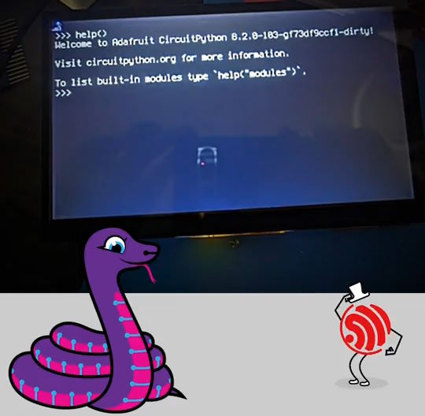](https://twitter.com/adafruit/status/1696925374100259012)

Adafruit now has the Espressif ESP32-S3 talking to large "dot clock" displays like the 7 inch 800x480 display above. There will be a display driver board with the S3 soon with a selection of displays including rectangular, circular, and square - [X, formerly Twitter](https://twitter.com/adafruit/status/1696925374100259012) and [YouTube](https://www.youtube.com/watch?v=uKouVzFcVxM).

## Get Your Mac Python From Python.org

[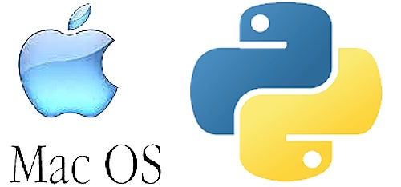](https://blog.glyph.im/2023/08/get-your-mac-python-from-python-dot-org.html)

There are many ways to get Python installed on macOS. But, for most people, the version that you download from Python.org is best - [Deciphering Glyph](https://blog.glyph.im/2023/08/get-your-mac-python-from-python-dot-org.html).

## Adafruit Surpasses 600 Certified Open Source Hardware Designs and a Weigh-In of the OSHW Movement

[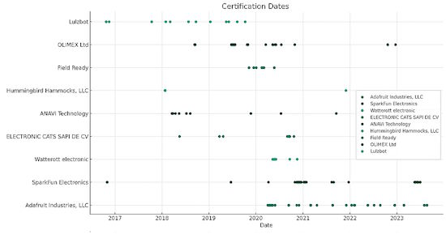](https://blog.adafruit.com/2023/08/28/3d-printing-open-source-certifying-hardware-oshwa-api-china-and-more-a-weigh-in-ahead/)

3D printing, open-source, certifying hardware, OSHWA API, China, and more … a weigh-in by Phillip Torrone at Adafruit is a wide sweep of the open hardware landscape, OSHWA, and more - [Adafruit Blog](https://blog.adafruit.com/2023/08/28/3d-printing-open-source-certifying-hardware-oshwa-api-china-and-more-a-weigh-in-ahead/) via [X, formerly Twitter](https://twitter.com/adafruit/status/1696975266826916216).

## Arm’s much anticipated IPO is around the corner

The technology company Arm, majority owned by SoftBank, will soon have its IPO on the New York Stock Exchange - [Adafruit Blog](https://blog.adafruit.com/2023/08/30/arms-much-anticipated-ipo-is-around-the-corner-makerbusiness/).

## More Handy Cheat Sheets

Cheat Sheets are one of the more popular items when they pop up in the newsletter - they certainly help in programming. Here are some new ones out this week, one on Python and some on Arm Assembly.

[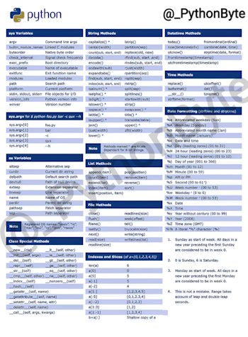](https://twitter.com/_PythonByte/status/1696001857943204193?t=iZwrkztzXtiCOKnvgi0ltQ&s=03)

From basic syntax to advanced concepts, this Python cheat code has got you covered - [X, formerly Twitter](https://twitter.com/_PythonByte/status/1696001857943204193?t=iZwrkztzXtiCOKnvgi0ltQ&s=03).

Azeria Fox is a foremost expert on Arm assembly and hacking. With her new book [Arm Assembly Internals and Reverse Engineering (Blue Fox Edition)](http://leg-assembly.com/), Arm is asking to retract the title because it contains the word 'Arm'. To celebrate how the community has circled around her, she's made two of her Arm assembly cheat sheets available for free - [Thread on X, formerly Twitter](https://twitter.com/Fox0x01/status/1696622243785191793).

## Adafruit.io WipperSnapper Adds No-Code Support for the MPL115A2 Barometric Pressure/Temperature Sensor

[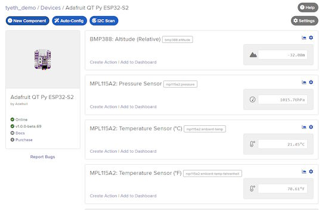](https://blog.adafruit.com/2023/08/29/adafruit-io-wippersnapper-adds-no-code-support-for-the-mpl115a2-barometric-pressure-temperature-sensor/)

You now can use the MPL115A2 – I2C Barometric Pressure/Temperature Sensor with Adafruit.io WipperSnapper for pressure and altitude measurements, all without the need for writing a single line of code! With WipperSnapper, you can effortlessly connect various components and sensors to any of the 20+ supported development boards to build an internet-connected electronics project. The best part is that you can configure and control these sensors from the web using Adafruit IO, all without the need for programming - [Adafruit Blog](https://blog.adafruit.com/2023/08/29/adafruit-io-wippersnapper-adds-no-code-support-for-the-mpl115a2-barometric-pressure-temperature-sensor/).

## This Week's Python Streams

Python on Hardware is all about building a cooperative ecosphere which allows contributions to be valued and to grow knowledge. Below are the streams within the last week focusing on the community.

**CircuitPython Deep Dive Stream**

You can see the latest video and past videos from Scott on the Adafruit YouTube channel under the Deep Dive playlist - [YouTube](https://www.youtube.com/playlist?list=PLjF7R1fz_OOXBHlu9msoXq2jQN4JpCk8A).

**CircuitPython Parsec**

Catch the latest episodes of from John Park on the parsec [YouTube playlist](https://www.youtube.com/playlist?list=PLjF7R1fz_OOWFqZfqW9jlvQSIUmwn9lWr).

## Project of the Week: Driving Five LED Displays with Python

Pimoroni writes "What if I told you this 96cm wide, five panel, 160x32 Interstate75 powered pixel display can be started for just £105 and driven from Python running on a Pi or desktop PC for impressively smoooth demos?"

Demonstrations include a fire animation and a long version of Conway's Game of Life - [Thread on X, formerly Twitter](https://twitter.com/Gadgetoid/status/1696602817685852410).

## News from around the web!

DJDevon3's Feather Weather on 4 matrix panels with a stemma BME688 sensor - [Quad Matrix Panel Feather Weather](https://github.com/DJDevon3/My_Circuit_Python_Projects/tree/main/Boards/espressif/Adafruit%20MatrixPortal%20S3/128x64%20RGB%20Matrix).

[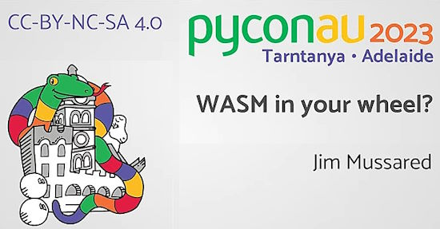](https://www.youtube.com/watch?v=yVA4TUtTDks)

"WASM in your wheel?" - Jim Mussared (PyCon AU 2023) - [YouTube](https://www.youtube.com/watch?v=yVA4TUtTDks).

An NTP Clock using CircuitPython - [Elektor](https://www.elektormagazine.com/magazine/elektor-304/61864).

[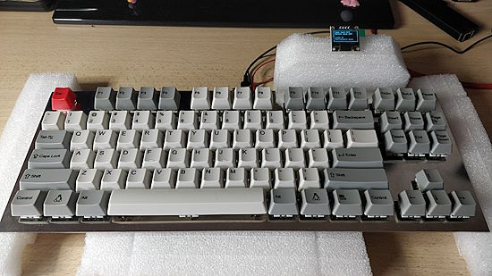](https://codeberg.org/JustineSmithies/JMS-Pico-TKL)

A Raspberry Pi Pico keyboard powered by CircuitPython and KMK - [Codeberg](https://codeberg.org/JustineSmithies/JMS-Pico-TKL) via [Mastodon](https://fosstodon.org/@JustineSmithies/110968826332584709).

[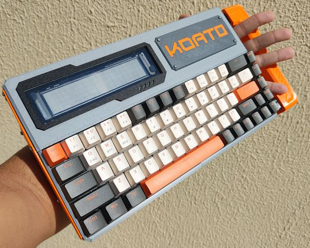](https://www.hackster.io/news/the-koat0-is-a-vfd-equipped-cyberdeck-terminal-36936d839954)

RobsonCouto's VFD-equipped KOAT0 cyberdeck terminal is a stylish and functional device - [hackster.io](https://www.hackster.io/news/the-koat0-is-a-vfd-equipped-cyberdeck-terminal-36936d839954) and [hackaday.io](https://hackaday.io/project/191664/gallery#f8fdbd59eeee940898c6a2de0af87591).

[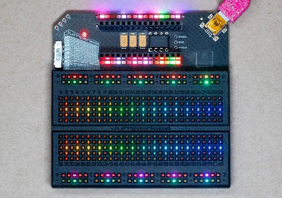](https://www.digikey.com/en/maker/projects/jumperless/2e62cc88ee6145bc924041dd486de76f)

Jumperless is a jumperless (solderless) breadboard - [DigiKey](https://www.digikey.com/en/maker/projects/jumperless/2e62cc88ee6145bc924041dd486de76f) and [YouTube](https://youtu.be/IDXGWoZEXfQ).

[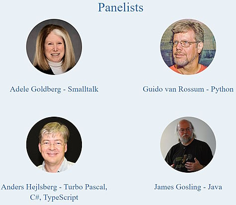](https://pydata.org/language-creator-fundraiser/)

PyData is hosting a Language Creators Charity Fundraiser which includes Guido van Rossum, creator of Python - [PyData](https://pydata.org/language-creator-fundraiser/).

PiBoy Mini: just add a Raspberry Pi and you’ve got a handheld retro gaming system - [Raspberry Pi](https://www.raspberrypi.com/news/piboy-mini-just-add-a-raspberry-pi-and-youve-got-a-handheld-retro-gaming-system/).

[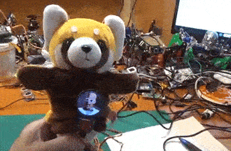](https://twitter.com/urukakanko/status/1696911868210950537)

RsPico round liquid crystal module with Raspberry Pi Pico W attached and running with CircuitPython. Red panda is in high spirits - [X, formerly Twitter](https://twitter.com/urukakanko/status/1696911868210950537) (Japanese).

text - [site](url).

text - [site](url).

text - [site](url).

text - [site](url).

text - [site](url).

text - [site](url).

[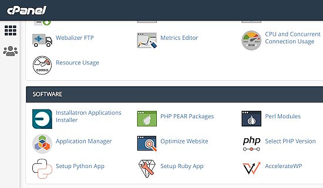](https://gist.github.com/pj8912/d030bc0b6f1ad6f767e383df296f200f)

Using an Internet Service Provider (ISP) to host Python apps for deployment - [GitHub](https://gist.github.com/pj8912/d030bc0b6f1ad6f767e383df296f200f).

CircuitPython Weekly Meeting for August 28, 2023 ([notes](https://github.com/adafruit/adafruit-circuitpython-weekly-meeting/blob/main/2023/2023-08-28.md)) [on YouTube](https://youtu.be/UndmYxxiNZQ).

#ICYDNCI What was the most popular, most clicked link, in [last week's newsletter](https://www.adafruitdaily.com/2023/08/28/python-on-microcontrollers-newsletter-ten-years-of-micropython-python-in-excel-and-much-more-circuitpython-python-micropython-thepsf-raspberry_pi/)? [Getting to grips with Bluetooth on Pico W](https://www.raspberrypi.com/news/getting-to-grips-with-bluetooth-on-pico-w/).

## New

[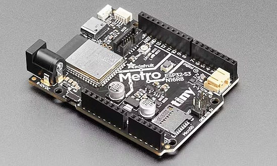](https://www.hackster.io/news/adafruit-s-metro-esp32-s3-puts-two-cores-8mb-psram-and-16mb-flash-in-an-arduino-uno-footprint-15e9411eba88)

Adafruit's Metro ESP32-S3 puts two cores, 8MB PSRAM, and 16MB flash in an Arduino UNO Footprint. The second new Metro design in a month, the Metro ESP32-S3 includes WiFi, Bluetooth Low Energy (BLE), and native USB support - [Hackster.io](https://www.hackster.io/news/adafruit-s-metro-esp32-s3-puts-two-cores-8mb-psram-and-16mb-flash-in-an-arduino-uno-footprint-15e9411eba88).

[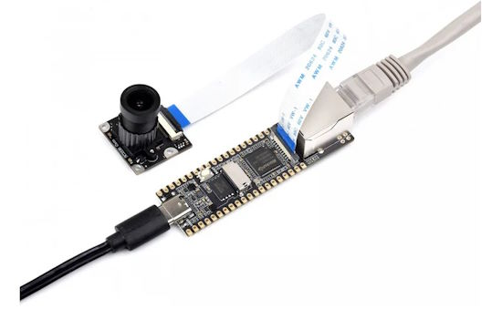](https://www.cnx-software.com/2023/08/30/luckfox-pico-rockchip-rv1103-cortex-a7-risc-v-camera-board-comes-with-an-optional-ethernet-port/)

LuckFox Pico is a small Linux camera board based on the Rockchip RV1103 Cortex-A7 and RISC-V AI camera SoC and offered with an Ethernet port in a longer version of the PCB called LuckFox Pico Plus. Both models come with 64MB RAM (apparently embedded in RV1103), a microSD card slot for storage, a MIPI CSI camera connector, a USB Type-C port for power, and a few through holes for expansion through GPIO, I2C, UART, etc. - [CNX Software](https://www.cnx-software.com/2023/08/30/luckfox-pico-rockchip-rv1103-cortex-a7-risc-v-camera-board-comes-with-an-optional-ethernet-port/).

[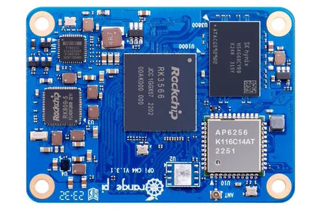](http://www.orangepi.org/html/hardWare/computerAndMicrocontrollers/details/Orange-Pi-CM4-1.html)

Orange Pi Compute Module 4 with Quad-core 64-bit Cortex-A55 processor and available with 1, 2, 4, or 8 GB RAM - [Orange Pi](http://www.orangepi.org/html/hardWare/computerAndMicrocontrollers/details/Orange-Pi-CM4-1.html).

## New Boards Supported by CircuitPython

The number of supported microcontrollers and Single Board Computers (SBC) grows every week. This section outlines which boards have been included in CircuitPython or added to [CircuitPython.org](https://circuitpython.org/).

This week, there was one new board added:

- [ESP32-S3-Pico](https://circuitpython.org/board/waveshare_esp32s3_pico/)

*Note: For non-Adafruit boards, please use the support forums of the board manufacturer for assistance, as Adafruit does not have the hardware to assist in troubleshooting.*

Looking to add a new board to CircuitPython? It's highly encouraged! Adafruit has four guides to help you do so:

- [How to Add a New Board to CircuitPython](https://learn.adafruit.com/how-to-add-a-new-board-to-circuitpython/overview)
- [How to add a New Board to the circuitpython.org website](https://learn.adafruit.com/how-to-add-a-new-board-to-the-circuitpython-org-website)
- [Adding a Single Board Computer to PlatformDetect for Blinka](https://learn.adafruit.com/adding-a-single-board-computer-to-platformdetect-for-blinka)
- [Adding a Single Board Computer to Blinka](https://learn.adafruit.com/adding-a-single-board-computer-to-blinka)

## New Learn Guides!

[Prop-Maker Feather Talking Adabot Clock](https://learn.adafruit.com/prop-maker-feather-talking-adabot-clock) from [Liz Clark](https://learn.adafruit.com/u/BlitzCityDIY)

[Teddy Ruxpin Rebuild](https://learn.adafruit.com/teddy-ruxpin-rebuild) from [Erin St. Blaine](https://learn.adafruit.com/u/firepixie)

[MatrixPortal CircuitPython Animated Message Board](https://learn.adafruit.com/matrixportal-circuitpython-animated-message-board) from [Melissa LeBlanc-Williams](https://learn.adafruit.com/u/MakerMelissa)

[Adafruit Metro ESP32-S3](https://learn.adafruit.com/adafruit-metro-esp32-s3) from [Kattni](https://learn.adafruit.com/u/kattni)

## CircuitPython Libraries!

The CircuitPython library numbers are continually increasing, while existing ones continue to be updated. Here we provide library numbers and updates!

To get the latest Adafruit libraries, download the [Adafruit CircuitPython Library Bundle](https://circuitpython.org/libraries). To get the latest community contributed libraries, download the [CircuitPython Community Bundle](https://circuitpython.org/libraries).

If you'd like to contribute to the CircuitPython project on the Python side of things, the libraries are a great place to start. Check out the [CircuitPython.org Contributing page](https://circuitpython.org/contributing). If you're interested in reviewing, check out Open Pull Requests. If you'd like to contribute code or documentation, check out Open Issues. We have a guide on [contributing to CircuitPython with Git and GitHub](https://learn.adafruit.com/contribute-to-circuitpython-with-git-and-github), and you can find us in the #help-with-circuitpython and #circuitpython-dev channels on the [Adafruit Discord](https://adafru.it/discord).

You can check out this [list of all the Adafruit CircuitPython libraries and drivers available](https://github.com/adafruit/Adafruit_CircuitPython_Bundle/blob/master/circuitpython_library_list.md). 

The current number of CircuitPython libraries is **448**!

**Updated Libraries!**

Here's this week's updated CircuitPython libraries:

  * [adafruit/Adafruit_CircuitPython_MatrixPortal](https://github.com/adafruit/Adafruit_CircuitPython_MatrixPortal)
  * [adafruit/Adafruit_CircuitPython_Display_Shapes](https://github.com/adafruit/Adafruit_CircuitPython_Display_Shapes)
  * [adafruit/Adafruit_CircuitPython_Fingerprint](https://github.com/adafruit/Adafruit_CircuitPython_Fingerprint)
  * [s-light/CircuitPython_ansi_escape_code](https://github.com/s-light/CircuitPython_ansi_escape_code)

**Library PyPI Weekly Download Stats**

**Total Library Stats**

  * 129910 PyPI downloads over 312 libraries

**Top 10 Libraries by PyPI Downloads**

  * Adafruit CircuitPython BusDevice (adafruit-circuitpython-busdevice): 7523
  * Adafruit CircuitPython Requests (adafruit-circuitpython-requests): 6917
  * Adafruit CircuitPython Register (adafruit-circuitpython-register): 2032
  * Adafruit CircuitPython NeoPixel (adafruit-circuitpython-neopixel): 1397
  * Adafruit CircuitPython ADS1x15 (adafruit-circuitpython-ads1x15): 1356
  * Adafruit CircuitPython Motor (adafruit-circuitpython-motor): 1257
  * Adafruit CircuitPython Display Text (adafruit-circuitpython-display-text): 1117
  * Adafruit CircuitPython Wiznet5k (adafruit-circuitpython-wiznet5k): 1105
  * Adafruit CircuitPython MiniMQTT (adafruit-circuitpython-minimqtt): 1047
  * Adafruit CircuitPython PCA9685 (adafruit-circuitpython-pca9685): 1014

## What’s the CircuitPython team up to this week?

What is the team up to this week? Let’s check in!

**Dan**

text - [site](url).

**Kattni**

The [Metro ESP32-S3 guide](https://learn.adafruit.com/adafruit-metro-esp32-s3) went live this week. I found a bug in the hardware through testing. It turns out the increased flash memory uses the SPI pins, which meant when trying to use SPI or I2S, such as with the built-in SD card slot, CircuitPython crashed into safe mode with a gnarly error. The board will be revised and released in the shop once it's updated. If you picked up one of the original boards, check out the warnings in the guide for details.

Next up is the EYESPI Pi Beret guide, which has a GIF player demo in Python for the Raspberry Pi.

**Melissa**

This past week I finished up writing the [MatrixPortal CircuitPython Animated Message Board guide](https://learn.adafruit.com/matrixportal-circuitpython-animated-message-board) and it is now published. This includes full 3D printing and assembly instructions as well as a code overview and a detailed usage page.

**Tim**

text - [site](url).

**Jeff**

After going down a number of blind alleys, I finally have working code (with caveats) for dot clock displays with the Espressif ESP32-S3 microcontroller. My test board has an 800x480 display; the CircuitPython text terminal looks nice and chunky with 2x2 virtual pixels:

[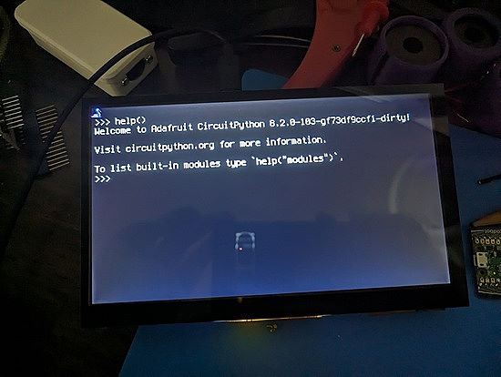](https://github.com/adafruit/circuitpython/pull/8351)

You can follow along with progress in the [pull request](https://github.com/adafruit/circuitpython/pull/8351).

**Scott**

This past week has primarily been working on the ESP32-S3. Kattni found [an issue](https://github.com/adafruit/circuitpython/issues/8288) on the new Metro S3 and I tried to debug it during [my stream on Friday](https://www.youtube.com/watch?v=RoLcCLuQ5vc). Monday morning I realized the issue is likely misconfiguring a pin and breaking the PSRAM. This causes the VM to load garbage that can cause all sorts of issues. It turned out to be the source of the problem. The full fix requires a hardware change. An interim fix is to have CircuitPython correctly protect those pins and prevent their use. It'll prevent the hard crash but not fix the inoperable pins. The problem occurred because the design was based on a 2MB PSRAM module that connects to the RAM over 4 data pins. The 8MB PSRAM module fits the same footprint but uses 4 more pins to connect to the RAM over 8 data pins. CircuitPython was resetting those extra pins and causing the crash. Soon it'll fail friendlier with "in use" instead.

I've also worked a bit on the IDF5 update and tweaked how flash and ram settings are specified. The settings will make it easier to clock the flash and ram as fast as a board can handle. Right now, we're pretty conservative. Hopefully in 9.x we'll get a nice performance speedup from clocking the flash faster.

The next week is busy for me as I move my office into a new space out of my house. There's a long weekend as well. My goal is to work from the office starting next week!

**Liz**

This week I worked on the [Talking Adabot Clock project](https://learn.adafruit.com/prop-maker-feather-talking-adabot-clock). This was a remake of the [Wave Shield Talking Clock](https://learn.adafruit.com/wave-shield-talking-clock) originally done by Phil B. in Arduino. I updated the project to use the RP2040 Prop-Maker Feather with a DS3231 RTC STEMMA breakout and remixed the Adabot head from the [Adabot Toy Robot Friend project](https://learn.adafruit.com/adabot-rp2040) to house the electronics. It was a really fun build from start to finish.

## Upcoming Events!

The next MicroPython Meetup in Melbourne will be on August 23rd – [Meetup](https://www.meetup.com/micropython-meetup/events). 

The supplier of popular ESP32 and ESP8266 microcontrollers, Espressif, announces their yearly Developers Conference. During the two-day online event, there will be nearly 30 talks created by Espressif technical experts and its partners, covering a wide range of topics, including Thread, the low-power features of ESP32-C6 and Wi-Fi 6, ESP-Mesh-Lite + ESP RainMaker Cloud solution, ESP-IDF, RUST, SquareLine Studio, AWS IoT, and more. September 12-13, 10:00-19:00 CEST - [devcon.espressif.com](https://devcon.espressif.com/).

PyCon UK will be returning to Cardiff City Hall from Friday 22nd September to Monday 25th September 2023 - [PyCon UK](https://2023.pyconuk.org/).

Maker Faire Bay Area will be October 13-15 & October 20-22, 2023 - [Eventbright](https://www.eventbrite.com/e/maker-faire-bay-area-october-13-15-october-20-22-2023-tickets-673771979127).

Hackaday has announced that the Hackaday Supercon is on for 2023, and will be taking place November 3 – 5 in Pasadena, California, USA - [Adafruit Blog](https://blog.adafruit.com/2023/05/10/hackaday-supercon-2023-is-on-supercon-hackaday/) and [Hackaday](https://hackaday.com/2023/05/10/supercon-2023-is-on-we-want-you/).

The Pyjamas Conference, the 24-hour online Python conference, will be returning for a fifth year. The Call for Papers will begin on September 2nd - [Twitter](https://twitter.com/PyjamasConf/status/1675278222798495745).

**Send Your Events In**

If you know of virtual events or upcoming events, please let us know via email to cpnews(at)adafruit(dot)com.

## Latest Releases

CircuitPython's stable release is [8.2.4](https://github.com/adafruit/circuitpython/releases/latest). New to CircuitPython? Start with our [Welcome to CircuitPython Guide](https://learn.adafruit.com/welcome-to-circuitpython).

[20230829](https://github.com/adafruit/Adafruit_CircuitPython_Bundle/releases/latest) is the latest Adafruit CircuitPython library bundle.

[20230829](https://github.com/adafruit/CircuitPython_Community_Bundle/releases/latest) is the latest CircuitPython Community library bundle.

[v1.20.0](https://micropython.org/download) is the latest MicroPython release. Documentation for it is [here](http://docs.micropython.org/en/latest/pyboard/).

[3.11.5](https://www.python.org/downloads/) is the latest Python release. The latest pre-release version is [3.12.0rc1](https://www.python.org/download/pre-releases/).

[3,648 Stars](https://github.com/adafruit/circuitpython/stargazers) Like CircuitPython? [Star it on GitHub!](https://github.com/adafruit/circuitpython)

## Call for Help -- Translating CircuitPython is now easier than ever!

[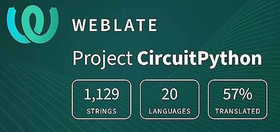](https://hosted.weblate.org/engage/circuitpython/)

One important feature of CircuitPython is translated control and error messages. With the help of fellow open source project [Weblate](https://weblate.org/), we're making it even easier to add or improve translations. 

Sign in with an existing account such as GitHub, Google or Facebook and start contributing through a simple web interface. No forks or pull requests needed! As always, if you run into trouble join us on [Discord](https://adafru.it/discord), we're here to help.

## 37,765 Thanks!

The Adafruit Discord community, where we do all our CircuitPython development in the open, reached over 37,765 humans - thank you! Adafruit believes Discord offers a unique way for Python on hardware folks to connect. Join today at [https://adafru.it/discord](https://adafru.it/discord).

## ICYMI - In case you missed it

Python on hardware is the Adafruit Python video-newsletter-podcast! The news comes from the Python community, Discord, Adafruit communities and more and is broadcast on ASK an ENGINEER Wednesdays. The complete Python on Hardware weekly videocast [playlist is here](https://www.youtube.com/playlist?list=PLjF7R1fz_OOXRMjM7Sm0J2Xt6H81TdDev). The video podcast is on [iTunes](https://itunes.apple.com/us/podcast/python-on-hardware/id1451685192?mt=2), [YouTube](http://adafru.it/pohepisodes), [Instagram Reels](https://www.instagram.com/adafruit/channel/)), and [XML](https://itunes.apple.com/us/podcast/python-on-hardware/id1451685192?mt=2).

[The weekly community chat on Adafruit Discord server CircuitPython channel - Audio / Podcast edition](https://itunes.apple.com/us/podcast/circuitpython-weekly-meeting/id1451685016) - Audio from the Discord chat space for CircuitPython, meetings are usually Mondays at 2pm ET, this is the audio version on [iTunes](https://itunes.apple.com/us/podcast/circuitpython-weekly-meeting/id1451685016), Pocket Casts, [Spotify](https://adafru.it/spotify), and [XML feed](https://adafruit-podcasts.s3.amazonaws.com/circuitpython_weekly_meeting/audio-podcast.xml).

## Contribute!

The CircuitPython Weekly Newsletter is a CircuitPython community-run newsletter emailed every Tuesday. The complete [archives are here](https://www.adafruitdaily.com/category/circuitpython/). It highlights the latest CircuitPython related news from around the web including Python and MicroPython developments. To contribute, edit next week's draft [on GitHub](https://github.com/adafruit/circuitpython-weekly-newsletter/tree/gh-pages/_drafts) and [submit a pull request](https://help.github.com/articles/editing-files-in-your-repository/) with the changes. You may also tag your information on Twitter with #CircuitPython. 

Join the Adafruit [Discord](https://adafru.it/discord) or [post to the forum](https://forums.adafruit.com/viewforum.php?f=60) if you have questions.
