- [ ] Library and info updates
- [ ] change date
- [ ] update title
- [ ] Feature story
- [ ] Update  for images
- [ ] Update ICYDNCI
- [ ] All images 550w max only
- [ ] Link "View this email in your browser."

News Sources

- Twitter: [CircuitPython](https://twitter.com/search?q=circuitpython&src=typed_query&f=live), [MicroPython](https://twitter.com/search?q=micropython&src=typed_query&f=live) and [Python](https://twitter.com/search?q=python&src=typed_query)
- Mastodon [CircuitPython](https://octodon.social/tags/CircuitPython) and [MicroPython](https://octodon.social/tags/MicroPython)
- [python.org](https://www.python.org/)
- [Python Insider - dev team blog](https://pythoninsider.blogspot.com/)
- [MicroPython Meetup Blog](https://melbournemicropythonmeetup.github.io/)
- [hackaday.io newest projects MicroPython](https://hackaday.io/projects?tag=micropython&sort=date) and [CircuitPython](https://hackaday.io/projects?tag=circuitpython&sort=date)
- [hackaday CircuitPython](https://hackaday.com/blog/?s=circuitpython) and [MicroPython](https://hackaday.com/blog/?s=micropython)
- [hackster.io CircuitPython](https://www.hackster.io/search?q=circuitpython&i=projects&sort_by=most_recent) and [MicroPython](https://www.hackster.io/search?q=micropython&i=projects&sort_by=most_recent)
- [https://opensource.com/tags/python](https://opensource.com/tags/python)
- [Raspberry Pi News](https://www.raspberrypi.com/news/)
- Check Issues and PRs for input

View this email in your browser. **Warning: Flashing Imagery**

Welcome to the latest Python on Microcontrollers newsletter! *insert 2-3 sentences from editor (what's in overview, banter)* - *Anne Barela, Ed.*

We're on [Discord](https://discord.gg/HYqvREz), [Twitter](https://twitter.com/search?q=circuitpython&src=typed_query&f=live), and for past newsletters - [view them all here](https://www.adafruitdaily.com/category/circuitpython/). If you're reading this on the web, [subscribe here](https://www.adafruitdaily.com/). Here's the news this week:

## Headline

text - [site](url).

## Bookworm — the new version of Raspberry Pi OS

Bookworm is the name of the new version of Raspberry Pi OS referred to in all the Raspberry Pi 5 discussions - [Raspberry Pi](https://www.raspberrypi.com/news/bookworm-the-new-version-of-raspberry-pi-os/).

> Debian Bookworm itself is mostly made up of incremental updates of the software that was in the previous Debian Bullseye release. There are a few small changes — have a look here for the list — but they mostly won’t affect Raspberry Pi users. So Bookworm itself really hasn’t resulted in many changes. &nbsp;  However, for the last year or so we have been working on some major architectural changes to the Raspberry Pi Desktop, and these are launched for the first time in the Bookworm release.

**Some of the changes under the hood**

* [Wayland](https://wayland.freedesktop.org/) is the default display system for Raspberry Pi 4 and 5 with the [Wayfire](https://github.com/WayfireWM/wayfire) compositor
* Use of the [PipeWWire](https://pipewire.org/) audio system
* The [NetworkManager](https://networkmanager.dev/) network controller replaces dhcpcd
* Firefox is a second browser option
* Changes to [how Python modules are installed](http://rptl.io/venv)
* A new VNC server, called wayvnc, is being used instead of RealVNC
* Subsequent documentation updates

It is suggested that a new image be created for using Bookworm, either to create an SD card using [Raspberry Pi Imager](https://www.raspberrypi.com/software/), or to download and flash a Bookworm image from [here](https://www.raspberrypi.com/software/operating-systems/) with a tool of your choice.

## PCIe Bus Use on Raspberry Pi Delights Community 

The maker community is excited to have Raspberry Pi hardware with official access to the high-speed PCIe bus, for which there are thousands of add-on cards in the marketplace. Here are several articles discussing PCIe in general and it's relation to Raspberry Pi 5. Raspberry Pi themselves talk about PCIe to a degree in their recent article - [Raspberry Pi](https://www.raspberrypi.com/news/behind-the-scenes-with-raspberry-pi-5-magpimonday/).

[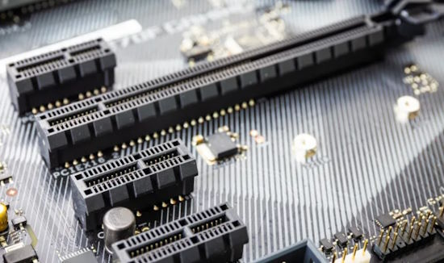](https://blog.adafruit.com/2023/10/04/pcie-pci-express-what-it-is-and-terminology/)

Adafruit recently posted four articles to familiarize makers with PCIe:

* [PCIe / PCI Express: what it is and terminology](https://blog.adafruit.com/2023/10/04/pcie-pci-express-what-it-is-and-terminology/)
* [PCIe / PCI Express: Bandwidth](https://blog.adafruit.com/2023/10/04/pcie-pci-express-bandwidth/)
* [PCIe / PCI Express: Connections](https://blog.adafruit.com/2023/10/04/pcie-pci-express-connections/)
* [PCIe / PCI Express: extenders and expanders](https://blog.adafruit.com/2023/10/04/pcie-pci-express-extenders-and-expanders/)

Here is an article on [Forcing PCI Express Gen 3.0 speeds on the Pi 5](https://www.jeffgeerling.com/blog/2023/forcing-pci-express-gen-30-speeds-on-pi-5) by Jeff Geerling. Yes, the default PCIe Gen 2.0 bus can be set to 1.0 or even 3.0! But beware of the possible consequences.

[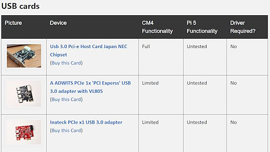](https://pipci.jeffgeerling.com/)

Jeff Geerling has established an online database of PCIe cards and their compatibility with the Raspberry Pi Compute Module 4 (CM4) and the Raspberry Pi 5 - [Jeff Geerling](https://pipci.jeffgeerling.com/).

## How Not to Build a Custom RP2040 Development Board

[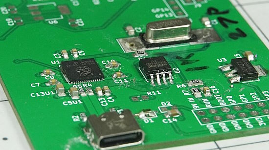](https://embeddedcomputing.com/technology/open-source/development-kits/how-not-to-build-a-custom-rp2040-dev-board)

Learn design best practices via the tips on how **not** to build a custom Raspberry Pi RP2040 development board - [Embedded Computing Design](https://embeddedcomputing.com/technology/open-source/development-kits/how-not-to-build-a-custom-rp2040-dev-board).

## A Handheld CircuitPython Computer

PICOmputer V consists of a PICOkeyboard, ESP32-S3 and a 2.8" IPS color display. It runs on a Raspberry Pi Pico, consists of 8 PCBs total (no 3D printing) and can act as a retro computer emulator for ZX Spectrum, Atari and Commodore 64 as well as running CircuitPython - [X thread](https://twitter.com/bobricius/status/1711863669322088475) and [YouTube](https://www.youtube.com/watch?v=Dao678T2R0M).

## Raspberry Pi Pico with CircuitPython, a Primer

[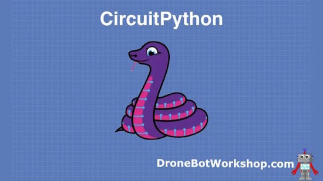](url)

DroneBot Workshop has developed a detailed primer on using a Raspberry Pi Pico with CircuitPython - [DroneBot Workshop](url) and [YouTube](https://youtu.be/07vG-_CcDG0).

## Fresh From the Oven: Pi for Your Desktop

[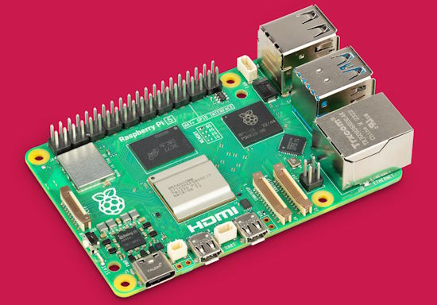](https://spectrum.ieee.org/raspberry-pi-5)

Fresh From the Oven: Pi for Your Desktop The Raspberry Pi 5 catches up to its original vision. IEEE Spectrum looks to see if the Pi 5 can replace a desktop computer - [IEEE Spectrum](https://spectrum.ieee.org/raspberry-pi-5).

## This Week's Python Streams

Python on Hardware is all about building a cooperative ecosphere which allows contributions to be valued and to grow knowledge. Below are the streams within the last week focusing on the community.

**CircuitPython Deep Dive Stream**

[Last Friday](link), Scott streamed work on {subject}.

You can see the latest video and past videos on the Adafruit YouTube channel under the Deep Dive playlist - [YouTube](https://www.youtube.com/playlist?list=PLjF7R1fz_OOXBHlu9msoXq2jQN4JpCk8A).

**CircuitPython Parsec**

John Park’s CircuitPython Parsec this week is on Debouncer Timer - [Adafruit Blog](https://blog.adafruit.com/2023/10/13/john-parks-circuitpython-parsec-debouncer-timer-adafruit-circuitpython/) and [YouTube](https://youtu.be/ZIKjZEkB48w).

Catch all the episodes in the [YouTube playlist](https://www.youtube.com/playlist?list=PLjF7R1fz_OOWFqZfqW9jlvQSIUmwn9lWr).

## Project of the Week: A Handheld CircuitPython Computer

PICOmputer V consists of a PICOkeyboard, ESP32-S3 and a 2.8" IPS color display. It runs on a Raspberry Pi Pico, consists of 8 PCBs total (no 3D printing) and can act as a retro computer emulator for ZX Spectrum, Atari and Commodore 64 as well as running CircuitPython - [X thread](https://twitter.com/bobricius/status/1711863669322088475) and [YouTube](https://www.youtube.com/watch?v=Dao678T2R0M).

## News from around the web!

[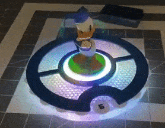](https://twitter.com/kwigbo/status/1711391040853197133)

Python customization for the Disney Lorcana lore counter with Adafruit Circuit playground Express - [X](https://twitter.com/kwigbo/status/1711391040853197133).

[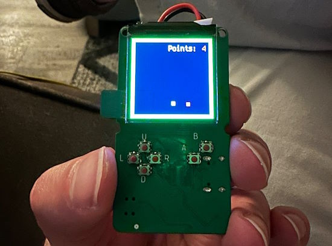](https://twitter.com/oakdevtech/status/1711565521672699910)

KeyBoy is a small handheld CircuitPython gaming system using an ESP32-S3 and 1.3" TFT LCD display - [X](https://twitter.com/oakdevtech/status/1711565521672699910) and [GitHub](https://github.com/skerr92/KeyBoy).

[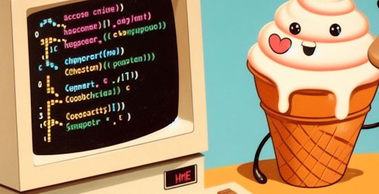](https://bigl.es/tooling-tuesday-icecream-python-debugging/)

Debugging Python with Icecream - [Les Pounder](https://bigl.es/tooling-tuesday-icecream-python-debugging/).

[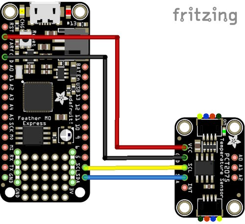](http://www.learnmicropython.com/code/adafruit-feather-m0-and-pct2075-temperature-to-digital-converter-circuitpython-example.php)

PCT2075 temperature-to-digital converter to an Adafruit Feather M0 running Circuitpython - [Learn MicroPython](http://www.learnmicropython.com/code/adafruit-feather-m0-and-pct2075-temperature-to-digital-converter-circuitpython-example.php).

Using a PicoPad with CircuitPython to monitor a home over modbus TCP (Czech) - [X](https://twitter.com/geek_czech/status/1712206839511683389).

[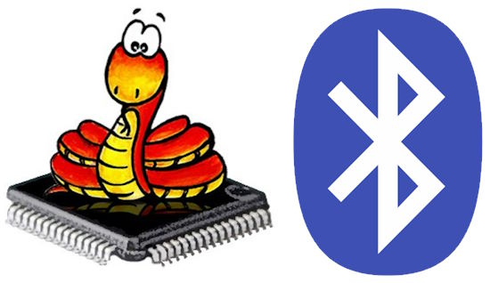](https://github.com/shariltumin/esp32-bluetooth-classic-micropython/)

Bluetooth Classic library for MicroPython on original ESP32 boards (the S2, S3, C3 all only support Bluetooth Low Energy) - [GitHub](https://github.com/shariltumin/esp32-bluetooth-classic-micropython/).

[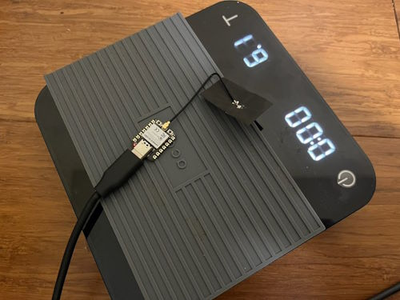](https://twitter.com/JoshMndez5/status/1711901004374126701)

Using ESP32 Xiao, MicroPython and Bluetooth LE to interact with Acaia scales - [X](https://twitter.com/JoshMndez5/status/1711901004374126701) and [GitHub](https://github.com/lucapinello/pyacaia).

[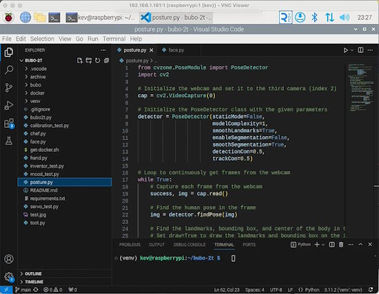](https://twitter.com/kevsmac/status/1710784488370803070)

Kevin McAleer reports "Developing in VS Code on the Raspberry Pi 5 is an absolute delight. It's swift and on par with developing on a desktop now. Very impressive" - [X](https://twitter.com/kevsmac/status/1710784488370803070).

text - [site](url).

text - [site](url).

text - [site](url).

text - [site](url).

text - [site](url).

text - [site](url).

text - [site](url).

RISC-V interrupts with a timer example - [Uros Popovic](https://popovicu.com/posts/risc-v-interrupts-with-timer-example/).

[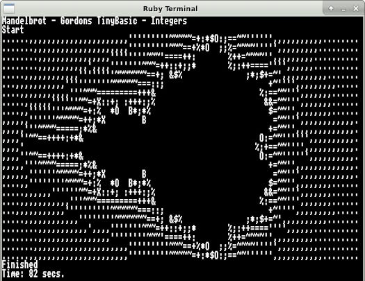](https://projects.drogon.net/gibl/)

A new Tiny Basic for the 6502 - [drogon.net](https://projects.drogon.net/gibl/).

Podcast: Building Python Best Practices and Fundamental Skills - [Real Python](https://realpython.com/podcasts/rpp/176/).

PyDev of the Week: Pradeep Kumar Srinivasan on [Mouse vs Python](https://www.blog.pythonlibrary.org/2023/10/09/pydev-of-the-week-pradeep-kumar-srinivasan/).

CircuitPython Weekly Meeting for October 10th, 2023 ([notes](https://github.com/adafruit/adafruit-circuitpython-weekly-meeting/blob/main/2023/2023-10-10.md)) [on YouTube](https://youtu.be/TWUJOGyFB1c).

#ICYDNCI What was the most popular, most clicked link, in [last week's newsletter](https://www.adafruitdaily.com/2023/10/09/python-on-microcontrollers-newsletter-new-versions-of-micropython-and-python-released-and-more-circuitpython-python-micropython-thepsf-raspberry_pi/)? [MicroPython 1.21 Out Now](https://github.com/micropython/micropython/releases/tag/v1.21.0).

## New

text - [site](url).

[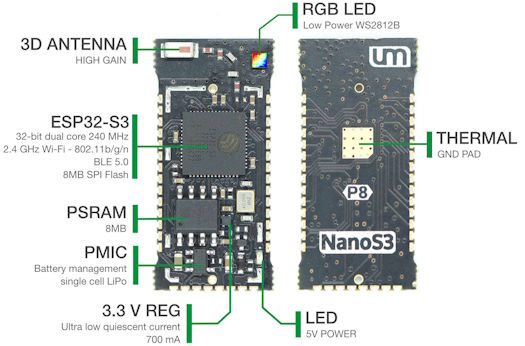](https://unexpectedmaker.com/shop.html#!/NanoS3/p/577095557/category=0)

Unexpected Maker NanoS3 now with a u.FL antenna connection, ESP32-S3, ships with CircuitPython pre-installed - [Unexpected Maker](https://unexpectedmaker.com/shop.html#!/NanoS3/p/577095557/category=0) via [X](https://twitter.com/unexpectedmaker/status/1712232781387112726).

[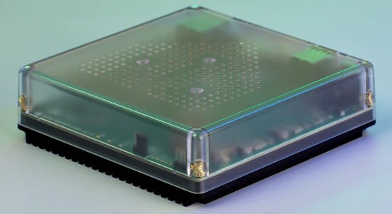](https://thepihut.com/products/home-assistant-green)

Home Assistant Green from The Pi Hut contains everything you need for Home Assistant in one box. Just plug the included power and network cables into the hub, and you’ll be up and running. Home Assistant Green will then automatically install the latest version of Home Assistant, the app (mobile or web) will guide you through the setup process, and it will detect your smart devices immediately - [ThePiHut](https://thepihut.com/products/home-assistant-green).

## New Boards Supported by CircuitPython

The number of supported microcontrollers and Single Board Computers (SBC) grows every week. This section outlines which boards have been included in CircuitPython or added to [CircuitPython.org](https://circuitpython.org/).

This week, there were (#/no) new boards added:

- [Board name](url)
- [Board name](url)
- [Board name](url)

*Note: For non-Adafruit boards, please use the support forums of the board manufacturer for assistance, as Adafruit does not have the hardware to assist in troubleshooting.*

Looking to add a new board to CircuitPython? It's highly encouraged! Adafruit has four guides to help you do so:

- [How to Add a New Board to CircuitPython](https://learn.adafruit.com/how-to-add-a-new-board-to-circuitpython/overview)
- [How to add a New Board to the circuitpython.org website](https://learn.adafruit.com/how-to-add-a-new-board-to-the-circuitpython-org-website)
- [Adding a Single Board Computer to PlatformDetect for Blinka](https://learn.adafruit.com/adding-a-single-board-computer-to-platformdetect-for-blinka)
- [Adding a Single Board Computer to Blinka](https://learn.adafruit.com/adding-a-single-board-computer-to-blinka)

## New Learn Guides!

[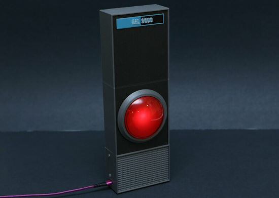](https://learn.adafruit.com/guides/latest)

[Talking HAL 9000 with RP2040 Prop Maker Feather](https://learn.adafruit.com/hal-9000-rp2040-prop-maker) from [Ruiz Brothers](https://learn.adafruit.com/u/pixil3d)

[Super Nintendo USB Controller](https://learn.adafruit.com/super-nintendo-usb-controller) from [Robert Dale Smith](https://learn.adafruit.com/u/RobertDaleSmith)

## Updated Learn Guides!

[Adafruit IO Basics: Feeds](https://learn.adafruit.com/adafruit-io-basics-feeds) from [Brent Rubell](https://learn.adafruit.com/u/brubell)

[Adafruit IO Basics: Dashboards](https://learn.adafruit.com/adafruit-io-basics-dashboards) from [Brent Rubell](https://learn.adafruit.com/u/brubell)

## CircuitPython Libraries!

The CircuitPython library numbers are continually increasing, while existing ones continue to be updated. Here we provide library numbers and updates!

To get the latest Adafruit libraries, download the [Adafruit CircuitPython Library Bundle](https://circuitpython.org/libraries). To get the latest community contributed libraries, download the [CircuitPython Community Bundle](https://circuitpython.org/libraries).

If you'd like to contribute to the CircuitPython project on the Python side of things, the libraries are a great place to start. Check out the [CircuitPython.org Contributing page](https://circuitpython.org/contributing). If you're interested in reviewing, check out Open Pull Requests. If you'd like to contribute code or documentation, check out Open Issues. We have a guide on [contributing to CircuitPython with Git and GitHub](https://learn.adafruit.com/contribute-to-circuitpython-with-git-and-github), and you can find us in the #help-with-circuitpython and #circuitpython-dev channels on the [Adafruit Discord](https://adafru.it/discord).

You can check out this [list of all the Adafruit CircuitPython libraries and drivers available](https://github.com/adafruit/Adafruit_CircuitPython_Bundle/blob/master/circuitpython_library_list.md). 

The current number of CircuitPython libraries is **###**!

**New Libraries!**

Here's this week's new CircuitPython libraries:

* [library](url)

**Updated Libraries!**

Here's this week's updated CircuitPython libraries:

* [library](url)

**Library PyPI Weekly Download Stats**

## What’s the CircuitPython team up to this week?

What is the team up to this week? Let’s check in!

**Dan**

Scott and I are continuing to work on the MicroPython v1.20 merge. I built representative boards from a number of ports and fixed minor errors which prevented those ports from building. Scott and I simultaneously fixed an issue with frozen modules. I am now looking at build size differences, both significantly larger and smaller, compared with before the merge.

**Melissa**

This past week, I worked on writing the [Adafruit Qualia ESP32-S3 for RGB-666 Displays Guide](https://learn.adafruit.com/adafruit-qualia-esp32-s3-for-rgb666-displays). Much of the underlying work for this guide was done by Jeff, which made the guide much easier to write. I also created my first Fritzing part for this guide with the help of Liz.

**Tim**

This week I've been testing library PRs, include a rewrite for the ADT7410 sensor, and new examples in the HttpServer and LIS3MDL libraries. I've also been trying out the latest versions of Blinka `DisplayIO` and making necessary changes to the `PyGameDisplay` module to work along with the recent changes.

**Scott**

This week I've been working on the MicroPython 1.20 merge into CircuitPython alongside Dan. My focus has been getting GitHub Actions running so that it builds all of the boards. It was originally failing because the tests weren't passing. Now the board builds are attempted, but many fail. Once they all build, we'll smoke test a few and PR the changes into main.

**Liz**

This week I've been working on writing some CircuitPython drivers for new breakouts that are in the shop, starting with the AD5693 DAC. Previously I had only written a driver for the Wii Classic controller, which only involved adapting the Wii Nunchuck driver to send different buffers, so this has been a bit of a learning curve. I'm really excited though for all that I've learned and appreciate the feedback and help I've gotten from the team. My process has been referencing the Arduino drivers and using ChatGPT-4 to convert to CircuitPython to get started and then testing and making adjustments from there.

## Upcoming Events!

Maker Faire Bay Area will be October 13-15 & October 20-22, 2023 - [Eventbright](https://www.eventbrite.com/e/maker-faire-bay-area-october-13-15-october-20-22-2023-tickets-673771979127).

The next MicroPython Meetup in Melbourne will be on October 25th – [Meetup](https://www.meetup.com/micropython-meetup/events). 

Hackaday has announced that the Hackaday Supercon is on for 2023, and will be taking place November 3 – 5 in Pasadena, California, USA - [Adafruit Blog](https://blog.adafruit.com/2023/05/10/hackaday-supercon-2023-is-on-supercon-hackaday/) and [Hackaday](https://hackaday.com/2023/05/10/supercon-2023-is-on-we-want-you/).

The inaugural PyLadies Conference will take place December 1-3, 2023 - [pretalx](https://pretalx.com/pyladiescon-2023/cfp).

The Pyjamas Conference, the 24-hour online Python conference, will be returning for a fifth year on December 9-10.

**Send Your Events In**

If you know of virtual events or upcoming events, please let us know via email to cpnews(at)adafruit(dot)com.

## Latest Releases

CircuitPython's stable release is [#.#.#](https://github.com/adafruit/circuitpython/releases/latest) and its unstable release is [#.#.#-##.#](https://github.com/adafruit/circuitpython/releases). New to CircuitPython? Start with our [Welcome to CircuitPython Guide](https://learn.adafruit.com/welcome-to-circuitpython).

[2023####](https://github.com/adafruit/Adafruit_CircuitPython_Bundle/releases/latest) is the latest Adafruit CircuitPython library bundle.

[2023####](https://github.com/adafruit/CircuitPython_Community_Bundle/releases/latest) is the latest CircuitPython Community library bundle.

[v#.#.#](https://micropython.org/download) is the latest MicroPython release. Documentation for it is [here](http://docs.micropython.org/en/latest/pyboard/).

[#.#.#](https://www.python.org/downloads/) is the latest Python release. The latest pre-release version is [#.#.#](https://www.python.org/download/pre-releases/).

[#,### Stars](https://github.com/adafruit/circuitpython/stargazers) Like CircuitPython? [Star it on GitHub!](https://github.com/adafruit/circuitpython)

## Call for Help -- Translating CircuitPython is now easier than ever!

[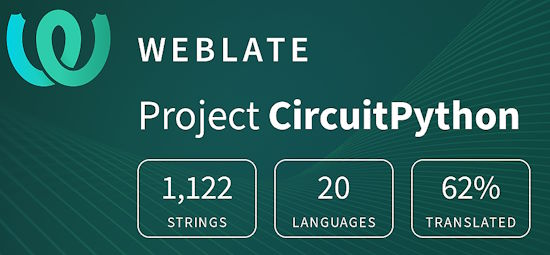](https://hosted.weblate.org/engage/circuitpython/)

One important feature of CircuitPython is translated control and error messages. With the help of fellow open source project [Weblate](https://weblate.org/), we're making it even easier to add or improve translations. 

Sign in with an existing account such as GitHub, Google or Facebook and start contributing through a simple web interface. No forks or pull requests needed! As always, if you run into trouble join us on [Discord](https://adafru.it/discord), we're here to help.

## NUMBER Thanks!

The Adafruit Discord community, where we do all our CircuitPython development in the open, reached over NUMBER humans - thank you! Adafruit believes Discord offers a unique way for Python on hardware folks to connect. Join today at [https://adafru.it/discord](https://adafru.it/discord).

## ICYMI - In case you missed it

Python on hardware is the Adafruit Python video-newsletter-podcast! The news comes from the Python community, Discord, Adafruit communities and more and is broadcast on ASK an ENGINEER Wednesdays. The complete Python on Hardware weekly videocast [playlist is here](https://www.youtube.com/playlist?list=PLjF7R1fz_OOXRMjM7Sm0J2Xt6H81TdDev). The video podcast is on [iTunes](https://itunes.apple.com/us/podcast/python-on-hardware/id1451685192?mt=2), [YouTube](http://adafru.it/pohepisodes), [Instagram Reels](https://www.instagram.com/adafruit/channel/)), and [XML](https://itunes.apple.com/us/podcast/python-on-hardware/id1451685192?mt=2).

[The weekly community chat on Adafruit Discord server CircuitPython channel - Audio / Podcast edition](https://itunes.apple.com/us/podcast/circuitpython-weekly-meeting/id1451685016) - Audio from the Discord chat space for CircuitPython, meetings are usually Mondays at 2pm ET, this is the audio version on [iTunes](https://itunes.apple.com/us/podcast/circuitpython-weekly-meeting/id1451685016), Pocket Casts, [Spotify](https://adafru.it/spotify), and [XML feed](https://adafruit-podcasts.s3.amazonaws.com/circuitpython_weekly_meeting/audio-podcast.xml).

## Contribute!

The CircuitPython Weekly Newsletter is a CircuitPython community-run newsletter emailed every Tuesday. The complete [archives are here](https://www.adafruitdaily.com/category/circuitpython/). It highlights the latest CircuitPython related news from around the web including Python and MicroPython developments. To contribute, edit next week's draft [on GitHub](https://github.com/adafruit/circuitpython-weekly-newsletter/tree/gh-pages/_drafts) and [submit a pull request](https://help.github.com/articles/editing-files-in-your-repository/) with the changes. You may also tag your information on Twitter with #CircuitPython. 

Join the Adafruit [Discord](https://adafru.it/discord) or [post to the forum](https://forums.adafruit.com/viewforum.php?f=60) if you have questions.
