- [ ] Library and info updates
- [ ] change date
- [ ] update title
- [ ] Feature story
- [ ] Update  for images
- [ ] Update ICYDNCI
- [ ] All images 550w max only
- [ ] Link "View this email in your browser."

News Sources

- [Adafruit Playground](https://adafruit-playground.com/)
- Twitter: [CircuitPython](https://twitter.com/search?q=circuitpython&src=typed_query&f=live), [MicroPython](https://twitter.com/search?q=micropython&src=typed_query&f=live) and [Python](https://twitter.com/search?q=python&src=typed_query)
- [Raspberry Pi News](https://www.raspberrypi.com/news/)
- Mastodon [CircuitPython](https://octodon.social/tags/CircuitPython) and [MicroPython](https://octodon.social/tags/MicroPython)
- [hackster.io CircuitPython](https://www.hackster.io/search?q=circuitpython&i=projects&sort_by=most_recent) and [MicroPython](https://www.hackster.io/search?q=micropython&i=projects&sort_by=most_recent)
- [python.org](https://www.python.org/)
- [Python Insider - dev team blog](https://pythoninsider.blogspot.com/)
- Individuals: [Jeff Geerling](https://www.jeffgeerling.com/blog)
- [hackaday CircuitPython](https://hackaday.com/blog/?s=circuitpython) and [MicroPython](https://hackaday.com/blog/?s=micropython)
- [hackaday.io newest projects MicroPython](https://hackaday.io/projects?tag=micropython&sort=date) and [CircuitPython](https://hackaday.io/projects?tag=circuitpython&sort=date)
- [https://opensource.com/tags/python](https://opensource.com/tags/python)
- Check Issues and PRs for input

View this email in your browser. **Warning: Flashing Imagery**

Welcome to the latest Python on Microcontrollers newsletter! We at Adafruit hope you all had a good week and holidays this past week. It's always a good month for buying open source hardware guifts from companies and there are more options than ever. The newsstream was not as full as in a usual week so this issue focuses more on some really nice projects. - *Anne Barela, Ed.*

We're on [Discord](https://discord.gg/HYqvREz), [Twitter](https://twitter.com/search?q=circuitpython&src=typed_query&f=live), and for past newsletters - [view them all here](https://www.adafruitdaily.com/category/circuitpython/). If you're reading this on the web, [subscribe here](https://www.adafruitdaily.com/). Here's the news this week:

## Raspberry Pi Compute Module 4s Coming Back Into the Retail Channel

[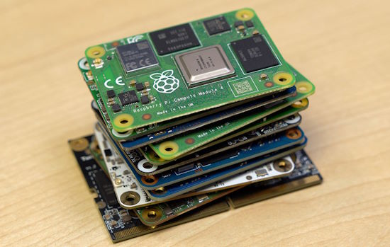](https://www.jeffgeerling.com/blog/2023/so-you-want-make-raspberry-pi-killer#comments)

Raspberry Pi Compute Module 4 boards have been rather scarce since 2021. Jeff Geerling notes that supplies are easing in line with what Eben Upton predicted ([rpilocator](https://rpilocator.com/?cat=CM4)). Jeff also discusses alternate CM4 form factor boards and the state of the ecosphere - [Jeff Geerling](https://www.jeffgeerling.com/blog/2023/so-you-want-make-raspberry-pi-killer#comments).

## A Raspberry Pi 5 Review

A comprehensive review of the Raspberry Pi 5 - [bret.dk](https://bret.dk/raspberry-pi-5-review/).

>"My Raspberry Pi 5 review will cover a wide range of areas, with comparisons to some of the existing options available on the market, and help you decide whether the Raspberry Pi Foundation’s latest offering is the one for you."

Whilst I’m comparing a range of other boards such as the older sibling, the Raspberry Pi 4, the Libre Computer Alta, Radxa’s ROCK 5B, and an Intel N100 system

## Talking To An Oscilloscope with Python

[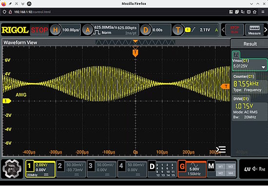](https://blog.adafruit.com/2023/11/22/how-to-talk-to-your-oscilloscope-python-hackaday/)

Historically, test gear used IEEE-488/GPIB/HPIB. Today, a device will likely talk over a USB port, a serial port, or a LAN connection. Each vendor and even model has its unique command language. There has been a significant effort to standardize some aspects of test instrument control, and you can quickly write code to control things on any platform. The key is to use VISA. This protocol, defined by the IVI Foundation, lets you talk to instruments regardless of how they communicate - [Hackaday](https://hackaday.com/2023/11/21/how-to-talk-to-your-scope/) and [Adafruit Blog](https://blog.adafruit.com/2023/11/22/how-to-talk-to-your-oscilloscope-python-hackaday/).

## Limor Fried’s code is often a de facto standard, and now ChatGPT is using it

[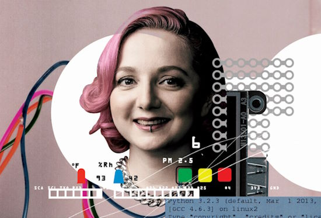](https://blog.adafruit.com/2023/11/22/limor-frieds-code-is-often-a-de-facto-standard-and-now-chatgpt-is-using-it-adafruit-chatgpt-ai-ieeespectrum-limorfried/)

IEEE Spectrum writes this past week about [Limor Fried](https://spectrum.ieee.org/profile-limor-fried), the founder of Adafruit. The open-source microcontroller driver libraries she writes to interface with devices such as sensors and displays often become de facto standards and are found in many code repositories. Recently, Fried began experimenting with ChatGPT to generate drivers and discovered that the AI was writing in her own particular style - [IEEE Spectrum](https://spectrum.ieee.org/chatgpt-code) and [Adafruit Blog](https://blog.adafruit.com/2023/11/22/limor-frieds-code-is-often-a-de-facto-standard-and-now-chatgpt-is-using-it-adafruit-chatgpt-ai-ieeespectrum-limorfried/).

## An Interactive Display for Finding Wheelchair-Accessible Places

[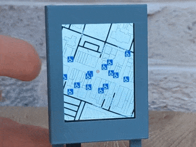](https://www.hackster.io/rhammell/interactive-display-for-finding-wheelchair-accessible-places-6020f1)

A touch-enabled display searches for and maps the location of wheelchair-accessible places around a user-defined location. This is done with an Adafruit PyPortal and CircuitPython along with Adafruit IO, Geoapify and Google Places - [hackster.io](https://www.hackster.io/rhammell/interactive-display-for-finding-wheelchair-accessible-places-6020f1).

## Low-Cost Volcanic Activity Detection with Raspberry Pi Cameras

[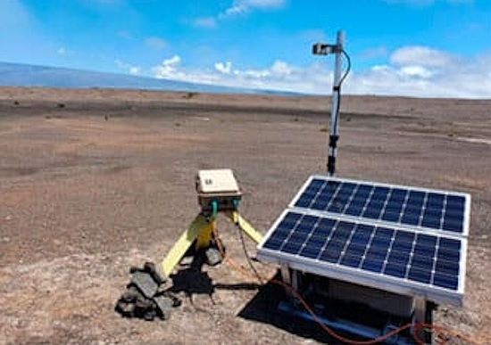](https://www.raspberrypi.com/news/low-cost-volcanic-activity-detection-with-raspberry-pi-cameras/)

A team of researchers from Chile, Australia, the US, and the UK have found a more affordable method to capture volcanic activity by detecting sulphur dioxide (SO2) emissions. While SO2 cameras do already exist, they’re usually expensive, so the team harnessed the more affordable Raspberry Pi cameras to create their solution. Data acquisition is controlled by software written in Python 3, which is freely available on [GitHub](https://github.com/twVolc/PyCamPermanent) - [Raspberry Pi News](https://www.raspberrypi.com/news/low-cost-volcanic-activity-detection-with-raspberry-pi-cameras/) and the scientific paper in [Frontiers](https://www.frontiersin.org/articles/10.3389/feart.2023.1088992/full).

## HackSpace Magazine Issue 72 - Raspberry Pi 5 Projects

[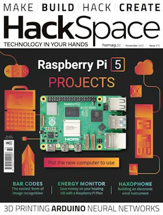](https://hackspace.raspberrypi.com/issues/72)

HackSpace Magazine issue 72 - Raspberry 5 Projects is out in print and [PDF](https://hackspace.raspberrypi.com/issues/72/contributions/new). There are two projects in the issue using CircuitPython, two in MicroPython, and one with Python - [PDF](https://hackspace.raspberrypi.com/issues/72/contributions/new) and [print](https://hackspace.raspberrypi.com/issues/72).

- Pico Air W: air monitoring using Raspberry Pi Pico W and CircuitPython
- Machine Learning: Using TensorFlow Light and Python on Raspberry Pi 5
- Making Music on Pico: Using `synthio` in CircuitPython on Raspberry Pi Pico
- Make a Pico LCD true or false quiz game in MicroPython on Raspberry Pi Pico
- Pico Agile Octopus Tariff Display: Uses MicroPython on a Raspberry Pi Pico W

## Using a CB Radio on Your PC With CircuitPython

[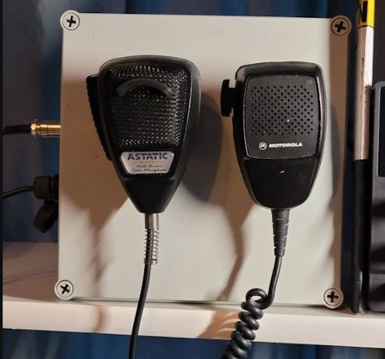](https://adafruit-playground.com/u/delchi/pages/cb-microphone-for-your-pc-breaker-breaker-any-takers)

Adafruit Playground member delchi writes: "I was looking for some new gaming frontiers when I came across truck simulators! All the skill & thrill of a big rig from your PC. As with all simulators there are button boxes and realistic cockpits to buy, but one thing I didn't see was a CB radio mic! They expect us to use desktop mics, headsets or some other hoo-haw instead of the ol jabberjaw microphone! A little deeper digging showed that you can buy adapters, but they ranged from $180 to $300!"

Instead, delchi built an interface using an Adafruit QT Py RP2040 and CircuitPython to implement push to talk (PTT) in simulators using USB HID - [Adafruit Playground](https://adafruit-playground.com/u/delchi/pages/cb-microphone-for-your-pc-breaker-breaker-any-takers).

## This Week's Python Streams

Python on Hardware is all about building a cooperative ecosphere which allows contributions to be valued and to grow knowledge. Below are the streams within the last week focusing on the community.

**CircuitPython Deep Dive Stream**

[Last Friday](https://www.youtube.com/watch?v=op3lTYKwNzM), Tim streamed work on New DisplayIO Shapes + Round Screen.

You can see the latest video and past videos on the Adafruit YouTube channel under the Deep Dive playlist - [YouTube](https://www.youtube.com/playlist?list=PLjF7R1fz_OOXBHlu9msoXq2jQN4JpCk8A).

**CircuitPython Parsec**

John Park’s CircuitPython Parsec is on holiday this week. Catch all the episodes in the [YouTube playlist](https://www.youtube.com/playlist?list=PLjF7R1fz_OOWFqZfqW9jlvQSIUmwn9lWr).

**CircuitPython Weekly Meeting**

CircuitPython Weekly Meeting for November 20, 2023 ([notes](https://github.com/adafruit/adafruit-circuitpython-weekly-meeting/blob/main/2023/2023-11-23.md)) [on YouTube](https://youtu.be/dgqI5mshZts).

## Project of the Week: A Projection Clock With a Vacuum Fluorescent Display

The VFD Night Projector Clock may be the first projecting clock that uses a VFD display. One trick to having the time project is to use a camera lens to focus the light on the ceiling. The project uses MicroPython on an STM32 microcontroller - [GitHub](https://github.com/shufps/vfd-night-projector-clock) and [Adafruit Blog](https://blog.adafruit.com/2023/11/20/making-a-projection-clock-with-a-vacuum-fluorescent-display/).

## Popular Last Week

What was the most popular, most clicked link, in [last week's newsletter](newslink)? [27 Malicious PyPI Packages with Thousands of Downloads Found](https://thehackernews.com/2023/11/27-malicious-pypi-packages-with.html).

## New Notes from Adafruit Playground

[Adafruit Playground](https://adafruit-playground.com/) is a new place for the community to post their projects and other making tips/tricks/techniques. Ad-free, it's an easy way to publish your work in a safe space for free.

[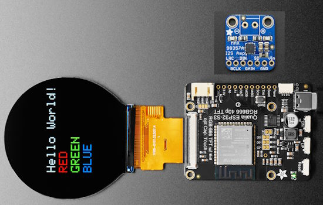](https://adafruit-playground.com/u/dexter_starboard/pages/sound-for-qualia-rgb666)

Sound for the Qualia RGB666 and CircuitPython - [Adafruit Playground](https://adafruit-playground.com/u/dexter_starboard/pages/sound-for-qualia-rgb666).

Hello Pi: Finding the IP Address of Headless Raspberry Pis (and Other Devices) - [Adafruit Playground](https://adafruit-playground.com/u/wiz0/pages/hello-pi-finding-the-ip-address-of-headless-raspberry-pis-and-other-devices).

CircuitPython HDMI Multiviewer RS232 Controller - [Adafruit Playground](https://adafruit-playground.com/u/jfurcean/pages/circuitpython-hdmi-multiviewer-rs232-controller).

## News from around the web

[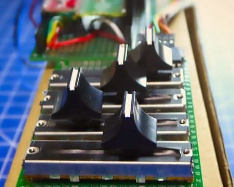](https://faircamp.axwax.eu/axwax-dawless-jams-1/)

An album made using electronic instruments including a Raspbbery Pi Pico with MicroPython - [faircamp.axwax.eu](https://faircamp.axwax.eu/axwax-dawless-jams-1/).

> "I haven't really made a proper post about my first solo and Faircamp-exclusive E.P, so it's time to rectify that. It's a collection of my DAWless jams, recorded between August 2021 and April 2022. As there is no MIDI or sequencer on the Werkstatt, I wrote a hacky MicroPython script to produce a hardcoded, but MIDI-synced arpeggio on CV1 and a user-controllable envelope generator on CV2."

[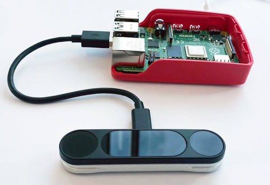](https://twitter.com/ultraleap_devs/status/1727343555868606689)

[Ultraleap](https://www.ultraleap.com/) hand tracking is now compatible with the Raspberry Pi 4 and 5, and includes Python bindings - [X](https://twitter.com/ultraleap_devs/status/1727343555868606689) and [GitHub](https://github.com/ultraleap/leapc-python-bindings).

WiFi Setup with the Raspberry Pi Pico W and MicroPython - [simonprickett.dev](https://simonprickett.dev/wifi-setup-with-raspberry-pi-pico-w/), [GitHub](https://github.com/simonprickett/phewap) and [YouTube](https://youtu.be/Gzp9nLkqadg).

[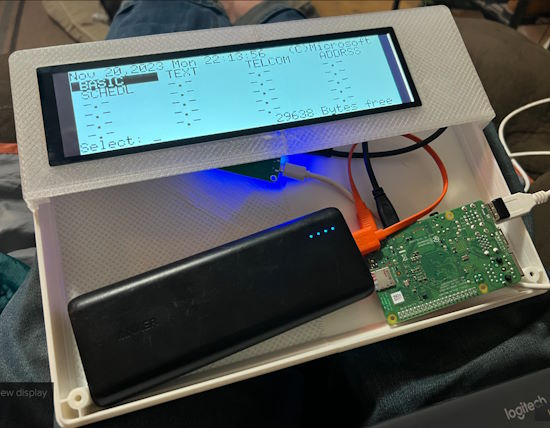](https://hackaday.io/project/193619-vcf-80-model-100)

Evan Scheel kept seeing gutted or "inspired by (Radio Shack) Model 100" builds, so he decided to start designing an 'updated' TRS-80 Model 100, the VCF-80, Model 100 - [Hackaday](https://hackaday.io/project/193619-vcf-80-model-100).

> "I have wanted to undertake a similar project (a cyberdeck) for some time using a Raspberry Pi to develop a portable and functional development platform for programming microcontrollers and other projects with Python."

[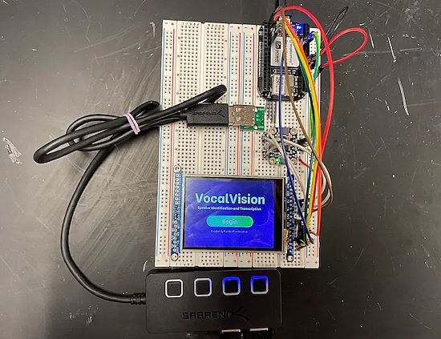](https://www.hackster.io/512003/vocalvision-transcription-classification-on-pocketbeagle-3014c9)

With VocalVision, you can record any speech, and this device will not only transcribe it, but also make a guess on who said it. It uses a PocketBeagle, Adafruit display and is programmed in Python and Adafruit Blinka - [hackster.io](https://www.hackster.io/512003/vocalvision-transcription-classification-on-pocketbeagle-3014c9) and [YouTube](https://youtu.be/KlsuRaNcSdM).

[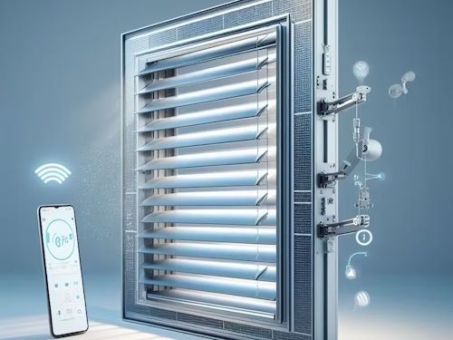](https://www.hackster.io/AmaljithCf/smart-motorized-window-blinds-with-environmental-control-b435e4)

Smart motorized window blinds with environmental control with MicroPython - [hackster.io](https://www.hackster.io/AmaljithCf/smart-motorized-window-blinds-with-environmental-control-b435e4).

[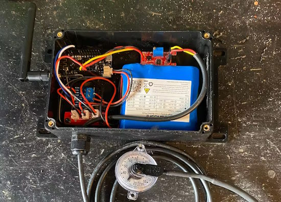](https://www.hackster.io/Chad_2005/liquid-propane-tank-remote-level-monitoring-24255c)

Liquid propane tank remote level monitoring with ESP32 and MicroPython - [hackster.io](https://www.hackster.io/Chad_2005/liquid-propane-tank-remote-level-monitoring-24255c).

[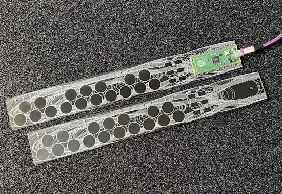](https://www.raspberrypi.com/news/picotouch-synthesiser-magpimonday/)

Raspberry Pi writes about Tod Kurt's PicoTouch synthesizer project previously featured here and now in the November issue of The MagPi. It uses a capacitive touch PCB and a Raspberry Pi Pico runnig CircuitPython to make all kinds of synth sounnds - [Raspberry Pi News](https://www.raspberrypi.com/news/picotouch-synthesiser-magpimonday/).

[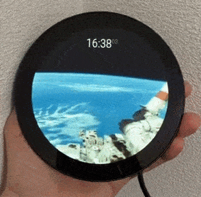](https://twitter.com/sozoraemon/status/1728009738489901321)

A round display clock that also displays live video from the International Space Station with Raspberry Pi (Japanese) - [X](https://twitter.com/sozoraemon/status/1728009738489901321).

[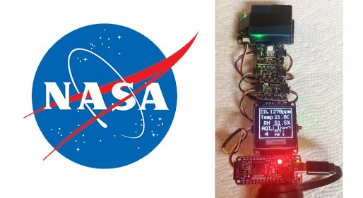](https://blog.adafruit.com/2023/11/24/an-open-source-co2-air-quality-sensor-stella-aq-space-circuitpython-feather-stemma-nasa/)

An open source, no solder CO2/Air Quality sensor: STELLA-AQ using Adafruit Feather, sensors and CircuitPython - [NASA](https://landsat.gsfc.nasa.gov/stella/stella-aq/) and [Adafruit Blog](https://blog.adafruit.com/2023/11/24/an-open-source-co2-air-quality-sensor-stella-aq-space-circuitpython-feather-stemma-nasa/).

[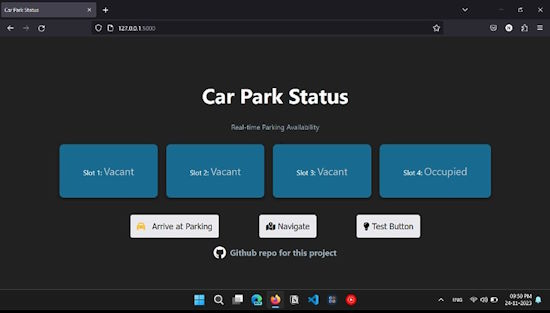](https://twitter.com/Navadeep_naidu7/status/1728116937295818903)

A real-time parking availability web application with IoT integration with Raspberry Pi Pico W and MicroPython - [X Thread](https://twitter.com/Navadeep_naidu7/status/1728116937295818903) and [GitHub](https://github.com/navadeepnaidu7/parking-status-project).

An affirmation MicroPython program for two [Thumbys](https://thumby.us/) which were made into earrings - [X](https://twitter.com/alinalikescozy/status/1727205369599119830).

text - [site](url).

text - [site](url).

text - [site](url).

text - [site](url).

text - [site](url).

## New

[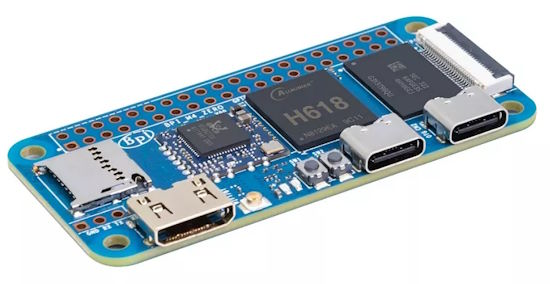](https://wiki.banana-pi.org/Banana_Pi_BPI-M4_Zero)

The Banana Pi BPI-M4 Zero is the successor model of the M2 Zero. The SOC is upgraded to H618 and the CPU frequency is increased by 25%. The memory is upgraded to DDR4, the capacity is quadrupled, and 8G eMMC is added. It supports 5G WiFi, and the USB interface has also been upgraded to type-C - [Banana Pi Wiki](https://wiki.banana-pi.org/Banana_Pi_BPI-M4_Zero) via [X](https://twitter.com/sinovoip/status/1726800305806070269).

text - [site](url).

## Coming Soon

[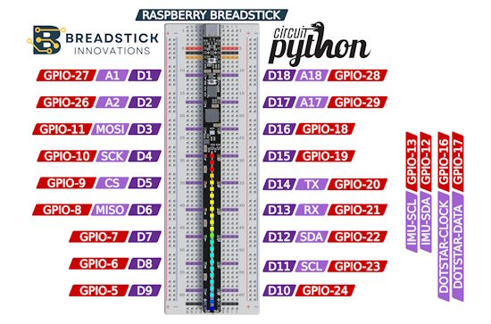](https://twitter.com/RangenMichael/status/1726708074260672870)

The test batch of Raspberry Breadsticks has arrived!! Cody’s got a CircuitPython pull-request in for the board’s config too! [Sign up](https://shop.breadstick.ca/) to the campaign to make sure you don’t miss the launch announcement - [X](https://twitter.com/RangenMichael/status/1726708074260672870), [Website](https://shop.breadstick.ca/) and [GitHub](https://github.com/mrangen/Raspberry-Breadstick).

text - [site](url).

## New Boards Supported by CircuitPython

The number of supported microcontrollers and Single Board Computers (SBC) grows every week. This section outlines which boards have been included in CircuitPython or added to [CircuitPython.org](https://circuitpython.org/).

This week, there were no new boards added (the big dump was last week). More are in development.

*Note: For non-Adafruit boards, please use the support forums of the board manufacturer for assistance, as Adafruit does not have the hardware to assist in troubleshooting.*

Looking to add a new board to CircuitPython? It's highly encouraged! Adafruit has four guides to help you do so:

- [How to Add a New Board to CircuitPython](https://learn.adafruit.com/how-to-add-a-new-board-to-circuitpython/overview)
- [How to add a New Board to the circuitpython.org website](https://learn.adafruit.com/how-to-add-a-new-board-to-the-circuitpython-org-website)
- [Adding a Single Board Computer to PlatformDetect for Blinka](https://learn.adafruit.com/adding-a-single-board-computer-to-platformdetect-for-blinka)
- [Adding a Single Board Computer to Blinka](https://learn.adafruit.com/adding-a-single-board-computer-to-blinka)

## New Learn Guides

[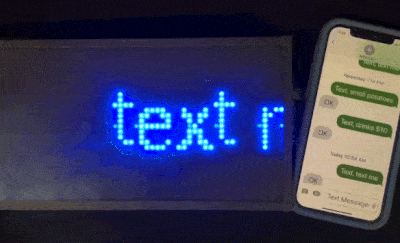](https://learn.adafruit.com/guides/latest)

[Scroll an SMS Text Message on your RGB Matrix](https://learn.adafruit.com/scroll-an-sms-text-message-on-your-rgb-matrix/code-the-message-board) from [Erin St Blaine](https://learn.adafruit.com/u/firepixie)

## CircuitPython Libraries

The CircuitPython library numbers are continually increasing, while existing ones continue to be updated. Here we provide library numbers and updates!

To get the latest Adafruit libraries, download the [Adafruit CircuitPython Library Bundle](https://circuitpython.org/libraries). To get the latest community contributed libraries, download the [CircuitPython Community Bundle](https://circuitpython.org/libraries).

If you'd like to contribute to the CircuitPython project on the Python side of things, the libraries are a great place to start. Check out the [CircuitPython.org Contributing page](https://circuitpython.org/contributing). If you're interested in reviewing, check out Open Pull Requests. If you'd like to contribute code or documentation, check out Open Issues. We have a guide on [contributing to CircuitPython with Git and GitHub](https://learn.adafruit.com/contribute-to-circuitpython-with-git-and-github), and you can find us in the #help-with-circuitpython and #circuitpython-dev channels on the [Adafruit Discord](https://adafru.it/discord).

You can check out this [list of all the Adafruit CircuitPython libraries and drivers available](https://github.com/adafruit/Adafruit_CircuitPython_Bundle/blob/master/circuitpython_library_list.md). 

The current number of CircuitPython libraries is **462**!

**New Libraries**

Here's this week's new CircuitPython libraries:

  * [elpekenin/circuitpython_toml](https://github.com/elpekenin/circuitpython_toml)

**Updated Libraries**

Here's this week's updated CircuitPython libraries:

  * [adafruit/Adafruit_CircuitPython_MiniMQTT](https://github.com/adafruit/Adafruit_CircuitPython_MiniMQTT)
  * [adafruit/Adafruit_CircuitPython_Display_Shapes](https://github.com/adafruit/Adafruit_CircuitPython_Display_Shapes)
  * [cedargrovestudios/circuitpython_chime](https://github.com/cedargrovestudios/circuitpython_chime)

**Library PyPI Weekly Download Stats**

**Total Library Stats**
  * 79179 PyPI downloads over 321 libraries

**Top 10 Libraries by PyPI Downloads**
  * Adafruit CircuitPython BusDevice (adafruit-circuitpython-busdevice): 9077
  * Adafruit CircuitPython Requests (adafruit-circuitpython-requests): 8330
  * Adafruit CircuitPython Register (adafruit-circuitpython-register): 2809
  * Adafruit CircuitPython ADS1x15 (adafruit-circuitpython-ads1x15): 1254
  * Adafruit CircuitPython Motor (adafruit-circuitpython-motor): 819
  * Adafruit CircuitPython ESP32SPI (adafruit-circuitpython-esp32spi): 807
  * Adafruit CircuitPython framebuf (adafruit-circuitpython-framebuf): 803
  * Adafruit CircuitPython ServoKit (adafruit-circuitpython-servokit): 799
  * Adafruit CircuitPython Pixelbuf (adafruit-circuitpython-pixelbuf): 777
  * Adafruit CircuitPython NeoPixel (adafruit-circuitpython-neopixel): 765

## What’s the CircuitPython team up to this week?

What is the team up to this week? Let’s check in:

**Dan**

I'm fixing bugs for the 8.2.x and 9.0.0 milestones, looking toward the medium-term goal of a 9.0.0 release. At the moment I'm looking at ESP32-S3 BLE issues, but I've fixed a number of other more minor issues. Re-testing has shown some problems have been fixed by the upgrade to ESP-IDF v5.1 and the recent MicroPython merges, and require no further work. Other issues require more thorough debugging. We are steadily reducing the issue list.

**Tim**

This week I've been working on refactoring some proposed code for circup that adds support for interacting with devices via the web workflow. I had to learn about the pytest mocking module in order to update the tests to work with the newly refactored version of circup. I've also been doing testing on proposed changes in the MiniMQTT library

**Jeff**

I've started working on a web-based UI for the OV5640 camera together with the ESP32-S3 microcontroller. Hopefully in the end this will allow streaming camera data in low resolution, setting the camera parameters (such as effect, exposure, etc) and downloading full-resolution images. At this time, it only works with commandline requests by curl, but it's a start.

When not working on this demo, I've been working in various small ways on CircuitPython 9. For instance, I noticed that not all of our tests were being performed when we built CircuitPython, and fixed it.

**Scott**

I'm keeping up with emails and PRs but not much else. I've been spending lots of time with family due to my mom's failing health.

**Liz**

This week I worked on a [1 minute video](https://youtube.com/shorts/ZCI8Wb70Xhc) to showcase using a CIRCUITPY drive with an Android device. I also worked on updating the [3.5" TFT FeatherWing guide](https://learn.adafruit.com/adafruit-3-5-tft-featherwing) for the V2 version of the board that was released last week.

In personal hardware news, I happened to come across an infamous Meowsic cat piano on the side of the road during a walk this week that was in purrfect condition after a little clean-up. This is the same keyboard that [JP featured in a few Learn Guides](https://learn.adafruit.com/meowsic-line-out). I'm excited to do my own mods soon.

## Upcoming Events

The inaugural PyLadies Conference will take place December 1-3, 2023 - [pretalx](https://pretalx.com/pyladiescon-2023/cfp).

The Pyjamas Conference, the 24-hour online Python conference, will be returning for a fifth year on December 9-10.

The next MicroPython Meetup in Melbourne will be on December 27th – [Meetup](https://www.meetup.com/micropython-meetup/events). 

PyCon US 2024 Launches - May 15-23, 2024 in Pittsburgh, Pennsylvania US - [PyCon US](https://pycon.blogspot.com/2023/10/pycon-us-2024-launches.html).

**Send Your Events In**

If you know of virtual events or upcoming events, please let us know via email to cpnews(at)adafruit(dot)com.

## Latest Releases

CircuitPython's stable release is [8.2.8](https://github.com/adafruit/circuitpython/releases/latest) and its unstable release is [9.0.0 alpha5](https://github.com/adafruit/circuitpython/releases). New to CircuitPython? Start with our [Welcome to CircuitPython Guide](https://learn.adafruit.com/welcome-to-circuitpython).

[20231124](https://github.com/adafruit/Adafruit_CircuitPython_Bundle/releases/latest) is the latest Adafruit CircuitPython library bundle.

[20231124](https://github.com/adafruit/CircuitPython_Community_Bundle/releases/latest) is the latest CircuitPython Community library bundle.

[v1.21..0](https://micropython.org/download) is the latest MicroPython release. Documentation for it is [here](http://docs.micropython.org/en/latest/pyboard/).

[3.12.0](https://www.python.org/downloads/) is the latest Python release. The latest pre-release version is [3.13.0a2](https://www.python.org/download/pre-releases/).

[3,720 Stars](https://github.com/adafruit/circuitpython/stargazers) Like CircuitPython? [Star it on GitHub!](https://github.com/adafruit/circuitpython)

## Call for Help -- Translating CircuitPython is now easier than ever

[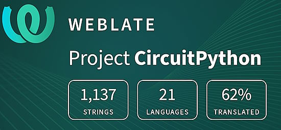](https://hosted.weblate.org/engage/circuitpython/)

One important feature of CircuitPython is translated control and error messages. With the help of fellow open source project [Weblate](https://weblate.org/), we're making it even easier to add or improve translations. 

Sign in with an existing account such as GitHub, Google or Facebook and start contributing through a simple web interface. No forks or pull requests needed! As always, if you run into trouble join us on [Discord](https://adafru.it/discord), we're here to help.

## 38,124 Thanks

The Adafruit Discord community, where we do all our CircuitPython development in the open, reached over 38,124 humans - thank you! Adafruit believes Discord offers a unique way for Python on hardware folks to connect. Join today at [https://adafru.it/discord](https://adafru.it/discord).

## ICYMI - In case you missed it

Python on hardware is the Adafruit Python video-newsletter-podcast! The news comes from the Python community, Discord, Adafruit communities and more and is broadcast on ASK an ENGINEER Wednesdays. The complete Python on Hardware weekly videocast [playlist is here](https://www.youtube.com/playlist?list=PLjF7R1fz_OOXRMjM7Sm0J2Xt6H81TdDev). The video podcast is on [iTunes](https://itunes.apple.com/us/podcast/python-on-hardware/id1451685192?mt=2), [YouTube](http://adafru.it/pohepisodes), [Instagram Reels](https://www.instagram.com/adafruit/channel/)), and [XML](https://itunes.apple.com/us/podcast/python-on-hardware/id1451685192?mt=2).

[The weekly community chat on Adafruit Discord server CircuitPython channel - Audio / Podcast edition](https://itunes.apple.com/us/podcast/circuitpython-weekly-meeting/id1451685016) - Audio from the Discord chat space for CircuitPython, meetings are usually Mondays at 2pm ET, this is the audio version on [iTunes](https://itunes.apple.com/us/podcast/circuitpython-weekly-meeting/id1451685016), Pocket Casts, [Spotify](https://adafru.it/spotify), and [XML feed](https://adafruit-podcasts.s3.amazonaws.com/circuitpython_weekly_meeting/audio-podcast.xml).

## Contribute

The CircuitPython Weekly Newsletter is a CircuitPython community-run newsletter emailed every Tuesday. The complete [archives are here](https://www.adafruitdaily.com/category/circuitpython/). It highlights the latest CircuitPython related news from around the web including Python and MicroPython developments. To contribute, edit next week's draft [on GitHub](https://github.com/adafruit/circuitpython-weekly-newsletter/tree/gh-pages/_drafts) and [submit a pull request](https://help.github.com/articles/editing-files-in-your-repository/) with the changes. You may also tag your information on Twitter with #CircuitPython. 

Join the Adafruit [Discord](https://adafru.it/discord) or [post to the forum](https://forums.adafruit.com/viewforum.php?f=60) if you have questions.
