- [ ] Library and info updates
- [ ] change date
- [ ] update title
- [ ] Feature story
- [ ] Update  for images
- [ ] Update ICYDNCI
- [ ] All images 550w max only
- [ ] Link "View this email in your browser."

News Sources

- [Adafruit Playground](https://adafruit-playground.com/)
- Twitter: [CircuitPython](https://twitter.com/search?q=circuitpython&src=typed_query&f=live), [MicroPython](https://twitter.com/search?q=micropython&src=typed_query&f=live) and [Python](https://twitter.com/search?q=python&src=typed_query)
- [Raspberry Pi News](https://www.raspberrypi.com/news/)
- Mastodon [CircuitPython](https://octodon.social/tags/CircuitPython) and [MicroPython](https://octodon.social/tags/MicroPython)
- [hackster.io CircuitPython](https://www.hackster.io/search?q=circuitpython&i=projects&sort_by=most_recent) and [MicroPython](https://www.hackster.io/search?q=micropython&i=projects&sort_by=most_recent)
- [python.org](https://www.python.org/)
- [Python Insider - dev team blog](https://pythoninsider.blogspot.com/)
- Individuals: [Jeff Geerling](https://www.jeffgeerling.com/blog)
- [hackaday CircuitPython](https://hackaday.com/blog/?s=circuitpython) and [MicroPython](https://hackaday.com/blog/?s=micropython)
- [hackaday.io newest projects MicroPython](https://hackaday.io/projects?tag=micropython&sort=date) and [CircuitPython](https://hackaday.io/projects?tag=circuitpython&sort=date)
- [https://opensource.com/tags/python](https://opensource.com/tags/python)
- Check Issues and PRs for input

View this email in your browser. **Warning: Flashing Imagery**

Welcome to the latest Python on Microcontrollers newsletter! *insert 2-3 sentences from editor (what's in overview, banter)* - *Anne Barela, Ed.*

We're on [Discord](https://discord.gg/HYqvREz), [Twitter](https://twitter.com/search?q=circuitpython&src=typed_query&f=live), and for past newsletters - [view them all here](https://www.adafruitdaily.com/category/circuitpython/). If you're reading this on the web, [subscribe here](https://www.adafruitdaily.com/). Here's the news this week:

## Headline

text - [site](url).

## Eben Upton Hints at an RP2040 Successor, Promises a Raspberry Pi Compute Module 5 in 2024

[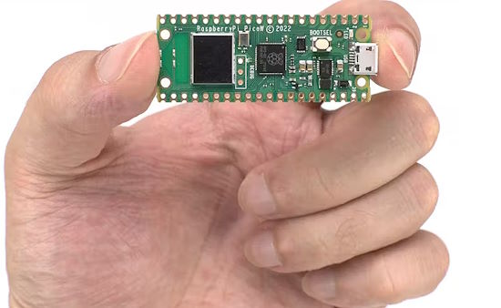](https://www.hackster.io/news/eben-upton-hints-at-an-rp2040-successor-promises-a-raspberry-pi-compute-module-5-in-2024-ec331994aca3)

Eben Upton hints at an RP2040 successor, promises a Raspberry Pi Compute Module 5 in 2024 - [hackster.io](https://www.hackster.io/news/eben-upton-hints-at-an-rp2040-successor-promises-a-raspberry-pi-compute-module-5-in-2024-ec331994aca3).

> "We know what people don't like [and] what people do like," Upton says, "and we have a chip team."

## Microsoft Reeleases ThreadX, Used in Raspberry Pi Boards, as Open Source

Microsoft opens sources ThreadX under MIT license. The 'Azure RTOS', used in millions of Raspberry Pis, is now open source - [The Register](https://www.theregister.com/2023/11/28/microsoft_opens_sources_threadx/).

> ThreadX was quite pervasive... Microsoft claims 12 billion devices run it, and you might own some of them. It is the firmware that controls every Raspberry Pi bigger than the Pi Pico. On the Pi 1, 2 and 3, it's the file on your Pi's SD card called bootcode.bin; in the Pi 4 and 400, it's called start*.elf. Even though it's on GitHub and included in Debian, it's a proprietary "blob" (Binary Large OBject). It's a metaphorical sealed black box which doesn't even contain Arm code: instead, it runs on the Pi's VideoCore GPU. This is the primary device, the part that boots up the Pi and controls its hardware.

## Feature

text - [site](url).

## Using an External GPUs on the Raspberry Pi 5

[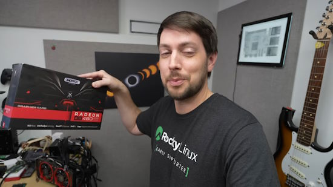](https://www.youtube.com/watch?v=BLg-1w2QayU)

When the Raspberry Pi Compute Module 4 came out, folks worked very hard to get the single PCIe lane working with external hardware with mixed results. With the release of the Raspberry Pi 5, previous work, along with improvements in the Pi, have allowed for more success in interfacing PCIe hardware like graphics cards - [YouTube](https://www.youtube.com/watch?v=BLg-1w2QayU) and [GitHub](https://github.com/geerlingguy/raspberry-pi-pcie-devices/issues/564).

## The Best Raspberry Pi 5 microSD Cards

[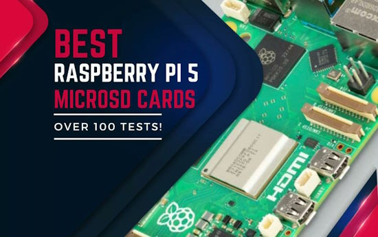](https://bret.dk/best-raspberry-pi-5-microsd-cards/)

Raspberry Pi 5 boards are getting into Pythonista hands and the question comes up: which microSD card gives the best performance? bret.dk tests popular models on the market to determine which ones are the best bet - [bret.dk](https://bret.dk/best-raspberry-pi-5-microsd-cards/).

## This Week's Python Streams

Python on Hardware is all about building a cooperative ecosphere which allows contributions to be valued and to grow knowledge. Below are the streams within the last week focusing on the community.

**CircuitPython Deep Dive Stream**

[Last Friday](link), Scott streamed work on {subject}.

You can see the latest video and past videos on the Adafruit YouTube channel under the Deep Dive playlist - [YouTube](https://www.youtube.com/playlist?list=PLjF7R1fz_OOXBHlu9msoXq2jQN4JpCk8A).

**CircuitPython Parsec**

John Park’s CircuitPython Parsec this week is on {subject} - [Adafruit Blog](link) and [YouTube](link).

Catch all the episodes in the [YouTube playlist](https://www.youtube.com/playlist?list=PLjF7R1fz_OOWFqZfqW9jlvQSIUmwn9lWr).

**The CircuitPython Show**

The CircuitPython Show is an independent podcast hosted by Paul Cutler, focusing on the people doing awesome things with CircuitPython. Each episode features Paul in conversation with a guest for a short interview – [CircuitPython Show](https://www.circuitpythonshow.com/).

The latest episode was released December 4th and features Max Lupo.  Max shares how the art he creates uses electronics and CircuitPython.

**CircuitPython Weekly Meeting**

CircuitPython Weekly Meeting for {date} ([notes]([file](https://github.com/adafruit/adafruit-circuitpython-weekly-meeting/blob/main/2023/2023-11-27.md))) [on YouTube]([link](https://youtu.be/scbLOtXnVtw)).

## Project of the Week: Wokwi

[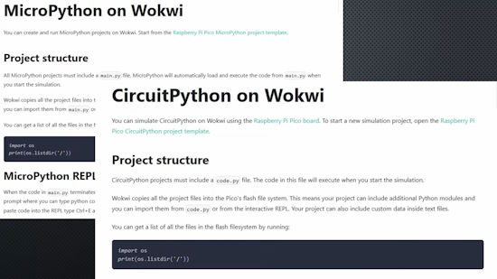](https://www.youtube.com/watch?v=6l9DWqb77KI)

Andreas Spiess makes a recent video on using Wokwi to simulate Arduino, ESP32, Pi Pico, STM32, And ATtiny with programming in MicroPython or CircuitPython - [YouTube](https://www.youtube.com/watch?v=6l9DWqb77KI).

## Popular Last Week

[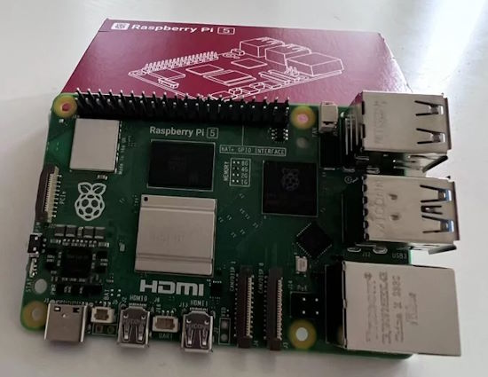](https://bret.dk/raspberry-pi-5-review/)

What was the most popular, most clicked link, in [last week's newsletter](https://www.adafruitdaily.com/2023/11/27/python-on-microcontrollers-newsletter-projects-galore-pi-news-and-much-more-circuitpython-python-micropython-thepsf-raspberry_pi/)? [Raspberry Pi 5 Review](https://bret.dk/raspberry-pi-5-review/).

## New Notes from Adafruit Playground

[Adafruit Playground](https://adafruit-playground.com/) is a new place for the community to post their projects and other making tips/tricks/techniques. Ad-free, it's an easy way to publish your work in a safe space for free.

[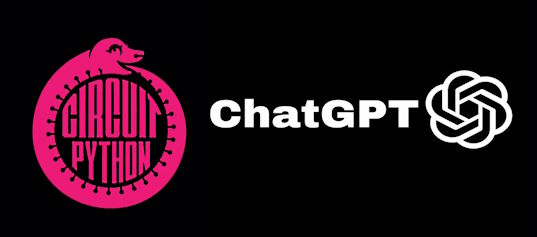](https://adafruit-playground.com/u/dexter_starboard/pages/circuitpython-and-chatgpt-code-interpreter)

CircuitPython and ChatGPT code interpreter. It allows you to run your own code on a GPT server - [Adafruit Playground](https://adafruit-playground.com/u/dexter_starboard/pages/circuitpython-and-chatgpt-code-interpreter).

[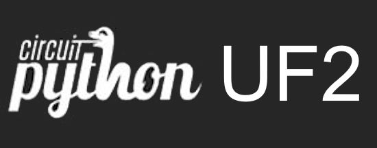](https://adafruit-playground.com/u/danhalbert/pages/create-all-in-one-uf2-s-with-circuitpy-files-on-rp2040)

Create All-in-One UF2's with CIRCUITPY files on RP2040 boards - [Adafruit Playground](https://adafruit-playground.com/u/danhalbert/pages/create-all-in-one-uf2-s-with-circuitpy-files-on-rp2040).

[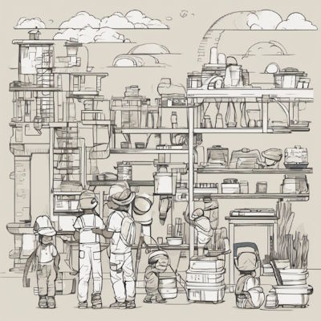](https://adafruit-playground.com/u/ntynen/pages/circuitpython-helpers-project)

The CircuitPython Helpers Project is a set of wrapper classes that can be used across projects - [Adafruit Playground](https://adafruit-playground.com/u/ntynen/pages/circuitpython-helpers-project).

## News from around the web

[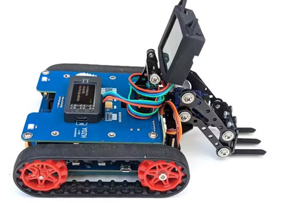](https://www.hackster.io/news/alexander-kirillov-s-yozh-is-an-expandable-compact-open-source-robot-for-education-and-more-c76d338abb74)

Alexander Kirillov's Yozh is an expandable, compact, open source robot for education and more. Pololu motors are driven from a custom electronics board, which also forms the chassis, with an Adafruit ESP32-S3 Feather as the primary microcontroller running CircuitPython and a Microchip SAM D21 as a coprocessor for low-level operations - [hackster.io](https://www.hackster.io/news/alexander-kirillov-s-yozh-is-an-expandable-compact-open-source-robot-for-education-and-more-c76d338abb74).

text - [site](url).

[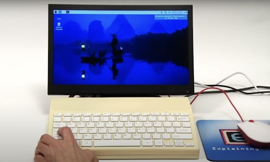](https://www.raspberrypi.com/news/explaining-computers-beat-us-to-raspberry-pi-500/)

Make your own Raspberry Pi 500 computer (sort of) - [Raspberry Pi News](https://www.raspberrypi.com/news/explaining-computers-beat-us-to-raspberry-pi-500/).

[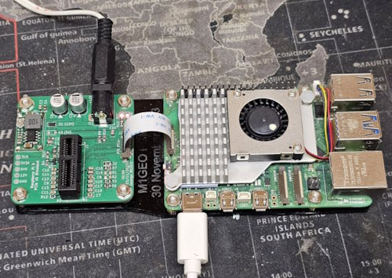](https://twitter.com/m1geo/status/1730036304279154991?t=5q5O7UfKaEmoTV1R5bRg7w&s=03)

George, M1GEO, is making a PCIe x1 breakout board for Raspberry Pi 5 - [X](https://twitter.com/m1geo/status/1730036304279154991?t=5q5O7UfKaEmoTV1R5bRg7w&s=03) and [GitHub](https://github.com/m1geo/Pi5_PCIe).

text - [site](url).

text - [site](url).

There's a brand new #Pybricks #MicroPython release that adds Bluetooth communication between all LEGO smart hubs. Try it now at [pybricks.com](https://pybricks.com/) - [Mastodon](https://fosstodon.org/@laurensvalk/111465975221205039).

text - [site](url).

text - [site](url).

[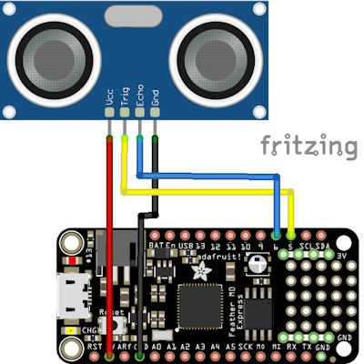](http://www.learnmicropython.com/circuitpython/adafruit-feather-m0-and-us-026-ultrasonic-sensor-circuitpython-example.php)

Using an Adafruit Feather M0 Express and a US-026 ultrasonic sensor with CircuitPython - [Learn MicroPython](http://www.learnmicropython.com/circuitpython/adafruit-feather-m0-and-us-026-ultrasonic-sensor-circuitpython-example.php).

[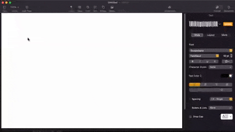](https://dupontgu.github.io/scopin-sans-web/)

Scopin' Sans is an open source typeface for hardware folk. See text as serial data on an oscilloscope - [GitHub](https://dupontgu.github.io/scopin-sans-web/) via [X](https://twitter.com/gvy_dvpont/status/1730240133587243440).

[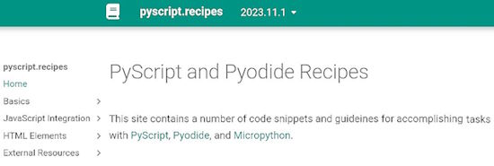](https://blog.adafruit.com/2023/11/27/use-pyscript-better-with-open-source-pyscript-recipes-iot-python-programming-jeffersglass/)

Use PyScript better with open source PyScript Recipes - [Adafruit Blog](https://blog.adafruit.com/2023/11/27/use-pyscript-better-with-open-source-pyscript-recipes-iot-python-programming-jeffersglass/).

[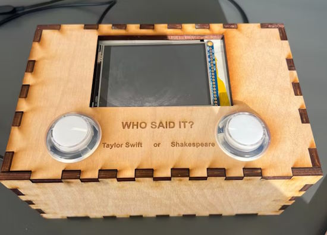](https://www.hackster.io/511943/who-said-it-taylor-swift-vs-shakespeare-trivia-fd3cca)

Who said it? Making a Taylor Swift vs. Shakespeare trivia box made with PocketBeagle and Python - [hackster.io](https://www.hackster.io/511943/who-said-it-taylor-swift-vs-shakespeare-trivia-fd3cca).

[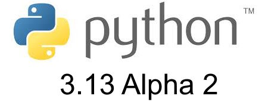](https://www.kevsrobots.com/blog/python13.html)

What's new in Python 3.13 alpha? A summary - [Kev's Robots](https://www.kevsrobots.com/blog/python13.html).

Building a small REPL in Python - [Bernsteinbear](https://bernsteinbear.com/blog/simple-python-repl/).

[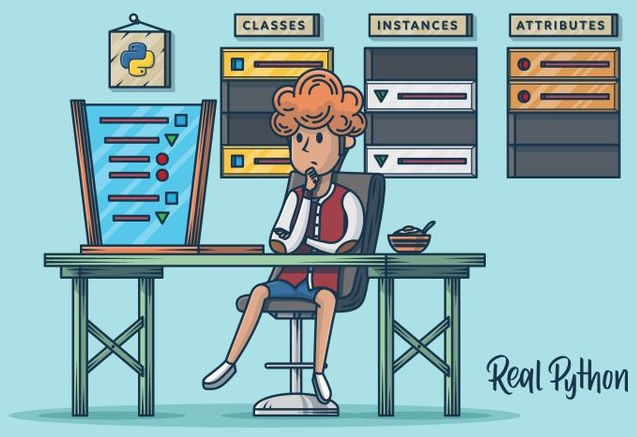](https://realpython.com/learning-paths/object-oriented-programming-oop-python/)

Object-Oriented Programming (OOP) With Python - [Real Python](https://realpython.com/learning-paths/object-oriented-programming-oop-python/).

[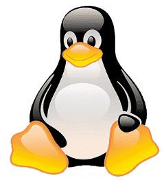](https://www.digikey.com/en/maker/blogs/2023/a-beginners-guide-to-linux-and-shell-commands-the-popular-ones)

A Beginner's Guide to Linux and Shell Commands: The Popular Ones - [DigiKey](https://www.digikey.com/en/maker/blogs/2023/a-beginners-guide-to-linux-and-shell-commands-the-popular-ones).

## Coming Soon / New

text - [site](url).

text - [site](url).

## New Boards Supported by CircuitPython

The number of supported microcontrollers and Single Board Computers (SBC) grows every week. This section outlines which boards have been included in CircuitPython or added to [CircuitPython.org](https://circuitpython.org/).

This week, there were (#/no) new boards added:

- [Board name](url)
- [Board name](url)
- [Board name](url)

*Note: For non-Adafruit boards, please use the support forums of the board manufacturer for assistance, as Adafruit does not have the hardware to assist in troubleshooting.*

Looking to add a new board to CircuitPython? It's highly encouraged! Adafruit has four guides to help you do so:

- [How to Add a New Board to CircuitPython](https://learn.adafruit.com/how-to-add-a-new-board-to-circuitpython/overview)
- [How to add a New Board to the circuitpython.org website](https://learn.adafruit.com/how-to-add-a-new-board-to-the-circuitpython-org-website)
- [Adding a Single Board Computer to PlatformDetect for Blinka](https://learn.adafruit.com/adding-a-single-board-computer-to-platformdetect-for-blinka)
- [Adding a Single Board Computer to Blinka](https://learn.adafruit.com/adding-a-single-board-computer-to-blinka)

## New Learn Guides

[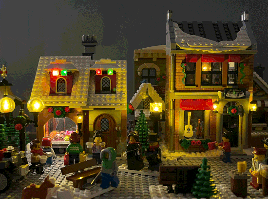](https://learn.adafruit.com/guides/latest)

[LEGO Set Lighting](https://learn.adafruit.com/lego-set-lighting) from [John Park](https://learn.adafruit.com/u/johnpark)

[Qualia S3 Space Clock](https://learn.adafruit.com/qualia-s3-space-clock) from [Liz Clark](https://learn.adafruit.com/u/BlitzCityDIY)

[MatrixPortal S3 Flight Proximity Tracker](https://learn.adafruit.com/matrixportal-s3-flight-proximity-tracker) from [Trevor Beaton](https://learn.adafruit.com/u/Seekwill)

## Updated Learn Guides

[Adafruit Qualia ESP32-S3 for RGB-666 Displays](https://learn.adafruit.com/adafruit-qualia-esp32-s3-for-rgb666-displays) from [M. LeBlanc-Williams](https://learn.adafruit.com/u/MakerMelissa)

## CircuitPython Libraries

The CircuitPython library numbers are continually increasing, while existing ones continue to be updated. Here we provide library numbers and updates!

To get the latest Adafruit libraries, download the [Adafruit CircuitPython Library Bundle](https://circuitpython.org/libraries). To get the latest community contributed libraries, download the [CircuitPython Community Bundle](https://circuitpython.org/libraries).

If you'd like to contribute to the CircuitPython project on the Python side of things, the libraries are a great place to start. Check out the [CircuitPython.org Contributing page](https://circuitpython.org/contributing). If you're interested in reviewing, check out Open Pull Requests. If you'd like to contribute code or documentation, check out Open Issues. We have a guide on [contributing to CircuitPython with Git and GitHub](https://learn.adafruit.com/contribute-to-circuitpython-with-git-and-github), and you can find us in the #help-with-circuitpython and #circuitpython-dev channels on the [Adafruit Discord](https://adafru.it/discord).

You can check out this [list of all the Adafruit CircuitPython libraries and drivers available](https://github.com/adafruit/Adafruit_CircuitPython_Bundle/blob/master/circuitpython_library_list.md). 

The current number of CircuitPython libraries is **###**!

**New Libraries**

Here's this week's new CircuitPython libraries:

* [library](url)

**Updated Libraries**

Here's this week's updated CircuitPython libraries:

* [library](url)

**Library PyPI Weekly Download Stats**

## What’s the CircuitPython team up to this week?

What is the team up to this week? Let’s check in:

**Dan**

I was able to improve the functionality of ESP32-S3 BLE acting as a BLE central. It now can talk to simple BLE devices such as pulse oximeters.

I'm continuing to work on CircuitPython 8.2.x and 9.0.0 issues, as we head toward 9.0.0 betas and then the final release.

**Melissa**

This past week was a short one due to the holiday. I spent time catching up on messages because I had also taken some time off the week before. I updated the [Qualia S3 guide](https://learn.adafruit.com/adafruit-qualia-esp32-s3-for-rgb666-displays) with backlight information as well as adding another Arduino example.

**Tim**

This week I tested out the new addition of Arcs in the Display Shapes library, the Qualia S3 and 2.1" round display made for perfect testing grounds. I've also been continuing work on a refactor of proposed changes in circup that add support for web workflow. Over the past weekend I made progress on updating fixing my PyGame_Display library to work with the latest versions of `Blinka_DisplayIO`, there are still quirks to work out but I've gotten the display to render successfully. 

**Jeff**

The CircuitPython library for the upcoming camera product is now [public on github](https://github.com/adafruit/Adafruit_CircuitPython_PyCamera/).

There are some details to be worked out before this can be published as part of the bundle, because the autofocus camera module requires a "firmware.bin" file which we can't currently include as part of the Adafruit CircuitPython Bundle. In the process of updating the bundle builder to handle this, I learned that a handful of libraries for CircuitPython, mostly in the community bundle, have incorrect data in `pyproject.toml`, which I would like to rely on to determine which files to include.

**Scott**

Last week I was out for family time and the Thanksgiving holiday. This week I'm mostly around so I did some bug fixing for the web workflow. First, I fixed incorrect behavior when a file that was too big is uploaded. Second, I fixed the websocket serial responsiveness to ctrl-c.

Now I'm looking at adding support for uploading directly to an attached disk (and displaying disk usage at the same time).

**Liz**

This week I published the [Qualia S3 Space Clock guide](https://learn.adafruit.com/qualia-s3-space-clock). This project was a fun challenge and I learned a ton. It was my first time working with a round display, I had to figure out how to calculate Mars time and I had to do some math to properly calculate the hour and minute hand positions for the clock face. Noe did an excellent job with the enclosure. We are both fans of retro futuristic designs from the 50's and 60's and I think he really captured that design aesthetic while managing to keep it easy to print and assemble for folks.

## Upcoming Events

The Pyjamas Conference, the 24-hour online Python conference, will be returning for a fifth year on December 9-10.

The next MicroPython Meetup in Melbourne will be on December 27th – [Meetup](https://www.meetup.com/micropython-meetup/events). 

PyCon US 2024 Launches - May 15-23, 2024 in Pittsburgh, Pennsylvania US - [PyCon US](https://pycon.blogspot.com/2023/10/pycon-us-2024-launches.html).

**Send Your Events In**

If you know of virtual events or upcoming events, please let us know via email to cpnews(at)adafruit(dot)com.

## Latest Releases

CircuitPython's stable release is [#.#.#](https://github.com/adafruit/circuitpython/releases/latest) and its unstable release is [#.#.#-##.#](https://github.com/adafruit/circuitpython/releases). New to CircuitPython? Start with our [Welcome to CircuitPython Guide](https://learn.adafruit.com/welcome-to-circuitpython).

[2023####](https://github.com/adafruit/Adafruit_CircuitPython_Bundle/releases/latest) is the latest Adafruit CircuitPython library bundle.

[2023####](https://github.com/adafruit/CircuitPython_Community_Bundle/releases/latest) is the latest CircuitPython Community library bundle.

[v#.#.#](https://micropython.org/download) is the latest MicroPython release. Documentation for it is [here](http://docs.micropython.org/en/latest/pyboard/).

[#.#.#](https://www.python.org/downloads/) is the latest Python release. The latest pre-release version is [#.#.#](https://www.python.org/download/pre-releases/).

[#,### Stars](https://github.com/adafruit/circuitpython/stargazers) Like CircuitPython? [Star it on GitHub!](https://github.com/adafruit/circuitpython)

## Call for Help -- Translating CircuitPython is now easier than ever

[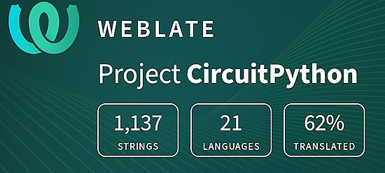](https://hosted.weblate.org/engage/circuitpython/)

One important feature of CircuitPython is translated control and error messages. With the help of fellow open source project [Weblate](https://weblate.org/), we're making it even easier to add or improve translations. 

Sign in with an existing account such as GitHub, Google or Facebook and start contributing through a simple web interface. No forks or pull requests needed! As always, if you run into trouble join us on [Discord](https://adafru.it/discord), we're here to help.

## NUMBER Thanks

The Adafruit Discord community, where we do all our CircuitPython development in the open, reached over NUMBER humans - thank you! Adafruit believes Discord offers a unique way for Python on hardware folks to connect. Join today at [https://adafru.it/discord](https://adafru.it/discord).

## ICYMI - In case you missed it

Python on hardware is the Adafruit Python video-newsletter-podcast! The news comes from the Python community, Discord, Adafruit communities and more and is broadcast on ASK an ENGINEER Wednesdays. The complete Python on Hardware weekly videocast [playlist is here](https://www.youtube.com/playlist?list=PLjF7R1fz_OOXRMjM7Sm0J2Xt6H81TdDev). The video podcast is on [iTunes](https://itunes.apple.com/us/podcast/python-on-hardware/id1451685192?mt=2), [YouTube](http://adafru.it/pohepisodes), [Instagram Reels](https://www.instagram.com/adafruit/channel/)), and [XML](https://itunes.apple.com/us/podcast/python-on-hardware/id1451685192?mt=2).

[The weekly community chat on Adafruit Discord server CircuitPython channel - Audio / Podcast edition](https://itunes.apple.com/us/podcast/circuitpython-weekly-meeting/id1451685016) - Audio from the Discord chat space for CircuitPython, meetings are usually Mondays at 2pm ET, this is the audio version on [iTunes](https://itunes.apple.com/us/podcast/circuitpython-weekly-meeting/id1451685016), Pocket Casts, [Spotify](https://adafru.it/spotify), and [XML feed](https://adafruit-podcasts.s3.amazonaws.com/circuitpython_weekly_meeting/audio-podcast.xml).

## Contribute

The CircuitPython Weekly Newsletter is a CircuitPython community-run newsletter emailed every Tuesday. The complete [archives are here](https://www.adafruitdaily.com/category/circuitpython/). It highlights the latest CircuitPython related news from around the web including Python and MicroPython developments. To contribute, edit next week's draft [on GitHub](https://github.com/adafruit/circuitpython-weekly-newsletter/tree/gh-pages/_drafts) and [submit a pull request](https://help.github.com/articles/editing-files-in-your-repository/) with the changes. You may also tag your information on Twitter with #CircuitPython. 

Join the Adafruit [Discord](https://adafru.it/discord) or [post to the forum](https://forums.adafruit.com/viewforum.php?f=60) if you have questions.
