- [ ] Library and info updates
- [ ] change date
- [ ] update title
- [ ] Feature story
- [ ] Update  for images
- [ ] Update ICYDNCI
- [ ] All images 550w max only
- [ ] Link "View this email in your browser."

News Sources

- [Adafruit Playground](https://adafruit-playground.com/)
- Twitter: [CircuitPython](https://twitter.com/search?q=circuitpython&src=typed_query&f=live), [MicroPython](https://twitter.com/search?q=micropython&src=typed_query&f=live) and [Python](https://twitter.com/search?q=python&src=typed_query)
- [Raspberry Pi News](https://www.raspberrypi.com/news/)
- Mastodon [CircuitPython](https://octodon.social/tags/CircuitPython) and [MicroPython](https://octodon.social/tags/MicroPython)
- [hackster.io CircuitPython](https://www.hackster.io/search?q=circuitpython&i=projects&sort_by=most_recent) and [MicroPython](https://www.hackster.io/search?q=micropython&i=projects&sort_by=most_recent)
- [python.org](https://www.python.org/)
- [Python Insider - dev team blog](https://pythoninsider.blogspot.com/)
- Individuals: [Jeff Geerling](https://www.jeffgeerling.com/blog)
- [hackaday CircuitPython](https://hackaday.com/blog/?s=circuitpython) and [MicroPython](https://hackaday.com/blog/?s=micropython)
- [hackaday.io newest projects MicroPython](https://hackaday.io/projects?tag=micropython&sort=date) and [CircuitPython](https://hackaday.io/projects?tag=circuitpython&sort=date)
- [https://opensource.com/tags/python](https://opensource.com/tags/python)
- Check Issues and PRs for input

View this email in your browser. **Warning: Flashing Imagery**

Welcome to the latest Python on Microcontrollers newsletter! *insert 2-3 sentences from editor (what's in overview, banter)* - *Anne Barela, Ed.*

We're on [Discord](https://discord.gg/HYqvREz), [Twitter](https://twitter.com/search?q=circuitpython&src=typed_query&f=live), and for past newsletters - [view them all here](https://www.adafruitdaily.com/category/circuitpython/). If you're reading this on the web, [subscribe here](https://www.adafruitdaily.com/). Here's the news this week:

## MicroPython v1.22.1 Patch Release

[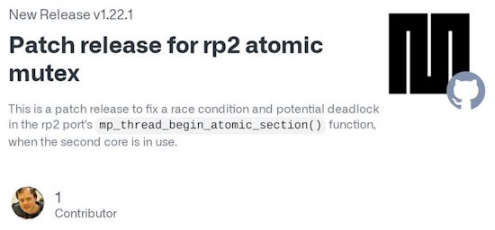](https://github.com/micropython/micropython/releases)

MicroPython v1.22.1 was released to address a specific race condition in using `_thread` in the RP2 port. v1.22.0 has been out since December 27th so the period where the issue has been in effect is short, although it was present in preview builds since November 9th - [GitHub](https://github.com/micropython/micropython/releases).

## Comparing the 1970's Cray-1 Supercomputer Against the Raspberry Pi Single-Board Computer Range

[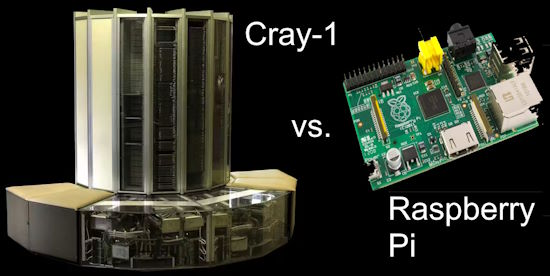](https://www.hackster.io/news/roy-longbottom-pits-1976-s-cray-1-supercomputer-against-the-raspberry-pi-single-board-computer-range-152bbe2d4111)

Developer Roy Longbottom, who has been personally benchmarking computer systems large and small for more than 50 years, has published a look at how the venerable Cray-1 supercomputer stacks up against modern devices of a considerably smaller scale: the Raspberry Pi family of single-board computers (SBCs) - [hackster.io](https://www.hackster.io/news/roy-longbottom-pits-1976-s-cray-1-supercomputer-against-the-raspberry-pi-single-board-computer-range-152bbe2d4111).

> "In 1978, the Cray-1 supercomputer cost $7 million, weighed 10,500 pounds and had a 115 kilowatt power supply. It was, by far, the fastest computer in the world," Longbottom writes of the device, designed as the flagship product of Seymour Cray's high-performance computing company. "The Raspberry Pi costs around $70 (CPU board, case, power supply, SD Card), weighs a few ounces, uses a five watt power supply and is more than 4.5 times faster than the Cray 1."

See Longbottom's extensive tests and comparisons article - [roylongbottom.org.uk](http://www.roylongbottom.org.uk/Cray%201%20Supercomputer%20Performance%20Comparisons%20With%20Home%20Computers%20Phones%20and%20Tablets.htm).

## In-Depth: Arduino Exploring Manufacturing in India

Last week's newsletter issue covered a TechCrunch article on Arduino saying they might manufacture in India as the software downloads dwarf the sales of hardware. Adafruit's director Phil Torrone writes a follow-up in the Adafruit Blog on Open Source Hardware and Software - [Adafruit Blog](https://blog.adafruit.com/2024/01/04/techcrunch-arduino-exploring-india-manufacturing-to-limit-counterfeit-sales/) and [Ask an Engineer Segment on YouTube](https://youtu.be/1EER4v5VJns?feature=shared&t=114).

> "What Arduino is calling “fake boards” are primarily Arduino-compatibles and clones, not trademark-infringing counterfeits. Blaming low-cost compatibles and assuming it’s a loss of 3.2 million sales since that’s the download count of the IDE is blaming something that is not really happening. There are counterfeits for sure, but that’s very different than hardware that’s compatible with using the Arduino IDE – the large number of downloads for the open-source Arduino IDE is for compatible board-support-packaged hardware like the ESP8266, ESP32, etc. (Unknown if there’s any telemetry data that lets anyone know what hardware is being used with the IDE, just that it’s downloaded, so we’re going with market indicators, projects published, GitHub repos, and shared online)."

## Feature

text - [site](url).

## 8 Reasons to Upgrade to a Raspberry Pi 5, Project by Project

[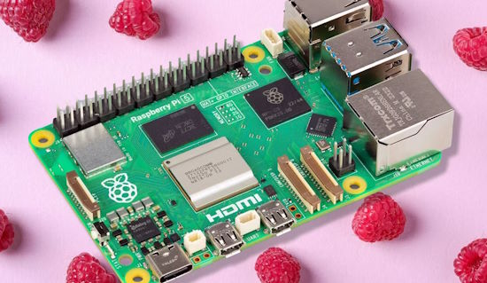](https://www.makeuseof.com/raspberry-pi-5-reasons-upgrade-projects/)

8 Reasons to upgrade to a Raspberry Pi 5, project by project. With a far more capable processor and a bunch of extra features, the Raspberry Pi 5 offers far more power than previous models - [Make Use Of](https://www.makeuseof.com/raspberry-pi-5-reasons-upgrade-projects/) via [Adafruit Blog](https://blog.adafruit.com/2023/12/29/8-reasons-to-upgrade-to-a-raspberry-pi-5-project-by-project-piday-raspberrypi/).

## Use Python Inside of Google Sheets With Neptyne

[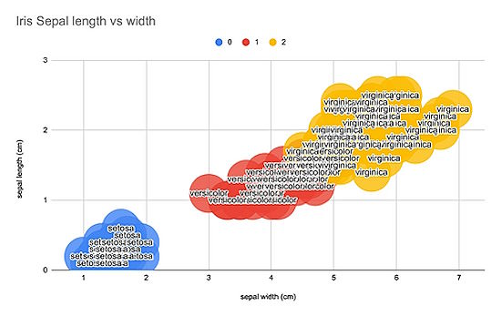](https://www.neptyne.com/google-sheets)

Neptyne allows use of Python inside of Google Sheets (similar to the announced use of Python in Microsoft Excel) - [Neptyne](https://www.neptyne.com/google-sheets) via [X](https://twitter.com/NeptyneHQ/status/1725275803473326313?t=bu-Aq-P3ELG9_kdg3fsVhQ&s=03).

## What are the Age of Some Popular Languages in 2024

[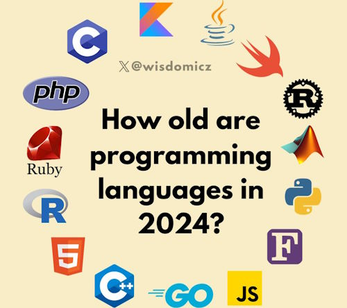](https://twitter.com/wisdomicz/status/1741825418053754918)

How old are languages in 2024? Wisdomic on X compiled a list. We added Python for microcontrollers - [X](https://twitter.com/wisdomicz/status/1741825418053754918).

* Assembly : 77 yrs
* FORTRAN : 70 yrs
* ALGOL : 66 yrs 
* COBOL  : 65 yrs
* LISP : 64 yrs  
* BASIC : 60 yrs
* LOGO : 57 yrs
* Pascal : 54 yrs   
* C  : 52 yrs   
* SQL : 50 yrs
* MATLAB : 40 yrs
* C++ : 39 yrs   
* Python : 33 yrs   
* HTML : 33 yrs  
* Ruby : 31 yrs   
* PHP : 30 yrs   
* JavaScript : 29 yrs   
* Java : 29 yrs 
* C# : 24 yrs 
* Rust : 18 yrs   
* Go : 17 yrs     
* Typescript : 12 yrs   
* Swift : 10 yrs
* MicroPython : 10 yrs
* CircuitPython : 7 yrs 

## This Week's Python Streams

Python on Hardware is all about building a cooperative ecosphere which allows contributions to be valued and to grow knowledge. Below are the streams within the last week focusing on the community.

**CircuitPython Deep Dive Stream**

[Last Friday](link), Tim streamed work on {subject}.

You can see the latest video and past videos on the Adafruit YouTube channel under the Deep Dive playlist - [YouTube](https://www.youtube.com/playlist?list=PLjF7R1fz_OOXBHlu9msoXq2jQN4JpCk8A).

**CircuitPython Parsec**

John Park’s CircuitPython Parsec this week is on {subject} - [Adafruit Blog](link) and [YouTube](link).

Catch all the episodes in the [YouTube playlist](https://www.youtube.com/playlist?list=PLjF7R1fz_OOWFqZfqW9jlvQSIUmwn9lWr).

**CircuitPython Weekly Meeting**

CircuitPython Weekly Meeting for January 2, 2024 ([notes](https://github.com/adafruit/adafruit-circuitpython-weekly-meeting/blob/main/2024/2024-01-02.md)) [on YouTube]([link](https://youtu.be/PgvY4-uFFKQ)).

## Project of the Week: Sound Localization with Raspberry Pi and Python

[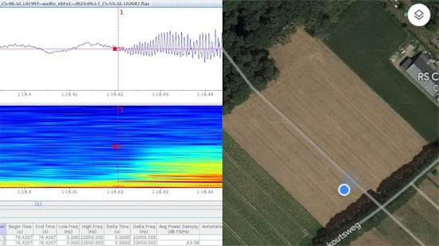](https://github.com/hcfman/sbts-aru)

If you have multiple microphones in known locations, and can determine the time a sound arrives at each one, you can actually determine the location that sound is coming from. This technique is referred to as sound localization via time difference of arrival. Kim Hendrikse decided to put the technique to good use to track down the location of illicit fireworks launches.

The build is based on the Raspberry Pi, with Kim developing an “autonomous recording unit” complete with GPS module for determining their location and keeping everything time synchronized. By deploying a number of these units, spread out over some distance, it’s possible to localize loud sounds based on the time stamps they show up in the recording on each unit - [GitHub](https://github.com/hcfman/sbts-aru), [Medium](https://github.com/hcfman/sbts-aru) and [Hackaday](https://hackaday.com/2023/12/30/localizing-fireworks-launches-with-a-raspberry-pi/).

## Popular Last Week

[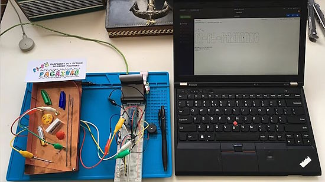](https://all3dp.com/2/best-raspberry-pi-projects-with-python/)

What was a popular, clicked link, in [last week's newsletter](https://www.adafruitdaily.com/2024/01/01/python-on-microcontrollers-newsletter-micropython-v1-22-0-is-out-freertos-adds-multiprocessing-and-much-more-circuitpython-python-micropython-thepsf-raspberry_pi/)? [10 Raspberry Pi Projects with Python to Boost Your Skills](https://all3dp.com/2/best-raspberry-pi-projects-with-python/).

## New Notes from Adafruit Playground

[Adafruit Playground](https://adafruit-playground.com/) is a new place for the community to post their projects and other making tips/tricks/techniques. Ad-free, it's an easy way to publish your work in a safe space for free.

[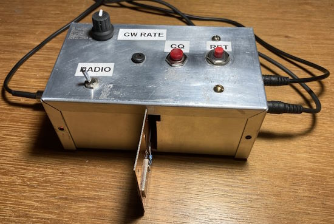](https://adafruit-playground.com/u/petitnoel/pages/rp2040-cw-keyer)

A morse keyer using a Feather RP2040 and CircuitPython - [Adafruit Playground](https://adafruit-playground.com/u/petitnoel/pages/rp2040-cw-keyer).

text - [Adafruit Playground](url).

text - [Adafruit Playground](url).

## News from around the web

[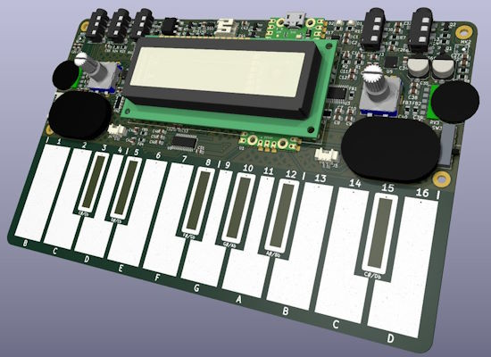](https://pico-synth-sandbox.dcdalrymple.com/revision-2/)

PCB Revision 2 of the Pico Synth Soundbox has been released using CircuitPython - [pico-synth-sandbox](https://pico-synth-sandbox.dcdalrymple.com/revision-2/).

[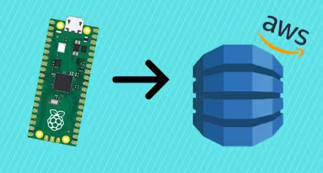](https://www.hackster.io/shilleh/how-to-send-data-to-aws-dynamodb-from-raspberry-pi-pico-w-6a4ee1)

How to Send Data to AWS DynamoDB in MicroPython from Raspberry Pi Pico W - [hackster.io](https://www.hackster.io/shilleh/how-to-send-data-to-aws-dynamodb-from-raspberry-pi-pico-w-6a4ee1).

[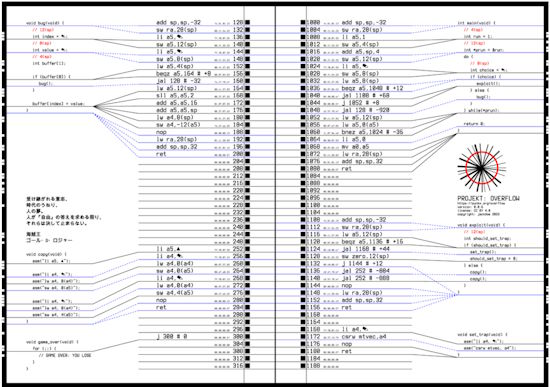](https://punkx.org/overflow/)

PROJEKT: OVERFLOW is a RISC-V assembly board game - [punkx.org](https://punkx.org/overflow/).

> "The game is about creating a small shellcode in memory by copying existing instructions and then exploiting a buffer overflow to jump into it, so that you can overwrite your opponent’s return address to force them to go to the game_over() function.There are other mechanics as well and more layers of strategy (like setting the exception handler or monkeypatching)."

[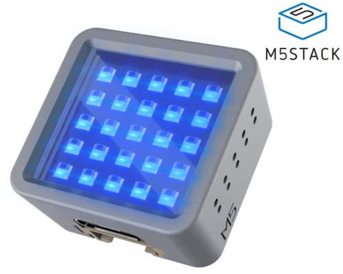](https://github.com/simonprickett/m5stack-atom-micropython)

Simon Prickett is doing a series of live streams on the M5Stack Atom Matrix with MicroPython - [GitHub](https://github.com/simonprickett/m5stack-atom-micropython).

[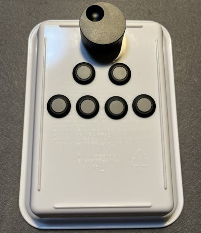](https://twitter.com/yawatta/status/1740726005453770891)

A Left-handed HID input device with rotary encoder and buttons with Raspberry Pi RP2040 and CircuitPython - [X](https://twitter.com/yawatta/status/1740726005453770891) (Japanese).

text - [site](url).

[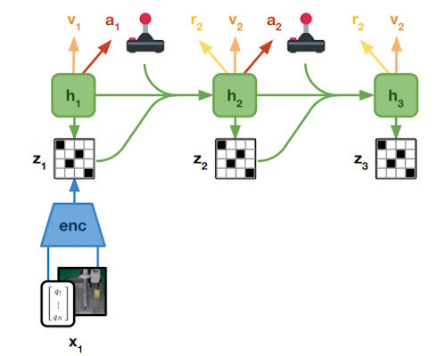](https://github.com/danijar/daydreamer)

Implementating of the [DayDreamer](https://danijar.com/daydreamer/) algorithm in TensorFlow 2 with Python and Jupyter Notebooks - [GitHub](https://github.com/danijar/daydreamer) and [project website](https://danijar.com/project/daydreamer/).

text - [site](url).

text - [site](url).

text - [site](url).

text - [site](url).

Take the video stream from an ESP32Cam and process it for faces on another, connected computer in Python and OpenCV - [YouTube](https://www.youtube.com/watch?v=DmWkxABZ69o) and [GitHub](https://github.com/kevinmcaleer/esp32cam_rtspstream) via [X](https://twitter.com/kevsmac/status/1741737938960982435).

An interactive flip flop simulation in Python and Jupyter Notebook - [GitHub](https://github.com/mattvenn/flipflop_demo) and [YouTube](https://www.youtube.com/watch?v=5PRuPVIjEcs).

[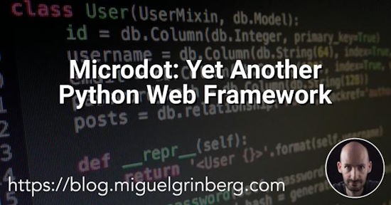](https://blog.miguelgrinberg.com/post/microdot-yet-another-python-web-framework)

Another Python web framework? Really? But Miguel Grinberg claims Microdot is different! It's small enough to work with MicroPython, compatible with CPython, and has Flask-like syntax - [blog.miguelgrinberg.com/](https://blog.miguelgrinberg.com/post/microdot-yet-another-python-web-framework) via [X](https://twitter.com/grandiopanda/status/1741908414287040956).

Shed Skin is a transpiler which can translate pure, but implicitly statically typed Python 3 programs into optimized C++. It can generate stand-alone programs or extension modules that can be imported and used in larger Python programs - [GitHub](https://github.com/shedskin/shedskin/tree/master?tab=readme-ov-file).

[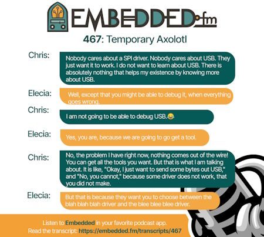](https://twitter.com/embeddedfm/status/1742625259344323061)

If you're an embedded software developer, you'll want to check out embedded.fm. Chris and Elicia know their stuff and are funny doing so - [embedded.fm podcast](https://embedded.fm/episodes/467) and [transcript](https://embedded.fm/transcripts/467), via [X](https://twitter.com/embeddedfm/status/1742625259344323061).

[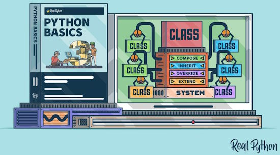](https://realpython.com/courses/python-basics-class/)

Python Basics: Building Systems With Classes - [Real Python](https://realpython.com/courses/python-basics-class/).

[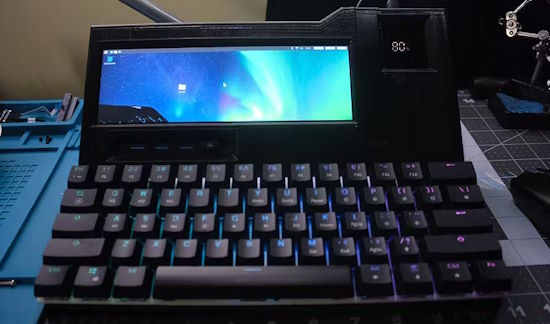](https://www.hackster.io/news/keigen7-s-sleek-3d-printed-raspberry-pi-4-cyberdeck-rings-in-2024-in-style-4f81c6c29d2a)

A 3D-printed Raspberry Pi 4 Cyberdeck - [hackster.io](https://www.hackster.io/news/keigen7-s-sleek-3d-printed-raspberry-pi-4-cyberdeck-rings-in-2024-in-style-4f81c6c29d2a) and [Reddit](https://www.reddit.com/r/cyberDeck/comments/18vcwcl/simple_cyberdeck_build_built_with_raspberry_pi_4b/).

## New

[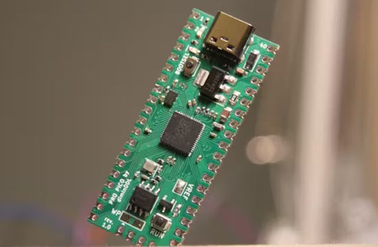](https://dmytroengineering.com/content/projects/pro-pico)

ProPico is an "Improved Raspberry Pi Pico" with better ADC, USB Type-C, and more - [website](https://dmytroengineering.com/content/projects/pro-pico) and [hackster.io](https://www.hackster.io/news/dmytro-s-propico-is-an-improved-raspberry-pi-pico-with-better-adc-usb-type-c-and-more-032d59ebb4a3).

[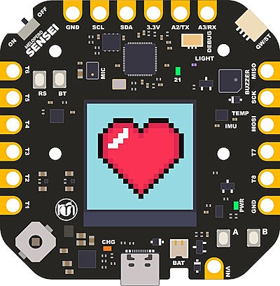](https://www.melopero.com/shop/melopero/melopero-sensei/)

Melopero Sensei is a development board based on the Raspberry Pi RP2040 microcontroller equipped with a 1.3” TFT 240×240 display and a variety of sensors - [Melopero](https://www.melopero.com/shop/melopero/melopero-sensei/).

## New Boards Supported by CircuitPython

The number of supported microcontrollers and Single Board Computers (SBC) grows every week. This section outlines which boards have been included in CircuitPython or added to [CircuitPython.org](https://circuitpython.org/).

This week, there were (#/no) new boards added:

- [Board name](url)
- [Board name](url)
- [Board name](url)

*Note: For non-Adafruit boards, please use the support forums of the board manufacturer for assistance, as Adafruit does not have the hardware to assist in troubleshooting.*

Looking to add a new board to CircuitPython? It's highly encouraged! Adafruit has four guides to help you do so:

- [How to Add a New Board to CircuitPython](https://learn.adafruit.com/how-to-add-a-new-board-to-circuitpython/overview)
- [How to add a New Board to the circuitpython.org website](https://learn.adafruit.com/how-to-add-a-new-board-to-the-circuitpython-org-website)
- [Adding a Single Board Computer to PlatformDetect for Blinka](https://learn.adafruit.com/adding-a-single-board-computer-to-platformdetect-for-blinka)
- [Adding a Single Board Computer to Blinka](https://learn.adafruit.com/adding-a-single-board-computer-to-blinka)

## New Learn Guides

WIth the holidays, there are no new guides this week.

## CircuitPython Libraries

The CircuitPython library numbers are continually increasing, while existing ones continue to be updated. Here we provide library numbers and updates!

To get the latest Adafruit libraries, download the [Adafruit CircuitPython Library Bundle](https://circuitpython.org/libraries). To get the latest community contributed libraries, download the [CircuitPython Community Bundle](https://circuitpython.org/libraries).

If you'd like to contribute to the CircuitPython project on the Python side of things, the libraries are a great place to start. Check out the [CircuitPython.org Contributing page](https://circuitpython.org/contributing). If you're interested in reviewing, check out Open Pull Requests. If you'd like to contribute code or documentation, check out Open Issues. We have a guide on [contributing to CircuitPython with Git and GitHub](https://learn.adafruit.com/contribute-to-circuitpython-with-git-and-github), and you can find us in the #help-with-circuitpython and #circuitpython-dev channels on the [Adafruit Discord](https://adafru.it/discord).

You can check out this [list of all the Adafruit CircuitPython libraries and drivers available](https://github.com/adafruit/Adafruit_CircuitPython_Bundle/blob/master/circuitpython_library_list.md). 

The current number of CircuitPython libraries is **###**!

**New Libraries**

Here's this week's new CircuitPython libraries:

* [library](url)

**Updated Libraries**

Here's this week's updated CircuitPython libraries:

* [library](url)

**Library PyPI Weekly Download Stats**

## What’s the CircuitPython team up to this week?

What is the team up to this week? Let’s check in:

**Dan**

text.

**Melissa**

text.

**Tim**

text.

**Jeff**

text.

**Scott**

[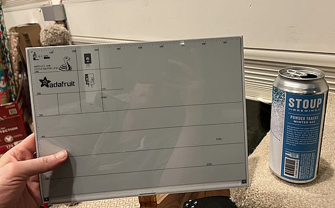](https://www.circuitpython.org/)

text.

**Liz**

text.

## Upcoming Events

The next MicroPython Meetup in Melbourne will be on January 24th – [Meetup](https://www.meetup.com/micropython-meetup/events). 

PyCascades 2024 is back in Seattle, Washington, USA and online, April 5-8th at the University of Washington's Kane Hall. - [PyCascades](https://2024.pycascades.com/).

PyCon US 2024 Launches - May 15-23, 2024 in Pittsburgh, Pennsylvania US - [PyCon US](https://pycon.blogspot.com/2024/10/pycon-us-2024-launches.html).

**Send Your Events In**

If you know of virtual events or upcoming events, please let us know via email to cpnews(at)adafruit(dot)com.

## Latest Releases

CircuitPython's stable release is [#.#.#](https://github.com/adafruit/circuitpython/releases/latest) and its unstable release is [#.#.#-##.#](https://github.com/adafruit/circuitpython/releases). New to CircuitPython? Start with our [Welcome to CircuitPython Guide](https://learn.adafruit.com/welcome-to-circuitpython).

[2024####](https://github.com/adafruit/Adafruit_CircuitPython_Bundle/releases/latest) is the latest Adafruit CircuitPython library bundle.

[2024####](https://github.com/adafruit/CircuitPython_Community_Bundle/releases/latest) is the latest CircuitPython Community library bundle.

[v#.#.#](https://micropython.org/download) is the latest MicroPython release. Documentation for it is [here](http://docs.micropython.org/en/latest/pyboard/).

[#.#.#](https://www.python.org/downloads/) is the latest Python release. The latest pre-release version is [#.#.#](https://www.python.org/download/pre-releases/).

[#,### Stars](https://github.com/adafruit/circuitpython/stargazers) Like CircuitPython? [Star it on GitHub!](https://github.com/adafruit/circuitpython)

## Call for Help -- Translating CircuitPython is now easier than ever

One important feature of CircuitPython is translated control and error messages. With the help of fellow open source project [Weblate](https://weblate.org/), we're making it even easier to add or improve translations. 

Sign in with an existing account such as GitHub, Google or Facebook and start contributing through a simple web interface. No forks or pull requests needed! As always, if you run into trouble join us on [Discord](https://adafru.it/discord), we're here to help.

## NUMBER Thanks

The Adafruit Discord community, where we do all our CircuitPython development in the open, reached over NUMBER humans - thank you! Adafruit believes Discord offers a unique way for Python on hardware folks to connect. Join today at [https://adafru.it/discord](https://adafru.it/discord).

## ICYMI - In case you missed it

Python on hardware is the Adafruit Python video-newsletter-podcast! The news comes from the Python community, Discord, Adafruit communities and more and is broadcast on ASK an ENGINEER Wednesdays. The complete Python on Hardware weekly videocast [playlist is here](https://www.youtube.com/playlist?list=PLjF7R1fz_OOXRMjM7Sm0J2Xt6H81TdDev). The video podcast is on [iTunes](https://itunes.apple.com/us/podcast/python-on-hardware/id1451685192?mt=2), [YouTube](http://adafru.it/pohepisodes), [Instagram Reels](https://www.instagram.com/adafruit/channel/)), and [XML](https://itunes.apple.com/us/podcast/python-on-hardware/id1451685192?mt=2).

[The weekly community chat on Adafruit Discord server CircuitPython channel - Audio / Podcast edition](https://itunes.apple.com/us/podcast/circuitpython-weekly-meeting/id1451685016) - Audio from the Discord chat space for CircuitPython, meetings are usually Mondays at 2pm ET, this is the audio version on [iTunes](https://itunes.apple.com/us/podcast/circuitpython-weekly-meeting/id1451685016), Pocket Casts, [Spotify](https://adafru.it/spotify), and [XML feed](https://adafruit-podcasts.s3.amazonaws.com/circuitpython_weekly_meeting/audio-podcast.xml).

## Contribute

The CircuitPython Weekly Newsletter is a CircuitPython community-run newsletter emailed every Tuesday. The complete [archives are here](https://www.adafruitdaily.com/category/circuitpython/). It highlights the latest CircuitPython related news from around the web including Python and MicroPython developments. To contribute, edit next week's draft [on GitHub](https://github.com/adafruit/circuitpython-weekly-newsletter/tree/gh-pages/_drafts) and [submit a pull request](https://help.github.com/articles/editing-files-in-your-repository/) with the changes. You may also tag your information on Twitter with #CircuitPython. 

Join the Adafruit [Discord](https://adafru.it/discord) or [post to the forum](https://forums.adafruit.com/viewforum.php?f=60) if you have questions.
