- [ ] Library and info updates
- [ ] change date
- [ ] update title
- [ ] Feature story
- [ ] Update  for images
- [ ] Update ICYDNCI
- [ ] All images 550w max only
- [ ] Link "View this email in your browser."

News Sources

- [Adafruit Playground](https://adafruit-playground.com/)
- Twitter: [CircuitPython](https://twitter.com/search?q=circuitpython&src=typed_query&f=live), [MicroPython](https://twitter.com/search?q=micropython&src=typed_query&f=live) and [Python](https://twitter.com/search?q=python&src=typed_query)
- [Raspberry Pi News](https://www.raspberrypi.com/news/)
- Mastodon [CircuitPython](https://octodon.social/tags/CircuitPython) and [MicroPython](https://octodon.social/tags/MicroPython)
- [hackster.io CircuitPython](https://www.hackster.io/search?q=circuitpython&i=projects&sort_by=most_recent) and [MicroPython](https://www.hackster.io/search?q=micropython&i=projects&sort_by=most_recent)
- [python.org](https://www.python.org/)
- [Python Insider - dev team blog](https://pythoninsider.blogspot.com/)
- Individuals: [Jeff Geerling](https://www.jeffgeerling.com/blog)
- [hackaday CircuitPython](https://hackaday.com/blog/?s=circuitpython) and [MicroPython](https://hackaday.com/blog/?s=micropython)
- [hackaday.io newest projects MicroPython](https://hackaday.io/projects?tag=micropython&sort=date) and [CircuitPython](https://hackaday.io/projects?tag=circuitpython&sort=date)
- [https://opensource.com/tags/python](https://opensource.com/tags/python)
- Check Issues and PRs for input

View this email in your browser. **Warning: Flashing Imagery**

Welcome to the latest Python on Microcontrollers newsletter! *insert 2-3 sentences from editor (what's in overview, banter)* - *Anne Barela, Ed.*

We're on [Discord](https://discord.gg/HYqvREz), [Twitter](https://twitter.com/search?q=circuitpython&src=typed_query&f=live), and for past newsletters - [view them all here](https://www.adafruitdaily.com/category/circuitpython/). If you're reading this on the web, [subscribe here](https://www.adafruitdaily.com/). Here's the news this week:

## Headline

text - [site](url).

## The CircuitPython 9 Poster Has Dropped

The official poster art for CircuitPython 9 was discussed on the Adafruit [Ask an Engineer](https://www.youtube.com/live/_eX5iFtMhS4?feature=shared&t=940) show last Wednesday. Paper posters have been announced for the Adafruit shop, coming soon - [Adafruit Store](https://www.adafruit.com/product/5873).

## CircuitPython 2024 is Coming

As the year starts, it's time to share goals for CircuitPython in 2024 and beyond. Just like in [past years](https://blog.adafruit.com/2023/01/01/circuitpython-in-2023-circuitpython2023-circuitpython/), the CircuitPython team would like like everyone in the CircuitPython community to contribute by posting their thoughts to some public place on the internet. Keep an eye on the [Adafruit Blog](https://blog.adafruit.com/) for the kickoff post from Scott Shawcroft and start gathering your thoughts to post on the social media platform of your choice.

## Python 3.13 Alpha Gets a JIT

[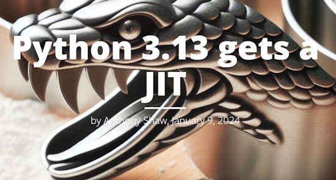](https://tonybaloney.github.io/posts/python-gets-a-jit.html)

CPython core developer Brandt Bucher has submitted a pull-request to the Python 3.13 branch adding a JIT compiler. JIT, or “Just in Time” is a compilation design that implies that compilation happens on demand when the code is run the first time. It’s a very broad term that could mean many things. Technically the Python compiler is already a JIT because it compiles from Python code into Bytecode. What people tend to mean when they say a JIT compiler, is a compiler that emits machine code.

Initial benchmarks show something of a 2-9% performance improvement. However, think of this JIT as being the cornerstone of a series of much larger optimizations. None of which are possible without it - [tonybaloney.github.io](https://tonybaloney.github.io/posts/python-gets-a-jit.html).

## What I learned from using a Raspberry Pi 5 as my main computer for two weeks

[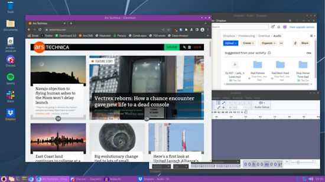](https://arstechnica.com/gadgets/2024/01/what-i-learned-from-using-a-raspberry-pi-5-as-my-main-computer-for-two-weeks/)

Andrew Cunningham wanted to take another crack at trying to use a Pi as an everyday general-purpose desktop computer. The Raspberry Pi's operating system has always included many of the tools you'd need to take a crack at this, including a lightweight desktop environment and a couple of web browser options, and the Pi 4-based Pi 400 variant has always been pitched specifically as a general-purpose computer - [Ars Technica](https://arstechnica.com/gadgets/2024/01/what-i-learned-from-using-a-raspberry-pi-5-as-my-main-computer-for-two-weeks/).

## Linux Kernel 6.7 Officially Released — And It’s a Big One

[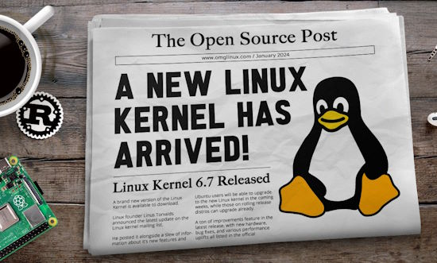](https://www.omgubuntu.co.uk/2024/01/linux-kernel-6-7-new-features)

The Linux 6.7 kernel is now officially released — and it’s hefty one packed with an assortment of new features, new hardware enablement, and more.

By commit size alone, Linux 6.7 is one of the largest in recent history - an indicator of just how much effort has been poured into honing the latest release - [OMG Ubuntu](https://www.omgubuntu.co.uk/2024/01/linux-kernel-6-7-new-features) and [ZDnet](https://www.zdnet.com/article/a-new-linux-kernel-has-been-released-and-its-one-of-the-largest-ever/).

## NumPy 2 is Coming

[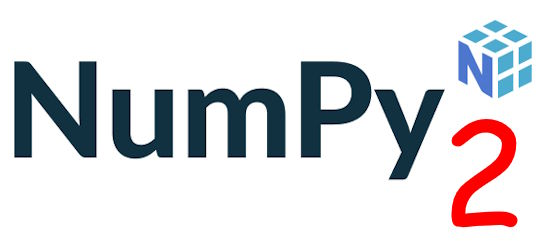](https://pythonspeed.com/articles/numpy-2/)

NumPy 2 is a new major release of the number crunching Python library. A release candidate is coming out February 1st, and a final release a month or two later. Importantly, **it’s backwards incompatible**; not in a major way, but enough that some work might be required to upgrade. And that means you need to make sure your application doesn’t break when NumPy 2 comes out - [Python Speed](https://pythonspeed.com/articles/numpy-2/).

## This Week's Python Streams

Python on Hardware is all about building a cooperative ecosphere which allows contributions to be valued and to grow knowledge. Below are the streams within the last week focusing on the community.

**CircuitPython Deep Dive Stream**

[Last Friday](link), Scott streamed work on {subject}.

You can see the latest video and past videos on the Adafruit YouTube channel under the Deep Dive playlist - [YouTube](https://www.youtube.com/playlist?list=PLjF7R1fz_OOXBHlu9msoXq2jQN4JpCk8A).

**CircuitPython Parsec**

John Park’s CircuitPython Parsec this week is on {subject} - [Adafruit Blog](link) and [YouTube](link).

Catch all the episodes in the [YouTube playlist](https://www.youtube.com/playlist?list=PLjF7R1fz_OOWFqZfqW9jlvQSIUmwn9lWr).

**CircuitPython Weekly Meeting**

CircuitPython Weekly Meeting for January 8, 2024 ([notes](https://github.com/adafruit/adafruit-circuitpython-weekly-meeting/blob/main/2024/2024-01-08.md)) [on YouTube](https://youtu.be/BoUmvQuKYLw)

## Project of the Week: A Raspberry Pi Pico HAM Transmitter

[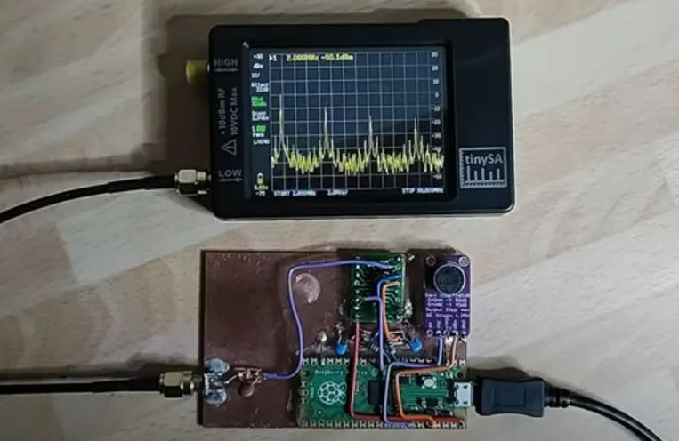](https://www.tomshardware.com/raspberry-pi/raspberry-pi-projects/raspberry-pi-pico-ham-transmitter-uses-onboard-pio-for-oscillator)

Jon Dawson has created a HAM radio transmitter with a Raspberry Pi Pico. Dawson can transmit single-sideband, AM, FM, and even CW. It has a supported range of between 500 KHz and 30 MHz. The software for this Raspberry Pi project was created from scratch by Dawson and is written in both Python and C++ - [Tom's Hardware](https://www.tomshardware.com/raspberry-pi/raspberry-pi-projects/raspberry-pi-pico-ham-transmitter-uses-onboard-pio-for-oscillator), [GitHub](https://github.com/dawsonjon/101Things/tree/master/18_transmitter) and [YouTube](https://youtu.be/PbhmQfPkNL0).

## Popular Last Week

[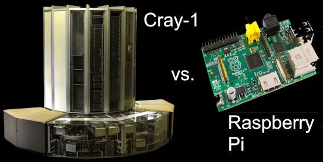](url)

What was the most popular, most clicked link, in [last week's newsletter](https://www.adafruitdaily.com/2024/01/08/python-on-microcontrollers-newsletter-micropython-1-22-1-patch-release-pi-vs-cray-and-much-more-circuitpython-python-micropython-thepsf-raspberry_pi/)? [Comparing the 1970’s Cray-1 Supercomputer Against the Raspberry Pi Single-Board Computer Range](http://www.roylongbottom.org.uk/Cray%201%20Supercomputer%20Performance%20Comparisons%20With%20Home%20Computers%20Phones%20and%20Tablets.htm).

## New Notes from Adafruit Playground

[Adafruit Playground](https://adafruit-playground.com/) is a new place for the community to post their projects and other making tips/tricks/techniques. Ad-free, it's an easy way to publish your work in a safe space for free.

WaveViz: Plot a synthio Wave Table - [Adafruit Playground](https://adafruit-playground.com/u/CGrover/pages/waveviz-plot-a-synthio-wave-table).

[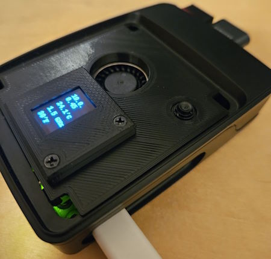](https://adafruit-playground.com/u/bdsvac/pages/raspberry-pi-stats-display)

Raspberry Pi Stats Display with CircuitPython - [Adafruit Playground](https://adafruit-playground.com/u/bdsvac/pages/raspberry-pi-stats-display).

text - [Adafruit Playground](url).

## News from around the web

text - [site](url).

[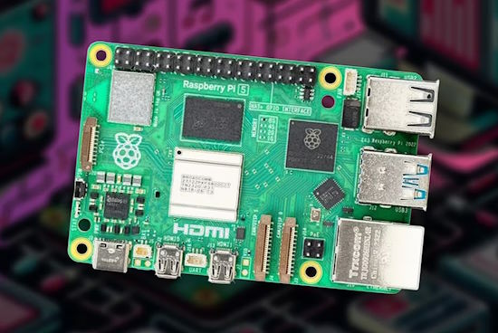](https://www.pocket-lint.com/how-to-use-raspberry-pi-5-beginner-projects/#turn-your-pi-5-into-a-retro-console)

5 ways to use the new Raspberry Pi 5: Fun beginner projects - [Pocket-lint](https://www.pocket-lint.com/how-to-use-raspberry-pi-5-beginner-projects/#turn-your-pi-5-into-a-retro-console).

The top 30 GitHub Python projects at the beginning Of 2024 (paywall) - [Towards Data Science](https://towardsdatascience.com/top-30-github-python-projects-at-the-beginning-of-2024-a0b84d4f8404).

The Tom's Hardware Pi Cast (1/9): PyScript with Nicholas Tollervey (principle author of Mu) - [YouTube](https://www.youtube.com/watch?v=WQ5f8CI7zNI) via [X](https://twitter.com/biglesp/status/1744405591290794375).

[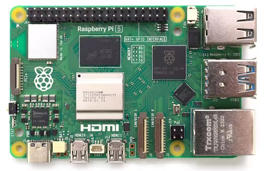](https://www.hardill.me.uk/wordpress/2023/12/23/pi5-usb-c-gadget/)

Guide to Getting a Raspberry Pi 5 Talking in USB Gadget Mode - [Ben's Place](https://www.hardill.me.uk/wordpress/2023/12/23/pi5-usb-c-gadget/) and [hackster.io](https://www.hackster.io/news/ben-hardill-pens-a-new-guide-to-getting-a-raspberry-pi-5-talking-in-usb-gadget-mode-8c3427f49e6b).

[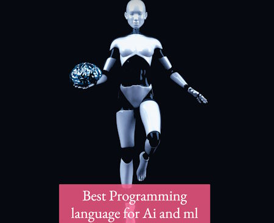](https://tazaakhbar.com/web-stories/best-programming-language-for-ai-and-ml-2/)

The top 10 best programming languages for programming AI and machine learning (slideshow) - [Tazaakhbar](https://tazaakhbar.com/web-stories/best-programming-language-for-ai-and-ml-2/).

text - [site](url).

[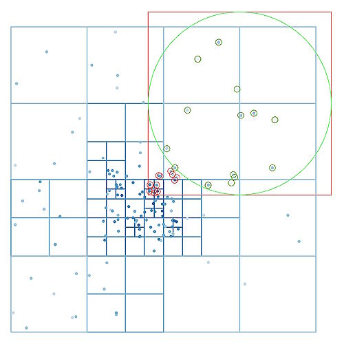](https://cerfacs.fr/coop/fortran-vs-python)

The counter-intuitive rise of Python in scientific computing (FORTRAN vs. Python) - [site](https://cerfacs.fr/coop/fortran-vs-python) and [Fortran Discourse](https://fortran-lang.discourse.group/t/the-counter-intuitive-rise-of-python-in-scientific-computing/469).

text - [site](url).

text - [site](url).

text - [site](url).

text - [site](url).

[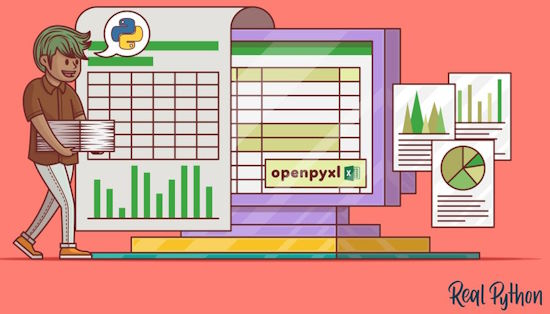](https://realpython.com/lessons/excel-python-openpyxl-overview/)

Use Excel spreadsheets in Python With openpyxl - [Real Python](https://realpython.com/lessons/excel-python-openpyxl-overview/).

[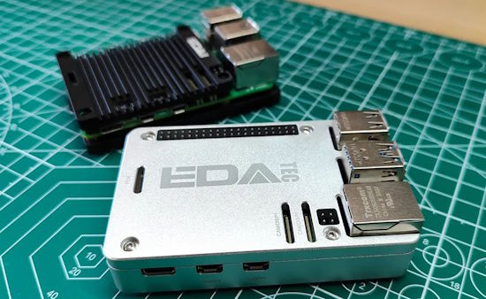](https://www.tomshardware.com/raspberry-pi/raspberry-pi-cases/edatec-raspberry-pi-5-cases-review-passively-cool)

EDATEC Raspberry Pi 5 Cases Review: Passively Cool - [Tom's Hardware](https://www.tomshardware.com/raspberry-pi/raspberry-pi-cases/edatec-raspberry-pi-5-cases-review-passively-cool).

[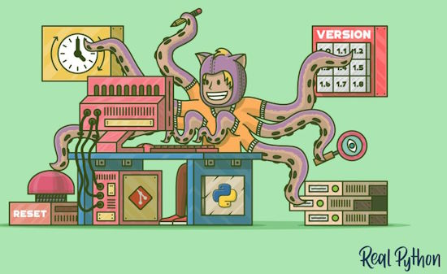](https://realpython.com/courses/python-git-github-intro/)

Introduction to Git and GitHub for Python Developers video course - [Real Python](https://realpython.com/courses/python-git-github-intro/).

[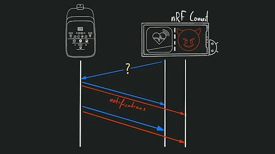](https://hackaday.com/2024/01/04/hacking-ble-to-liberate-your-exercise-equipment/)

Hacking BLE with Python to liberate your exercise equipment - [Hackaday](https://hackaday.com/2024/01/04/hacking-ble-to-liberate-your-exercise-equipment/).

[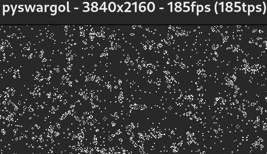](https://www.da.vidbuchanan.co.uk/blog/python-swar.html)

SIMD in Pure Python - [vidbuchanan.co.uk](https://www.da.vidbuchanan.co.uk/blog/python-swar.html).

text - [site](url).

Renesas’s GreenPAK SPLDs, a good fit for Stemma QT/Qwiic - [Adafruit Blog](https://blog.adafruit.com/2024/01/09/renesass-greenpak-splds-stemmaqt-qwiic-renesasglobal/).

## New

[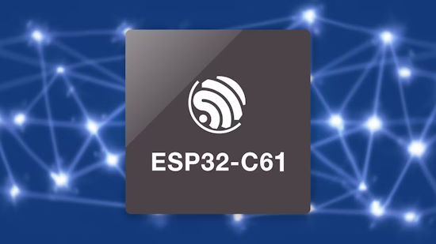](https://www.hackster.io/news/espressif-introduces-the-esp32-c61-for-cost-focused-wi-fi-6-iot-devices-a40d3f2f878b)

Espressif introduces the ESP32-C61 microcontroller for cost-focused WiFi 6 IoT devices. TheESP32-C61 includes a RISC-V core, WiFi 6, Bluetooth 5, security features, and software dev support for Matter applications - [hackster.io](https://www.hackster.io/news/espressif-introduces-the-esp32-c61-for-cost-focused-wi-fi-6-iot-devices-a40d3f2f878b).

[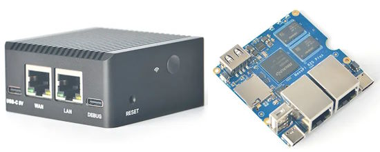](https://www.cnx-software.com/2024/01/06/nanopi-r2s-plus-dual-gbe-sbc-router-32gb-flash-usb-c-debug-port-m2-wifi/)

The NanoPi R2S Plus dual GbE SBC and router gets 32GB flash, USB-C debug port, and a M.2 socket for WiFi - [CNX Software](https://www.cnx-software.com/2024/01/06/nanopi-r2s-plus-dual-gbe-sbc-router-32gb-flash-usb-c-debug-port-m2-wifi/).

## New Boards Supported by CircuitPython

The number of supported microcontrollers and Single Board Computers (SBC) grows every week. This section outlines which boards have been included in CircuitPython or added to [CircuitPython.org](https://circuitpython.org/).

This week, there were (#/no) new boards added:

- [Board name](url)
- [Board name](url)
- [Board name](url)

*Note: For non-Adafruit boards, please use the support forums of the board manufacturer for assistance, as Adafruit does not have the hardware to assist in troubleshooting.*

Looking to add a new board to CircuitPython? It's highly encouraged! Adafruit has four guides to help you do so:

- [How to Add a New Board to CircuitPython](https://learn.adafruit.com/how-to-add-a-new-board-to-circuitpython/overview)
- [How to add a New Board to the circuitpython.org website](https://learn.adafruit.com/how-to-add-a-new-board-to-the-circuitpython-org-website)
- [Adding a Single Board Computer to PlatformDetect for Blinka](https://learn.adafruit.com/adding-a-single-board-computer-to-platformdetect-for-blinka)
- [Adding a Single Board Computer to Blinka](https://learn.adafruit.com/adding-a-single-board-computer-to-blinka)

## New Learn Guides

[Bluetooth-Controlled Matrix LED Sign using Bluefruit Connect](https://learn.adafruit.com/bluetooth-controlled-matrix-led-sign-using-bluefruit-connect) from [Trevor Beaton](https://learn.adafruit.com/u/Seekwill)

## Updated Learn Guides

[Adafruit MEMENTO Camera Board](https://learn.adafruit.com/adafruit-memento-camera-board) 

## CircuitPython Libraries

The CircuitPython library numbers are continually increasing, while existing ones continue to be updated. Here we provide library numbers and updates!

To get the latest Adafruit libraries, download the [Adafruit CircuitPython Library Bundle](https://circuitpython.org/libraries). To get the latest community contributed libraries, download the [CircuitPython Community Bundle](https://circuitpython.org/libraries).

If you'd like to contribute to the CircuitPython project on the Python side of things, the libraries are a great place to start. Check out the [CircuitPython.org Contributing page](https://circuitpython.org/contributing). If you're interested in reviewing, check out Open Pull Requests. If you'd like to contribute code or documentation, check out Open Issues. We have a guide on [contributing to CircuitPython with Git and GitHub](https://learn.adafruit.com/contribute-to-circuitpython-with-git-and-github), and you can find us in the #help-with-circuitpython and #circuitpython-dev channels on the [Adafruit Discord](https://adafru.it/discord).

You can check out this [list of all the Adafruit CircuitPython libraries and drivers available](https://github.com/adafruit/Adafruit_CircuitPython_Bundle/blob/master/circuitpython_library_list.md). 

The current number of CircuitPython libraries is **###**!

**New Libraries**

Here's this week's new CircuitPython libraries:

* [library](url)

**Updated Libraries**

Here's this week's updated CircuitPython libraries:

* [library](url)

**Library PyPI Weekly Download Stats**

## What’s the CircuitPython team up to this week?

What is the team up to this week? Let’s check in:

**Melissa**

This past week I worked on testing various pieces of hardware on the Raspberry Pi 5 including the Speaker Bonnet, Voice Bonnet, and BrainCraft HAT. I updated scripts and guides to reflect any changes that were needed to get the hardware functioning. I'm also working with maintainers of some of the drivers to fix issues that I found during my testing.

**Tim**

This week I've been testing and reviewing library PRs. The most substantial of the ones I looked into is a proposed refactoring of the network management helper code to further simplify the user code for networking operations between microcontrollsers with built-in WiFi vs. ones with an ESP32SPI Co-Processor. I've been continuing my effor tot update the `PyGameDisplay` library to work with the latest versions of `Blinka_DisplayIO`.

**Jeff**

text.

**Liz**

I was able to take the past two weeks off to rest and recharge. I did work on some electronics projects though while I was out. I built a plant grow light for my mom. This involved building a wooden flower box to hold the plants. The lights are 6000K dotstar LEDs that are connected to a QT Py ESP32-S2 running WipperSnapper firmware that turns the lights on and off at a scheduled time. It was my first time using WipperSnapper for a project and it was incredibly easy. Since this project is running at my mom’s house, I can also monitor it via my IO account for troubleshooting.

[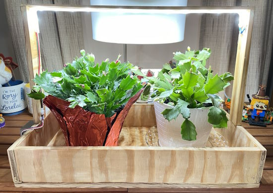](https://www.circuitpython.org/)

I finally got around to starting to mod a Meowsic cat piano that I had found on the side of the road. I followed [JP’s guide](https://learn.adafruit.com/meowsic-line-out) on adding a line out. Additionally, I took out the very corroded battery compartment and installed an HUSB238 so that it can be powered by USB C. I also added a power indicator LED. I'm hoping to write both of these up as Playground notes.

[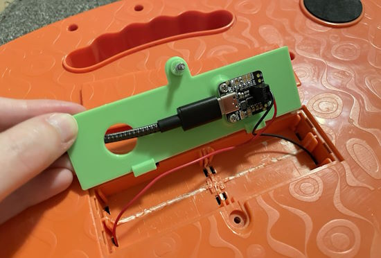](https://www.circuitpython.org/)

## Upcoming Events

The next MicroPython Meetup in Melbourne will be on January 24th – [Meetup](https://www.meetup.com/micropython-meetup/events). 

PyCascades 2024 is back in Seattle, Washington, USA and online, April 5-8th at the University of Washington's Kane Hall. - [PyCascades](https://2024.pycascades.com/).

PyCon US 2024 Launches - May 15-23, 2024 in Pittsburgh, Pennsylvania US - [PyCon US](https://pycon.blogspot.com/2024/10/pycon-us-2024-launches.html).

**Send Your Events In**

If you know of virtual events or upcoming events, please let us know via email to cpnews(at)adafruit(dot)com.

## Latest Releases

CircuitPython's stable release is [#.#.#](https://github.com/adafruit/circuitpython/releases/latest) and its unstable release is [#.#.#-##.#](https://github.com/adafruit/circuitpython/releases). New to CircuitPython? Start with our [Welcome to CircuitPython Guide](https://learn.adafruit.com/welcome-to-circuitpython).

[2024####](https://github.com/adafruit/Adafruit_CircuitPython_Bundle/releases/latest) is the latest Adafruit CircuitPython library bundle.

[2024####](https://github.com/adafruit/CircuitPython_Community_Bundle/releases/latest) is the latest CircuitPython Community library bundle.

[v#.#.#](https://micropython.org/download) is the latest MicroPython release. Documentation for it is [here](http://docs.micropython.org/en/latest/pyboard/).

[#.#.#](https://www.python.org/downloads/) is the latest Python release. The latest pre-release version is [#.#.#](https://www.python.org/download/pre-releases/).

[#,### Stars](https://github.com/adafruit/circuitpython/stargazers) Like CircuitPython? [Star it on GitHub!](https://github.com/adafruit/circuitpython)

## Call for Help -- Translating CircuitPython is now easier than ever

[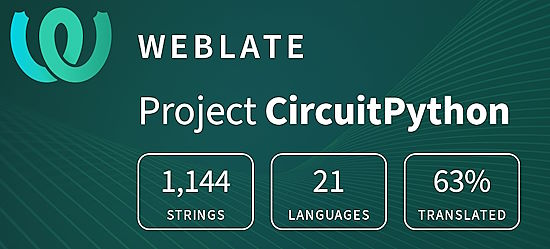](https://hosted.weblate.org/engage/circuitpython/)

One important feature of CircuitPython is translated control and error messages. With the help of fellow open source project [Weblate](https://weblate.org/), we're making it even easier to add or improve translations. 

Sign in with an existing account such as GitHub, Google or Facebook and start contributing through a simple web interface. No forks or pull requests needed! As always, if you run into trouble join us on [Discord](https://adafru.it/discord), we're here to help.

## NUMBER Thanks

The Adafruit Discord community, where we do all our CircuitPython development in the open, reached over NUMBER humans - thank you! Adafruit believes Discord offers a unique way for Python on hardware folks to connect. Join today at [https://adafru.it/discord](https://adafru.it/discord).

## ICYMI - In case you missed it

Python on hardware is the Adafruit Python video-newsletter-podcast! The news comes from the Python community, Discord, Adafruit communities and more and is broadcast on ASK an ENGINEER Wednesdays. The complete Python on Hardware weekly videocast [playlist is here](https://www.youtube.com/playlist?list=PLjF7R1fz_OOXRMjM7Sm0J2Xt6H81TdDev). The video podcast is on [iTunes](https://itunes.apple.com/us/podcast/python-on-hardware/id1451685192?mt=2), [YouTube](http://adafru.it/pohepisodes), [Instagram Reels](https://www.instagram.com/adafruit/channel/)), and [XML](https://itunes.apple.com/us/podcast/python-on-hardware/id1451685192?mt=2).

[The weekly community chat on Adafruit Discord server CircuitPython channel - Audio / Podcast edition](https://itunes.apple.com/us/podcast/circuitpython-weekly-meeting/id1451685016) - Audio from the Discord chat space for CircuitPython, meetings are usually Mondays at 2pm ET, this is the audio version on [iTunes](https://itunes.apple.com/us/podcast/circuitpython-weekly-meeting/id1451685016), Pocket Casts, [Spotify](https://adafru.it/spotify), and [XML feed](https://adafruit-podcasts.s3.amazonaws.com/circuitpython_weekly_meeting/audio-podcast.xml).

## Contribute

The CircuitPython Weekly Newsletter is a CircuitPython community-run newsletter emailed every Tuesday. The complete [archives are here](https://www.adafruitdaily.com/category/circuitpython/). It highlights the latest CircuitPython related news from around the web including Python and MicroPython developments. To contribute, edit next week's draft [on GitHub](https://github.com/adafruit/circuitpython-weekly-newsletter/tree/gh-pages/_drafts) and [submit a pull request](https://help.github.com/articles/editing-files-in-your-repository/) with the changes. You may also tag your information on Twitter with #CircuitPython. 

Join the Adafruit [Discord](https://adafru.it/discord) or [post to the forum](https://forums.adafruit.com/viewforum.php?f=60) if you have questions.
