- [ ] Library and info updates
- [ ] change date
- [ ] update title
- [ ] Feature story
- [ ] Update  for images
- [ ] Update ICYDNCI
- [ ] All images 550w max only
- [ ] Link "View this email in your browser."

News Sources

- [Adafruit Playground](https://adafruit-playground.com/)
- Twitter: [CircuitPython](https://twitter.com/search?q=circuitpython&src=typed_query&f=live), [MicroPython](https://twitter.com/search?q=micropython&src=typed_query&f=live) and [Python](https://twitter.com/search?q=python&src=typed_query)
- [Raspberry Pi News](https://www.raspberrypi.com/news/)
- Mastodon [CircuitPython](https://octodon.social/tags/CircuitPython) and [MicroPython](https://octodon.social/tags/MicroPython)
- [hackster.io CircuitPython](https://www.hackster.io/search?q=circuitpython&i=projects&sort_by=most_recent) and [MicroPython](https://www.hackster.io/search?q=micropython&i=projects&sort_by=most_recent)
- [python.org](https://www.python.org/)
- [Python Insider - dev team blog](https://pythoninsider.blogspot.com/)
- Individuals: [Jeff Geerling](https://www.jeffgeerling.com/blog)
- [hackaday CircuitPython](https://hackaday.com/blog/?s=circuitpython) and [MicroPython](https://hackaday.com/blog/?s=micropython)
- [hackaday.io newest projects MicroPython](https://hackaday.io/projects?tag=micropython&sort=date) and [CircuitPython](https://hackaday.io/projects?tag=circuitpython&sort=date)
- [https://opensource.com/tags/python](https://opensource.com/tags/python)
- Check Issues and PRs for input

View this email in your browser. **Warning: Flashing Imagery**

Welcome to the latest Python on Microcontrollers newsletter! *insert 2-3 sentences from editor (what's in overview, banter)* - *Anne Barela, Ed.*

We're on [Discord](https://discord.gg/HYqvREz), [Twitter](https://twitter.com/search?q=circuitpython&src=typed_query&f=live), and for past newsletters - [view them all here](https://www.adafruitdaily.com/category/circuitpython/). If you're reading this on the web, [subscribe here](https://www.adafruitdaily.com/). Here's the news this week:

## #CircuitPython2024 First Posts

[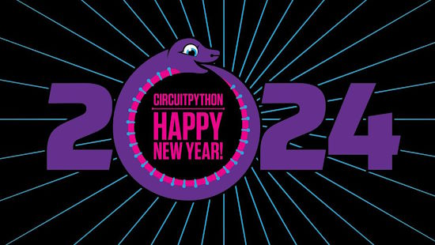](https://blog.adafruit.com/2024/01/22/first-circuitpython2024-posts/)

The #CircuitPython2024 effort allows the community to share goals for CircuitPython in 2024 and beyond. The developers would like everyone in the CircuitPython community to contribute by posting their thoughts to some public place on the internet.

You can see the first two posts by the community: incrediblelittlebee and DJDevon3 - [Adafruit Blog](https://blog.adafruit.com/2024/01/22/first-circuitpython2024-posts/).

Scott Shawcroft is the lead developer on CircuitPython. Catch his thoughts for the year ahead - [Adafruit Blog](url).

Learn how to post your own #CircuitPython2024 message - [Adafruit Blog](https://blog.adafruit.com/2024/01/01/circuitpython-in-2024-circuitpython2024-python-circuitpython/).

## Feature

text - [site](url).

## 8 Raspberry Pi Attachments Radically Expand Its Powers

[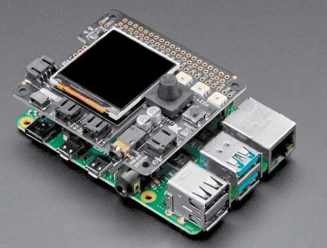](https://www.pcworld.com/article/2204701/the-best-extensions-for-the-raspberry-pi.html)

PCWorld highlights 8 Raspberry Pi attachments which radically expand its powers. Want to use your Raspberry Pi for Lego Mindstorm, AI research, handheld gaming, and more? Check out these "HAT" expansion modules - [PCWorld](https://www.pcworld.com/article/2204701/the-best-extensions-for-the-raspberry-pi.html).

## UVC Video Coming to CircuitPython 9

[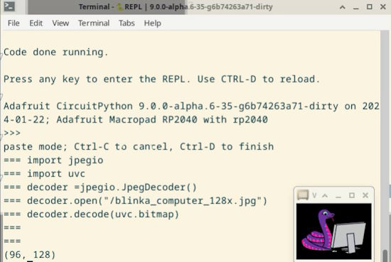](https://youtu.be/tW1cL80QeMQ)

[TinyUSB](https://github.com/hathach/tinyusb), the USB driver used by CircuitPython, has recently added UVC support. [UVC](https://en.wikipedia.org/wiki/USB_video_device_class) is a USB device class that describes devices capable of streaming video like webcams, digital camcorders, analog video converters and still-image cameras. Jeff Epler has been doing preliminary work to integrate UVC into CircuitPython 9 so devices can act as webcams, for example - [YouTube](https://youtu.be/tW1cL80QeMQ).

## Running a ChatGPT-Like LLM on the Raspberry Pi 5

[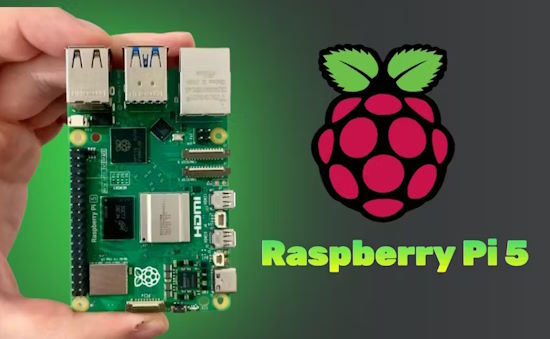](https://www.hackster.io/shahizat/running-a-chatgpt-like-llm-on-the-raspberry-pi-5-fd67f9)

Nurgaliyev Shakhizat presents a tutorial for how to run an advanced ChatGPT-Like large language model on the Raspberry Pi 5 - [hackster.io](https://www.hackster.io/shahizat/running-a-chatgpt-like-llm-on-the-raspberry-pi-5-fd67f9).

## Comparing a Raspberry Pi 5 Computer to an Intel N100 Mini PC

[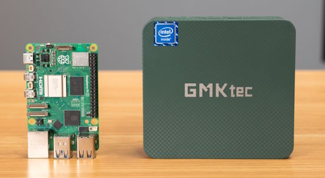](https://www.jeffgeerling.com/blog/2024/when-did-raspberry-pi-get-so-expensive)

Jeff Geerling compares a Raspberry Pi 5 system vs. an Intel N100-based PC with Windows. Comparing total cost, power draw, and efficiency - [YouTube](https://www.youtube.com/watch?v=jjzvh-bfV-E) and [Blog](https://www.jeffgeerling.com/blog/2024/when-did-raspberry-pi-get-so-expensive).

## Adafruit Designs Raspberry Pi Pico RP2040 Floppy Drive Emulator

[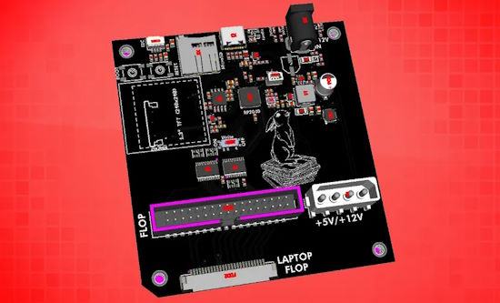](https://www.tomshardware.com/raspberry-pi/adafruit-designs-raspberry-pi-rp2040-floppy-drive-emulator)

Tom's Hardware looks at the new Adafruit floppy disk interface in development  - [Tom's Hardware](https://www.tomshardware.com/raspberry-pi/adafruit-designs-raspberry-pi-rp2040-floppy-drive-emulator).

> "At the moment, the PCB features a 34-pin IDC pinout for interfacing. It also has support for 26-pin interfaces; however, the team mentioned the possibility of adding support for Disk II support in the future after some success when tinkering with an Apple disk."

## The Ultimate List of Python YouTube Channels

[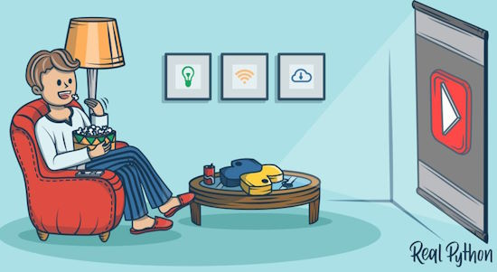](https://realpython.com/python-youtube-channels/)

The folks at Real Python couldn't find a good and updated list of Python developer or Python programming YouTube channels online. So they created their own list with the best and most Pythonic YouTubers  - [Real Python](https://realpython.com/python-youtube-channels/) via [X](https://twitter.com/realpython/status/1750187120872849914).

## This Week's Python Streams

Python on Hardware is all about building a cooperative ecosphere which allows contributions to be valued and to grow knowledge. Below are the streams within the last week focusing on the community.

**CircuitPython Deep Dive Stream**

[Last Friday](link), Scott streamed work on {subject}.

You can see the latest video and past videos on the Adafruit YouTube channel under the Deep Dive playlist - [YouTube](https://www.youtube.com/playlist?list=PLjF7R1fz_OOXBHlu9msoXq2jQN4JpCk8A).

**CircuitPython Parsec**

John Park’s CircuitPython Parsec this week is on {subject} - [Adafruit Blog](link) and [YouTube](link).

Catch all the episodes in the [YouTube playlist](https://www.youtube.com/playlist?list=PLjF7R1fz_OOWFqZfqW9jlvQSIUmwn9lWr).

**CircuitPython Weekly Meeting**

CircuitPython Weekly Meeting for January 22, 2024 ([notes](https://github.com/adafruit/adafruit-circuitpython-weekly-meeting/blob/main/2024/2024-01-22.md)) [on YouTube](https://youtu.be/APxBao-d9Vw).

## Project of the Week: Using ChatGPT to Code in Python

[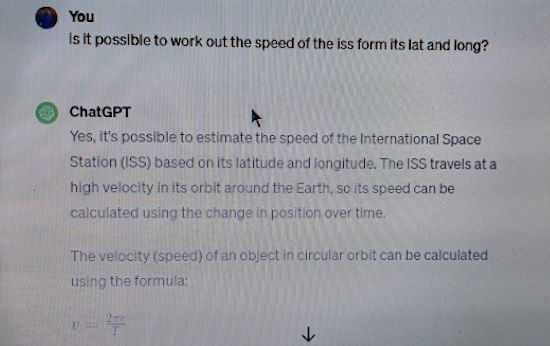](https://twitter.com/JohnChinner/status/1749043051924754452?t=HrO6-bZa7noTuD99fUXUqQ&s=19)

[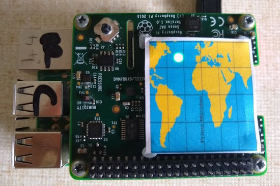](https://twitter.com/JohnChinner/status/1749043051924754452?t=HrO6-bZa7noTuD99fUXUqQ&s=19)

John Chinner wanted to code an app on a Raspberry Pi with Sense HAT to display information about the International Space Station (ISS). He turned to ChatGPT to look up how to code various parts of the project- [X Thread](https://twitter.com/JohnChinner/status/1749043051924754452?t=HrO6-bZa7noTuD99fUXUqQ&s=19).

## Popular Last Week

What was the most popular, most clicked link, in [last week's newsletter](https://www.adafruitdaily.com/2024/01/22/python-on-microcontrollers-newsletter-pi-5-manufacturing-soars-thea-flowers-new-oshwa-president-and-much-more-circuitpython-python-micropython-thepsf-raspberry_pi/)? [Four Raspberry Pi 5 Projects to Make Use of the Power of One of the Best SBCs Out There](https://www.notebookcheck.net/4-Raspberry-Pi-5-projects-to-make-use-of-the-power-of-one-of-the-best-SBCs-out-there.792524.0.html).

You can read past newsletters in the [repository](https://www.adafruitdaily.com/category/circuitpython/).

## New Notes from Adafruit Playground

[Adafruit Playground](https://adafruit-playground.com/) is a new place for the community to post their projects and other making tips/tricks/techniques. Ad-free, it's an easy way to publish your work in a safe space for free.

text - [Adafruit Playground](url).

text - [Adafruit Playground](url).

text - [Adafruit Playground](url).

## News from around the web

[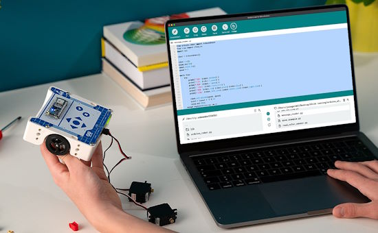](https://www.hackster.io/news/arduino-education-unveils-alvik-an-arduino-nano-esp32-driven-micropython-robot-3bf70168f94c)

Arduino unveils Alvik, an Arduino Nano ESP32-driven MicroPython Robot. It offers STEMMA QT/Qwiic, Grove and LEGO Technic capabilities - [hackster.io](https://www.hackster.io/news/arduino-education-unveils-alvik-an-arduino-nano-esp32-driven-micropython-robot-3bf70168f94c).

[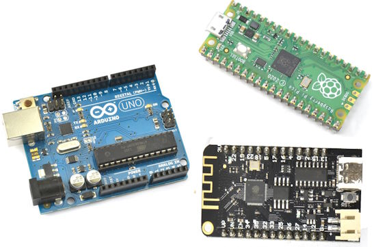](https://www.doctormonk.com/2024/01/comparingadcs.html)

Lies, damn lies and analog inputs (comparing ADCs on ESP32, Pico and Arduino) - [DoctorMonk](https://www.doctormonk.com/2024/01/comparingadcs.html).

[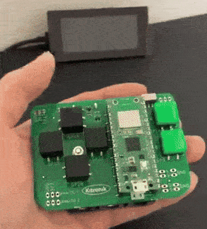](https://twitter.com/sozoraemon/status/1749744994770936183)

A Raspberry Pi Pico programmed in MicroPython transmits to an eInk display - [X](https://twitter.com/sozoraemon/status/1749744994770936183) (Japanese).

The new PiDog is programmed in MicroPython to respond to sound - [X](https://twitter.com/sozoraemon/status/1750111162447147148?t=mYfLqy-Wx4y77MG9qD8IFg&s=03) (Japanese).

A step-by-step guide gets a Raspberry Pi 5 running on NVMe drives greater than 2TB - [Reddit](https://www.reddit.com/r/raspberry_pi/comments/19e0x42/booting_pi_from_nvme_greater_than_2tb_gpt_as/) via [hackster.io](https://www.hackster.io/news/this-step-by-step-guide-from-coreyfro-gets-your-raspberry-pi-5-running-on-2tb-nvme-drives-28a2b0344f3a).

[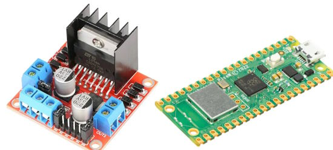](https://peppe8o.com/l298n-raspberry-pi-pico/)

How to use an L298N with Raspberry PI Pico: Driving Motors with MicroPython - [peppe80](https://peppe8o.com/l298n-raspberry-pi-pico/).

[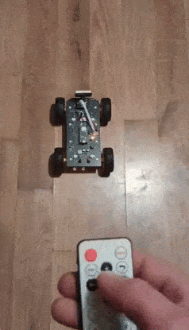](https://twitter.com/piers_storey/status/1749485474249310389)

IR remote car with motor control in MicroPython - [X](https://twitter.com/piers_storey/status/1749485474249310389).

[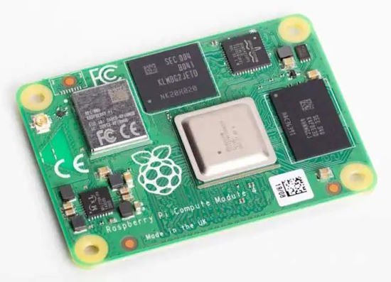](https://www.digikey.com/en/maker/projects/creating-a-raspberry-pi-compute-module-4-cm4-carrier-board-in-kicad/7812da347e5e409aa28d59ea2aaea490)

Creating a Raspberry Pi Compute Module 4 (CM4) carrier board in KiCad - [DigiKey](https://www.digikey.com/en/maker/projects/creating-a-raspberry-pi-compute-module-4-cm4-carrier-board-in-kicad/7812da347e5e409aa28d59ea2aaea490) and [YouTube](https://youtu.be/ypcPJC_umPQ).

[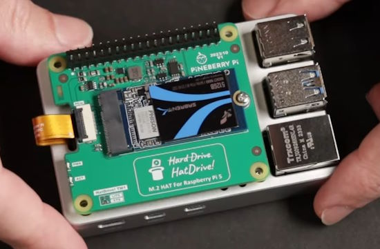](https://www.youtube.com/watch?v=xPaSXeriXUg)

How to build a Pi 5 network attached storage (NAS) with PCIe solid state storage - [YouTube](https://www.youtube.com/watch?v=xPaSXeriXUg).

[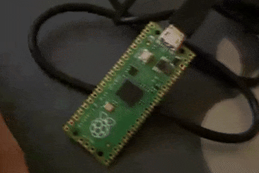](https://twitter.com/DO6AN/status/1748770171630596184)

A Morse Code trainer in MicroPython on a Raspberry Pi Pico - [X](https://twitter.com/DO6AN/status/1748770171630596184).

text - [site](url).

text - [site](url).

text - [site](url).

text - [site](url).

text - [site](url).

text - [site](url).

text - [site](url).

text - [site](url).

## New

Geekworm X1003 PCIe to NVMe SSD adapter for Raspberry Pi 5 works with the active cooler or official case, supports short 2230 or 2242 NVMe M.2 SSDs - [CNX Software](https://www.cnx-software.com/2024/01/24/geekworm-x1003-pcie-to-nvme-ssd-raspberry-pi-5-active-cooler/).

[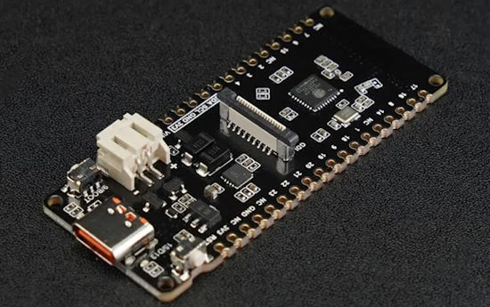](https://www.cnx-software.com/2024/01/20/esp32-c6-iot-development-board-solar-battery-charging/)

A new ESP32-C6-based IoT development board supports solar battery charging - [CNX Software](https://www.cnx-software.com/2024/01/20/esp32-c6-iot-development-board-solar-battery-charging/).

## New Boards Supported by CircuitPython

The number of supported microcontrollers and Single Board Computers (SBC) grows every week. This section outlines which boards have been included in CircuitPython or added to [CircuitPython.org](https://circuitpython.org/).

This week, there were (#/no) new boards added:

- [Board name](url)
- [Board name](url)
- [Board name](url)

*Note: For non-Adafruit boards, please use the support forums of the board manufacturer for assistance, as Adafruit does not have the hardware to assist in troubleshooting.*

Looking to add a new board to CircuitPython? It's highly encouraged! Adafruit has four guides to help you do so:

- [How to Add a New Board to CircuitPython](https://learn.adafruit.com/how-to-add-a-new-board-to-circuitpython/overview)
- [How to add a New Board to the circuitpython.org website](https://learn.adafruit.com/how-to-add-a-new-board-to-the-circuitpython-org-website)
- [Adding a Single Board Computer to PlatformDetect for Blinka](https://learn.adafruit.com/adding-a-single-board-computer-to-platformdetect-for-blinka)
- [Adding a Single Board Computer to Blinka](https://learn.adafruit.com/adding-a-single-board-computer-to-blinka)

## New Learn Guides

[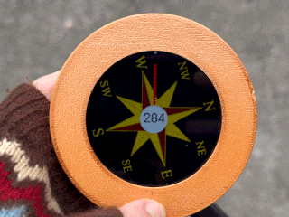](https://learn.adafruit.com/guides/latest)

[Qualia S3 Compass](https://learn.adafruit.com/qualia-s3-compass) from [Liz Clark](https://learn.adafruit.com/u/BlitzCityDIY)

[Sound Reactive Rapunzel Hair](https://learn.adafruit.com/sound-reactive-rapunzel-hair) from [Erin St Blaine](https://learn.adafruit.com/u/firepixie)

[MEMENTO Wireless Remote with TouchOSC](https://learn.adafruit.com/memento-wireless-remote) from [John Park](https://learn.adafruit.com/u/johnpark)

[Remote Shutter Button for MEMENTO](https://learn.adafruit.com/memento-shutter) from [Ruiz Brothers](https://learn.adafruit.com/u/pixil3d)

## CircuitPython Libraries

The CircuitPython library numbers are continually increasing, while existing ones continue to be updated. Here we provide library numbers and updates!

To get the latest Adafruit libraries, download the [Adafruit CircuitPython Library Bundle](https://circuitpython.org/libraries). To get the latest community contributed libraries, download the [CircuitPython Community Bundle](https://circuitpython.org/libraries).

If you'd like to contribute to the CircuitPython project on the Python side of things, the libraries are a great place to start. Check out the [CircuitPython.org Contributing page](https://circuitpython.org/contributing). If you're interested in reviewing, check out Open Pull Requests. If you'd like to contribute code or documentation, check out Open Issues. We have a guide on [contributing to CircuitPython with Git and GitHub](https://learn.adafruit.com/contribute-to-circuitpython-with-git-and-github), and you can find us in the #help-with-circuitpython and #circuitpython-dev channels on the [Adafruit Discord](https://adafru.it/discord).

You can check out this [list of all the Adafruit CircuitPython libraries and drivers available](https://github.com/adafruit/Adafruit_CircuitPython_Bundle/blob/master/circuitpython_library_list.md). 

The current number of CircuitPython libraries is **###**!

**New Libraries**

Here's this week's new CircuitPython libraries:

* [library](url)

**Updated Libraries**

Here's this week's updated CircuitPython libraries:

* [library](url)

**Library PyPI Weekly Download Stats**

## What’s the CircuitPython team up to this week?

What is the team up to this week? Let’s check in:

**Dan**

This past week Scott and I did some pair debugging and were able to fix a longstanding issue that made some operations not work correctly when you subclassed built-in dict type.

A user encountered another core language problem. I found it was already reported to MicroPython, and is not easy to fix without possibly causing an mpy version change, so we'll await a fix from upstream.

**Melissa**

This past week, I've been working on getting the PiTFT Displays working on the Raspberry Pi 5 with Bookworm. So far, the 2.2" PiTFT has been updated and works. I'm still struggling with getting the touch rotation to work for the 2.8" capacitive and resistive touchscreens, but hopefully that will be worked out soon.

**Tim**

This week I've been working on the 1D Chomper game and Learn Guide. I did a load of cleaning up and commenting the code. I also set up the light box to take some clean photos for the guide and recorded a quick look introduction video for the project. 

**Jeff**

With `bitmapfilter` merged into the "absolute latest" CircuitPython builds, I'm concentrating on something new: Support for CircuitPython operating as a ["UVC" device](../assets/20240129/20240129jeff.jpg), which lets CircuitPython appear like a webcam to a host computer. Ultimately, the intent is to make this work with `displayio` applications, so that in addition to displaying to an LCD or similar display attached to the microcontroller, they can display on a host computer.

**Scott**

This past week has been co-opted by a daycare flu. Ari got it and then I got it a few days later. So, I haven't done as much as I would have liked. My main work is [accessing the SD card over WiFi and BLE](https://github.com/adafruit/circuitpython/pull/8699). The PR is ready and will hopefully get merged in the next few days. Next, I'm finishing up my [#CircuitPython2024](https://blog.adafruit.com/2024/01/01/circuitpython-in-2024-circuitpython2024-python-circuitpython/) post. After that, I'll be heads down on bug fixing for the 9.0 release. I'd love to get 9.0.0 released in February (just like 8.0.0 was released last February.)

**Liz**

This week I published the [Qualia S3 Compass project](https://learn.adafruit.com/qualia-s3-compass). I used a Qualia S3 with a 2.1 inch round display and a 9-DoF sensor to create a working compass. I learned a lot working on this project, since first of all I had never really used a compass, but there was a lot of math involved in calculating the compass heading properly and displaying it in two different ways on the round display. I'd like to extend a hug report to community member Gamblor21, whose [AHRS CircuitPython library](https://github.com/gamblor21/Gamblor21_CircuitPython_AHRS) in the community bundle was extremely helpful for this project. I also used [rotozoom](https://docs.circuitpython.org/en/latest/shared-bindings/bitmaptools/index.html#bitmaptools.rotozoom) from the built-in bitmaptools for the first time and once I understood how to use it properly, it was a game changer. I look forward to using it in future projects.

## Upcoming Events

The next MicroPython Meetup in Melbourne will be on January 24th – [Meetup](https://www.meetup.com/micropython-meetup/events). 

PyCascades 2024 is back in Seattle, Washington, USA and online, April 5-8th at the University of Washington's Kane Hall. - [PyCascades](https://2024.pycascades.com/).

PyCon US 2024 Launches - May 15-23, 2024 in Pittsburgh, Pennsylvania US - [PyCon US](https://pycon.blogspot.com/2024/10/pycon-us-2024-launches.html).

**Send Your Events In**

If you know of virtual events or upcoming events, please let us know via email to cpnews(at)adafruit(dot)com.

## Latest Releases

CircuitPython's stable release is [#.#.#](https://github.com/adafruit/circuitpython/releases/latest) and its unstable release is [#.#.#-##.#](https://github.com/adafruit/circuitpython/releases). New to CircuitPython? Start with our [Welcome to CircuitPython Guide](https://learn.adafruit.com/welcome-to-circuitpython).

[2024####](https://github.com/adafruit/Adafruit_CircuitPython_Bundle/releases/latest) is the latest Adafruit CircuitPython library bundle.

[2024####](https://github.com/adafruit/CircuitPython_Community_Bundle/releases/latest) is the latest CircuitPython Community library bundle.

[v#.#.#](https://micropython.org/download) is the latest MicroPython release. Documentation for it is [here](http://docs.micropython.org/en/latest/pyboard/).

[#.#.#](https://www.python.org/downloads/) is the latest Python release. The latest pre-release version is [#.#.#](https://www.python.org/download/pre-releases/).

[#,### Stars](https://github.com/adafruit/circuitpython/stargazers) Like CircuitPython? [Star it on GitHub!](https://github.com/adafruit/circuitpython)

## Call for Help -- Translating CircuitPython is now easier than ever

[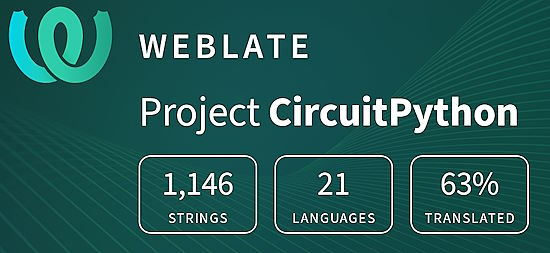](https://hosted.weblate.org/engage/circuitpython/)

One important feature of CircuitPython is translated control and error messages. With the help of fellow open source project [Weblate](https://weblate.org/), we're making it even easier to add or improve translations. 

Sign in with an existing account such as GitHub, Google or Facebook and start contributing through a simple web interface. No forks or pull requests needed! As always, if you run into trouble join us on [Discord](https://adafru.it/discord), we're here to help.

## NUMBER Thanks

The Adafruit Discord community, where we do all our CircuitPython development in the open, reached over NUMBER humans - thank you! Adafruit believes Discord offers a unique way for Python on hardware folks to connect. Join today at [https://adafru.it/discord](https://adafru.it/discord).

## ICYMI - In case you missed it

Python on hardware is the Adafruit Python video-newsletter-podcast! The news comes from the Python community, Discord, Adafruit communities and more and is broadcast on ASK an ENGINEER Wednesdays. The complete Python on Hardware weekly videocast [playlist is here](https://www.youtube.com/playlist?list=PLjF7R1fz_OOXRMjM7Sm0J2Xt6H81TdDev). The video podcast is on [iTunes](https://itunes.apple.com/us/podcast/python-on-hardware/id1451685192?mt=2), [YouTube](http://adafru.it/pohepisodes), [Instagram Reels](https://www.instagram.com/adafruit/channel/)), and [XML](https://itunes.apple.com/us/podcast/python-on-hardware/id1451685192?mt=2).

[The weekly community chat on Adafruit Discord server CircuitPython channel - Audio / Podcast edition](https://itunes.apple.com/us/podcast/circuitpython-weekly-meeting/id1451685016) - Audio from the Discord chat space for CircuitPython, meetings are usually Mondays at 2pm ET, this is the audio version on [iTunes](https://itunes.apple.com/us/podcast/circuitpython-weekly-meeting/id1451685016), Pocket Casts, [Spotify](https://adafru.it/spotify), and [XML feed](https://adafruit-podcasts.s3.amazonaws.com/circuitpython_weekly_meeting/audio-podcast.xml).

## Contribute

The CircuitPython Weekly Newsletter is a CircuitPython community-run newsletter emailed every Monday. The complete [archives are here](https://www.adafruitdaily.com/category/circuitpython/). It highlights the latest CircuitPython related news from around the web including Python and MicroPython developments. To contribute, edit next week's draft [on GitHub](https://github.com/adafruit/circuitpython-weekly-newsletter/tree/gh-pages/_drafts) and [submit a pull request](https://help.github.com/articles/editing-files-in-your-repository/) with the changes. You may also tag your information on Twitter with #CircuitPython. 

Join the Adafruit [Discord](https://adafru.it/discord) or [post to the forum](https://forums.adafruit.com/viewforum.php?f=60) if you have questions.
