- [ ] Library and info updates
- [ ] change date
- [ ] update title
- [ ] Feature story
- [ ] Update  for images
- [ ] Update ICYDNCI
- [ ] All images 550w max only
- [ ] Link "View this email in your browser."

News Sources

- [Adafruit Playground](https://adafruit-playground.com/)
- Twitter: [CircuitPython](https://twitter.com/search?q=circuitpython&src=typed_query&f=live), [MicroPython](https://twitter.com/search?q=micropython&src=typed_query&f=live) and [Python](https://twitter.com/search?q=python&src=typed_query)
- [Raspberry Pi News](https://www.raspberrypi.com/news/)
- Mastodon [CircuitPython](https://octodon.social/tags/CircuitPython) and [MicroPython](https://octodon.social/tags/MicroPython)
- [hackster.io CircuitPython](https://www.hackster.io/search?q=circuitpython&i=projects&sort_by=most_recent) and [MicroPython](https://www.hackster.io/search?q=micropython&i=projects&sort_by=most_recent)
- [python.org](https://www.python.org/)
- [Python Insider - dev team blog](https://pythoninsider.blogspot.com/)
- Individuals: [Jeff Geerling](https://www.jeffgeerling.com/blog)
- [hackaday CircuitPython](https://hackaday.com/blog/?s=circuitpython) and [MicroPython](https://hackaday.com/blog/?s=micropython)
- [hackaday.io newest projects MicroPython](https://hackaday.io/projects?tag=micropython&sort=date) and [CircuitPython](https://hackaday.io/projects?tag=circuitpython&sort=date)
- [Google News Python](https://news.google.com/search?q=python&hl=en-US&gl=US&ceid=US%3Aen)
- Check Issues and PRs for input

View this email in your browser. **Warning: Flashing Imagery**

Welcome to the latest Python on Microcontrollers newsletter! *insert 2-3 sentences from editor (what's in overview, banter)* - *Anne Barela, Ed.*

We're on [Discord](https://discord.gg/HYqvREz), [Twitter](https://twitter.com/search?q=circuitpython&src=typed_query&f=live), and for past newsletters - [view them all here](https://www.adafruitdaily.com/category/circuitpython/). If you're reading this on the web, [subscribe here](https://www.adafruitdaily.com/). Here's the news this week:

## Raspberry Pi Celebrates 12 Years

Happy Birthday to Raspberry Pi on 29 February. They're a leap-year baby, technically it's their third birthday. They've sold 61 million units as of their anniversary. They celebrated by having their in-house maker Toby whip up projects with Raspberry Pi Pico W, NeoPixel LEDs and MicroPython - [Raspberry Pi News](https://www.raspberrypi.com/news/you-cant-eat-our-birthday-cake-because-it-is-full-of-leds/), [Tom's Hardware](https://www.tomshardware.com/raspberry-pi/raspberry-pi-celebrates-12-years-as-sales-break-61-million-units) and [Adafruit Blog](https://blog.adafruit.com/2024/02/29/happy-12th-birthday-raspberry-pi-or-is-it-a-3rd-birthday-raspberrypi-raspberry_pi/).

## KiCad 8 released

The KiCad project announced the release of version 8.0.0 of their PCB layout program. Despite coming only a year after KiCad 7 was released, version 8 is packed with new features, improvements, and hundreds of bug fixes - [KiCad](https://www.kicad.org/blog/2024/02/Version-8.0.0-Released/) and [Adafruit Blog](https://blog.adafruit.com/2024/02/26/kicad-8-released-pcb-kicad_pcb/).

## Feature

text - [site](url).

## Adafruit IO in 2024 Survey

[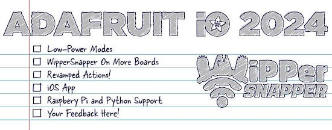](https://blog.adafruit.com/2024/02/27/adafruit-io-in-2024-adafruitio2024/)

Inspired by Scott’s blog post, CircuitPython 2024, the developers and designers on the Adafruit IO team are requesting feedback (from you!) to help guide development of Adafruit IO in 2024 - [Adafruit Blog](https://blog.adafruit.com/2024/02/27/adafruit-io-in-2024-adafruitio2024/).

> "If you’re a current Adafruit Free IO user, an Adafruit IO Plus (paid) user, or have previously used Adafruit IO in the last year, we want to hear from you!" 

## 9 tips I Wish I knew Before Starting My First Raspberry Pi Project

Find your new Raspberry Pi daunting? These tips from Pocket-lint should have your Raspberry Pi projects up and running in no time - [Pocket-lint](https://www.pocket-lint.com/raspberry-pi-tips-tricks/#get-connected-to-wi-fi).

## Arduino Docs Gets a Revamp

[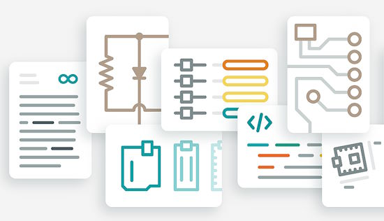](https://blog.arduino.cc/2024/01/30/whats-up-docs-arduino-docs-gets-a-revamp/)

Arduino Docs, a public and collaborative repository of info, tech specs, and tutorials, gets a major facelift - [Arduino Blog](https://blog.arduino.cc/2024/01/30/whats-up-docs-arduino-docs-gets-a-revamp/).

> "Open-source through and through, Arduino Docs is a shared space that’s wonderfully alive with updates and new ideas. But it can also get messy and confusing – and that’s why we decided to revamp its design and architecture completely, to improve your experience and navigation."

## This Week's Python Streams

Python on Hardware is all about building a cooperative ecosphere which allows contributions to be valued and to grow knowledge. Below are the streams within the last week focusing on the community.

**CircuitPython Deep Dive Stream**

[Last Friday](link), Scott streamed work on {subject}.

You can see the latest video and past videos on the Adafruit YouTube channel under the Deep Dive playlist - [YouTube](https://www.youtube.com/playlist?list=PLjF7R1fz_OOXBHlu9msoXq2jQN4JpCk8A).

**CircuitPython Parsec**

John Park’s CircuitPython Parsec this week is on {subject} - [Adafruit Blog](link) and [YouTube](link).

Catch all the episodes in the [YouTube playlist](https://www.youtube.com/playlist?list=PLjF7R1fz_OOWFqZfqW9jlvQSIUmwn9lWr).

**CircuitPython Weekly Meeting**

CircuitPython Weekly Meeting for February 26, 2024 ([notes](https://github.com/adafruit/adafruit-circuitpython-weekly-meeting/blob/main/2024/2024-02-26.md)) [on YouTube](https://youtu.be/0R3lIlEbY-M)

## Project of the Week

text - [site](url).

## Popular Last Week

What was the most popular, most clicked link, in [last week's newsletter](https://www.adafruitdaily.com/2024/02/26/python-on-microcontrollers-newsletter-micropython-1-22-2-circuitpython-9-beta-2-out-python-pi-break-enigma-and-much-more-circuitpython-python-micropython-thepsf-raspberry_pi/)? [Raspberry Pi 5 vs 4: Is the extra power worth the cost?](https://www.pocket-lint.com/raspberry-pi-5-vs-4/).

## New Notes from Adafruit Playground

[Adafruit Playground](https://adafruit-playground.com/) is a new place for the community to post their projects and other making tips/tricks/techniques. Ad-free, it's an easy way to publish your work in a safe space for free.

[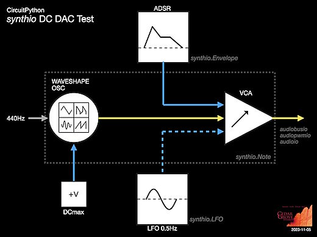](https://adafruit-playground.com/u/CGrover/pages/eurorack-control-voltage-cv-signals-from-synthio)

Output Eurorack Control Voltage (CV) Signals from `synthio` - [Adafruit Playground](https://adafruit-playground.com/u/CGrover/pages/eurorack-control-voltage-cv-signals-from-synthio).

text - [Adafruit Playground](url).

text - [Adafruit Playground](url).

## News from around the web

A radar-style clock using a Raspberry Pi, a round display and Python - [X](https://twitter.com/sozoraemon/status/1760978496250421697).

[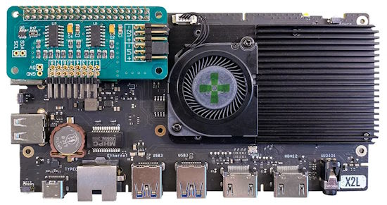](https://www.briandorey.com/post/radxa-x2l-and-adcpi)

Radxa X2L and ADC Pi, Bridging Microcontrollers with Linux (and Python) - [Brian Dorey](https://www.briandorey.com/post/radxa-x2l-and-adcpi).

text - [site](url).

text - [site](url).

[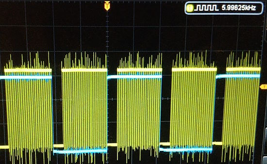](https://diyelectromusic.wordpress.com/2024/02/04/raspberry-pi-pico-synth_dexed-part-3/)

Raspberry Pi Pico Synth_Dexed (with overclocking) – Part 3 - [DIY Electronic Music](https://diyelectromusic.wordpress.com/2024/02/04/raspberry-pi-pico-synth_dexed-part-3/).

[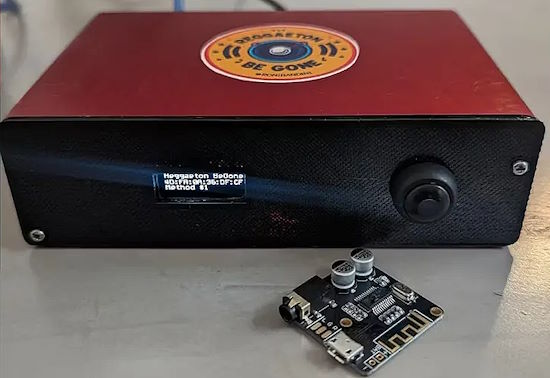](https://www.tomshardware.com/raspberry-pi/maker-uses-raspberry-pi-and-ai-to-block-noisy-neighbors-music-by-hacking-nearby-bluetooth-speakers)

Maker uses Raspberry Pi, Python and AI to block noisy neighbor's music by hacking nearby Bluetooth speakers - [Tom's Hardware](https://www.tomshardware.com/raspberry-pi/maker-uses-raspberry-pi-and-ai-to-block-noisy-neighbors-music-by-hacking-nearby-bluetooth-speakers) and [hackster.io](https://www.hackster.io/roni-bandini/reggaeton-be-gone-e5b6e2).

[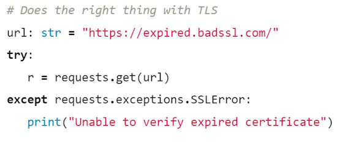](https://blog.ian.stapletoncordas.co/2024/02/a-retrospective-on-requests)

A Retrospective on Requests: using Python for HTTP/HTTPS requests - [cat /dev/brain](https://blog.ian.stapletoncordas.co/2024/02/a-retrospective-on-requests).

[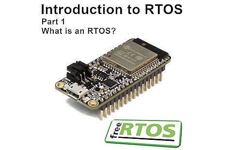](https://www.digikey.com/en/maker/projects/what-is-a-realtime-operating-system-rtos/28d8087f53844decafa5000d89608016)

What is a Real-Time Operating System (RTOS) - [DigiKey](https://www.digikey.com/en/maker/projects/what-is-a-realtime-operating-system-rtos/28d8087f53844decafa5000d89608016).

[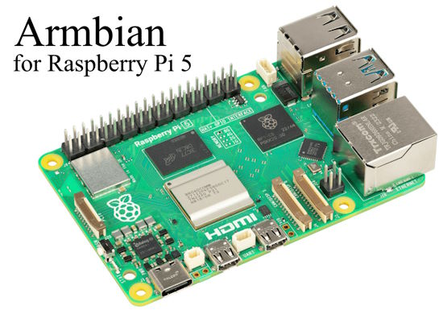](https://www.armbian.com/rpi5b/)

Armbian released for the Raspberry Pi 5 - [Armbian](https://www.armbian.com/rpi5b/).

[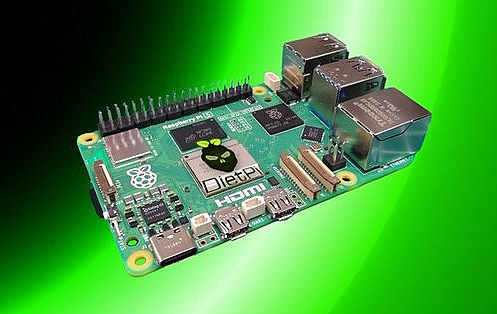](https://dietpi.com/)

Lightweight DietPi v9.1 adds support for Raspberry Pi 5 - [Tom's Hardware](https://www.tomshardware.com/raspberry-pi/raspberry-pi-5-support-arrives-with-dietpi-v91) and [DietPi](https://dietpi.com/).

[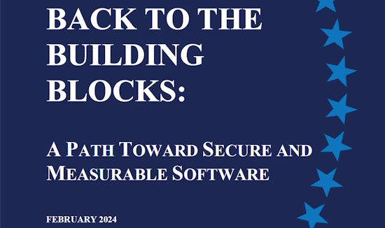](https://www.whitehouse.gov/oncd/briefing-room/2024/02/26/press-release-technical-report/)

US White House Report - Back to the Building Blocks: A Path Towards Secure and Measurable Software - [White House](https://www.whitehouse.gov/oncd/briefing-room/2024/02/26/press-release-technical-report/).

text - [site](url).

[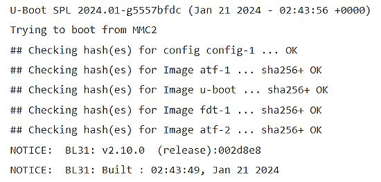](https://www.collabora.com/news-and-blog/blog/2024/02/21/almost-a-fully-open-source-boot-chain-for-rockchips-rk3588/)

Almost a fully open-source boot chain for Rockchip's RK3588 - [Collabora](https://www.collabora.com/news-and-blog/blog/2024/02/21/almost-a-fully-open-source-boot-chain-for-rockchips-rk3588/).

text - [site](url).

text - [site](url).

text - [site](url).

text - [site](url).

text - [site](url).

## New

The Milk-V Duo S includes dual CPUs, 512MB RAM, and Wi-Fi 6 connectivity. In Arm CPU mode, the Milk-V Duo S can reach 1GHz speed, outperforming the Raspberry Pi Pico but with limitations. The base model starts at $11. For $20, you can get 8GB eMMC, Wi-Fi 6, and a PoE HAT - [XDA Developers](https://www.xda-developers.com/1-7-inch-wide-computer-10x-raspberry-pi-pico/).

text - [site](url).

## New Boards Supported by CircuitPython

The number of supported microcontrollers and Single Board Computers (SBC) grows every week. This section outlines which boards have been included in CircuitPython or added to [CircuitPython.org](https://circuitpython.org/).

This week, there were (#/no) new boards added:

- [Board name](url)
- [Board name](url)
- [Board name](url)

*Note: For non-Adafruit boards, please use the support forums of the board manufacturer for assistance, as Adafruit does not have the hardware to assist in troubleshooting.*

Looking to add a new board to CircuitPython? It's highly encouraged! Adafruit has four guides to help you do so:

- [How to Add a New Board to CircuitPython](https://learn.adafruit.com/how-to-add-a-new-board-to-circuitpython/overview)
- [How to add a New Board to the circuitpython.org website](https://learn.adafruit.com/how-to-add-a-new-board-to-the-circuitpython-org-website)
- [Adding a Single Board Computer to PlatformDetect for Blinka](https://learn.adafruit.com/adding-a-single-board-computer-to-platformdetect-for-blinka)
- [Adding a Single Board Computer to Blinka](https://learn.adafruit.com/adding-a-single-board-computer-to-blinka)

## New Learn Guides

[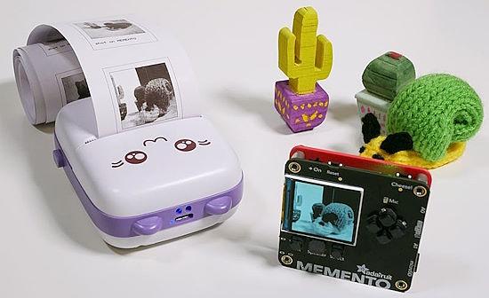](https://learn.adafruit.com/guides/latest)

[BLE Cat Thermal Printer with MEMENTO](https://learn.adafruit.com/ble-cat-thermal-printer-with-memento) from [Liz Clark](https://learn.adafruit.com/u/BlitzCityDIY)

[How to use Blockly for Actions on Adafruit IO](https://learn.adafruit.com/how-to-use-blockly-for-actions-on-adafruit-io) from [Tyeth Gundry](https://learn.adafruit.com/u/tyeth)

## CircuitPython Libraries

The CircuitPython library numbers are continually increasing, while existing ones continue to be updated. Here we provide library numbers and updates!

To get the latest Adafruit libraries, download the [Adafruit CircuitPython Library Bundle](https://circuitpython.org/libraries). To get the latest community contributed libraries, download the [CircuitPython Community Bundle](https://circuitpython.org/libraries).

If you'd like to contribute to the CircuitPython project on the Python side of things, the libraries are a great place to start. Check out the [CircuitPython.org Contributing page](https://circuitpython.org/contributing). If you're interested in reviewing, check out Open Pull Requests. If you'd like to contribute code or documentation, check out Open Issues. We have a guide on [contributing to CircuitPython with Git and GitHub](https://learn.adafruit.com/contribute-to-circuitpython-with-git-and-github), and you can find us in the #help-with-circuitpython and #circuitpython-dev channels on the [Adafruit Discord](https://adafru.it/discord).

You can check out this [list of all the Adafruit CircuitPython libraries and drivers available](https://github.com/adafruit/Adafruit_CircuitPython_Bundle/blob/master/circuitpython_library_list.md). 

The current number of CircuitPython libraries is **###**!

**New Libraries**

Here's this week's new CircuitPython libraries:

* [library](url)

**Updated Libraries**

Here's this week's updated CircuitPython libraries:

* [library](url)

**Library PyPI Weekly Download Stats**

## What’s the CircuitPython team up to this week?

What is the team up to this week? Let’s check in:

**Dan**

I've been fixing nRF- and MEMENTO-related bugs for the 9.0.0 release. Then I'll move on to whatever remaining bugs there are.

**Melissa**

This past week, I worked on writing a guide on some of the new features of Web Workflow, but unfortunately ran into a bug in CircuitPython that stopped me from finishing up the guide. Once the bug is resolved, I'll be able to finish up. In the interim, I switched over to fixing some Raspberry Pi related bugs including updating the Blinka installer and PiTFT installer script to fix a couple of issues so they are now backwards compatible with Bullseye.

**Tim**

I did library PR reviews across several libraries. I've also been working on applying changes from feedback on the web workflow support for circup. The workflow APIs have changed slightly, so it needed some catching up an addition to the feedback from prior review. I'm trying to dig into circup for a different issue that was noticed as well that is resulting in it not wanting to install the new ConnectionManager library based on its PyPI name. 

**Jeff**

I'm excited to be on the talk schedule at PyCon US 2024! I'll be giving a talk titled "Connecting Old to New with CircuitPython: Retrocomputer input devices on modern PCs" on May 19 in Pittsburgh, PA.

**Scott**

Last week I was fixing two USB host related issues we wanted to fix before 9.0 release. This week I've been out most of the week with a sick kid at home. Once I'm back to work, I'll continue fixing 9.0.0 issues so that we can release another major stable version.

**Liz**

This week I published the [BLE Cat Thermal Printer with MEMENTO guide](https://learn.adafruit.com/ble-cat-thermal-printer-with-memento). This guide goes through connecting the MEMENTO camera to print photos on the BLE cat thermal printer with a gameboy photo filter. This was really fun to work on and I especially enjoyed writing the guide copy on the overview page.

I also wrapped up the product guide for the new [ItsyBitsy ESP32](https://learn.adafruit.com/adafruit-itsybitsy-esp32). You can run CircuitPython on this board with web workflow and I wrote a few example pages stepping thru the process for downloading the project bundle and uploading the libraries and code thru the browser. I hope these steps will help folks new to web workflow get the hang of it.

## Upcoming Events

The next MicroPython Meetup in Melbourne will be on March 27th – [Meetup](https://www.meetup.com/micropython-meetup/events). 

PyCascades 2024 is back in Seattle, Washington, USA and online, April 5-8th at the University of Washington, Kane Hall - [PyCascades](https://2024.pycascades.com/).

The 2024 Open Hardware Summit will be taking place May 3 & 4, 2024 at Concordia University and lespacemaker in Montreal, Canada - [oshwa.org](https://2024.oshwa.org/).

[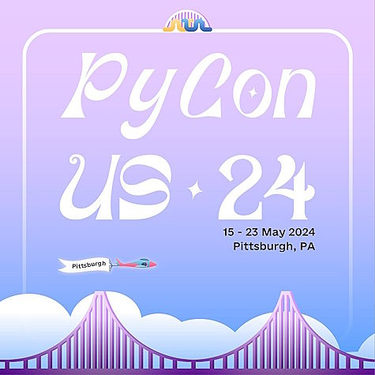](https://pycon.blogspot.com/2024/10/pycon-us-2024-launches.html)

PyCon US 2024 launches May 15-23, 2024 in Pittsburgh, Pennsylvania US - [PyCon US](https://pycon.blogspot.com/2024/10/pycon-us-2024-launches.html).

Open Sauce, the Maker extravaganza, is returning to San Francisco, California June 15-16 - [Open Sauce](https://opensauce.live/).

EuroPython is the oldest and longest running volunteer-led Python programming conference on the planet. This year it will be held July 8-14 in Prague. Call for Proposals, the Mentorship Programme, and the Financial Aid Programme will be starting this month - [EuroPython 2024](https://ep2024.europython.eu/).

**Send Your Events In**

If you know of virtual events or upcoming events, please let us know via email to cpnews(at)adafruit(dot)com.

## Latest Releases

CircuitPython's stable release is [#.#.#](https://github.com/adafruit/circuitpython/releases/latest) and its unstable release is [#.#.#-##.#](https://github.com/adafruit/circuitpython/releases). New to CircuitPython? Start with our [Welcome to CircuitPython Guide](https://learn.adafruit.com/welcome-to-circuitpython).

[2024####](https://github.com/adafruit/Adafruit_CircuitPython_Bundle/releases/latest) is the latest Adafruit CircuitPython library bundle.

[2024####](https://github.com/adafruit/CircuitPython_Community_Bundle/releases/latest) is the latest CircuitPython Community library bundle.

[v#.#.#](https://micropython.org/download) is the latest MicroPython release. Documentation for it is [here](http://docs.micropython.org/en/latest/pyboard/).

[#.#.#](https://www.python.org/downloads/) is the latest Python release. The latest pre-release version is [#.#.#](https://www.python.org/download/pre-releases/).

[#,### Stars](https://github.com/adafruit/circuitpython/stargazers) Like CircuitPython? [Star it on GitHub!](https://github.com/adafruit/circuitpython)

## Call for Help -- Translating CircuitPython is now easier than ever

[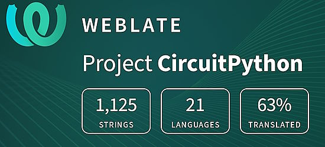](https://hosted.weblate.org/engage/circuitpython/)

One important feature of CircuitPython is translated control and error messages. With the help of fellow open source project [Weblate](https://weblate.org/), we're making it even easier to add or improve translations. 

Sign in with an existing account such as GitHub, Google or Facebook and start contributing through a simple web interface. No forks or pull requests needed! As always, if you run into trouble join us on [Discord](https://adafru.it/discord), we're here to help.

## NUMBER Thanks

The Adafruit Discord community, where we do all our CircuitPython development in the open, reached over NUMBER humans - thank you! Adafruit believes Discord offers a unique way for Python on hardware folks to connect. Join today at [https://adafru.it/discord](https://adafru.it/discord).

## ICYMI - In case you missed it

Python on hardware is the Adafruit Python video-newsletter-podcast! The news comes from the Python community, Discord, Adafruit communities and more and is broadcast on ASK an ENGINEER Wednesdays. The complete Python on Hardware weekly videocast [playlist is here](https://www.youtube.com/playlist?list=PLjF7R1fz_OOXRMjM7Sm0J2Xt6H81TdDev). The video podcast is on [iTunes](https://itunes.apple.com/us/podcast/python-on-hardware/id1451685192?mt=2), [YouTube](http://adafru.it/pohepisodes), [Instagram Reels](https://www.instagram.com/adafruit/channel/)), and [XML](https://itunes.apple.com/us/podcast/python-on-hardware/id1451685192?mt=2).

[The weekly community chat on Adafruit Discord server CircuitPython channel - Audio / Podcast edition](https://itunes.apple.com/us/podcast/circuitpython-weekly-meeting/id1451685016) - Audio from the Discord chat space for CircuitPython, meetings are usually Mondays at 2pm ET, this is the audio version on [iTunes](https://itunes.apple.com/us/podcast/circuitpython-weekly-meeting/id1451685016), Pocket Casts, [Spotify](https://adafru.it/spotify), and [XML feed](https://adafruit-podcasts.s3.amazonaws.com/circuitpython_weekly_meeting/audio-podcast.xml).

## Contribute

The CircuitPython Weekly Newsletter is a CircuitPython community-run newsletter emailed every Monday. The complete [archives are here](https://www.adafruitdaily.com/category/circuitpython/). It highlights the latest CircuitPython related news from around the web including Python and MicroPython developments. To contribute, edit next week's draft [on GitHub](https://github.com/adafruit/circuitpython-weekly-newsletter/tree/gh-pages/_drafts) and [submit a pull request](https://help.github.com/articles/editing-files-in-your-repository/) with the changes. You may also tag your information on Twitter with #CircuitPython. 

Join the Adafruit [Discord](https://adafru.it/discord) or [post to the forum](https://forums.adafruit.com/viewforum.php?f=60) if you have questions.
