- [ ] Library and info updates
- [ ] change date
- [ ] update title
- [ ] Feature story
- [ ] Update  for images
- [ ] Update ICYDNCI
- [ ] All images 550w max only
- [ ] Link "View this email in your browser."

News Sources

- [Adafruit Playground](https://adafruit-playground.com/)
- Twitter: [CircuitPython](https://twitter.com/search?q=circuitpython&src=typed_query&f=live), [MicroPython](https://twitter.com/search?q=micropython&src=typed_query&f=live) and [Python](https://twitter.com/search?q=python&src=typed_query)
- [Raspberry Pi News](https://www.raspberrypi.com/news/)
- Mastodon [CircuitPython](https://octodon.social/tags/CircuitPython) and [MicroPython](https://octodon.social/tags/MicroPython)
- [hackster.io CircuitPython](https://www.hackster.io/search?q=circuitpython&i=projects&sort_by=most_recent) and [MicroPython](https://www.hackster.io/search?q=micropython&i=projects&sort_by=most_recent)
- [python.org](https://www.python.org/)
- [Python Insider - dev team blog](https://pythoninsider.blogspot.com/)
- Individuals: [Jeff Geerling](https://www.jeffgeerling.com/blog)
- [hackaday CircuitPython](https://hackaday.com/blog/?s=circuitpython) and [MicroPython](https://hackaday.com/blog/?s=micropython)
- [hackaday.io newest projects MicroPython](https://hackaday.io/projects?tag=micropython&sort=date) and [CircuitPython](https://hackaday.io/projects?tag=circuitpython&sort=date)
- [Google News Python](https://news.google.com/topics/CAAqIQgKIhtDQkFTRGdvSUwyMHZNRFY2TVY4U0FtVnVLQUFQAQ?hl=en-US&gl=US&ceid=US%3Aen)
- Check Issues and PRs for input 

View this email in your browser. **Warning: Flashing Imagery**

Welcome to the latest Python on Microcontrollers newsletter! *insert 2-3 sentences from editor (what's in overview, banter)* - *Anne Barela, Ed.*

We're on [Discord](https://discord.gg/HYqvREz), [Twitter](https://twitter.com/search?q=circuitpython&src=typed_query&f=live), and for past newsletters - [view them all here](https://www.adafruitdaily.com/category/circuitpython/). If you're reading this on the web, [subscribe here](https://www.adafruitdaily.com/). Here's the news this week:

## Headline

text - [site](url).

## BeagleBoard.Org Delivers the BeagleY-AI

[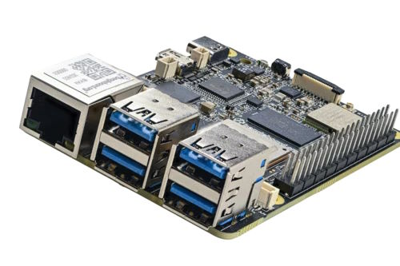](https://www.beagleboard.org/boards/beagley-ai)

The new BeagleY-AI provides 4 TOPS of Edge AI acceleration in a Raspberry-Pi like form factor. It has a Quad-core 64-bit Arm®Cortex®-A53 CPU subsystem at 1.4GHz, 4GB RAM, gigabit Ethernet and a PCIe Gen 3 lane along with Bluetooth and WiFi and more - [BeagleBoard.org](https://www.beagleboard.org/boards/beagley-ai).

## CircuitPython 9.0.2 and 9.1.0-beta.0 Released

CircuitPython 9.0.2 is the latest bugfix release of CircuitPython, and is a new stable release. It fixes using HTTPServer on Pico W and turns off `displayio` renaming warnings (9.0.1) and fixes an Adafruit SHT4x Trinkey pin error (9.0.2). Thanks to the community for testing version 9 thoroughly - [Adafruit Blog](https://blog.adafruit.com/2024/03/26/circuitpython-9-0-1-released/) and [release page](https://github.com/adafruit/circuitpython/releases/tag/9.0.1).

CircuitPython 9.1.0-beta.0, a beta for CircuitPython 9.1.0, is the new unstable release. This release has known bugs that will be addressed before 9.1.0 final - [Adafruit Blog](https://blog.adafruit.com/2024/03/28/circuitpython-9-1-0-beta-0-released/) and [release page](https://github.com/adafruit/circuitpython/releases/tag/9.1.0-beta.0)

**Notable changes since 9.0.0**

Audio
- RP2040 I2SOut supports BLCK and LRCLK in either order.
  
Built-in modules
- Enhance collections.deque functionality.
- Add keypad_demux.DemuxKeyMatrix: use multiplexer for one side of a keypad matrix.
- Add integration-based debouncing to keypad.
  
Internal
- Espressif: update to ESP-IDF v5.2.1.

## A New Adafruit Discord Milestone: 39,000 Members

The Adafruit Discord community, where we do all our CircuitPython development in the open, reached over 39,000 humans - thank you! Adafruit believes Discord offers a unique way for Python on hardware folks to connect. Join today at [https://adafru.it/discord](https://adafru.it/discord) - [Adafruit Blog](https://blog.adafruit.com/2024/03/27/celebrating-over-39000-members-in-the-adafruit-discord-community-adafruit-discord/)

## ecoEDA: Recycling E-Waste During Electronics Design in KiCad

[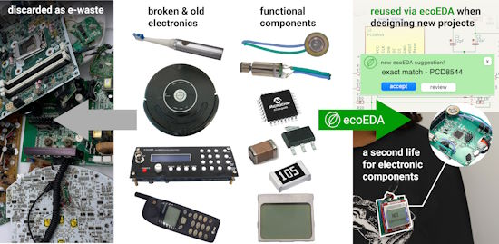](https://github.com/humancomputerintegration/ecoEDA)

ecoEDA is a Python-based tool that integrates with KiCad. It is designed to provide suggestions of recycled components whenever you add a new symbol to your schematic - [GitHub](https://github.com/humancomputerintegration/ecoEDA).

## 170,000 Users Caught in Fake PyPI Hack

[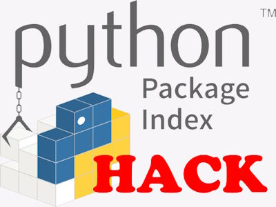](https://www.theregister.com/2024/03/25/python_package_malware/)

More than 170,000 users are said to have been affected by an attack using fake Python infrastructure. The Top.gg GitHub organization – a top resource for Discord bot makers – as well as other developers were targeted, and it all hinged on various supply chain attack techniques to distribute malware-infected Python PyPI packages. That malware stole data from people's browsers, Discord app, crypto wallets, and files that matched certain keywords. There were multiple prongs to this remarkably complicated attack: clones of popular Python packages such as Colorama, a typosquatted domain for Python packages, and code obfuscation - [The Register](https://www.theregister.com/2024/03/25/python_package_malware/).

PyPI shut down creation of new users and projects for ten hours due to security concerns for typosquatting package names - [Ars Technica](https://arstechnica.com/security/2024/03/pypi-halted-new-users-and-projects-while-it-fended-off-supply-chain-attack/).

## Adafruit IO in 2024 Survey Last Chance

[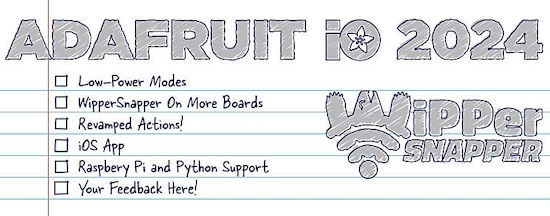](https://blog.adafruit.com/2024/02/27/adafruit-io-in-2024-adafruitio2024/)

Inspired by Scott’s blog post, CircuitPython 2024, the Adafruit IO developers and designers are requesting feedback (from you!) to help guide development of Adafruit IO in 2024. Wrapping soon, please respond - [Adafruit Blog](https://blog.adafruit.com/2024/02/27/adafruit-io-in-2024-adafruitio2024/).

> “If you’re a current Adafruit Free IO user, an Adafruit IO Plus (paid) user, or have previously used Adafruit IO in the last year, we want to hear from you!”

## See CircuitPython Lead Developer Scott Shawcroft at PyCascades 2024

PyCascades 2024 is back in Seattle, Washington, USA and online, April 5-8th at the University of Washington, Kane Hall. CircuitPython lead developer Scott Shawcroft will be presenting the talk "Cutting the USB cord: wirelessly programming CircuitPython" on April 7th at 2 pm PST - [PyCascades](https://2024.pycascades.com/).

## This Week's Python Streams

Python on Hardware is all about building a cooperative ecosphere which allows contributions to be valued and to grow knowledge. Below are the streams within the last week focusing on the community.

**CircuitPython Deep Dive Stream**

[Last Friday](https://www.youtube.com/watch?v=wZbAGkcInek), Scott streamed work on PyCascades prep.

You can see the latest video and past videos on the Adafruit YouTube channel under the Deep Dive playlist - [YouTube](https://www.youtube.com/playlist?list=PLjF7R1fz_OOXBHlu9msoXq2jQN4JpCk8A).

**CircuitPython Parsec**

John Park’s CircuitPython Parsec this week is on {subject} - [Adafruit Blog](link) and [YouTube](link).

Catch all the episodes in the [YouTube playlist](https://www.youtube.com/playlist?list=PLjF7R1fz_OOWFqZfqW9jlvQSIUmwn9lWr).

**CircuitPython Weekly Meeting**

CircuitPython Weekly Meeting for March 25, 2024 ([notes](https://github.com/adafruit/adafruit-circuitpython-weekly-meeting/blob/main/2024/2024-03-25.md)) [on YouTube](https://youtu.be/oykFxLCp6Zo).

## Project of the Week: A Mini Observatory

A 3D printed, mini motorized observatory with Raspberry Pi and camera programmed in Python and CircuitPython - [Raspberry Pi News](https://www.raspberrypi.com/news/mini-observatory-the-magpi-140/) via The MagPi and [Instructables](https://www.instructables.com/Pi-lomar-3D-Printed-Working-Miniature-Observatory-/).

## Popular Last Week

[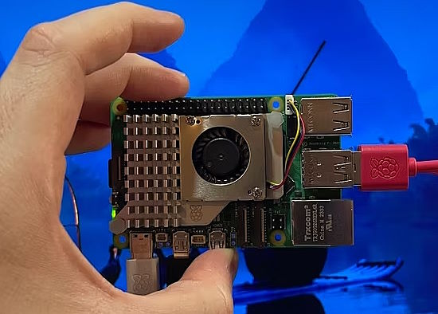](https://www.pocket-lint.com/raspberry-pi-5-review/)

What was the most popular, most clicked link, in [last week's newsletter](https://www.adafruitdaily.com/2024/03/25/python-on-microcontrollers-newsletter-circuitpython-9-final-is-here-micropython-gets-a-usb-update-and-more-circuitpython-python-micropython-thepsf-raspberry_pi/)? [My Raspberry Pi 5 is a delight, and I'm excited about all its future uses](https://www.pocket-lint.com/raspberry-pi-5-review/).

## New Notes from Adafruit Playground

[Adafruit Playground](https://adafruit-playground.com/) is a new place for the community to post their projects and other making tips/tricks/techniques. Ad-free, it's an easy way to publish your work in a safe space for free.

[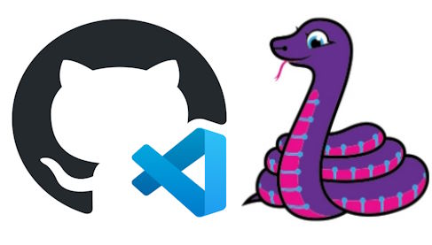](https://adafruit-playground.com/u/picofun/pages/using-github-codespaces-fo-circuitpython-development)

Using GitHub Codespaces for CircuitPython development - [Adafruit Playground](https://adafruit-playground.com/u/picofun/pages/using-github-codespaces-fo-circuitpython-development).

[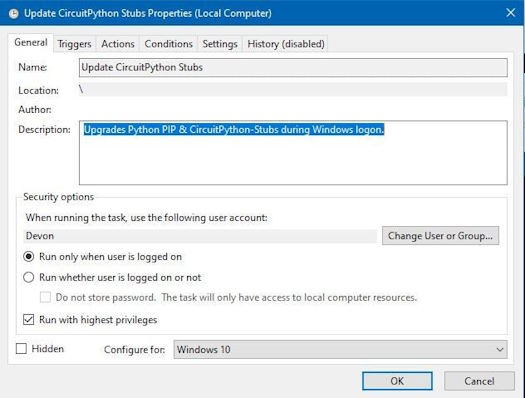](https://adafruit-playground.com/u/DJDevon3/pages/automating-pip-circuitpython-stubs-updates-for-windows-users)

Automating PIP & CircuitPython-Stubs updates for Windows Users - [Adafruit Playground](https://adafruit-playground.com/u/DJDevon3/pages/automating-pip-circuitpython-stubs-updates-for-windows-users).

## News From Around the Web

[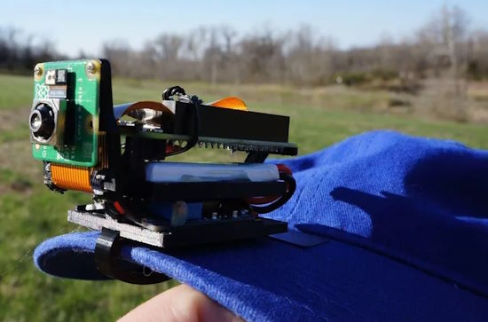](https://www.tomshardware.com/raspberry-pi/raspberry-pi-hat-camera-views-the-world-from-your-perspective)

A hat mounted camera using a Raspberry Pi Zero 2 W, Camera Module 3 and Python - [Tom's Hardware](https://www.tomshardware.com/raspberry-pi/raspberry-pi-hat-camera-views-the-world-from-your-perspective) and [GitHub](https://github.com/jdc-cunningham/ml-clip-cam).

Berkeley SoftFloat 3e is a free, high-quality C software implementation of binary floating-point that conforms to the IEEE Standard for Floating-Point Arithmetic. SoftFloat is completely faithful to the IEEE Standard, while at the same time being relatively fast - [John Hauser](http://www.jhauser.us/arithmetic/SoftFloat.html), [GitHub](https://github.com/ucb-bar/berkeley-softfloat-3) and [Fork](https://github.com/EOSIO/berkeley-softfloat-3).

Laurens Valk upgraded a childhood LEGO train to use Pybricks MicroPython. It stops at train stations now. No rail loops required - [Mastodon](https://fosstodon.org/@laurensvalk/112166988497665295).

[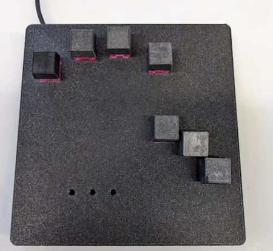](https://www.instructables.com/One-Handed-Chording-Keyboard/)

A one handed chording keyboard running CircuitPython on a Raspberry Pi Pico. The case and keys are 3D printed - [Instructables](https://www.instructables.com/One-Handed-Chording-Keyboard/).

[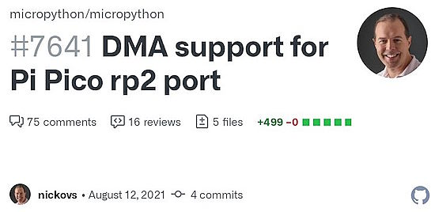](https://twitter.com/matt_trentini/status/1771321979389547000?t=v9is5gslrrs9b6NHwQfSRg&s=03)

Did you know, on a RP2040, you can use DMA with PIO from within MicroPython - [GitHub](https://github.com/micropython/micropython/pull/7641) via [X](https://twitter.com/matt_trentini/status/1771321979389547000?t=v9is5gslrrs9b6NHwQfSRg&s=03).

[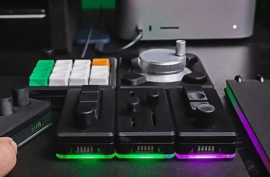](https://www.instructables.com/Modular-Macro-Keyboard-System-Ocreeb-MK2/)

Modular Macro Keyboard System, Ocreeb MK2, uses a Xiao RP2040 running CircuitPython - [Instructables](https://www.instructables.com/Modular-Macro-Keyboard-System-Ocreeb-MK2/) and [GitHub](https://github.com/sb-ocr/ocreeb-mk-2).

[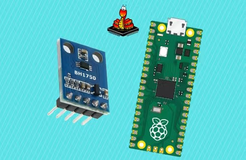](https://www.hackster.io/shilleh/how-to-connect-bh1750-with-the-raspberry-pi-pico-pico-w-7be5e0)

How to connect a BH1750 to a Raspberry Pi Pico/Pico W with MicroPython - [hackster.io](https://www.hackster.io/shilleh/how-to-connect-bh1750-with-the-raspberry-pi-pico-pico-w-7be5e0) and [YouTube](https://youtu.be/l9MAZu7yvN4).

[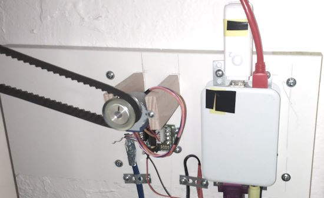](https://hackaday.com/2024/03/26/2024-home-sweet-home-automation-sms-controlled-heating/)

An SMS-controlled remote heating controller with Raspberry Pi and Python - [Hackaday](https://hackaday.com/2024/03/26/2024-home-sweet-home-automation-sms-controlled-heating/).

[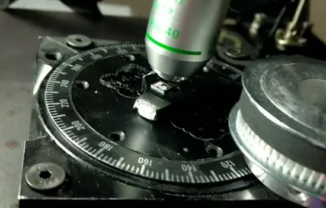](https://www.tomshardware.com/raspberry-pi/raspberry-pi-spins-precision-movement-stage-for-beautiful-up-close-microchip-videos)

Raspberry Pi spins precision movement stage for beautiful up-close microchip videos - [Tom's Hardware](https://www.tomshardware.com/raspberry-pi/raspberry-pi-spins-precision-movement-stage-for-beautiful-up-close-microchip-videos) and [YouTube](https://youtu.be/tHwjnl-pefs).

[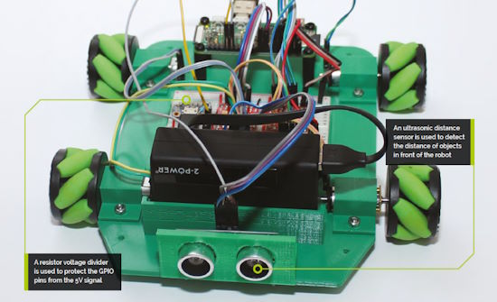](https://hackspace.raspberrypi.com/issues/76)

A Raspberry Pi Zero 2 + Python powered mecanum robot - [HackSpace Magazine](https://hackspace.raspberrypi.com/issues/76).

[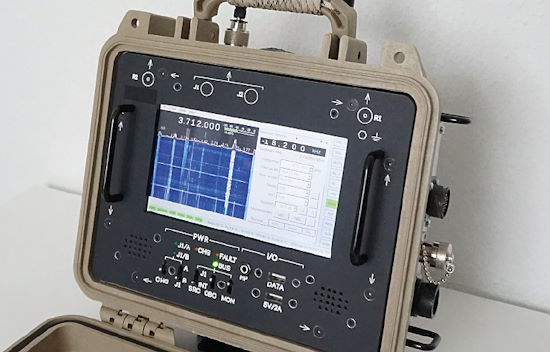](https://hackspace.raspberrypi.com/issues/76)

Making a Raspberry Pi-based software defined radio cyberdeck - [HackSpace Magazine](https://hackspace.raspberrypi.com/issues/76).

text - [site](url).

text - [site](url).

[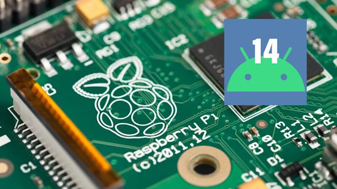](https://www.slashgear.com/1537822/how-to-install-android-14-raspberry-pi/)

How To Install Android 14 On Your Raspberry Pi - [SlashGear](https://www.slashgear.com/1537822/how-to-install-android-14-raspberry-pi/).

[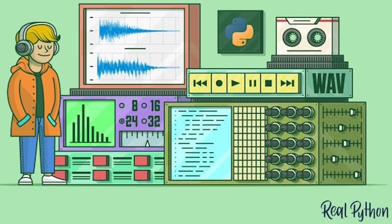](https://realpython.com/python-wav-files/)

Reading and Writing WAV Files in Python - [Real Python](https://realpython.com/python-wav-files/).

[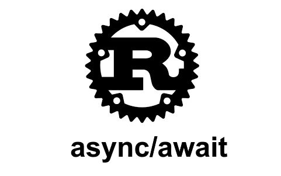](https://notgull.net/why-not-threads/)

Why choose async/await over threads in Rust - [notgull](https://notgull.net/why-not-threads/).

## New

[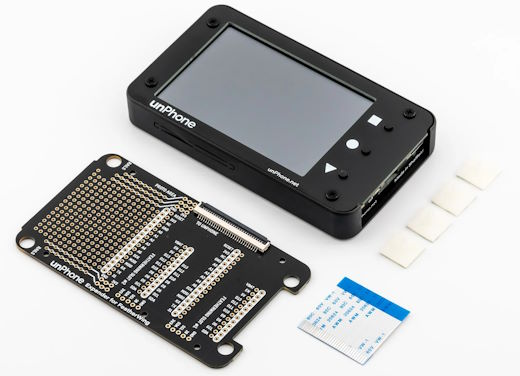](https://shop.pimoroni.com/products/unphone?variant=40829810311251)

unPhone is an all-in-one LoRa, WiFi and Bluetooth dev device with touchscreen, expandable with two FeatherWing slots and LiPo battery with an ESP32-S3, programmable in C++ or CircuitPython - [Pimoroni](https://shop.pimoroni.com/products/unphone?variant=40829810311251).

[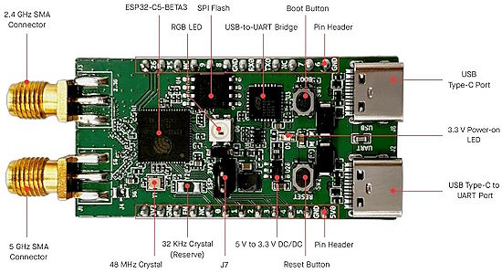](https://www.cnx-software.com/2024/03/27/esp32-c5-beta-board-2-4ghz-and-5ghz-sma-antenna-connectors-usb-c-ports/)

Espressif ESP32-C5 microcontroller was announced in June 2022 as the first dual-band WiFi 6 IoT chip from the company. It’s been quiet since then, but things are about to change as the ESP32-C5 beta board’s documentation has very recently been released - [CNX Software](https://www.cnx-software.com/2024/03/27/esp32-c5-beta-board-2-4ghz-and-5ghz-sma-antenna-connectors-usb-c-ports/).

[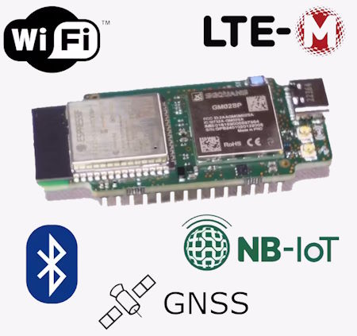](https://www.hackster.io/news/walter-packs-5g-wi-fi-bluetooth-and-gnss-into-a-certified-board-as-short-as-a-aa-battery-61d405ea5104)

Walter packs 5G, WiFi, Bluetooth, and GNSS into a certified board as short as a AA battery - [hackster.io](https://www.hackster.io/news/walter-packs-5g-wi-fi-bluetooth-and-gnss-into-a-certified-board-as-short-as-a-aa-battery-61d405ea5104).

[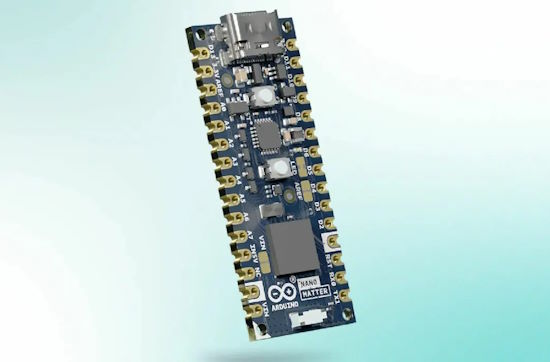](https://www.cnx-software.com/2024/03/26/arduino-nano-matter-board-specifications-and-price/)

Arduino Nano Matter board specifications and price announced - [CNX Software](https://www.cnx-software.com/2024/03/26/arduino-nano-matter-board-specifications-and-price/).

## New Boards Supported by CircuitPython

The number of supported microcontrollers and Single Board Computers (SBC) grows every week. This section outlines which boards have been included in CircuitPython or added to [CircuitPython.org](https://circuitpython.org/).

This week there were two new boards added:

- [ESP32-S3-GEEK](https://circuitpython.org/board/waveshare_esp32_s3_geek/)
- [Sunton ESP32-2432S028](https://circuitpython.org/board/sunton_esp32_2432S028/)

*Note: For non-Adafruit boards, please use the support forums of the board manufacturer for assistance, as Adafruit does not have the hardware to assist in troubleshooting.*

Looking to add a new board to CircuitPython? It's highly encouraged! Adafruit has four guides to help you do so:

- [How to Add a New Board to CircuitPython](https://learn.adafruit.com/how-to-add-a-new-board-to-circuitpython/overview)
- [How to add a New Board to the circuitpython.org website](https://learn.adafruit.com/how-to-add-a-new-board-to-the-circuitpython-org-website)
- [Adding a Single Board Computer to PlatformDetect for Blinka](https://learn.adafruit.com/adding-a-single-board-computer-to-platformdetect-for-blinka)
- [Adding a Single Board Computer to Blinka](https://learn.adafruit.com/adding-a-single-board-computer-to-blinka)

## New Learn Guides

[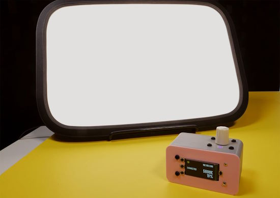](https://learn.adafruit.com/guides/latest)

[CircuitPython Elgato WiFi Light Controller](https://learn.adafruit.com/circuitpython-elgato-wifi-light-controller) from [Liz Clark](https://learn.adafruit.com/u/BlitzCityDIY)

[Vintage computer to HDMI with Feather DVI & CircuitPython](https://learn.adafruit.com/vintage-computer-to-dvi-with-feather-dvi-circuitpython) from [Jeff Epler](https://learn.adafruit.com/u/jeplern)

## CircuitPython Libraries

The CircuitPython library numbers are continually increasing, while existing ones continue to be updated. Here we provide library numbers and updates!

To get the latest Adafruit libraries, download the [Adafruit CircuitPython Library Bundle](https://circuitpython.org/libraries). To get the latest community contributed libraries, download the [CircuitPython Community Bundle](https://circuitpython.org/libraries).

If you'd like to contribute to the CircuitPython project on the Python side of things, the libraries are a great place to start. Check out the [CircuitPython.org Contributing page](https://circuitpython.org/contributing). If you're interested in reviewing, check out Open Pull Requests. If you'd like to contribute code or documentation, check out Open Issues. We have a guide on [contributing to CircuitPython with Git and GitHub](https://learn.adafruit.com/contribute-to-circuitpython-with-git-and-github), and you can find us in the #help-with-circuitpython and #circuitpython-dev channels on the [Adafruit Discord](https://adafru.it/discord).

You can check out this [list of all the Adafruit CircuitPython libraries and drivers available](https://github.com/adafruit/Adafruit_CircuitPython_Bundle/blob/master/circuitpython_library_list.md). 

The current number of CircuitPython libraries is **480**!

**New Libraries**

Here's this week's new CircuitPython libraries:

  * [skerr92/Oakdevtech_CircuitPython_IcePython](https://github.com/skerr92/Oakdevtech_CircuitPython_IcePython)
  * [bablokb/circuitpython-ehttpserver](https://github.com/bablokb/circuitpython-ehttpserver)

**Updated Libraries**

Here's this week's updated CircuitPython libraries:

  * [adafruit/Adafruit_CircuitPython_RSA](https://github.com/adafruit/Adafruit_CircuitPython_RSA)
  * [adafruit/Adafruit_CircuitPython_GPS](https://github.com/adafruit/Adafruit_CircuitPython_GPS)
  * [skerr92/at42qt-acorn-python](https://github.com/skerr92/at42qt-acorn-python)

**Library PyPI Weekly Download Stats**

**Total Library Stats**
  * 151767 PyPI downloads over 325 libraries

**Top 10 Libraries by PyPI Downloads**
  * Adafruit CircuitPython Requests (adafruit-circuitpython-requests): 9556
  * Adafruit CircuitPython BusDevice (adafruit-circuitpython-busdevice): 9166
  * Adafruit CircuitPython ConnectionManager (adafruit-circuitpython-connectionmanager): 8116
  * Adafruit CircuitPython Register (adafruit-circuitpython-register): 2191
  * Adafruit CircuitPython ADS1x15 (adafruit-circuitpython-ads1x15): 1463
  * Adafruit CircuitPython DHT (adafruit-circuitpython-dht): 1395
  * Adafruit CircuitPython PCA9685 (adafruit-circuitpython-pca9685): 1223
  * Adafruit CircuitPython Display Text (adafruit-circuitpython-display-text): 1138
  * Adafruit CircuitPython NeoPixel (adafruit-circuitpython-neopixel): 1133
  * Adafruit CircuitPython MiniMQTT (adafruit-circuitpython-minimqtt): 1097

## What’s the CircuitPython team up to this week?

What is the team up to this week? Let’s check in:

**Dan**

I made bugfix releases CircuitPython 9.0.1 and 9.0.2 in quick succession this last week, and also released CircuitPython 9.1.0 Beta 0, which has some new features and has updated the version of ESP-IDF it uses, courtesy of Scott.

I'm continuing to fix bugs in 9.0.x and 9.x.x. The day I wrote this, I found out `AnalogIn` is not working properly in 9.x.x. This turns out to be a compilation issue of some kind: when compiled with gcc 10, the code works fine, but not when compiled with gcc 13. It may be a statement reordering problem. I have a hackish fix but will be trying to understand this problem in more detail.

**Melissa**

This past week was spent mostly working on GitHub issues. Some of these issues were requests for new features like adding PWM support to the Jetson Nano. Most of these were bug fixes like updating the CircuitPython installer to run on Windows computers and fixing some of the Arduino repos that were no longer passing CI (Continuous Integration) due to compilation warnings.

**Tim**

I've been updating Learn guide code and pages for new displayio API, although we've decided to change how the warnings are working so I am going back through to revert the changes I made to guide pages and we will hold off until further down the line when the backwards compatibility is removed entirely. 

I've started building out a basic Tic Tac Toe game that will get integrated into a conference badge for PyCon. Lastly, I've managed to get working some example code that loads an RSA keypair and uses `adafruit_httpserver` to receive a message encrypted in the front end with the public key and then uses `adafruit_rsa` library to decrypt it in the backend and show the plain text to the user. 

**Jeff**

[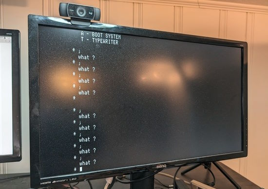](https://www.circuitpython.org/)

I had a chance to do a project for myself using CircuitPython this week. It'll probably emerge as a Learn guide in the next month or two, but I'll spoiler it here: I made a video converter for an old Xerox 820 (8-bit CP/M computer) to HDMI using the Adafruit Feather RP2040 DVI. This is a very niche display (it is 560x240 pixels at 59Hz) but the technique might apply to other monochrome computers of the era.

In the course of doing this, I put in a Pull Request to add a 640x240 video mode to picodvi. This is a very non-square resolution, but such modes were common in old computers; for instance, CGA featured a 640x200 mode that this would allow in letterboxed fashion.

For those who may be immediately interested, I've published a version of the code as a [GitHub gist](https://gist.github.com/jepler/cf582975546f1aa0039ed88d3a991c66).

**Scott**

This week I wrapped up the update to ESP-IDF 5.2. It'll be released in CircuitPython 9.1. I'm continuing work on USB host featherwing support in CircuitPython after Thach added deinit functionality to TinyUSB. Thanks Thach!

**Liz**

This week I worked on a [project to control Elgato key lights with CircuitPython](https://learn.adafruit.com/circuitpython-elgato-wifi-light-controller). The Elgato lights use an app that accepts HTTP requests to control turning them on and off, brightness and color temperature. I used a Feather ESP32-S3 Reverse TFT to connect to WiFi and send the requests with the onboard buttons. I also added in a rotary encoder to dial in color temperature and brightness. This was really fun to work on and I might expand the project further if I have time by trying to use MDNS to automatically find the lights on the network.
## Upcoming Events

The next MicroPython Meetup in Melbourne will be on April 24th – [Meetup](https://www.meetup.com/micropython-meetup/events). You can see recordings of previous meetings on [YouTube](https://www.youtube.com/@MicroPythonOfficial). 

The 2024 Open Hardware Summit will be taking place May 3 & 4, 2024 at Concordia University and lespacemaker in Montreal, Canada - [oshwa.org](https://2024.oshwa.org/).

PyCon US 2024 launches May 15-23, 2024 in Pittsburgh, Pennsylvania US - [PyCon US](https://pycon.blogspot.com/2024/10/pycon-us-2024-launches.html).

Open Sauce, the Maker extravaganza, is returning to San Francisco, California June 15-16 - [Open Sauce](https://opensauce.live/).

EuroPython is the oldest and longest running volunteer-led Python programming conference on the planet. This year it will be held July 8-14 in Prague. Call for Proposals, the Mentorship Programme, and the Financial Aid Programme will be starting this month - [EuroPython 2024](https://ep2024.europython.eu/).

**Send Your Events In**

If you know of virtual events or upcoming events, please let us know via email to cpnews(at)adafruit(dot)com.

## Latest Releases

CircuitPython's stable release is [9.0.2](https://github.com/adafruit/circuitpython/releases/latest) and its unstable release is [9.1.0-beta.0](https://github.com/adafruit/circuitpython/releases). New to CircuitPython? Start with our [Welcome to CircuitPython Guide](https://learn.adafruit.com/welcome-to-circuitpython).

[20240326](https://github.com/adafruit/Adafruit_CircuitPython_Bundle/releases/latest) is the latest Adafruit CircuitPython library bundle.

[20240326](https://github.com/adafruit/CircuitPython_Community_Bundle/releases/latest) is the latest CircuitPython Community library bundle.

[v1.22.2](https://micropython.org/download) is the latest MicroPython release. Documentation for it is [here](http://docs.micropython.org/en/latest/pyboard/).

[3.12.2](https://www.python.org/downloads/) is the latest Python release. The latest pre-release version is [3.13.0a5](https://www.python.org/download/pre-releases/).

[3,861 Stars](https://github.com/adafruit/circuitpython/stargazers) Like CircuitPython? [Star it on GitHub!](https://github.com/adafruit/circuitpython)

## Call for Help -- Translating CircuitPython is now easier than ever

[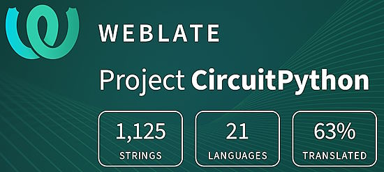](https://hosted.weblate.org/engage/circuitpython/)

One important feature of CircuitPython is translated control and error messages. With the help of fellow open source project [Weblate](https://weblate.org/), we're making it even easier to add or improve translations. 

Sign in with an existing account such as GitHub, Google or Facebook and start contributing through a simple web interface. No forks or pull requests needed! As always, if you run into trouble join us on [Discord](https://adafru.it/discord), we're here to help.

## ICYMI - In case you missed it

Python on hardware is the Adafruit Python video-newsletter-podcast! The news comes from the Python community, Discord, Adafruit communities and more and is broadcast on ASK an ENGINEER Wednesdays. The complete Python on Hardware weekly videocast [playlist is here](https://www.youtube.com/playlist?list=PLjF7R1fz_OOXRMjM7Sm0J2Xt6H81TdDev). The video podcast is on [iTunes](https://itunes.apple.com/us/podcast/python-on-hardware/id1451685192?mt=2), [YouTube](http://adafru.it/pohepisodes), [Instagram](https://www.instagram.com/adafruit/channel/)), and [XML](https://itunes.apple.com/us/podcast/python-on-hardware/id1451685192?mt=2).

[The weekly community chat on Adafruit Discord server CircuitPython channel - Audio / Podcast edition](https://itunes.apple.com/us/podcast/circuitpython-weekly-meeting/id1451685016) - Audio from the Discord chat space for CircuitPython, meetings are usually Mondays at 2pm ET, this is the audio version on [iTunes](https://itunes.apple.com/us/podcast/circuitpython-weekly-meeting/id1451685016), Pocket Casts, [Spotify](https://adafru.it/spotify), and [XML feed](https://adafruit-podcasts.s3.amazonaws.com/circuitpython_weekly_meeting/audio-podcast.xml).

## Contribute

The CircuitPython Weekly Newsletter is a CircuitPython community-run newsletter emailed every Monday. The complete [archives are here](https://www.adafruitdaily.com/category/circuitpython/). It highlights the latest CircuitPython related news from around the web including Python and MicroPython developments. To contribute, edit next week's draft [on GitHub](https://github.com/adafruit/circuitpython-weekly-newsletter/tree/gh-pages/_drafts) and [submit a pull request](https://help.github.com/articles/editing-files-in-your-repository/) with the changes. You may also tag your information on Twitter with #CircuitPython. 

Join the Adafruit [Discord](https://adafru.it/discord) or [post to the forum](https://forums.adafruit.com/viewforum.php?f=60) if you have questions.
