- [ ] Library and info updates
- [ ] change date
- [ ] update title
- [ ] Feature story
- [ ] Update  for images
- [ ] Update ICYDNCI
- [ ] All images 550w max only
- [ ] Link "View this email in your browser."

View this email in your browser. **Warning: Flashing Imagery**

Welcome to the latest Python on Microcontrollers newsletter! There is a steady stream of events through summer. Do check out the list in this newsletter and on [python.org](https://www.python.org/events/calendars/) to meet up with fellow enthusiasts. Lots of content in the newsletter this week, I hope you have the time to scan through to find things of interest. And we'd like to feature your news and projects, send links via email to cpnews(at)adafruit(dot)com anytime - *Anne Barela, Ed.*

We're on [Discord](https://discord.gg/HYqvREz), [Twitter](https://twitter.com/search?q=circuitpython&src=typed_query&f=live), and for past newsletters - [view them all here](https://www.adafruitdaily.com/category/circuitpython/). If you're reading this on the web, [subscribe here](https://www.adafruitdaily.com/). Here's the news this week:

## New Versions of Python Have Been Released

Several new versions of Python have been released by developers, including versions for Python 3.11, 3.12 and an alpha release of Python 3.13:

- [Python 3.11.9](https://pythoninsider.blogspot.com/2024/04/python-3119-is-now-available.html)
- [Python 3.12.3](https://pythoninsider.blogspot.com/2024/04/python-3123-and-3130a6-released.html)
- [Python 3.13.0a6](https://pythoninsider.blogspot.com/2024/04/python-3123-and-3130a6-released.html)

## 10 Gigabit Ethernet on Raspberry Pi 5

[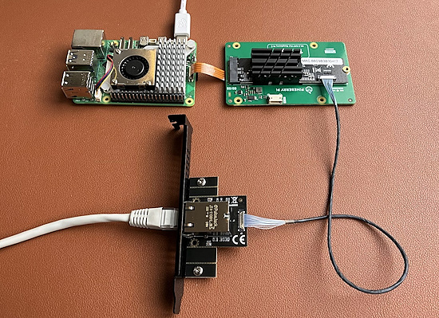](https://www.jiribrejcha.net/2024/03/10-gigabit-ethernet-on-raspberry-pi-5/)

Jiri Brejcha uses Pineberry’s HatDrive! Bottom for converting Pi’s PCIe connection to M.2 M-key format. With a Kalea-Informatique 10 Gigabit adapter attached, speeds of 3.5Gbps were achieved in PCIe Gen 2 (it wouldn't boot the unsupported Gen 3 mode) - [Jiri Brejcha](https://www.jiribrejcha.net/2024/03/10-gigabit-ethernet-on-raspberry-pi-5/) via [X](https://twitter.com/jiribrejcha/status/1769798639512105157).

## Using Thonny and Raspberry Pi Pico W on the Latest Chrome OS

[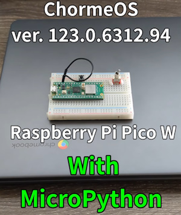](https://www.youtube.com/shorts/z9mpXCOvvP4)

@noelrecords-programming demonstrates developing with MicroPython on Chromebook and Raspberry Pi Pico W using a recent release of Chrome OS - [YouTube](https://www.youtube.com/shorts/z9mpXCOvvP4) via [X](https://twitter.com/NoelRecords_App/status/1776950023667999077) (Japanese).

## Making A Giant Retro Gaming Magic Mirror with a Raspberry Pi 5 and Python

David merges an impressive 65-inch touchscreen and a retro arcade machine into the single concept of a "magic mirror" using a Raspberry Pi 5 and Python - [Element14](https://community.element14.com/challenges-projects/element14-presents/project-videos/w/documents/29545/giant-retro-gaming-magic-mirror-with-a-raspberry-pi-5----episode-649?CMP=SOM-YOUTUBE-PRG-ELEMENT14PRESENTS-EP649-COMM) and [YouTube](https://youtu.be/CYEiDsiCqmo).

## The Official Raspberry Pi 15.6″ Monitor is Shown at Embedded World 2024

[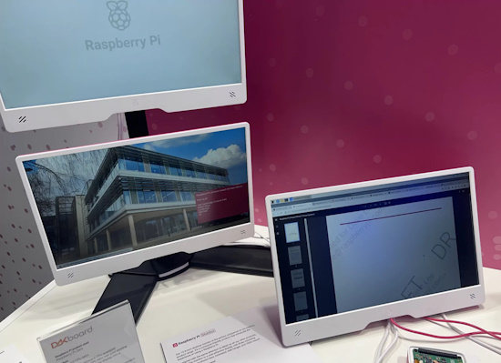](https://bret.dk/official-raspberry-pi-15-6-monitor/)

The new Official Raspberry Pi 15.6” Monitor was on display last week at Embedded World 2024 - [bret.dk](https://bret.dk/official-raspberry-pi-15-6-monitor/).

Basic specifications from an included data sheet:

- 15.6 inch IPS LCD Panel
- 1920×1080 Resolution (60Hz)
- Connection via HDMI
- Built-in Stereo Speakers
- 3.5mm Headphone Jack
- Powered via USB-C (1A at 5V required)
- Volume, brightness, and power buttons/controls
- VESA mount
- Kickstand for table-top use
- Wall hanger

## Automated Hardware Testing Using pytest

[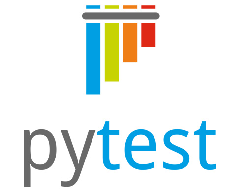](https://blog.golioth.io/automated-hardware-testing-using-pytest/)

[Pytest](https://docs.pytest.org/) is a framework for — you guessed it — testing! When working with embedded hardware you need to spend some time setting up fixtures that connect it to pytest. Once that’s in place, you’ll be surprised at how fast you can write tests for your firmware projects - [golioth](https://blog.golioth.io/automated-hardware-testing-using-pytest/).

## Raspberry Pi OS Now Shipping With Vulkan Support By Default

[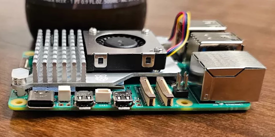](https://www.phoronix.com/news/Raspberry-Pi-OS-Default-V3DV)

For those running the official Raspberry Pi OS on Raspberry Pi 4 and 5 series single board computers, the Mesa V3DV Vulkan driver is now shipping by default to provide for a better out-of-the-box experience - [Phoronix](https://www.phoronix.com/news/Raspberry-Pi-OS-Default-V3DV).

## This Week's Python Streams

Python on Hardware is all about building a cooperative ecosphere which allows contributions to be valued and to grow knowledge. Below are the streams within the last week focusing on the community.

**CircuitPython Deep Dive Stream**

[Last Friday](https://www.youtube.com/watch?v=ezcgWLuPxFg), Scott streamed work on building CircuitPython with clang.

You can see the latest video and past videos on the Adafruit YouTube channel under the Deep Dive playlist - [YouTube](https://www.youtube.com/playlist?list=PLjF7R1fz_OOXBHlu9msoXq2jQN4JpCk8A).

**CircuitPython Parsec**

John Park’s CircuitPython Parsec this week is on Monitoring Battery Voltage - [Adafruit Blog](https://blog.adafruit.com/2024/04/12/john-parks-circuitpython-parsec-monitor-battery-voltage-adafruit-circuitpython/) and [YouTube](https://youtu.be/kIvFFO8u40o).

Catch all the episodes in the [YouTube playlist](https://www.youtube.com/playlist?list=PLjF7R1fz_OOWFqZfqW9jlvQSIUmwn9lWr).

**CircuitPython Weekly Meeting**

CircuitPython Weekly Meeting for April 8th, 2024 ([notes](https://github.com/adafruit/adafruit-circuitpython-weekly-meeting/blob/main/2024/2024-04-08.md)) [on YouTube](https://www.youtube.com/watch?v=5DAnahlqCLo).

## Project of the Week: A Robotic Arm With A Camera

[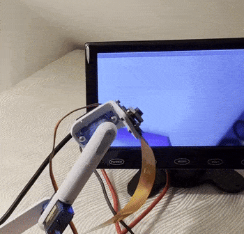](https://mastodon.social/@kevsmac/112226140573188214)

Kevin McAleer made a cute robot arm with a camera on the end. It uses inverse kinematics to keep the camera pointing forward. Adafruit CircuitPython for Linux is used running on a Raspberry Pi 5 - [Mastodon](https://mastodon.social/@kevsmac/112226140573188214) and [Twitter](https://twitter.com/kevsmac/status/1776706503208046967).

## Popular Last Week

What was the most popular, most clicked link, in [last week's newsletter](https://www.adafruitdaily.com/2024/04/08/python-on-microcontrollers-newsletter-python-on-hardware-news-youll-want-to-read-and-more-circuitpython-python-micropython-thepsf-raspberry_pi/)? [Comparing the Three Main Zero Form Factor SBC’s in the Market Right Now](https://www.youtube.com/watch?v=Fyet0-L1IWI).

## New Notes from Adafruit Playground

[Adafruit Playground](https://adafruit-playground.com/) is a new place for the community to post their projects and other making tips/tricks/techniques. Ad-free, it's an easy way to publish your work in a safe space for free.

[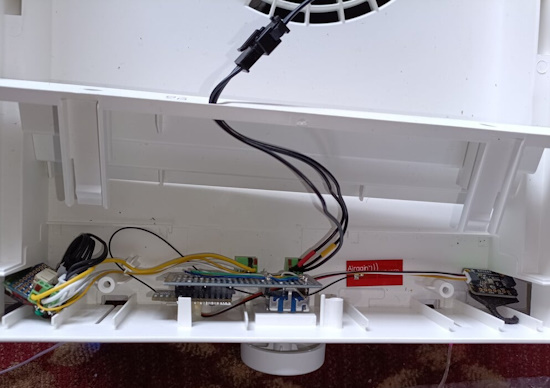](https://adafruit-playground.com/u/tyeth/pages/ikea-fornufig-air-purifier-v2-custom-fan-speed-controller-blinkenlights)

IKEA Förnufig Air Purifier V2 - Custom fan speed controller + Blinkenlights - [Adafruit Playground](https://adafruit-playground.com/u/tyeth/pages/ikea-fornufig-air-purifier-v2-custom-fan-speed-controller-blinkenlights).

[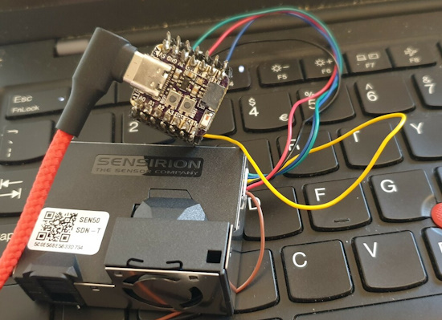](https://adafruit-playground.com/u/tyeth/pages/wippersnapper-sensirion-sen55-particulate-voc-nox-sensor-plus-an-educational-saga-in-the-quest-for-a-case)

Wippersnapper - Sensirion SEN55 Particulate/VOC/NOx sensor - [Adafruit Playground](https://adafruit-playground.com/u/tyeth/pages/wippersnapper-sensirion-sen55-particulate-voc-nox-sensor-plus-an-educational-saga-in-the-quest-for-a-case).

## News From Around the Web

[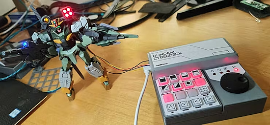](https://www.hackster.io/robpsf/gundam-cyberdeck-180cb1)

Making a Gundam Cyberdeck using Raspberry Pi Pico and CircuitPython - [hackster.io](https://www.hackster.io/robpsf/gundam-cyberdeck-180cb1) and [YouTube](https://youtu.be/y92gcVz35gY).

[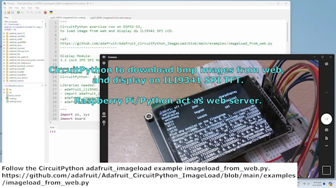](https://www.youtube.com/watch?v=di5K28rdOxM)

Use CircuitPython to download BMP images from the web and display them on an ILI9341 LCD display - [YouTube](https://www.youtube.com/watch?v=di5K28rdOxM) via [X](https://twitter.com/KcCoxxect/status/1777069685990957561).

[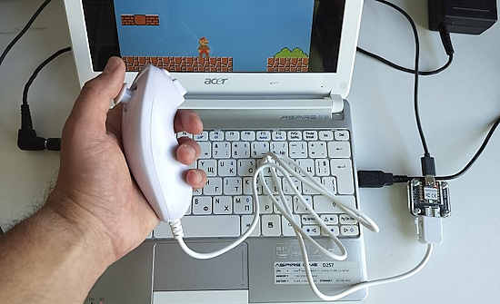](https://twitter.com/AnaviTechnology/status/1776956805475709044)

ANAVI Handle allows use of Wii Nunchuk-compatible controllers as USB HID peripherals using a Xiao RP2040 and CircuitPython - [X](https://twitter.com/AnaviTechnology/status/1776956805475709044) and [CrowdSupply](https://www.crowdsupply.com/anavi-technology/anavi-handle).

[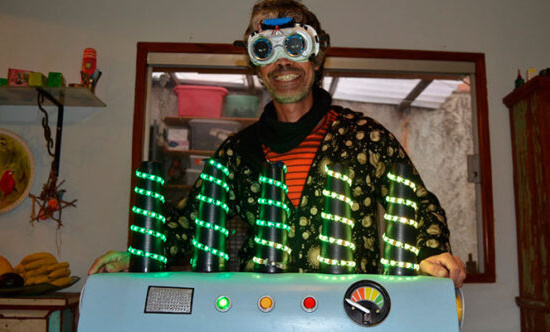](https://www.sescsp.org.br/programacao/capacitacao-em-eletronica-e-programacao-com-circuitpython/)

Class: Training in Electronics and Programming using CircuitPython with Djair Guilhermein, São Paulo, Brazil - [SESC São Paulo](https://www.sescsp.org.br/programacao/capacitacao-em-eletronica-e-programacao-com-circuitpython/).

[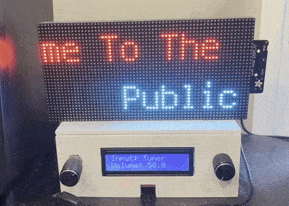](https://octodon.social/@prcutler@hachyderm.io/112238112136626695)

Paul Cutler updated his SongMatrix project to use CircuitPython 9. A Pi listens for what song is playing in the background and uses the Python Shazam library to identify it, sending it to Adafruit IO via MQTT, and a MatrixPortal listens for the MQTT message and displays the song info - [Mastodon](https://octodon.social/@prcutler@hachyderm.io/112238112136626695) and [GitHub](https://github.com/prcutler/songmatrix).

[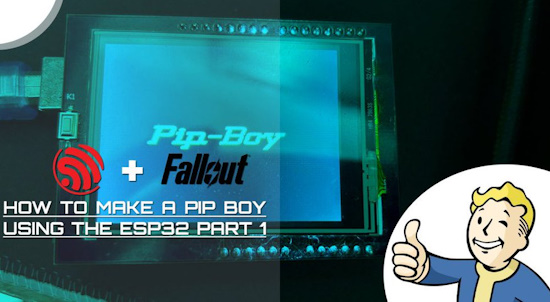](https://www.youtube.com/watch?v=a12odJv2LEg)

[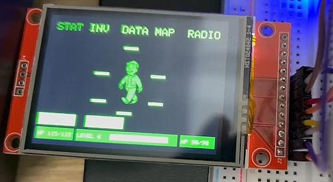](https://www.youtube.com/watch?v=a12odJv2LEg)

How to make a Pip Boy using ESP32 - [YouTube](https://www.youtube.com/watch?v=a12odJv2LEg) via [X](https://twitter.com/PAECMX/status/1777860840722485411) (Portuguese).

[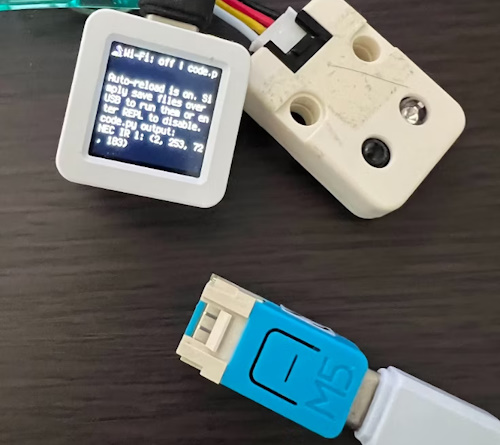](https://qiita.com/komde/items/e7755b11ab79e8713431)

Run CircuitPython on the [M5Stack NanoC6](https://shop.m5stack.com/products/m5stack-nanoc6-dev-kit) - [Qiita](https://qiita.com/komde/items/e7755b11ab79e8713431) (Japanese).

[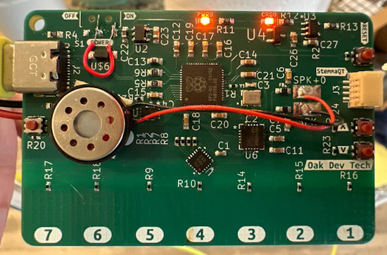](https://twitter.com/oakdevtech/status/1778575269974155357)

RPiano is an electronic musical instrument using an RP2040, AT42QT1070 touch sensor, Nuvaton I2S amp and Stemma QT port, programmed in CircuitPython - [X](https://twitter.com/oakdevtech/status/1778575269974155357).

[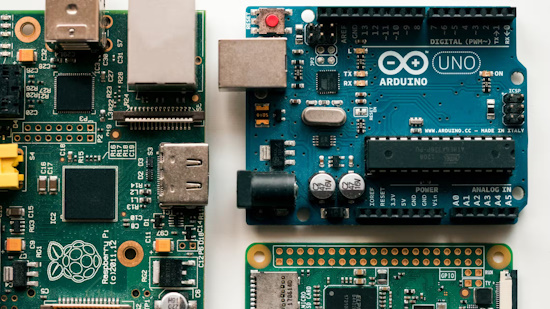](https://www.xda-developers.com/is-raspberry-pi-losing-its-spirit/)

Has the Raspberry Pi been a victim of its own success, losing the 'available to all' charm that made it so successful? - [XDA](https://www.xda-developers.com/is-raspberry-pi-losing-its-spirit/).

[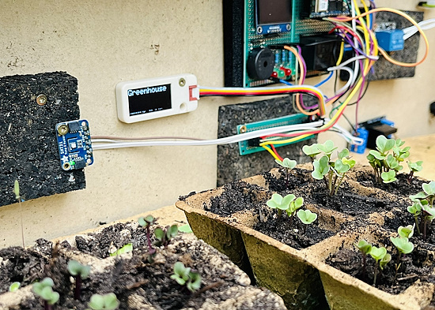](https://twitter.com/r_schulz_maker/status/1777737930183770472)

A greenhouse Arduino IoT Cloud project using an Adafruit SHT31 sensor and MicroPython - [X](https://twitter.com/r_schulz_maker/status/1777737930183770472).

Place calls from an A9G board using Raspberry Pi Pico W and MicroPython - [hackster.io](https://www.hackster.io/fusion_automate/place-calls-from-a9g-board-using-raspberry-pi-pico-w-0edaa6).

text - [site](url).

[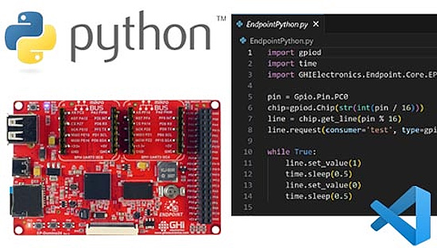](https://www.ghielectronics.com/2024/03/08/endpoint-now-support-python-3-10/)

Python 3.12 support has been added to the GHI Endpoint single board computer (SBC) - [GHI Electronics](https://www.ghielectronics.com/2024/03/08/endpoint-now-support-python-3-10/).

text - [site](url).

[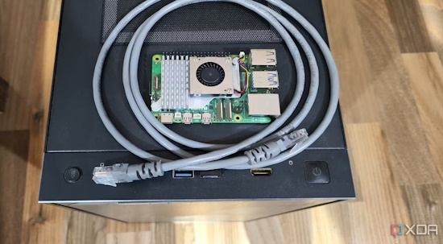](https://www.xda-developers.com/protect-network-with-raspberry-pi-firewall/)

How to protect your home network with a Raspberry Pi firewall - [XDA](https://www.xda-developers.com/protect-network-with-raspberry-pi-firewall/).

[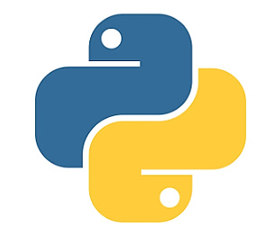](https://audiodiwhy.blogspot.com/2024/03/python-dsp-baby-steps.html)

Python: Digital Audio and DSP - Baby Steps - [AUDIODiWHY](https://audiodiwhy.blogspot.com/2024/03/python-dsp-baby-steps.html).

supernote-cloud-python: a Python wrapper for the unofficial [supernote cloud](https://support.supernote.com/en_US/Tools-Features/supernote-cloud) api - [GitHub](https://github.com/bwhitman/supernote-cloud-python).

How to make Cyberpunk “Dark Mode” data visualizations in Python - [Towards Data Science](https://towardsdatascience.com/how-to-make-cyberpunk-dark-mode-data-visualizations-in-python-b28f82386e75).

## New

[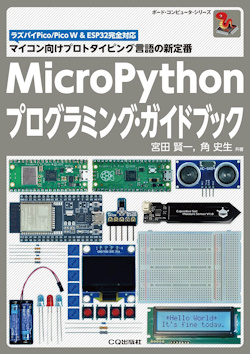](https://www.cqpub.co.jp/hanbai/books/44/44791.htm)

The MicroPython Programming Guidebook by Kenichi Miyata and Fumio Kado will be released April 23rd - [CQ Publishing](https://www.cqpub.co.jp/hanbai/books/44/44791.htm) (Japanese).

[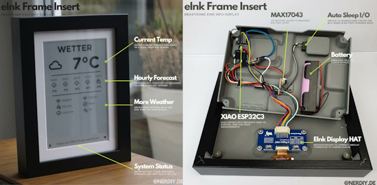](https://www.hackster.io/news/nerdiy-s-3d-printed-framework-turns-an-ikea-ribba-into-a-seeed-xiao-esp32c3-powered-epaper-dashboard-3d09f96f7936)

A 3D-printed framework from Nerdiy transforms an IKEA RIBBA into an ePaper dashboard powered by Seeed XIAO ESP32-C3 - [hackster.io](https://www.hackster.io/news/nerdiy-s-3d-printed-framework-turns-an-ikea-ribba-into-a-seeed-xiao-esp32c3-powered-epaper-dashboard-3d09f96f7936) via [X](https://twitter.com/seeedstudio/status/1777956135666073966).

## New Boards Supported by CircuitPython

The number of supported microcontrollers and Single Board Computers (SBC) grows every week. This section outlines which boards have been included in CircuitPython or added to [CircuitPython.org](https://circuitpython.org/).

This week there was one new board added:

- [Sunton ESP32-8048S070](https://circuitpython.org/board/sunton_esp32_8048S070/)

*Note: For non-Adafruit boards, please use the support forums of the board manufacturer for assistance, as Adafruit does not have the hardware to assist in troubleshooting.*

Looking to add a new board to CircuitPython? It's highly encouraged! Adafruit has four guides to help you do so:

- [How to Add a New Board to CircuitPython](https://learn.adafruit.com/how-to-add-a-new-board-to-circuitpython/overview)
- [How to add a New Board to the circuitpython.org website](https://learn.adafruit.com/how-to-add-a-new-board-to-the-circuitpython-org-website)
- [Adding a Single Board Computer to PlatformDetect for Blinka](https://learn.adafruit.com/adding-a-single-board-computer-to-platformdetect-for-blinka)
- [Adding a Single Board Computer to Blinka](https://learn.adafruit.com/adding-a-single-board-computer-to-blinka)

## Updated Learn Guides

[Pi Video Output Using pygame](https://learn.adafruit.com/pi-video-output-using-pygame) 

[Simple Raspberry Pi Robot](https://learn.adafruit.com/simple-raspberry-pi-robot)

## CircuitPython Libraries

The CircuitPython library numbers are continually increasing, while existing ones continue to be updated. Here we provide library numbers and updates!

To get the latest Adafruit libraries, download the [Adafruit CircuitPython Library Bundle](https://circuitpython.org/libraries). To get the latest community contributed libraries, download the [CircuitPython Community Bundle](https://circuitpython.org/libraries).

If you'd like to contribute to the CircuitPython project on the Python side of things, the libraries are a great place to start. Check out the [CircuitPython.org Contributing page](https://circuitpython.org/contributing). If you're interested in reviewing, check out Open Pull Requests. If you'd like to contribute code or documentation, check out Open Issues. We have a guide on [contributing to CircuitPython with Git and GitHub](https://learn.adafruit.com/contribute-to-circuitpython-with-git-and-github), and you can find us in the #help-with-circuitpython and #circuitpython-dev channels on the [Adafruit Discord](https://adafru.it/discord).

You can check out this [list of all the Adafruit CircuitPython libraries and drivers available](https://github.com/adafruit/Adafruit_CircuitPython_Bundle/blob/master/circuitpython_library_list.md). 

The current number of CircuitPython libraries is **481**!

**New Libraries**

Here's this week's new CircuitPython libraries:

  * [brushmate/CircuitPython_MCP48XX](https://github.com/brushmate/CircuitPython_MCP48XX)

**Updated Libraries**

Here's this week's updated CircuitPython libraries:

  * [adafruit/Adafruit_CircuitPython_Requests](https://github.com/adafruit/Adafruit_CircuitPython_Requests)
  * [jepler/Jepler_CircuitPython_udecimal](https://github.com/jepler/Jepler_CircuitPython_udecimal)
  * [elpekenin/circuitpython_toml](https://github.com/elpekenin/circuitpython_toml)

**Library PyPI Weekly Download Stats**

**Total Library Stats**

  * 217477 PyPI downloads over 325 libraries

**Top 10 Libraries by PyPI Downloads**

  * Adafruit CircuitPython Requests (adafruit-circuitpython-requests): 10107
  * Adafruit CircuitPython BusDevice (adafruit-circuitpython-busdevice): 9693
  * Adafruit CircuitPython ConnectionManager (adafruit-circuitpython-connectionmanager): 7677
  * Adafruit CircuitPython Register (adafruit-circuitpython-register): 2954
  * Adafruit CircuitPython framebuf (adafruit-circuitpython-framebuf): 2085
  * Adafruit CircuitPython RGB Display (adafruit-circuitpython-rgb-display): 2020
  * Adafruit CircuitPython MiniMQTT (adafruit-circuitpython-minimqtt): 1974
  * Adafruit CircuitPython Wiznet5k (adafruit-circuitpython-wiznet5k): 1894
  * Adafruit CircuitPython Display Text (adafruit-circuitpython-display-text): 1808
  * Adafruit CircuitPython ESP32SPI (adafruit-circuitpython-esp32spi): 1696

## What’s the CircuitPython team up to this week?

What is the team up to this week? Let’s check in:

**Dan**

I did some work on reducing "deprecation debt" this past week. In CircuitPython 8, we added the settings.toml file, and recommended using that instead of secrets.py to store WiFi credentials. We've been updating Learn Guides to use settings.toml gradually. But while helping a user, I found that all our AirLift-based Learn Guides were still using secrets.py, both in the shared "Internet Connect" example, and also in the AirLift project guide code.py files. I revised all the guides I found, several dozen in total, to use settings.toml. Soon I'll go back and find any remaining uses of secrets.py and fix those as well.

**Melissa**

This past week, I've continued addressing Raspberry Pi related guide feedback and updating guides as needed. These guides include [Adding a Real Time Clock to Raspberry Pi](https://learn.adafruit.com/adding-a-real-time-clock-to-raspberry-pi), [Adafruit RGB Matrix + Real Time Clock HAT for Raspberry Pi](https://learn.adafruit.com/adafruit-rgb-matrix-plus-real-time-clock-hat-for-raspberry-pi), [Simple Raspberry Pi Robot](https://learn.adafruit.com/simple-raspberry-pi-robot), [Pi Video Output Using pygame](https://learn.adafruit.com/pi-video-output-using-pygame), and [Pi Hole Ad Blocker with Pi Zero W](https://learn.adafruit.com/pi-hole-ad-blocker-with-pi-zero-w).

**Tim**

This week I finished up the refactoring inside of circup. It's now split up into more manageable sized chunks. While working in there I made changes to resolve a few issues. I've also made some changes inside of `circuitpython-build-tools` to make the examples inside the bundles get grouped into sub-directores by module, previously they were all put into one directory together. I'll be trying to add example loading capability to circup next now that those are grouped.

**Scott**

Last week I finished up my PyCascades talk. I came down with a cold so my recording from [Deep Dive](https://www.youtube.com/watch?v=epbn0SlKDNQ) may be easier to understand than my actual talk. Besides that, I've finished up the USB host featherwing support (Max3421E) in CircuitPython and [it was merged](https://github.com/adafruit/circuitpython/pull/9164). Check it out in the next 9.1.0 beta!

Next week I'll be at the [Embedded Open Source Summit](https://events.linuxfoundation.org/embedded-open-source-summit/). Reach out to me on Discord if you will be there and want to meet up!

**Liz**

This past week I published a [guide for the STEMMA Reflective Photo Interrupt Sensor](https://learn.adafruit.com/adafruit-stemma-reflective-photo-interrupt-sensor). This sensor is great at detecting objects and is easy to code with a simple digital input.

I also worked on code for two upcoming projects in Arduino. The first uses a Pico W with a DVI PiCowbell to display Adafruit IO feeds. The second uses the MAX3421E USB Host FeatherWing with an ESP32-S3 TFT Feather. The code takes in USB commands from a USB keyboard and sends them out via BLE, essentially converting a USB device to BLE. Both of these projects will be written up as guides soon.

## Upcoming Events

The next MicroPython Meetup in Melbourne will be on April 24th – [Meetup](https://www.meetup.com/micropython-meetup/events). You can see recordings of previous meetings on [YouTube](https://www.youtube.com/@MicroPythonOfficial). 

The 2024 Open Hardware Summit will be taking place May 3 & 4, 2024 at Concordia University and lespacemaker in Montreal, Canada - [oshwa.org](https://2024.oshwa.org/).

PyCon US 2024 launches May 15-23, 2024 in Pittsburgh, Pennsylvania US - [PyCon US](https://pycon.blogspot.com/2024/10/pycon-us-2024-launches.html).

Open Sauce, the Maker extravaganza, is returning to San Francisco, California June 15-16 - [Open Sauce](https://opensauce.live/).

EuroPython is the oldest and longest running volunteer-led Python programming conference on the planet. This year it will be held July 8-14 in Prague. Call for Proposals, the Mentorship Programme, and the Financial Aid Programme will be starting this month - [EuroPython 2024](https://ep2024.europython.eu/).

PyOhio is being held July 27-28, 2024 in Cleveland, Ohio. The organizing team welcomes you to [submit your proposals to the CfP](https://www.pyohio.org/2024/speaking/cfp/) by May 21st - [PyOhio](https://www.pyohio.org/2024/).

**Send Your Events In**

If you know of virtual events or upcoming events, please let us know via email to cpnews(at)adafruit(dot)com.

## Latest Releases

CircuitPython's stable release is [9.0.3](https://github.com/adafruit/circuitpython/releases/latest) and its unstable release is [9.1.0-beta.0](https://github.com/adafruit/circuitpython/releases). New to CircuitPython? Start with our [Welcome to CircuitPython Guide](https://learn.adafruit.com/welcome-to-circuitpython).

[20240411](https://github.com/adafruit/Adafruit_CircuitPython_Bundle/releases/latest) is the latest Adafruit CircuitPython library bundle.

[20240412](https://github.com/adafruit/CircuitPython_Community_Bundle/releases/latest) is the latest CircuitPython Community library bundle.

[v1.22.2](https://micropython.org/download) is the latest MicroPython release. Documentation for it is [here](http://docs.micropython.org/en/latest/pyboard/).

[3.12.3](https://www.python.org/downloads/) is the latest Python release. The latest pre-release version is [3.13.0a6](https://www.python.org/download/pre-releases/).

[3,882 Stars](https://github.com/adafruit/circuitpython/stargazers) Like CircuitPython? [Star it on GitHub!](https://github.com/adafruit/circuitpython)

## Call for Help -- Translating CircuitPython is now easier than ever

[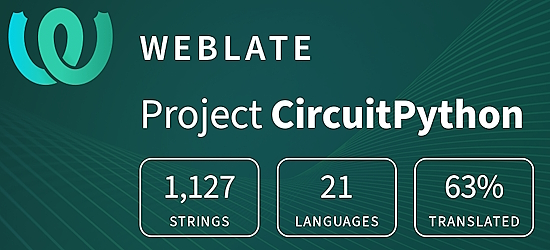](https://hosted.weblate.org/engage/circuitpython/)

One important feature of CircuitPython is translated control and error messages. With the help of fellow open source project [Weblate](https://weblate.org/), we're making it even easier to add or improve translations. 

Sign in with an existing account such as GitHub, Google or Facebook and start contributing through a simple web interface. No forks or pull requests needed! As always, if you run into trouble join us on [Discord](https://adafru.it/discord), we're here to help.

## 39,045 Thanks

The Adafruit Discord community, where we do all our CircuitPython development in the open, reached over 39,045 humans - thank you! Adafruit believes Discord offers a unique way for Python on hardware folks to connect. Join today at [https://adafru.it/discord](https://adafru.it/discord).

## ICYMI - In case you missed it

Python on hardware is the Adafruit Python video-newsletter-podcast! The news comes from the Python community, Discord, Adafruit communities and more and is broadcast on ASK an ENGINEER Wednesdays. The complete Python on Hardware weekly videocast [playlist is here](https://www.youtube.com/playlist?list=PLjF7R1fz_OOXRMjM7Sm0J2Xt6H81TdDev). The video podcast is on [iTunes](https://itunes.apple.com/us/podcast/python-on-hardware/id1451685192?mt=2), [YouTube](http://adafru.it/pohepisodes), [Instagram](https://www.instagram.com/adafruit/channel/)), and [XML](https://itunes.apple.com/us/podcast/python-on-hardware/id1451685192?mt=2).

[The weekly community chat on Adafruit Discord server CircuitPython channel - Audio / Podcast edition](https://itunes.apple.com/us/podcast/circuitpython-weekly-meeting/id1451685016) - Audio from the Discord chat space for CircuitPython, meetings are usually Mondays at 2pm ET, this is the audio version on [iTunes](https://itunes.apple.com/us/podcast/circuitpython-weekly-meeting/id1451685016), Pocket Casts, [Spotify](https://adafru.it/spotify), and [XML feed](https://adafruit-podcasts.s3.amazonaws.com/circuitpython_weekly_meeting/audio-podcast.xml).

## Contribute

The CircuitPython Weekly Newsletter is a CircuitPython community-run newsletter emailed every Monday. The complete [archives are here](https://www.adafruitdaily.com/category/circuitpython/). It highlights the latest CircuitPython related news from around the web including Python and MicroPython developments. To contribute, edit next week's draft [on GitHub](https://github.com/adafruit/circuitpython-weekly-newsletter/tree/gh-pages/_drafts) and [submit a pull request](https://help.github.com/articles/editing-files-in-your-repository/) with the changes. You may also tag your information on Twitter with #CircuitPython. 

Join the Adafruit [Discord](https://adafru.it/discord) or [post to the forum](https://forums.adafruit.com/viewforum.php?f=60) if you have questions.
