View this email in your browser. **Warning: Flashing Imagery**

Welcome to the latest Python on Microcontrollers newsletter! Big news which broke on Ask an Engineer: Espressif (ESP maker) is taking a stake in M5Stack. Arm and Sony already have invested in Raspberry Pi. New versions of the Raspberry Pi Compute Module 4S are now out. And an uptick in Python on Pi projects this issue. I hope you enjoy this week's coverage - *Anne Barela, Ed.*

We're on [Discord](https://discord.gg/HYqvREz), [Twitter](https://twitter.com/search?q=circuitpython&src=typed_query&f=live), and for past newsletters - [view them all here](https://www.adafruitdaily.com/category/circuitpython/). If you're reading this on the web, [subscribe here](https://www.adafruitdaily.com/). Here's the news this week:

## Espressif Acquires Majority Stake in M5Stack

Espressif Systems has announced its acquisition of a majority stake in M5Stack. [M5Stack](https://m5stack.com/) is renowned for its innovative approach to hardware development and offers a modular, open-source platform that simplifies the creation of IoT and embedded system solutions - [Espressif](https://www.espressif.com/en/news/Espressif_Acquires_M5Stack).

## Raspberry Pi Debuts the Compute Module 4S 2GB, 4GB, and 8GB Options

The new Compute Module 4S 2GB, 4GB, and 8GB options are based on the Raspberry Pi 4 architecture. They are designed for industrial customers who are migrating from Compute Module 3 or Compute Module 3+ - [Raspberry Pi](https://www.raspberrypi.com/news/new-memory-variants-for-the-raspberry-pi-compute-module-family/) and [hackster.io](https://www.hackster.io/news/raspberry-pi-expands-its-backwards-compatible-compute-module-4s-family-adds-more-ram-b9003cd1ff79).

## Identify Different Bird Species Using Raspberry Pi and Python

[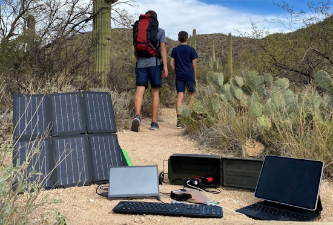](https://www.raspberrypi.com/news/a-bird-uses-raspberry-pi-to-identify-different-species-singing-at-the-same-time/)

Noah and Luca McGill bagged the “Coding with Commitment” Award at last month’s SARSEF (Southern Arizona Regional Science and Engineering Fair) with a Raspberry Pi-powered application of the BirdNET-Pi acoustic bird classification system: A-BiRD written in Python - [Project Brief](https://sarsef.org/wp-content/uploads/2023/02/Finnegans-Project-2022.pdf) (PDF) and [Raspberry Pi News](https://www.raspberrypi.com/news/a-bird-uses-raspberry-pi-to-identify-different-species-singing-at-the-same-time/).

## How the Raspberry Pi is Transforming Synthesizers

[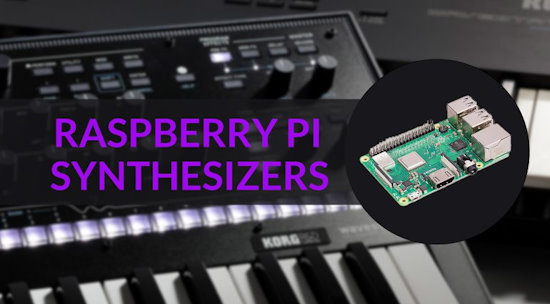](https://www.gearnews.com/raspberry-pi-synthesizers-how-the-pi-is-transforming-synths/)

The Raspberry Pi microcomputer is finding its way into more and more synthesizers. The biggest synthesizer manufacturer to make use of the Raspberry Pi is Korg. The Japanese synth company’s Wavestate, Modwave and Opsix digital synths all make use of the Raspberry Pi Compute Module - [GearNews](https://www.gearnews.com/raspberry-pi-synthesizers-how-the-pi-is-transforming-synths/).

## The CircuitPython Online IDE 2.0.0 beta is available

River Wang has released an alpha revision to the independently developed CircuitPython Online IDE (integrated development environment) which runs in a modern web browser. Issues from 2.0 alpha have been addressed. They’re looking for feedback - [Adafruit Blog](https://blog.adafruit.com/2024/04/24/the-circuitpython-online-ide-2-0-0-beta-is-available/) and [Editor](https://urfdvw.github.io/CircuitPython-online-IDE2/).

## I Turned My Raspberry Pi Into a Portable Computer — and you can too

[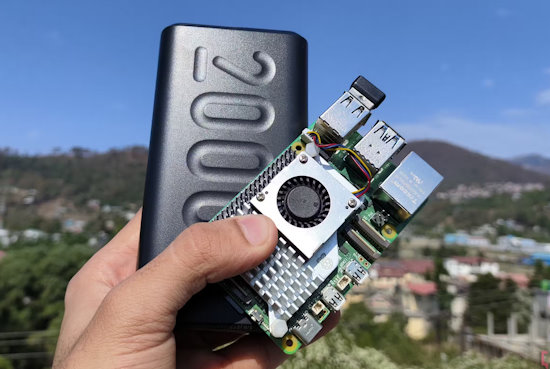](https://www.xda-developers.com/raspberry-pi-as-a-portable-device/)

The Raspberry Pi boards are some of the best SBCs for DIY projects, but there’s no reason to confine them within the bounds of your house. Thanks to their small size, it's entirely possible to slip these devices into your pocket and use them on the move - [XDA](https://www.xda-developers.com/raspberry-pi-as-a-portable-device/).

## This Week's Python Streams

Python on Hardware is all about building a cooperative ecosphere which allows contributions to be valued and to grow knowledge. Below are the streams within the last week focusing on the community.

**CircuitPython Deep Dive Stream**

[Last Friday](https://www.youtube.com/watch?v=65p4Wi-4na4), Scott streamed work on ESP USB Host and Renode.

You can see the latest video and past videos on the Adafruit YouTube channel under the Deep Dive playlist - [YouTube](https://www.youtube.com/playlist?list=PLjF7R1fz_OOXBHlu9msoXq2jQN4JpCk8A).

**CircuitPython Parsec**

John Park’s CircuitPython Parsec shows circup code examples - [Adafruit Blog](https://blog.adafruit.com/2024/04/26/john-parks-circuitpython-parsec-circup-code-examples-adafruit-circuitpython/) and [YouTube](https://youtu.be/J6-NYLCfHSE).

Catch all the episodes in the [YouTube playlist](https://www.youtube.com/playlist?list=PLjF7R1fz_OOWFqZfqW9jlvQSIUmwn9lWr).

**CircuitPython Weekly Meeting**

CircuitPython Weekly Meeting for Monday, April 22, 2024 ([notes](https://github.com/adafruit/adafruit-circuitpython-weekly-meeting/blob/main/2024/2024-04-22.md)) [on YouTube](https://youtu.be/TmFugF2c4mk).

## Project of the Week: A Pimoroni Inky Impression eInk Weather Station

[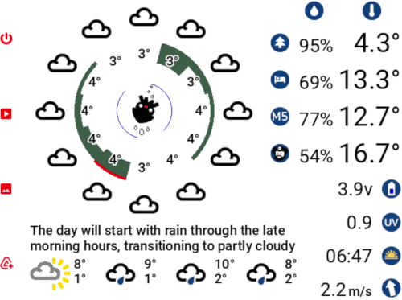](https://github.com/arnoldwells/weatherstation?tab=readme-ov-file)

The weather station runs on a Raspberry Pi Zero and displays weather forecast and sensor data. It retrieves the weather data from [openweathermap.org](https://openweathermap.org/) and stores and retrieves data from [io.adafruit.com](https://io.adafruit.com/) - [GitHub](https://github.com/arnoldwells/weatherstation?tab=readme-ov-file).

## Popular Last Week

What was the most popular, most clicked link, in [last week's newsletter](https://www.adafruitdaily.com/2024/04/22/python-on-microcontrollers-newsletter-esp-now-in-python-new-circuitpython-versions-rust-vs-micropython-more-circuitpython-python-micropython-thepsf-raspberry_pi/)? [Meet the NiceGUI: Your Soon-to-be Favorite Python UI Library](https://towardsdatascience.com/meet-the-nicegui-your-soon-to-be-favorite-python-ui-library-fb69f14bb0ac).

## New Notes from Adafruit Playground

[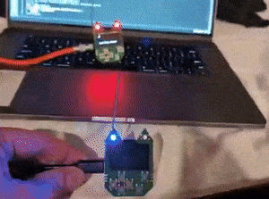](https://twitter.com/KodyKinzie/status/1783789982551065014)

Transmitting rickrolls over LoRa with CircuitPython and a custom backpack for the Nugget - [X](https://twitter.com/KodyKinzie/status/1783789982551065014).

[Adafruit Playground](https://adafruit-playground.com/) is a new place for the community to post their projects and other making tips/tricks/techniques. Ad-free, it's an easy way to publish your work in a safe space for free.

[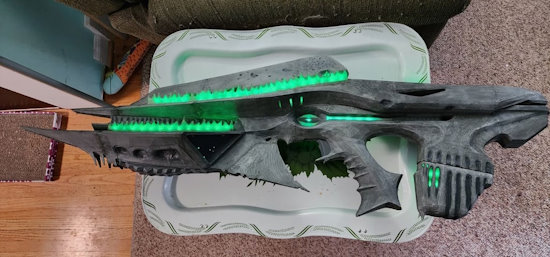](https://adafruit-playground.com/u/omnifarious50/pages/the-necrochasm-pushing-the-prop-maker-rp2040-to-its-limit)

The Necrochasm: Pushing the Prop-Maker RP2040 to its limit - [Adafruit Playground](https://adafruit-playground.com/u/omnifarious50/pages/the-necrochasm-pushing-the-prop-maker-rp2040-to-its-limit).

An update to the Firewalker Sneakers with RP2040 - [Adafruit Playground](https://adafruit-playground.com/u/FractalFish/pages/better-shoes).

## News From Around the Web

Simple-MicroPython-Webserver is a MicroPython module to aid in setting up a simple webserver. Testing was done on a Raspberry Pi Pico W. This module allows the use of separate HTML, JavaScript and CSS files - [GitHub](https://github.com/owainm713/Simple-MicroPython-Webserver).

[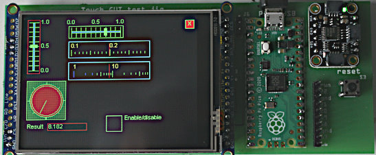](https://github.com/peterhinch/micropython-touch)

micropython-touch is a lightweight, portable, MicroPython GUI library for displays having a touch interface and with drivers subclassed from framebuf - [GitHub](https://github.com/peterhinch/micropython-touch).

[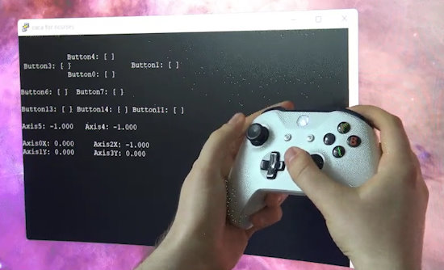](https://www.hackster.io/sarakit/xbox-pad-control-for-raspberry-pi-projects-9a2b97)

Xbox pad control for Raspberry Pi projects and Python - [hackster.io](https://www.hackster.io/sarakit/xbox-pad-control-for-raspberry-pi-projects-9a2b97).

[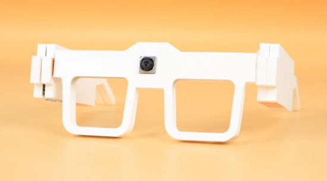](https://www.instructables.com/Sign-Language-Translator-Spectacle/)

Sign language translator spectacles with Raspberry Pi and Python - [Instructables](https://www.instructables.com/Sign-Language-Translator-Spectacle/).

[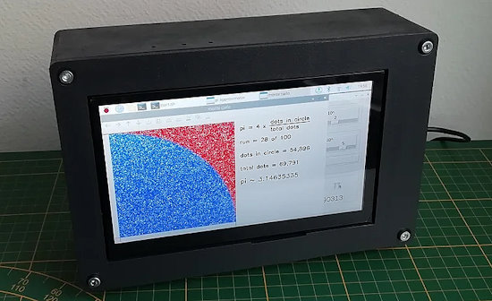](https://www.instructables.com/Pi-Approximation-With-Raspberry-Pi-Monte-Carlo-Met/)

Pi approximation with a Raspberry Pi using a Monte Carlo method coded in Python - [Instructables](https://www.instructables.com/Pi-Approximation-With-Raspberry-Pi-Monte-Carlo-Met/).

CircuitPython exercise to draw line and rect - [YouTube](https://www.youtube.com/shorts/fbjSZBTykY4).

[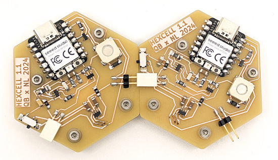](https://gitlab.cba.mit.edu/quentinbolsee/hexcell)

Microquine: self-replicating microcontroller code with MicroPython - [GitHub](https://gitlab.cba.mit.edu/quentinbolsee/hexcell).

A personal, wireless ESP32 Arduino/Raspberry Pi database using Python - [Instructables](https://www.instructables.com/A-Personal-Wireless-ESP32-ArduinoRaspberry-Pi-Data/).

[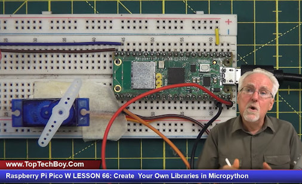](https://www.youtube.com/watch?v=lz_Gp-zDtKI)

Raspberry Pi Pico W: Create Your Own Libraries in Micropython - [YouTube](https://www.youtube.com/watch?v=lz_Gp-zDtKI).

[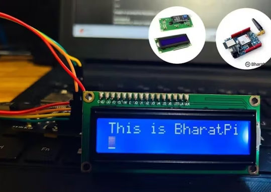](https://www.hackster.io/bharatpi/exploring-lcd-sensors-with-micropython-on-bharat-piexploring-9f2f7a)

Exploring LCD Sensors with MicroPython on Bharat PiExploring - [hackster.io](https://www.hackster.io/bharatpi/exploring-lcd-sensors-with-micropython-on-bharat-piexploring-9f2f7a).

[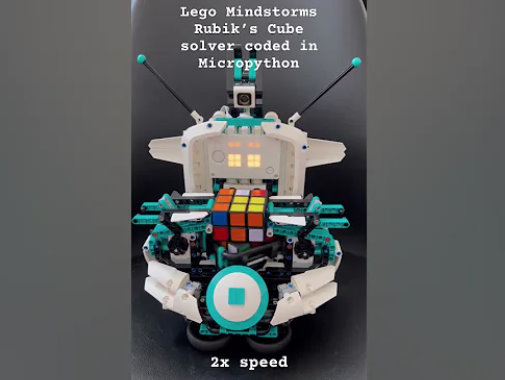](https://www.youtube.com/shorts/fhpwnSIfUmM)

A Lego Rubik’s cube solver programmed in Micropython - [YouTube](https://www.youtube.com/shorts/fhpwnSIfUmM).

[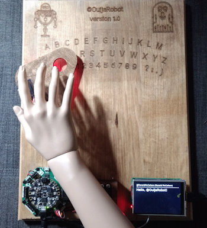](https://hackaday.io/project/165445-ouija-robot)

Ouija Robot: a disembodied arm that spells out messages with an Adafruit Cricket - [hackaday.io](https://hackaday.io/project/165445-ouija-robot).

Fake job interviews target developers with new Python backdoor - [BleepingComputer](https://www.bleepingcomputer.com/news/security/fake-job-interviews-target-developers-with-new-python-backdoor/).

[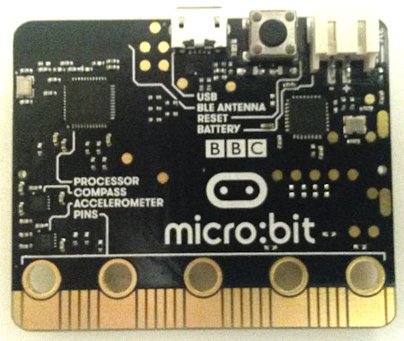](https://www.instructables.com/BBC-Microbit-Power-Usage-Mu-an-Off-line-MicroPytho/)

BBC Micro:bit – Power usage and Mu (an offline MicroPython editor) - [Instructables](https://www.instructables.com/BBC-Microbit-Power-Usage-Mu-an-Off-line-MicroPytho/).

[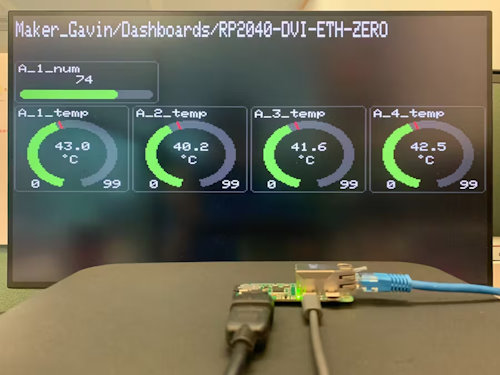](https://www.hackster.io/gavinchiong/rp2040-eth-dvi-zero-adafruit-io-dashboard-monitor-1b8b3b)

RP2040-ETH-DVI-ZERO: Making an Adafruit IO dashboard monitor - [hackster.io](https://www.hackster.io/gavinchiong/rp2040-eth-dvi-zero-adafruit-io-dashboard-monitor-1b8b3b).

Invent - an app framework for beginners - [GitHub](https://github.com/invent-framework/invent).

Hopper Chat, a Raspberry Pi based Chatbot (LLM) based voice assistance and smart speaker - [GitHub](https://github.com/ShawnHymel/hopper-chat).

[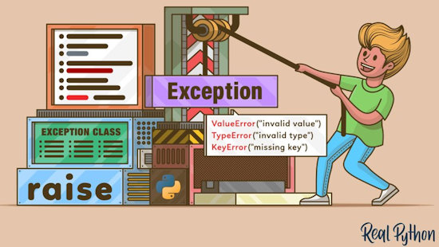](https://realpython.com/courses/using-raise-for-effective-exceptions/)

Using `raise` for effective exceptions - [Real Python](https://realpython.com/courses/using-raise-for-effective-exceptions/).

## New

[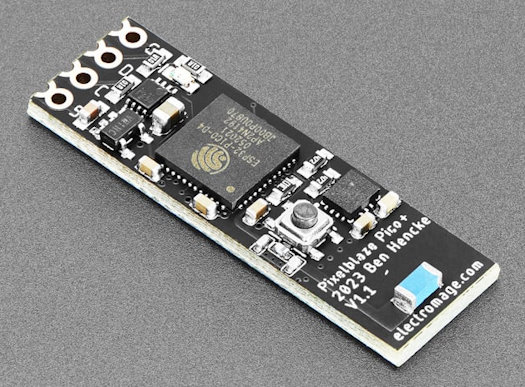](https://www.adafruit.com/product/5943)

Pixelblaze is a Wi-Fi Addressable LED Controller and Custom Pattern Editor, powered by an ESP32 module with 240Mhz dual-core processor for 'blazingly fast' pixel rendering capabilities. Pixelblaze V3 Pico which is the smallest and most powerful LED controller - [Adafruit](https://www.adafruit.com/product/5943).

ESP32-POE2 Open Source Hardware PoE IoT board provides up to 25W power supply to external circuits - [olimex](https://olimex.wordpress.com/2024/04/25/esp32-poe2-open-source-hardware-poe-iot-board-provides-up-to-25w-power-supply-to-external-circuits/).

[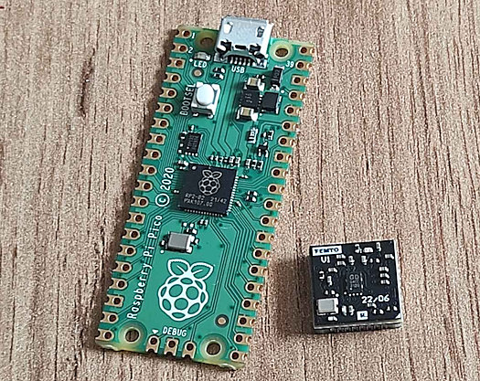](https://hackaday.io/project/186871-femto-module-v1)

Femto is a ultra compact RP2040 module - [hackaday.io](https://hackaday.io/project/186871-femto-module-v1).
- small footprint 12x12mm,
- all 30 GPIO pins connected,
- stamp form factor

## New Boards Supported by CircuitPython

The number of supported microcontrollers and Single Board Computers (SBC) grows every week. This section outlines which boards have been included in CircuitPython or added to [CircuitPython.org](https://circuitpython.org/).

This week, there were two new boards added:

- [ESP32S3-LCD-1.28](https://circuitpython.org/board/waveshare_esp32_s3_lcd_1_28/)
- [Watchy](https://circuitpython.org/board/sqfmi_watchy/)

*Note: For non-Adafruit boards, please use the support forums of the board manufacturer for assistance, as Adafruit does not have the hardware to assist in troubleshooting.*

Looking to add a new board to CircuitPython? It's highly encouraged! Adafruit has four guides to help you do so:

- [How to Add a New Board to CircuitPython](https://learn.adafruit.com/how-to-add-a-new-board-to-circuitpython/overview)
- [How to add a New Board to the circuitpython.org website](https://learn.adafruit.com/how-to-add-a-new-board-to-the-circuitpython-org-website)
- [Adding a Single Board Computer to PlatformDetect for Blinka](https://learn.adafruit.com/adding-a-single-board-computer-to-platformdetect-for-blinka)
- [Adding a Single Board Computer to Blinka](https://learn.adafruit.com/adding-a-single-board-computer-to-blinka)

## CircuitPython Libraries

The CircuitPython library numbers are continually increasing, while existing ones continue to be updated. Here we provide library numbers and updates!

To get the latest Adafruit libraries, download the [Adafruit CircuitPython Library Bundle](https://circuitpython.org/libraries). To get the latest community contributed libraries, download the [CircuitPython Community Bundle](https://circuitpython.org/libraries).

If you'd like to contribute to the CircuitPython project on the Python side of things, the libraries are a great place to start. Check out the [CircuitPython.org Contributing page](https://circuitpython.org/contributing). If you're interested in reviewing, check out Open Pull Requests. If you'd like to contribute code or documentation, check out Open Issues. We have a guide on [contributing to CircuitPython with Git and GitHub](https://learn.adafruit.com/contribute-to-circuitpython-with-git-and-github), and you can find us in the #help-with-circuitpython and #circuitpython-dev channels on the [Adafruit Discord](https://adafru.it/discord).

You can check out this [list of all the Adafruit CircuitPython libraries and drivers available](https://github.com/adafruit/Adafruit_CircuitPython_Bundle/blob/master/circuitpython_library_list.md). 

The current number of CircuitPython libraries is **482**!

**Updated Libraries**

Here's this week's updated CircuitPython libraries:

  * [adafruit/Adafruit_CircuitPython_BusDevice](https://github.com/adafruit/Adafruit_CircuitPython_BusDevice)
  * [adafruit/Adafruit_CircuitPython_ConnectionManager](https://github.com/adafruit/Adafruit_CircuitPython_ConnectionManager)
  * [adafruit/Adafruit_CircuitPython_RSA](https://github.com/adafruit/Adafruit_CircuitPython_RSA)

**Library PyPI Weekly Download Stats**

**Total Library Stats**

  * 153810 PyPI downloads over 326 libraries

**Top 10 Libraries by PyPI Downloads**

  * Adafruit CircuitPython BusDevice (adafruit-circuitpython-busdevice): 9868
  * Adafruit CircuitPython Requests (adafruit-circuitpython-requests): 9429
  * Adafruit CircuitPython ConnectionManager (adafruit-circuitpython-connectionmanager): 8108
  * Adafruit CircuitPython Register (adafruit-circuitpython-register): 2554
  * Adafruit CircuitPython Wiznet5k (adafruit-circuitpython-wiznet5k): 2421
  * Adafruit CircuitPython framebuf (adafruit-circuitpython-framebuf): 1578
  * Adafruit CircuitPython RGB Display (adafruit-circuitpython-rgb-display): 1415
  * Adafruit CircuitPython MiniMQTT (adafruit-circuitpython-minimqtt): 1330
  * Adafruit CircuitPython SharpMemoryDisplay (adafruit-circuitpython-sharpmemorydisplay): 1185
  * Adafruit CircuitPython Display Text (adafruit-circuitpython-display-text): 1123

## What’s the CircuitPython team up to this week?

What is the team up to this week? Let’s check in:

**Dan**

When a UART device was initialized on ESP32-S3 or ESP32-C3, it could receive a junk byte as the first byte. I fixed this by clearing the input buffer after waiting a short time, based on the baud rate.

I'm now working on adding a user-settable timeout for the socket connect() operation on WiFi-capable boards, to match what is available in CPython. The `lwip` library we use does not support this natively, but it's not too hard to do this "manually".

**Melissa**

This past week I continued working on updating guides. I finished updating the [Turning your Raspberry Pi Zero into a USB Gadget](https://learn.adafruit.com/turning-your-raspberry-pi-zero-into-a-usb-gadget) guide and addressed feedback in a couple of other guides with only minor changes.

**Tim**

I've been testing many networking PRs in the Wiznet and Requests libraries. This week a new version of Circup was released with the new circup example command that loads examples from circuitpython libraries in the bundle. I'm hoping to make changes in the build-tools or the bundle actions to generate and cache a copy of the examples listing. That could then be fetched from the bundle release page to populate example loading utilities like this one in circup and perhaps some other more visual ones. 

**Scott**

Last week I went to the Zephyr Dev Summit and met a bunch of embedded folks. One group of folks were from [Antmicro](https://antmicro.com/) who make [Renode](https://renode.io/), a microcontroller emulator. I've made [a CircuitPython port to Renode](https://github.com/adafruit/circuitpython/pull/9199) so that we can test CircuitPython in the emulator. It makes it much easier to monitor execution and memory access than real hardware.

Now that I'm back from ZDS, I'm getting my teeth into BLE support on ESP chips that support it. Specifically, we don't currently support GATT Server which allows the device to present functionality to another device. We can only do GATT Client now which reads from the other device. I hope to finish support for BLE in ESP so it matches the support on the nRF52840..

## Upcoming Events

The 2024 Open Hardware Summit will be taking place May 3 & 4, 2024 at Concordia University and lespacemaker in Montreal, Canada - [oshwa.org](https://2024.oshwa.org/).

PyCon US 2024 launches May 15-23, 2024 in Pittsburgh, Pennsylvania US - [PyCon US](https://pycon.blogspot.com/2024/10/pycon-us-2024-launches.html).

The next MicroPython Meetup in Melbourne will be on May 22nd – [Meetup](https://www.meetup.com/micropython-meetup/events). You can see recordings of previous meetings on [YouTube](https://www.youtube.com/@MicroPythonOfficial). 

Open Sauce, the Maker extravaganza, is returning to San Francisco, California June 15-16 - [Open Sauce](https://opensauce.live/).

EuroPython is the oldest and longest running volunteer-led Python programming conference on the planet. This year it will be held July 8-14 in Prague - [EuroPython 2024](https://ep2024.europython.eu/).

PyOhio is being held July 27-28, 2024 in Cleveland, Ohio - [PyOhio](https://www.pyohio.org/2024/).

**Send Your Events In**

If you know of virtual events or upcoming events, please let us know via email to cpnews(at)adafruit(dot)com.

## Latest Releases

CircuitPython's stable release is [9.0.4](https://github.com/adafruit/circuitpython/releases/latest) and its unstable release is [9.1.0-beta.1](https://github.com/adafruit/circuitpython/releases). New to CircuitPython? Start with our [Welcome to CircuitPython Guide](https://learn.adafruit.com/welcome-to-circuitpython).

[20240426](https://github.com/adafruit/Adafruit_CircuitPython_Bundle/releases/latest) is the latest Adafruit CircuitPython library bundle.

[20240412](https://github.com/adafruit/CircuitPython_Community_Bundle/releases/latest) is the latest CircuitPython Community library bundle.

[v1.22.2](https://micropython.org/download) is the latest MicroPython release. Documentation for it is [here](http://docs.micropython.org/en/latest/pyboard/).

[3.12.3](https://www.python.org/downloads/) is the latest Python release. The latest pre-release version is [3.13.0a6](https://www.python.org/download/pre-releases/).

[3,893 Stars](https://github.com/adafruit/circuitpython/stargazers) Like CircuitPython? [Star it on GitHub!](https://github.com/adafruit/circuitpython)

## Call for Help -- Translating CircuitPython is now easier than ever

[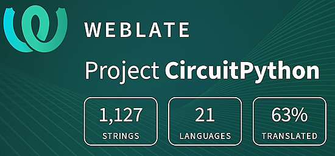](https://hosted.weblate.org/engage/circuitpython/)

One important feature of CircuitPython is translated control and error messages. With the help of fellow open source project [Weblate](https://weblate.org/), we're making it even easier to add or improve translations. 

Sign in with an existing account such as GitHub, Google or Facebook and start contributing through a simple web interface. No forks or pull requests needed! As always, if you run into trouble join us on [Discord](https://adafru.it/discord), we're here to help.

## 39,133 Thanks

The Adafruit Discord community, where we do all our CircuitPython development in the open, reached over 39,133 humans - thank you! Adafruit believes Discord offers a unique way for Python on hardware folks to connect. Join today at [https://adafru.it/discord](https://adafru.it/discord).

## ICYMI - In case you missed it

Python on hardware is the Adafruit Python video-newsletter-podcast! The news comes from the Python community, Discord, Adafruit communities and more and is broadcast on ASK an ENGINEER Wednesdays. The complete Python on Hardware weekly videocast [playlist is here](https://www.youtube.com/playlist?list=PLjF7R1fz_OOXRMjM7Sm0J2Xt6H81TdDev). The video podcast is on [iTunes](https://itunes.apple.com/us/podcast/python-on-hardware/id1451685192?mt=2), [YouTube](http://adafru.it/pohepisodes), [Instagram](https://www.instagram.com/adafruit/channel/)), and [XML](https://itunes.apple.com/us/podcast/python-on-hardware/id1451685192?mt=2).

[The weekly community chat on Adafruit Discord server CircuitPython channel - Audio / Podcast edition](https://itunes.apple.com/us/podcast/circuitpython-weekly-meeting/id1451685016) - Audio from the Discord chat space for CircuitPython, meetings are usually Mondays at 2pm ET, this is the audio version on [iTunes](https://itunes.apple.com/us/podcast/circuitpython-weekly-meeting/id1451685016), Pocket Casts, [Spotify](https://adafru.it/spotify), and [XML feed](https://adafruit-podcasts.s3.amazonaws.com/circuitpython_weekly_meeting/audio-podcast.xml).

## Contribute

The CircuitPython Weekly Newsletter is a CircuitPython community-run newsletter emailed every Monday. The complete [archives are here](https://www.adafruitdaily.com/category/circuitpython/). It highlights the latest CircuitPython related news from around the web including Python and MicroPython developments. To contribute, edit next week's draft [on GitHub](https://github.com/adafruit/circuitpython-weekly-newsletter/tree/gh-pages/_drafts) and [submit a pull request](https://help.github.com/articles/editing-files-in-your-repository/) with the changes. You may also tag your information on Twitter with #CircuitPython. 

Join the Adafruit [Discord](https://adafru.it/discord) or [post to the forum](https://forums.adafruit.com/viewforum.php?f=60) if you have questions.
