View this email in your browser. **Warning: Flashing Imagery**

Welcome to the latest Python on Microcontrollers newsletter! The Open Hardware Summit is just wrapping up and we'll look to check individual videos when available. How time flies: MicroPython is now 11 years old and better than ever. And an expanded projects and news section this week looks to showcase all that's happening in the community. - *Anne Barela, Ed.*

We're on [Discord](https://discord.gg/HYqvREz), [Twitter](https://twitter.com/search?q=circuitpython&src=typed_query&f=live), and for past newsletters - [view them all here](https://www.adafruitdaily.com/category/circuitpython/). If you're reading this on the web, [subscribe here](https://www.adafruitdaily.com/). Here's the news this week:

## MicroPython is Now 11 Years Old

MicroPython has turned eleven, having started in 2013 - [X](https://twitter.com/micropython/status/1784874073329180975).

> “MicroPython started life in early 2013 as an experiment, to see if it was possible to shrink a high-level language like Python down enough to run on very small devices. Now MicroPython is a mature open-source project that is relied upon by a wide variety of users."

## Talk: Build Wireless Products Faster with Zephyr and MicroPython

[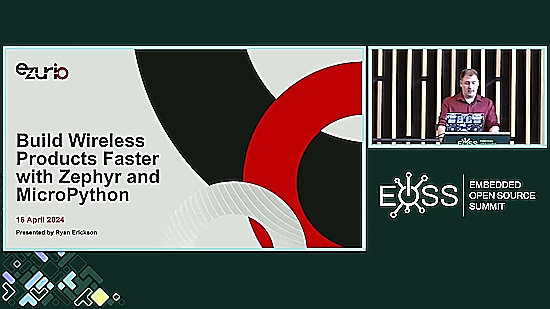](https://www.youtube.com/watch?v=Y2v6Eh8X8iA)

Build Wireless Products Faster with Zephyr and MicroPython - Ryan Erickson, Ezurio - [YouTube](https://www.youtube.com/watch?v=Y2v6Eh8X8iA).

## CircuitPython vs. Arduino’s C++ Language for ESP32: A Comparative Analysis

[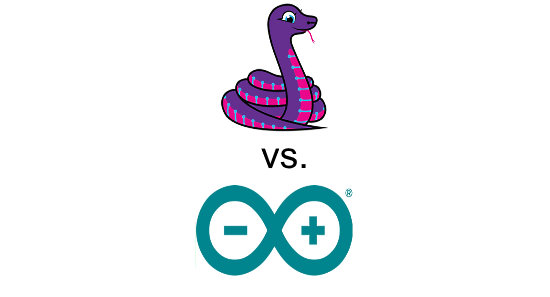](https://thecustomizewindows.com/2024/04/circuitpython-vs-arduinos-c-language-for-esp32-a-comparative-analysis/)

CircuitPython (offered by Adafruit) and Arduino’s C++ language (offered by Arduino with Arduino IDE) stand out as popular choices for DIY projects, prototyping, and educational purposes. Both platforms offer powerful capabilities for developing interactive hardware projects, but they differ significantly in terms of programming language, ease of use, and ecosystem support - [The Customize Windows](https://thecustomizewindows.com/2024/04/circuitpython-vs-arduinos-c-language-for-esp32-a-comparative-analysis/).

## 3 Things Arduino Can Do That Raspberry Pi Can't

Looking to use a Raspberry Pi in your project? Instead of a single board computer, you might look at a microcontroller. Besides there being no operating system to maintain, read about other advantages - [Slashgear](https://www.slashgear.com/1568342/what-arduino-can-do-that-raspberry-pi-cant/).

## The Adafruit Learning System Exceeds 3,000 Guides

[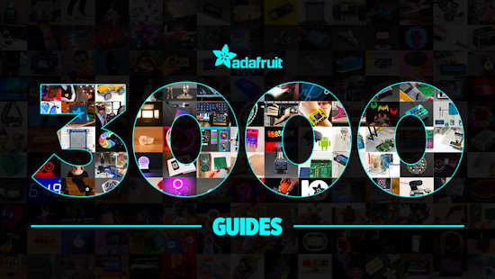](https://blog.adafruit.com/2024/04/03/the-adafruit-learning-system-has-over-3000-guides-thank-you-adafruit-adafruit/)

Recently, the Adafruit Learning System surpassed 3,000 guides! Thank you to the entire team at Adafruit who builds and makes learn.adafruit.com, one of the best resources online for learning CircuitPython & Python and more - [Adafruit Learning System](https://learn.adafruit.com/) and read about reaching 3k in the [Adafruit Blog](https://blog.adafruit.com/2024/04/03/the-adafruit-learning-system-has-over-3000-guides-thank-you-adafruit-adafruit/).

## Raspberry Pi 5 vs Intel N100 mini PC comparison

[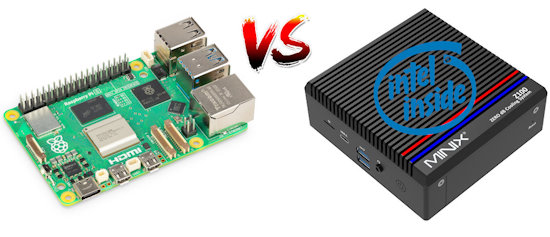](https://www.cnx-software.com/2024/04/29/raspberry-pi-5-intel-n100-mini-pc-comparison-features-benchmarks-price/)

The Raspberry Pi 5 Arm SBC is now powerful enough to challenge some Intel systems in terms of performance. Intel has made the Alder Lake-N family, notably the Intel Processor N100, inexpensive and efficient enough to challenge Arm systems when it comes to price, form factor, and power consumption - [CNX Software](https://www.cnx-software.com/2024/04/29/raspberry-pi-5-intel-n100-mini-pc-comparison-features-benchmarks-price/).

## The PSF's 2023 Annual Impact Report is Available

[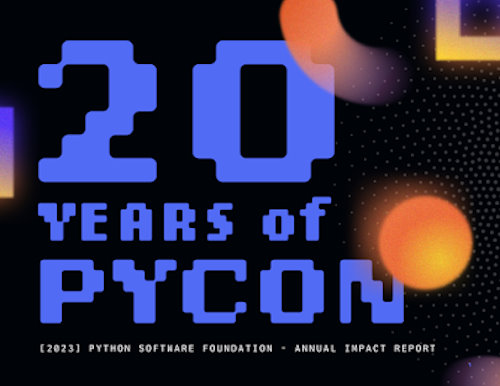](url)

The Python Software Foundation (PSF) has captured some of the key numbers, details, and information on the last year in their latest Annual Impact Report - [Report Slides](https://www.python.org/psf/annual-report/2023/) and [Python Software Foundation](https://pyfound.blogspot.com/2024/05/the-psfs-2023-annual-impact-report-is.html).

## This Week's Python Streams

Python on Hardware is all about building a cooperative ecosphere which allows contributions to be valued and to grow knowledge. Below are the streams within the last week focusing on the community.

**CircuitPython Deep Dive Stream**

[Last Friday](https://www.youtube.com/watch?v=3lfj_O88Egg), Scott streamed work on Espressif ESP Bluetooth Low Energy (BLE) debugging.

You can see the latest video and past videos on the Adafruit YouTube channel under the Deep Dive playlist - [YouTube](https://www.youtube.com/playlist?list=PLjF7R1fz_OOXBHlu9msoXq2jQN4JpCk8A).

**CircuitPython Parsec**

John Park’s CircuitPython Parsec this week is on circup code examples - [Adafruit Blog](https://blog.adafruit.com/2024/04/26/john-parks-circuitpython-parsec-circup-code-examples-adafruit-circuitpython/) and [YouTube](https://youtu.be/J6-NYLCfHSE).

Catch all the episodes in the [YouTube playlist](https://www.youtube.com/playlist?list=PLjF7R1fz_OOWFqZfqW9jlvQSIUmwn9lWr).

**CircuitPython Weekly Meeting**

CircuitPython Weekly Meeting for April 29, 2024 ([notes](https://github.com/adafruit/adafruit-circuitpython-weekly-meeting/blob/main/2024/2024-04-29.md)) [on YouTube](https://youtu.be/xdl84Wpq7q0?si=ElNwollzpbkzwG_H).

## Project of the Week: The 2024 eChallengeCoin

Bradán Lane's 2024 eChallengeCoin runs CircuitPython and is packed with hardware to inspire the next generation of hackers. It's 350% bigger than previous years (now at 84mm in diameter) and includes a maze game as well as a full text adventure game - [X Thread](https://twitter.com/bradanlane/status/1785463018240782636).

## Popular Last Week

[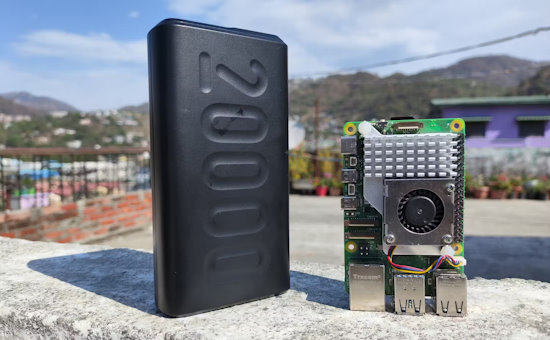](https://www.xda-developers.com/raspberry-pi-as-a-portable-device/)

What was the most popular, most clicked link, in [last week's newsletter](https://www.adafruitdaily.com/2024/04/29/python-on-microcontrollers-newsletter-espressif-takes-an-m5-stake-new-raspberry-pi-compute-modules-and-more-circuitpython-python-micropython-thepsf-raspberry_pi/)? [I turned my Raspberry Pi into a portable computer — and you can too](https://www.xda-developers.com/raspberry-pi-as-a-portable-device/).

## Pushing the Envelope

[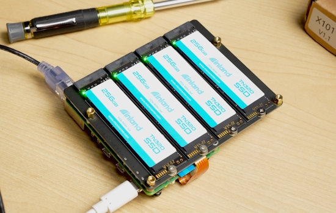](https://www.jeffgeerling.com/blog/2024/4-way-nvme-raid-comes-raspberry-pi-5)

With the Raspberry Pi 5's exposed PCI Express connector comes many new possibilities. Jeff Geerling this time tests and documents the [Geekwork X1011](https://geekworm.com/products/x1011), which puts four NVMe SSDs under a Raspberry Pi - [Jeff Geerling](https://www.jeffgeerling.com/blog/2024/4-way-nvme-raid-comes-raspberry-pi-5) and [Tom's Hardware](https://www.tomshardware.com/raspberry-pi/add-on-board-lets-you-use-four-nvme-ssds-at-once-with-raspberry-pi-5).

## News From Around the Web

[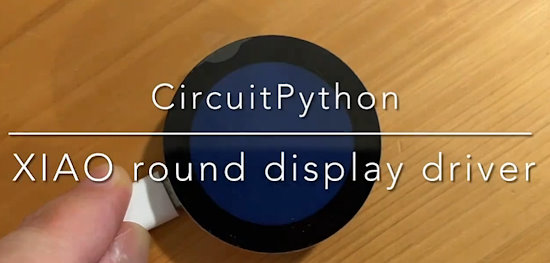](https://twitter.com/AoyamaProd/status/1786022136026734895)

A CircuitPython driver for XIAO round display and CHSC6540 touch controller - [X](https://twitter.com/AoyamaProd/status/1786022136026734895) and [GitHub](https://github.com/STEAM-Tokyo/CircuitPython_XiaoRoundDisplay).

[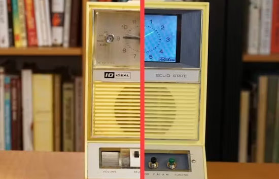](https://www.hackster.io/alan-boris/1960s-clock-radio-pi-makeover-867e49)

A 1960s clock radio makeover with Raspberry Pi 4, Adafruit parts and CircuitPython - [hackster.io](https://www.hackster.io/alan-boris/1960s-clock-radio-pi-makeover-867e49).

py2wasm draws on Nuitka to convert Python programs to WebAssembly and run them at 3x faster speeds - [InfoWorld](https://www.infoworld.com/article/3715388/wasmer-unveils-python-to-wasm-compiler.html).

[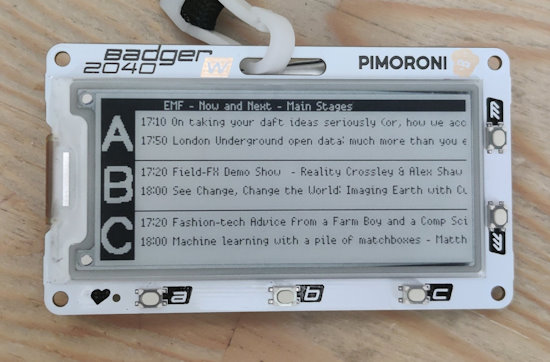](https://twitter.com/IainYarnall/status/1786103512385937553)

Using a Pimoroni Badger 2040 W to show the EMF Camp schedule via MicroPython - [X](https://twitter.com/IainYarnall/status/1786103512385937553).

[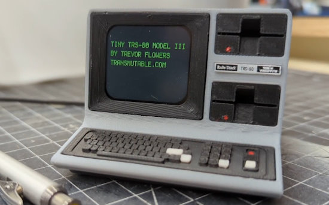](https://octodon.social/@trevorflowers@machines.social/112355353414989159)

> "Ok, this [browser-based IDE for CircuitPython boards](https://urfdvw.github.io/circuitpython-online-ide-2/) is pretty slick. Once 2.0 ships I'll probably start recommending it to people who buy my smol machines with QT Py boards like the [TRS-80 Model III](https://store.transmutable.com/l/e-trs-80-model-iii) and [Connection Machine](https://store.transmutable.com/l/ecm2). On the whole, I'm well pleased with that ecosystem as it has many good online tutorials and docs. Hat tip to Adafruit's Python on Microcontrollers newsletter for pointing out the project" - [Mastodon](https://octodon.social/@trevorflowers@machines.social/112355353414989159).

A free workshop: (Re)creating Arcade classics with CircuitPython and Raspberry Pi Pico with Djair Guilherme, May 24th, SESC São Paulo - [SESC São Paulo](https://www.sescsp.org.br/programacao/recriando-classicos-dos-arcades-com-circuitpython-e-raspberry-pi-pico/) (Portuguese) and [hackster.io](https://www.hackster.io/nicolaudosbrinquedos/circuitpython-tiled-neopixel-panel-446b73) (English).

[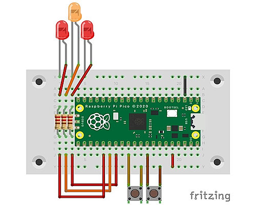](https://twitter.com/PaterPracticus/status/1785238888744681610)

A level crossing lights controller with Raspberry Pi Pico and MicroPython in Fritzing - [X](https://twitter.com/PaterPracticus/status/1785238888744681610), [GitHub](https://github.com/PaterPracticus/Level_Crossing_v1) and [YouTube](https://www.youtube.com/watch?v=IupTxBROl1U).

[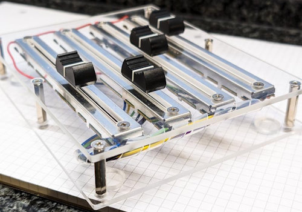](https://octodon.social/@gilester45@twit.social/112342732714768716)

A custom MIDI Fader controller featuring an Adafruit Feather RP2040 and CircuitPython - [Mastodon](https://octodon.social/@gilester45@twit.social/112342732714768716) and [Blog](https://www.technical-capers.info/post/the-midi-fader-caper).

Google lays off US Python programmers - [Fierce](https://www.fierce-network.com/cloud/mongodb-wants-be-meat-industrys-ai-sandwich).

[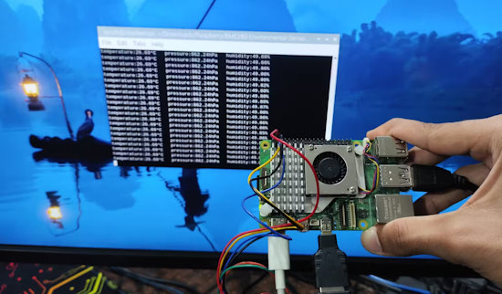](https://www.xda-developers.com/turn-raspberry-pi-into-a-weather-station/)

I turned my Raspberry Pi into a full-fledged weather station (with Python), here's how you can, too - [XDA](https://www.xda-developers.com/turn-raspberry-pi-into-a-weather-station/).

[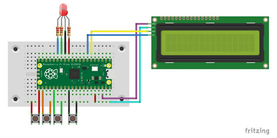](https://github.com/PaterPracticus/Video-call_Interruptibility_Status_Indicator)

A Zoom call status monitor with a Raspberry Pi Pico and MicroPython - [X](https://twitter.com/PaterPracticus/status/1785728603612680489), [GitHub](https://github.com/PaterPracticus/Video-call_Interruptibility_Status_Indicator) and [YouTube](https://www.youtube.com/watch?v=Ch0FHyCTUvo).

[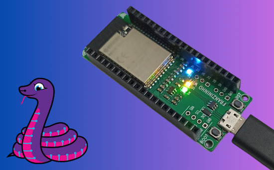](https://embarcados.com.br/esp32-s2-franzininho-wi-fi-com-circuitpython-dicas-e-truques/)

Using Franzininho WiFi ESP32 with CircuitPython - [Embarcados](https://embarcados.com.br/esp32-s2-franzininho-wi-fi-com-circuitpython-dicas-e-truques/) via [X](https://twitter.com/embarcados/status/1786084454118609079) (Portuguese).

[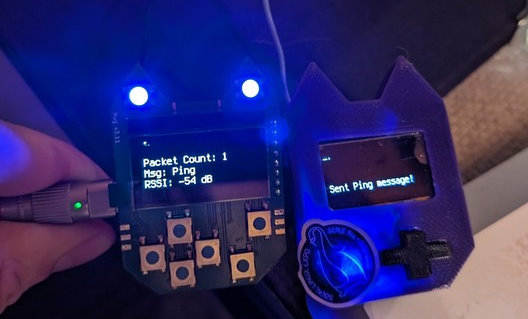](https://infosec.exchange/@skickar/112367132923227583)

> "It was super easy to get LoRa communication working with CircuitPython on current and experimental nuggets. So far, max range has been 4 miles!" - [Mastodon](https://infosec.exchange/@skickar/112367132923227583).

[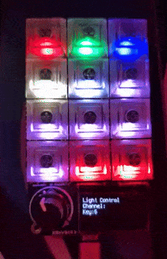](https://twitter.com/Secoh2000/status/1784783585674752186)

Building a MIDI light controller with an Adafruit Macropad and CircuitPython - [X](https://twitter.com/Secoh2000/status/1784783585674752186).

[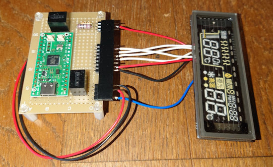](https://twitter.com/kptchip/status/1785922069982855408)

Making an evaluation board for a bathroom fluorescent display tube (CN2113M) using MicroPython on a Raspberry Pi Pico - [X](https://twitter.com/kptchip/status/1785922069982855408).

[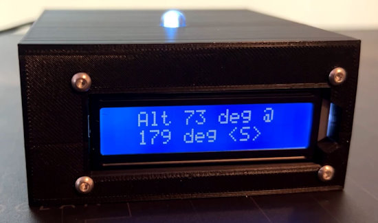](http://www.whiskeytangohotel.com/2024/04/where-is-iss-rasberry-pi-version.html)

Where is the ISS, Raspberry Pi and Python version - [WhiskeyTangoHotel](http://www.whiskeytangohotel.com/2024/04/where-is-iss-rasberry-pi-version.html).

[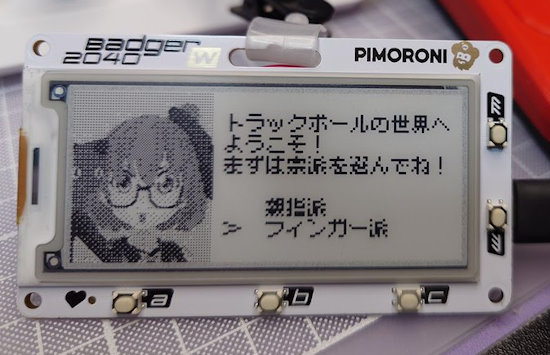](https://twitter.com/shiiba_cba418/status/1786326335230746836)

Japanese on the Badger 2040 W using MicroPython and Tamakichi's library - [GitHub](https://github.com/Tamakichi/pico_MicroPython_misakifont) via [X](https://twitter.com/shiiba_cba418/status/1786326335230746836) (Japanese).

This camera writes poems with Raspberry Pi and Python - [Raspberry Pi News](https://www.raspberrypi.com/news/this-camera-writes-poems/).

[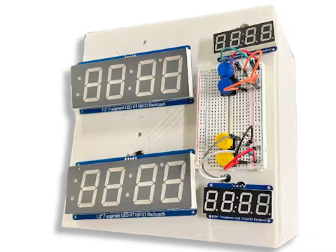](https://www.hackster.io/mtd8/ambient-temperature-and-humidity-monitor-a0c806)

An ambient temperature and humidity monitor with PocketBeagle and Python - [hackster.io](https://www.hackster.io/mtd8/ambient-temperature-and-humidity-monitor-a0c806).

[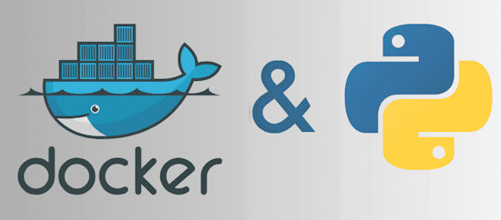](https://www.kdnuggets.com/containerize-python-apps-with-docker-in-5-easy-steps)

Containerize Python Apps with Docker in 5 Easy Steps - [KDnuggets](https://www.kdnuggets.com/containerize-python-apps-with-docker-in-5-easy-steps).

## New Boards Supported by CircuitPython

The number of supported microcontrollers and Single Board Computers (SBC) grows every week. This section outlines which boards have been included in CircuitPython or added to [CircuitPython.org](https://circuitpython.org/).

This week there was one new board added:

- [Spotpear ESP32C3 LCD 1.44](https://circuitpython.org/board/spotpear_esp32c3_lcd_1_44/)

*Note: For non-Adafruit boards, please use the support forums of the board manufacturer for assistance, as Adafruit does not have the hardware to assist in troubleshooting.*

Looking to add a new board to CircuitPython? It's highly encouraged! Adafruit has four guides to help you do so:

- [How to Add a New Board to CircuitPython](https://learn.adafruit.com/how-to-add-a-new-board-to-circuitpython/overview)
- [How to add a New Board to the circuitpython.org website](https://learn.adafruit.com/how-to-add-a-new-board-to-the-circuitpython-org-website)
- [Adding a Single Board Computer to PlatformDetect for Blinka](https://learn.adafruit.com/adding-a-single-board-computer-to-platformdetect-for-blinka)
- [Adding a Single Board Computer to Blinka](https://learn.adafruit.com/adding-a-single-board-computer-to-blinka)

## New Learn Guides

[Gravity Falls Memory Gun](https://learn.adafruit.com/gravity-falls-memory-gun) from [Ruiz Brothers](https://learn.adafruit.com/u/pixil3d)

[ESP32 PlayStation Controller](https://learn.adafruit.com/esp32-playstation-controller) from [John Park](https://learn.adafruit.com/esp32-playstation-controller)

## Updated Learn Guides

[Raspberry Pi Wearable Time Lapse Camera](https://learn.adafruit.com/raspberry-pi-wearable-time-lapse-camera/software)

## CircuitPython Libraries

The CircuitPython library numbers are continually increasing, while existing ones continue to be updated. Here we provide library numbers and updates!

To get the latest Adafruit libraries, download the [Adafruit CircuitPython Library Bundle](https://circuitpython.org/libraries). To get the latest community contributed libraries, download the [CircuitPython Community Bundle](https://circuitpython.org/libraries).

If you'd like to contribute to the CircuitPython project on the Python side of things, the libraries are a great place to start. Check out the [CircuitPython.org Contributing page](https://circuitpython.org/contributing). If you're interested in reviewing, check out Open Pull Requests. If you'd like to contribute code or documentation, check out Open Issues. We have a guide on [contributing to CircuitPython with Git and GitHub](https://learn.adafruit.com/contribute-to-circuitpython-with-git-and-github), and you can find us in the #help-with-circuitpython and #circuitpython-dev channels on the [Adafruit Discord](https://adafru.it/discord).

You can check out this [list of all the Adafruit CircuitPython libraries and drivers available](https://github.com/adafruit/Adafruit_CircuitPython_Bundle/blob/master/circuitpython_library_list.md). 

The current number of CircuitPython libraries is **482**!

**Updated Libraries**

Here's this week's updated CircuitPython libraries:

  * [adafruit/Adafruit_CircuitPython_AzureIoT](https://github.com/adafruit/Adafruit_CircuitPython_AzureIoT)
  * [adafruit/Adafruit_CircuitPython_Requests](https://github.com/adafruit/Adafruit_CircuitPython_Requests)
  * [adafruit/Adafruit_CircuitPython_PIOASM](https://github.com/adafruit/Adafruit_CircuitPython_PIOASM)
  * [adafruit/Adafruit_CircuitPython_ConnectionManager](https://github.com/adafruit/Adafruit_CircuitPython_ConnectionManager)
  * [rgrizzell/CircuitPython_GT911](https://github.com/rgrizzell/CircuitPython_GT911)

**Library PyPI Weekly Download Stats**

**Total Library Stats**
  * 128179 PyPI downloads over 326 libraries

**Top 10 Libraries by PyPI Downloads**
  * Adafruit CircuitPython Requests (adafruit-circuitpython-requests): 11508
  * Adafruit CircuitPython ConnectionManager (adafruit-circuitpython-connectionmanager): 10645
  * Adafruit CircuitPython BusDevice (adafruit-circuitpython-busdevice): 9969
  * Adafruit CircuitPython Register (adafruit-circuitpython-register): 2792
  * Adafruit CircuitPython Wiznet5k (adafruit-circuitpython-wiznet5k): 1676
  * Adafruit CircuitPython framebuf (adafruit-circuitpython-framebuf): 1417
  * Adafruit CircuitPython RGB Display (adafruit-circuitpython-rgb-display): 1202
  * Adafruit CircuitPython MiniMQTT (adafruit-circuitpython-minimqtt): 1078
  * Adafruit CircuitPython Motor (adafruit-circuitpython-motor): 1066
  * Adafruit CircuitPython ESP32SPI (adafruit-circuitpython-esp32spi): 1028

## What’s the CircuitPython team up to this week?

What is the team up to this week? Let’s check in:

**Dan**

Ubuntu 24.04 final was released just last week. Over the previous weekend I upgraded my development machine, so I could be a guinea pig for changes that will be needed when building CircuitPython.

As we saw with Debian Bookworm, installing Python libraries for your own use needs to be done in a Python virtual environment, such as "venv", unless you override some safety protections. Carter already wrote [a Learn Guide](https://learn.adafruit.com/python-virtual-environment-usage-on-raspberry-pi0 about this for the new release of Raspberry Pi OS.

I'll be updating the [Building CircuitPython](https://learn.adafruit.com/building-circuitpython) Guide to cover this and other needed recipe changes.

**Melissa**

I finished up going through Raspberry Pi related guides, addressing feedback, and updating older guides this past week. The last couple of guides that I updated include [Raspberry Pi Wearable Time Lapse Camera](https://learn.adafruit.com/raspberry-pi-wearable-time-lapse-camera) and [Adafruit MAX98357 I2S Class-D Mono Amp](https://learn.adafruit.com/adafruit-max98357-i2s-class-d-mono-amp).

**Tim**

I've been testing and reviewing PRs for changes to requests and networking related libraries this week, there is loads of great work taking place around ConnectionManager and the libraries it can interact with to simplify networking. I'm also creating some scripts to create new github issues in a subset of the libraries for creating displayio based sensor examples.

**Jeff**

I've been working on MP3 support for the ESP32-S3 for a couple of weeks without anything to show for it. But finally with some hints from Scott & lots of time debugging the code, I got stable MP3 playback on the Adafruit Feather ESP32-S3 TFT.

One of the things I did along the way was measure the performance of MP3 playback on the S3. In this scope trace, the "D0" trace shows the time spent decoding a 22kHz 48kbit/s MP3 file stored on internal flash; it takes about 2ms every 46ms, or about 5% of the total CPU available.

Playing other MP3 files or playing MP3 files from an SD card might take more time, but it gives the impression that there's plenty of headroom available for higher bitrate MP3 files.

**Scott**

This week I took a little detour to enable the MAX3421E on ESP chips. (I thought I had but someone testing it found I hadn't.) This included enabling it on non-USB device ESP chips like the C3 and C6. Absolute latest builds now include the `max3421e` module correctly.

I've been shepherding the Renode support along. It should be merged any day now.

Lastly, I've been working on BLE GATT server support on ESP. This is needed for BLE HID device functionality in particular.

**Liz**

I took a little time off last week but now I'm back to writing guides. I wrote up guides for a few new products: the [BNO055 + BMP280 BFF](https://learn.adafruit.com/adafruit-bno055-bmp280-bff), the [STEMMA IR Demodulator](https://learn.adafruit.com/adafruit-tssp77038-38khz-infrared-ir-demodulator-breakout) and the [DVI Sock for Pico](https://learn.adafruit.com/adafruit-dvi-sock-for-pico). I also wrote up my project using a USB Host FeatherWing and Feather ESP32-S3 TFT to build a [USB to BLE adapter](https://learn.adafruit.com/esp32-s3-usb-to-ble-keyboard-adapter). The code is written in Arduino, but with the recently added support for the USB Host FeatherWing and impending support for BLE on Espressif in CircuitPython, I'm hopeful to have code in CircuitPython for it at some point.

## Upcoming Events

PyCon US 2024 launches May 15-23, 2024 in Pittsburgh, Pennsylvania US - [PyCon US](https://pycon.blogspot.com/2024/10/pycon-us-2024-launches.html).

The next MicroPython Meetup in Melbourne will be on May 22 – [Meetup](https://www.meetup.com/micropython-meetup/events). You can see recordings of previous meetings on [YouTube](https://www.youtube.com/@MicroPythonOfficial). 

Open Sauce, the Maker extravaganza, is returning to San Francisco, California June 15-16 - [Open Sauce](https://opensauce.live/).

EuroPython is the oldest and longest running volunteer-led Python programming conference on the planet. This year it will be held July 8-14 in Prague - [EuroPython 2024](https://ep2024.europython.eu/).

PyOhio is being held July 27-28, 2024 in Cleveland, Ohio - [PyOhio](https://www.pyohio.org/2024/).

Espressif DevCon24 will be held Sep 3-5, 13:00-18:00 CEST. Call for presentations now - [Espressif](https://devcon.espressif.com/).

**Send Your Events In**

If you know of virtual events or upcoming events, please let us know via email to cpnews(at)adafruit(dot)com.

## Latest Releases

CircuitPython's stable release is [9.0.4](https://github.com/adafruit/circuitpython/releases/latest) and its unstable release is [9.1.0-beta.1](https://github.com/adafruit/circuitpython/releases). New to CircuitPython? Start with our [Welcome to CircuitPython Guide](https://learn.adafruit.com/welcome-to-circuitpython).

[20240503](https://github.com/adafruit/Adafruit_CircuitPython_Bundle/releases/latest) is the latest Adafruit CircuitPython library bundle.

[20240502](https://github.com/adafruit/CircuitPython_Community_Bundle/releases/latest) is the latest CircuitPython Community library bundle.

[v1.22.2](https://micropython.org/download) is the latest MicroPython release. Documentation for it is [here](http://docs.micropython.org/en/latest/pyboard/).

[3.12.3](https://www.python.org/downloads/) is the latest Python release. The latest pre-release version is [3.13.0a6](https://www.python.org/download/pre-releases/).

[3,907 Stars](https://github.com/adafruit/circuitpython/stargazers) Like CircuitPython? [Star it on GitHub!](https://github.com/adafruit/circuitpython)

## Call for Help -- Translating CircuitPython is now easier than ever

[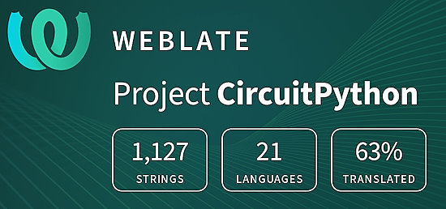](https://hosted.weblate.org/engage/circuitpython/)

One important feature of CircuitPython is translated control and error messages. With the help of fellow open source project [Weblate](https://weblate.org/), we're making it even easier to add or improve translations. 

Sign in with an existing account such as GitHub, Google or Facebook and start contributing through a simple web interface. No forks or pull requests needed! As always, if you run into trouble join us on [Discord](https://adafru.it/discord), we're here to help.

## 39,181 Thanks

The Adafruit Discord community, where we do all our CircuitPython development in the open, reached over 39,181 humans - thank you! Adafruit believes Discord offers a unique way for Python on hardware folks to connect. Join today at [https://adafru.it/discord](https://adafru.it/discord).

## ICYMI - In case you missed it

Python on hardware is the Adafruit Python video-newsletter-podcast! The news comes from the Python community, Discord, Adafruit communities and more and is broadcast on ASK an ENGINEER Wednesdays. The complete Python on Hardware weekly videocast [playlist is here](https://www.youtube.com/playlist?list=PLjF7R1fz_OOXRMjM7Sm0J2Xt6H81TdDev). The video podcast is on [iTunes](https://itunes.apple.com/us/podcast/python-on-hardware/id1451685192?mt=2), [YouTube](http://adafru.it/pohepisodes), [Instagram](https://www.instagram.com/adafruit/channel/)), and [XML](https://itunes.apple.com/us/podcast/python-on-hardware/id1451685192?mt=2).

[The weekly community chat on Adafruit Discord server CircuitPython channel - Audio / Podcast edition](https://itunes.apple.com/us/podcast/circuitpython-weekly-meeting/id1451685016) - Audio from the Discord chat space for CircuitPython, meetings are usually Mondays at 2pm ET, this is the audio version on [iTunes](https://itunes.apple.com/us/podcast/circuitpython-weekly-meeting/id1451685016), Pocket Casts, [Spotify](https://adafru.it/spotify), and [XML feed](https://adafruit-podcasts.s3.amazonaws.com/circuitpython_weekly_meeting/audio-podcast.xml).

## Contribute

The CircuitPython Weekly Newsletter is a CircuitPython community-run newsletter emailed every Monday. The complete [archives are here](https://www.adafruitdaily.com/category/circuitpython/). It highlights the latest CircuitPython related news from around the web including Python and MicroPython developments. To contribute, edit next week's draft [on GitHub](https://github.com/adafruit/circuitpython-weekly-newsletter/tree/gh-pages/_drafts) and [submit a pull request](https://help.github.com/articles/editing-files-in-your-repository/) with the changes. You may also tag your information on Twitter with #CircuitPython. 

Join the Adafruit [Discord](https://adafru.it/discord) or [post to the forum](https://forums.adafruit.com/viewforum.php?f=60) if you have questions.
