View this email in your browser. **Warning: Flashing Imagery**

Welcome to the latest Python on Microcontrollers newsletter! A surprise announcement from Raspberry Pi - a baked-in solution to control an internet connected Raspberry Pi from anywhere makes it easier to deploy the boards. The Matter standard is becoming more mature for the Internet of Things but actual use of hardware + software still seems sparse. Python 3.13 gets a major step closer to release. Finally the crop of projects around the 'net this week is superb, I couldn't fit them all! And if you're going to PyCon US, catch my colleague Jeff Epler gving a talk and more - *Anne Barela, Ed.*

We're on [Discord](https://discord.gg/HYqvREz), [Twitter](https://twitter.com/search?q=circuitpython&src=typed_query&f=live), and for past newsletters - [view them all here](https://www.adafruitdaily.com/category/circuitpython/). If you're reading this on the web, [subscribe here](https://www.adafruitdaily.com/). Here's the news this week:

## Raspberry Pi Connect Now Available

[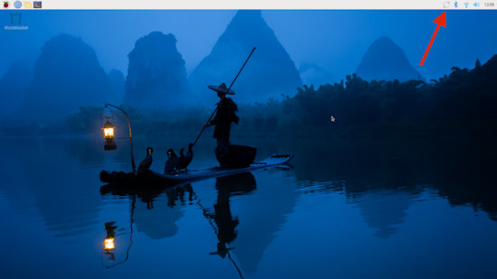](https://www.raspberrypi.com/news/raspberry-pi-connect/)

Raspberry Pi announced the beta release of Raspberry Pi Connect: a secure and easy-to-use way to access your Raspberry Pi remotely, from anywhere on the planet, using just a web browser - [Raspberry Pi News](https://www.raspberrypi.com/news/raspberry-pi-connect/).

> "It’s often extremely useful to be able to access your Raspberry Pi’s desktop remotely. There are a number of technologies which can be used to do this, including VNC, and of course the X protocol itself. But they can be hard to configure, particularly when you are attempting to access a machine on a different local network; and of course with the transition to Wayland in Raspberry Pi OS Bookworm, classic X remote desktop support is no longer available. &nbsp;  We wanted to be able to provide you with this functionality with our usual “it just works” approach. Enter Raspberry Pi Connect."

## The Updated Matter 1.3 Internet of Things Standard Brings Energy Monitoring, Electric Vehicle Charging Support, and More

[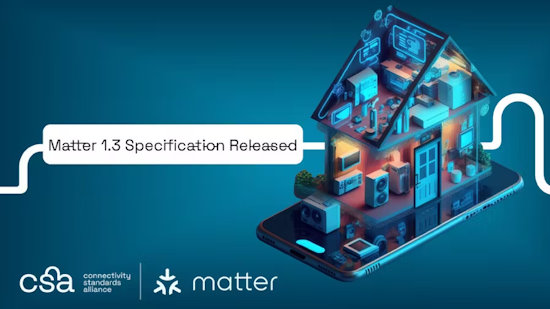](https://www.hackster.io/news/updated-matter-1-3-standard-brings-energy-monitoring-electric-vehicle-charging-support-and-more-88af871283d8)

The new Matter 1.3 standard provides energy monitoring, electric vehicle charging support, and more - [hackster.io](https://www.hackster.io/news/updated-matter-1-3-standard-brings-energy-monitoring-electric-vehicle-charging-support-and-more-88af871283d8).

> "The addition of these new device types and functionalities in Matter 1.3 enables product manufacturers and controllers to begin implementing and certifying these features into new and existing products."

## Coming up at PyCon US: Jeff Epler's talk on "Connecting Old to New with CircuitPython: Retrocomputer input devices on modern PCs"

[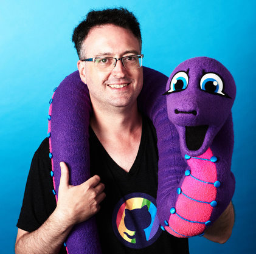](https://us.pycon.org/2024/schedule/presentation/15/)

CircuitPython developer Jeff Epler will be giving the talk "Connecting Old to New with CircuitPython: Retrocomputer input devices on modern PCs" on Sunday May 19th, 2024 1:45 p.m.-2:15 p.m. in Hall C at PyCon US 2024 - [PyCon US](https://us.pycon.org/2024/schedule/presentation/15/) via [Mastodon](https://octodon.social/@stylus/112411930220861884).

> "No keyboards were harmed in the preparation of this talk. Preservation is important, and I only discuss "non-invasive", alteration-free techniques here, using original wiring & connectors only. Sunday afternoon in Hall C has been arranged as a lovely hardware mini-track, with a presentation on robots before me and one on machine learning with FPGAs to follow. You can also find me in the hallway track & 2 days of sprints. Please don't hesitate to introduce yourself!"

## Python 3.13.0 Beta 1 is Out Now

Python 3.13.0 beta 1 has been released. The 3.13 branch has been created and features for 3.13 are now frozen. The main branch is now 3.14.0a0. Beta release previews are intended to give the wider community the opportunity to test new features and bug fixes and to prepare their projects to support the new feature release. The Python developers strongly encourage maintainers of third-party Python projects to test with 3.13 during the beta phase and report issues found to the Python bug tracker as soon as possible - [Python Discussion Forums](https://discuss.python.org/t/python-3-13-0b1-now-available/52891) and [Python Insider Blog](https://pythoninsider.blogspot.com/).

## Adafruit Reaches 750 OSHWA Certified Open Source Hardware Projects

Adafruit has certified 750 open source designs with the Open Source Hardware Association (OSHWA). The current total worldwide is 2,768 - [OSHWA](https://certification.oshwa.org/list.html?q=adafruit).

## Is The New Orange Pi 5 Pro A Good Raspberry Pi 5 Alternative?

[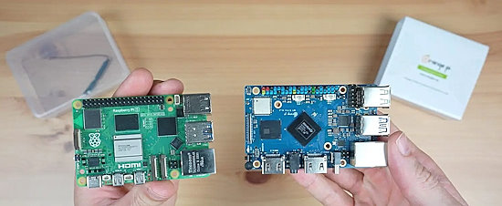](https://www.the-diy-life.com/is-the-new-orange-pi-5-pro-a-good-raspberry-pi-5-alternative/)

Is the new Orange Pi 5 Pro a good Raspberry Pi 5 alternative? - [The DIY Life](https://www.the-diy-life.com/is-the-new-orange-pi-5-pro-a-good-raspberry-pi-5-alternative/).

> "The Orange Pi 5 Pro is a great board if there is a software package or OS image built for it or if you have a good understanding of software and programming, but for the average hobbyist or tinkerer, if you’re trying a project that hasn’t been tried before, or you’re running a project that utilises the GPIO pins then you’re probably better off with the Raspberry Pi 5."

## This Week's Python Streams

Python on Hardware is all about building a cooperative ecosphere which allows contributions to be valued and to grow knowledge. Below are the streams within the last week focusing on the community.

**CircuitPython Deep Dive Stream**

[Last Friday](https://www.youtube.com/watch?v=j6jOk6f01CE), Tim streamed work on Library PR Testing + Some Circup Stuff.

You can see the latest video and past videos on the Adafruit YouTube channel under the Deep Dive playlist - [YouTube](https://www.youtube.com/playlist?list=PLjF7R1fz_OOXBHlu9msoXq2jQN4JpCk8A).

**CircuitPython Parsec**

John Park’s CircuitPython Parsec this week is on Touchwheel - [Adafruit Blog](https://blog.adafruit.com/2024/05/10/john-parks-circuitpython-parsec-touchwheel-adafruit-circuitpython/) and [YouTube](https://youtu.be/Lv7GH2mVS3M).

Catch all the episodes in the [YouTube playlist](https://www.youtube.com/playlist?list=PLjF7R1fz_OOWFqZfqW9jlvQSIUmwn9lWr).

**CircuitPython Weekly Meeting**

CircuitPython Weekly Meeting for {date} ([notes](https://github.com/adafruit/adafruit-circuitpython-weekly-meeting/blob/main/2024/2024-05-06.md)) [on YouTube](https://youtu.be/APp40FUBCXQ).

## Project of the Week: Reducing Raspberry Pi Pico W Power Consumption and a Second Attempt at Using Solar Panels

[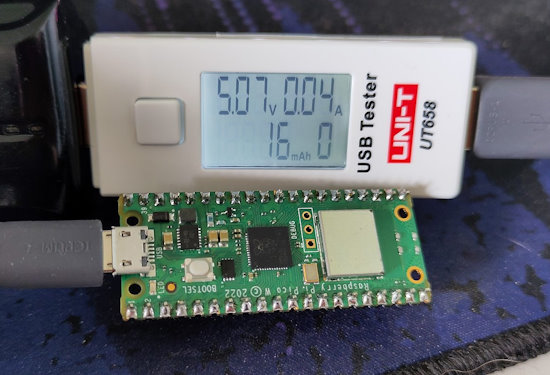](https://stfn.pl/blog/34-pico-power-consumption-solar-panels/)

Reducing Raspberry Pi Pico W power consumption and a second attempt at using solar panels - [STFN](https://stfn.pl/blog/34-pico-power-consumption-solar-panels/).

> "I am convinced that with the current setup, the Pi Pico W can run indefinitely, or well, at least until late Autumn, when the days will be much shorter. But we’ll measure that bridge when we get there."

## Popular Last Week

[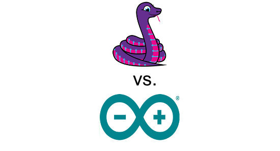](https://www.adafruitdaily.com/2024/05/06/python-on-microcontrollers-newsletter-micropython-turns-11-arduino-vs-circuitpython-and-much-more-circuitpython-python-micropython-thepsf-raspberry_pi/)

What was the most popular, most clicked link, in [last week's newsletter](https://www.adafruitdaily.com/2024/05/06/python-on-microcontrollers-newsletter-micropython-turns-11-arduino-vs-circuitpython-and-much-more-circuitpython-python-micropython-thepsf-raspberry_pi/)? [CircuitPython vs. Arduino’s C++ Language for ESP32: A Comparative Analysis](https://thecustomizewindows.com/2024/04/circuitpython-vs-arduinos-c-language-for-esp32-a-comparative-analysis/).

## New Notes from Adafruit Playground

[Adafruit Playground](https://adafruit-playground.com/) is a new place for the community to post their projects and other making tips/tricks/techniques. Ad-free, it's an easy way to publish your work in a safe space for free.

[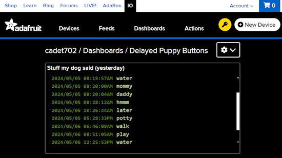](https://adafruit-playground.com/u/cadet702/pages/stuff-my-dog-said-via-adafruitio)

Stuff My Dog Said via CircuitPython and Adafruit IO - [Adafruit Playground](https://adafruit-playground.com/u/cadet702/pages/stuff-my-dog-said-via-adafruitio).

Reading pixels from the RA8875 display driver board - [Adafruit Playground](https://adafruit-playground.com/u/DJDevon3/pages/reading-pixels-on-the-ra8875-display-circuit-python).

[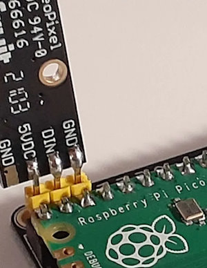](https://adafruit-playground.com/u/dexter_starboard/pages/neopixel-stick-and-pi-pico)

Do you need to add a simple diagnostic display to a Pico project? Or perhaps you want a quick and easy NeoPixel light show? This project with CircuitPython may help - [Adafruit Playground](https://adafruit-playground.com/u/dexter_starboard/pages/neopixel-stick-and-pi-pico).

## News From Around the Web

[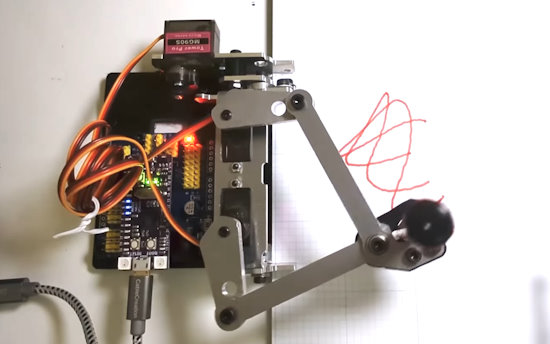](https://www.youtube.com/watch?v=k056yo-cRJI)

River Wang purchased a drawing robot kit and programmed it using CircuitPython. It processes gcode converted from images to draw images on paper - [YouTube](https://www.youtube.com/watch?v=k056yo-cRJI) and [GitHub](https://github.com/urfdvw/drawing-robot), via [X](https://twitter.com/River___Wang/status/1786602273398722999?t=RpFMg14gzyCTrjF_3xirHQ&s=03).

[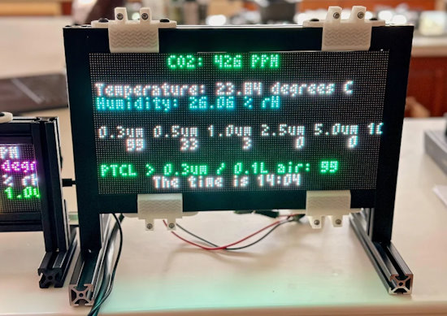](https://www.instructables.com/A-Simple-Air-Quality-Monitor/)

A simple air quality monitor with an Adafruit Matrix Portal and CircuitPython - [Instructables](https://www.instructables.com/A-Simple-Air-Quality-Monitor/).

[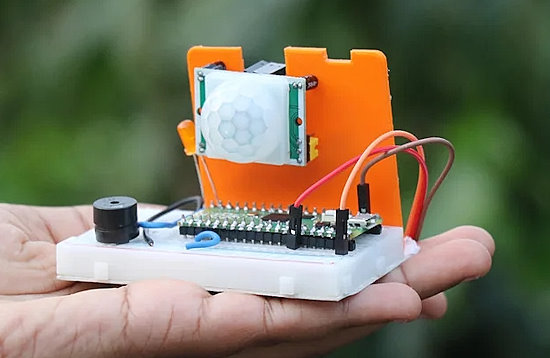](https://www.instructables.com/How-to-Make-Burglar-Alarm-Using-Raspberry-Pi-Keep-/)

Making a burglar alarm using Raspberry Pi Pico and MicroPython - [Instructables](https://www.instructables.com/How-to-Make-Burglar-Alarm-Using-Raspberry-Pi-Keep-/) and [YouTube](https://youtu.be/MftMYfsDmlw).

[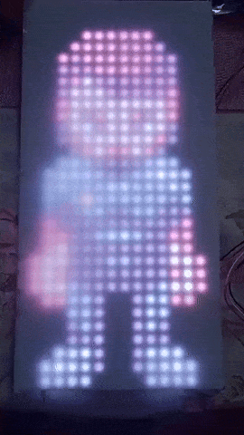](https://www.hackster.io/nicolaudosbrinquedos/circuitpython-neopixel-bmp-animation-e2ca24)

CircuitPython NeoPixel BMP animation with Xiao and CircuitPython - [hackster.io](https://www.hackster.io/nicolaudosbrinquedos/circuitpython-neopixel-bmp-animation-e2ca24).

[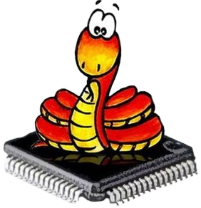](https://github.com/WebReflection/micro-repl/#readme)

micro-repl is an easy, SerialPort based, MicroPython REPL for microcontrollers. - [GitHub](https://github.com/WebReflection/micro-repl/#readme).

A Matrix like dripping display with CircuitPython - [X](https://twitter.com/NickRuffilo/status/1787528190442815586).

[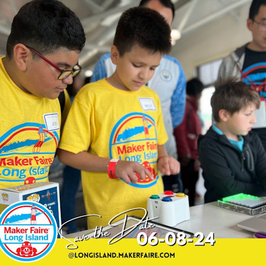](https://twitter.com/River___Wang/status/1786604077733802252?t=BKF2fBxw3udgvUO4BSPrGQ&s=03)

The CircuitPython Online IDE 2 will be shown at Maker Faire Long Island 2024 - [X](https://twitter.com/River___Wang/status/1786604077733802252?t=BKF2fBxw3udgvUO4BSPrGQ&s=03).

[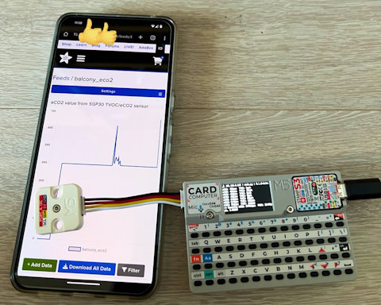](https://twitter.com/komde/status/1786593195796930937)

> "I wanted to do an experiment outdoors with a device equipped with a large battery, so while I was asleep, I created a program that reads sensor values ​​with the M5 Cardputer TVOC Unit configuration and continues to send them via MQTT. Since I was getting used to CircuitPython, I was able to get it up and running in 30 minutes" - [X](https://twitter.com/komde/status/1786593195796930937) (Japanese).

[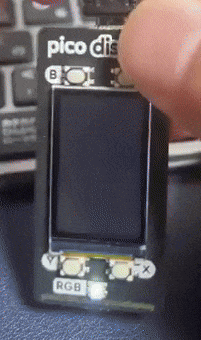](https://twitter.com/masukusoro/status/1788277095170535610)

A beer "pouring" game with Pimoroni display and MicroPython - [X](https://twitter.com/masukusoro/status/1788277095170535610) (Japanese).

[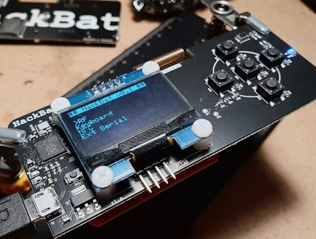](https://www.hackster.io/pablotrujillojuan/hackbat-1dfdbc)

Hackbat is an open-source hacking hardware platform based on the RP2040 with RF, NFC, USB, and SD card ready for pen testing research, programmable in Python - [hackster.io](https://www.hackster.io/pablotrujillojuan/hackbat-1dfdbc) via [Tom's Hardware](https://www.tomshardware.com/raspberry-pi/the-raspberry-pi-rp2040-hackbat-is-an-open-source-swiss-army-knife-pen-testing-tool).

[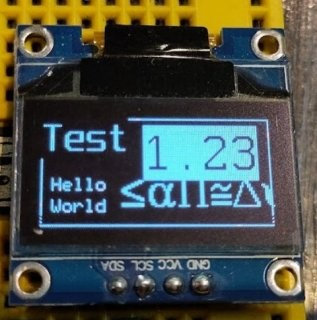](https://github.com/easytarget/microPyEZfonts)

100 fonts and font writer for the MicroPython framebuffer - [GitHub](https://github.com/easytarget/microPyEZfonts) via [Mastodon](https://octodon.social/@easytarget@social.makerforums.info/112407528499052047).

Building an ESP32 beer fermentation controller with MicroPython  - [Mastodon](https://octodon.social/@JustDude@bsd.cafe/112387138438851308).

[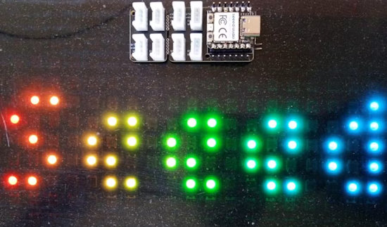](https://www.hackster.io/nicolaudosbrinquedos/circuitpython-tiled-marquee-6e48cf)

A Circuitpython tiled NeoPixel marquee with Xiao - [hackster.io](https://www.hackster.io/nicolaudosbrinquedos/circuitpython-tiled-marquee-6e48cf).

[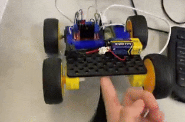](https://twitter.com/saintronans/status/1788253668837343657)

> "Year 8’s with their Pico Microprocessors programmed to output to a motor controller. Prototyping and experimenting with PWM, MicroPython and Physics" - [X](https://twitter.com/saintronans/status/1788253668837343657).

[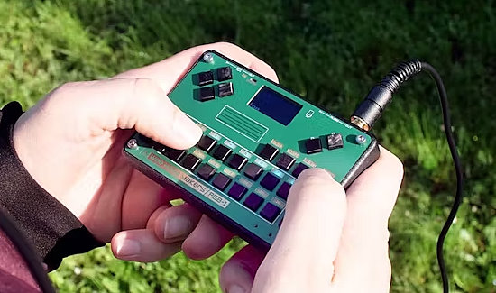](https://www.hackster.io/news/wee-noise-maker-pgb1-opens-an-audio-synth-gateway-to-musicians-and-hackers-alike-2b5a25f97cfe)

Wee Noise Maker PGB1 opens an audio synth gateway to Mmusicians and hackers alike, can be programmed in CircuitPython - [hackster.io](https://www.hackster.io/news/wee-noise-maker-pgb1-opens-an-audio-synth-gateway-to-musicians-and-hackers-alike-2b5a25f97cfe).

[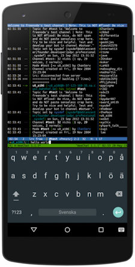](https://github.com/termux/termux-app)

Run Linux (and Python) on your Android device - [GitHub](https://github.com/termux/termux-app) and [Wiki](https://wiki.termux.com/wiki/Main_Page).

[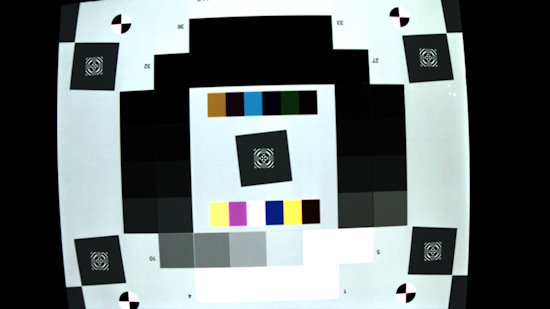](https://github.com/yuqing-liu-dut/ISPLab)

ISPLab is an open-source and platform-free ISP pipeline converting 10-bit RAW data to 8-bit RGB/YUV image without any 3rdparty libs - [GitHub](https://github.com/yuqing-liu-dut/ISPLab).

## New

[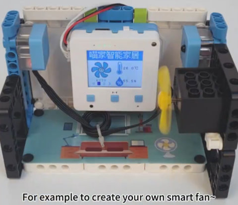](https://www.kittenbot.cc/products/kittenbot-futureboard-lite-esp32-s3-aiot-educational-controller)

The KittenBot FutureBoard Lite is an ESP32-S3 AIOT educational controller running CircuitPython - [KittenBot](https://www.kittenbot.cc/products/kittenbot-futureboard-lite-esp32-s3-aiot-educational-controller) via [X](https://twitter.com/KittenBot1/status/1788099797733560469).

C790 HDMI to MIPI CSI adapter adds HDMI and audio input to Raspberry Pi SBCs (Raspberry Pi Zero, 3B, 3B+, 4B, CM3, CM4 with MIPI CSI-2 input port) - [CNX Software](https://www.cnx-software.com/2024/05/08/c790-hdmi-to-mipi-csi-adapter-hdmi-and-audio-input-raspberry-pi-sbc/).

NVME+LTE/5G Hats for Raspberry Pi 5 - [HackerGadgets](https://hackergadgets.com/).

## New Boards Supported by CircuitPython

The number of supported microcontrollers and Single Board Computers (SBC) grows every week. This section outlines which boards have been included in CircuitPython or added to [CircuitPython.org](https://circuitpython.org/).

There were no new boards added this week but there are some in the works.

*Note: For non-Adafruit boards, please use the support forums of the board manufacturer for assistance, as Adafruit does not have the hardware to assist in troubleshooting.*

Looking to add a new board to CircuitPython? It's highly encouraged! Adafruit has four guides to help you do so:

- [How to Add a New Board to CircuitPython](https://learn.adafruit.com/how-to-add-a-new-board-to-circuitpython/overview)
- [How to add a New Board to the circuitpython.org website](https://learn.adafruit.com/how-to-add-a-new-board-to-the-circuitpython-org-website)
- [Adding a Single Board Computer to PlatformDetect for Blinka](https://learn.adafruit.com/adding-a-single-board-computer-to-platformdetect-for-blinka)
- [Adding a Single Board Computer to Blinka](https://learn.adafruit.com/adding-a-single-board-computer-to-blinka)

## Updated Learn Guides

[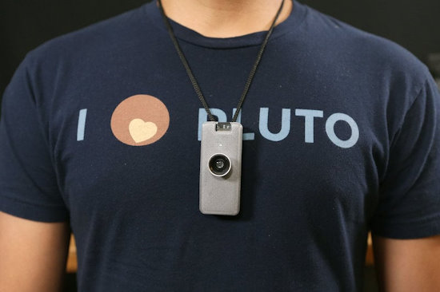](https://learn.adafruit.com/raspberry-pi-wearable-time-lapse-camera)

[Raspberry Pi Wearable Time Lapse Camera](https://learn.adafruit.com/raspberry-pi-wearable-time-lapse-camera)

## CircuitPython Libraries

The CircuitPython library numbers are continually increasing, while existing ones continue to be updated. Here we provide library numbers and updates!

To get the latest Adafruit libraries, download the [Adafruit CircuitPython Library Bundle](https://circuitpython.org/libraries). To get the latest community contributed libraries, download the [CircuitPython Community Bundle](https://circuitpython.org/libraries).

If you'd like to contribute to the CircuitPython project on the Python side of things, the libraries are a great place to start. Check out the [CircuitPython.org Contributing page](https://circuitpython.org/contributing). If you're interested in reviewing, check out Open Pull Requests. If you'd like to contribute code or documentation, check out Open Issues. We have a guide on [contributing to CircuitPython with Git and GitHub](https://learn.adafruit.com/contribute-to-circuitpython-with-git-and-github), and you can find us in the #help-with-circuitpython and #circuitpython-dev channels on the [Adafruit Discord](https://adafru.it/discord).

You can check out this [list of all the Adafruit CircuitPython libraries and drivers available](https://github.com/adafruit/Adafruit_CircuitPython_Bundle/blob/master/circuitpython_library_list.md). 

The current number of CircuitPython libraries is **483**!

**New Libraries**

Here's this week's new CircuitPython libraries:

  * [adafruit/Adafruit_CircuitPython_S-35710](https://github.com/adafruit/Adafruit_CircuitPython_S-35710)

**Updated Libraries**

Here's this week's updated CircuitPython libraries:

  * [adafruit/Adafruit_CircuitPython_AVRprog](https://github.com/adafruit/Adafruit_CircuitPython_AVRprog)

**Library PyPI Weekly Download Stats**

**Total Library Stats**

  * 106564 PyPI downloads over 326 libraries

**Top 10 Libraries by PyPI Downloads**

  * Adafruit CircuitPython Requests (adafruit-circuitpython-requests): 7996
  * Adafruit CircuitPython BusDevice (adafruit-circuitpython-busdevice): 7736
  * Adafruit CircuitPython ConnectionManager (adafruit-circuitpython-connectionmanager): 6897
  * Adafruit CircuitPython Register (adafruit-circuitpython-register): 2465
  * Adafruit CircuitPython ESP32SPI (adafruit-circuitpython-esp32spi): 1291
  * Adafruit CircuitPython Wiznet5k (adafruit-circuitpython-wiznet5k): 973
  * Adafruit CircuitPython Motor (adafruit-circuitpython-motor): 947
  * Adafruit CircuitPython NeoPixel (adafruit-circuitpython-neopixel): 930
  * Adafruit CircuitPython MiniMQTT (adafruit-circuitpython-minimqtt): 832
  * Adafruit CircuitPython Pixelbuf (adafruit-circuitpython-pixelbuf): 822

## What’s the CircuitPython team up to this week?

What is the team up to this week? Let’s check in:

**Dan**

I'm working on an out-of-memory error that occurs when using SSL network sockets. I refactored some existing code to prevent it doing some initialization more than once, which it was doing previously, but that did not help. I'm still debugging the problem.

**Melissa**

This past week I've been working on the [CircuitPython Code Editor](https://code.circuitpython.org/) and fixing up some bugs. I have a Pull Request in and I am currently working on improving the experience for managing files with USB file transfer. This should make using USB connected boards much easier to program using the editor.

**Tim**

I ran scripts to create 'good first issues' on driver libraries looking for displayio examples to be contributed. I've also been reviewing may networking related PRs. This week I also completed several changes requested in a prior review on an old PR to the AVRProg library in order to get it into a good state for merging.

**Jeff**

[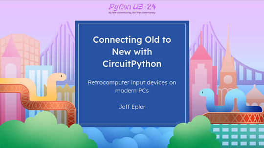](https://us.pycon.org/2024/schedule/presentation/15/)

I performed several releases of the [circuitpython-fonts bundle](https://github.com/adafruit/circuitpython-fonts) to fix a compatibility problem with circup. Now the libraries in this bundle should be installable with the latest circup again.

I'll also be at PyCon US 2024. Find me Sunday May 19th, 2024 1:45 p.m.-2:15 p.m. in Hall C for my talk "[Connecting Old to New with CircuitPython: Retrocomputer input devices on modern PCs](https://us.pycon.org/2024/schedule/presentation/15/)", as well as in the hallway track & the first two days of sprints. I'd love to meet any and all community members, so don't hesitate to introduce yourself to me.

**Liz**

This week I've been working on a guide for the [QT Py CH552](https://learn.adafruit.com/adafruit-ch552-qt-py). This QT Py has a CH552 chip on it, which is an 8051 processor. It requires a C compiler, so you can't use Arduino libraries with it but there is an Arduino IDE BSP that lets you compile and upload code to it over USB. It's been fun getting to learn how to use this board and experiment with the example.

## Upcoming Events

PyCon US 2024 launches May 15-23, 2024 in Pittsburgh, Pennsylvania US - [PyCon US](https://pycon.blogspot.com/2024/10/pycon-us-2024-launches.html).

The next MicroPython Meetup in Melbourne will be on May 22 – [Meetup](https://www.meetup.com/micropython-meetup/events). You can see recordings of previous meetings on [YouTube](https://www.youtube.com/@MicroPythonOfficial). 

Open Sauce, the Maker extravaganza, is returning to San Francisco, California June 15-16 - [Open Sauce](https://opensauce.live/).

EuroPython is the oldest and longest running volunteer-led Python programming conference on the planet. This year it will be held July 8-14 in Prague - [EuroPython 2024](https://ep2024.europython.eu/).

PyOhio is being held July 27-28, 2024 in Cleveland, Ohio - [PyOhio](https://www.pyohio.org/2024/).

Espressif DevCon24 will be held Sep 3-5, 13:00-18:00 CEST. Call for presentations now - [Espressif](https://devcon.espressif.com/).

**Send Your Events In**

If you know of virtual events or upcoming events, please let us know via email to cpnews(at)adafruit(dot)com.

## Latest Releases

CircuitPython's stable release is [9.0.4](https://github.com/adafruit/circuitpython/releases/latest) and its unstable release is [9.1.0-beta.1](https://github.com/adafruit/circuitpython/releases). New to CircuitPython? Start with our [Welcome to CircuitPython Guide](https://learn.adafruit.com/welcome-to-circuitpython).

[20240510](https://github.com/adafruit/Adafruit_CircuitPython_Bundle/releases/latest) is the latest Adafruit CircuitPython library bundle.

[20240502](https://github.com/adafruit/CircuitPython_Community_Bundle/releases/latest) is the latest CircuitPython Community library bundle.

[v1.22.2](https://micropython.org/download) is the latest MicroPython release. Documentation for it is [here](http://docs.micropython.org/en/latest/pyboard/).

[3.12.3](https://www.python.org/downloads/) is the latest Python release. The latest pre-release version is [3.13.0b1](https://www.python.org/download/pre-releases/).

[3,911 Stars](https://github.com/adafruit/circuitpython/stargazers) Like CircuitPython? [Star it on GitHub!](https://github.com/adafruit/circuitpython)

## Call for Help -- Translating CircuitPython is now easier than ever

One important feature of CircuitPython is translated control and error messages. With the help of fellow open source project [Weblate](https://weblate.org/), we're making it even easier to add or improve translations. 

Sign in with an existing account such as GitHub, Google or Facebook and start contributing through a simple web interface. No forks or pull requests needed! As always, if you run into trouble join us on [Discord](https://adafru.it/discord), we're here to help.

## 39,204 Thanks

The Adafruit Discord community, where we do all our CircuitPython development in the open, reached over 39,204 humans - thank you! Adafruit believes Discord offers a unique way for Python on hardware folks to connect. Join today at [https://adafru.it/discord](https://adafru.it/discord).

## ICYMI - In case you missed it

Python on hardware is the Adafruit Python video-newsletter-podcast! The news comes from the Python community, Discord, Adafruit communities and more and is broadcast on ASK an ENGINEER Wednesdays. The complete Python on Hardware weekly videocast [playlist is here](https://www.youtube.com/playlist?list=PLjF7R1fz_OOXRMjM7Sm0J2Xt6H81TdDev). The video podcast is on [iTunes](https://itunes.apple.com/us/podcast/python-on-hardware/id1451685192?mt=2), [YouTube](http://adafru.it/pohepisodes), [Instagram](https://www.instagram.com/adafruit/channel/)), and [XML](https://itunes.apple.com/us/podcast/python-on-hardware/id1451685192?mt=2).

[The weekly community chat on Adafruit Discord server CircuitPython channel - Audio / Podcast edition](https://itunes.apple.com/us/podcast/circuitpython-weekly-meeting/id1451685016) - Audio from the Discord chat space for CircuitPython, meetings are usually Mondays at 2pm ET, this is the audio version on [iTunes](https://itunes.apple.com/us/podcast/circuitpython-weekly-meeting/id1451685016), Pocket Casts, [Spotify](https://adafru.it/spotify), and [XML feed](https://adafruit-podcasts.s3.amazonaws.com/circuitpython_weekly_meeting/audio-podcast.xml).

## Contribute

The CircuitPython Weekly Newsletter is a CircuitPython community-run newsletter emailed every Monday. The complete [archives are here](https://www.adafruitdaily.com/category/circuitpython/). It highlights the latest CircuitPython related news from around the web including Python and MicroPython developments. To contribute, edit next week's draft [on GitHub](https://github.com/adafruit/circuitpython-weekly-newsletter/tree/gh-pages/_drafts) and [submit a pull request](https://help.github.com/articles/editing-files-in-your-repository/) with the changes. You may also tag your information on Twitter with #CircuitPython. 
