- [ ] Library and info updates
- [ ] change date
- [ ] update title
- [ ] Feature story
- [ ] Update  for images
- [ ] Update ICYDNCI
- [ ] All images 550w max only
- [ ] Link "View this email in your browser."

News Sources

- [Adafruit Playground](https://adafruit-playground.com/)
- Twitter: [CircuitPython](https://twitter.com/search?q=circuitpython&src=typed_query&f=live), [MicroPython](https://twitter.com/search?q=micropython&src=typed_query&f=live) and [Python](https://twitter.com/search?q=python&src=typed_query)
- [Raspberry Pi News](https://www.raspberrypi.com/news/)
- Mastodon [CircuitPython](https://octodon.social/tags/CircuitPython) and [MicroPython](https://octodon.social/tags/MicroPython)
- [hackster.io CircuitPython](https://www.hackster.io/search?q=circuitpython&i=projects&sort_by=most_recent) and [MicroPython](https://www.hackster.io/search?q=micropython&i=projects&sort_by=most_recent)
- YouTube: [CircuitPython](https://www.youtube.com/results?search_query=circuitpython&sp=CAI%253D), [MicroPython](https://www.youtube.com/results?search_query=micropython&sp=CAI%253D)
- Instructables: [CircuitPython](https://www.instructables.com/search/?q=circuitpython&projects=all&sort=Newest), [MicroPython](https://www.instructables.com/search/?q=micropython&projects=all&sort=Newest), [Raspberry Pi Python](https://www.instructables.com/search/?q=raspberry+pi+python&projects=all&sort=Newest)
- [python.org](https://www.python.org/)
- [Python Insider - dev team blog](https://pythoninsider.blogspot.com/)
- Individuals: [Jeff Geerling](https://www.jeffgeerling.com/blog)
- Tom's Hardware: [CircuitPython](https://www.tomshardware.com/search?searchTerm=circuitpython&articleType=all&sortBy=publishedDate) and [MicroPython](https://www.tomshardware.com/search?searchTerm=micropython&articleType=all&sortBy=publishedDate) and [Raspberry Pi](https://www.tomshardware.com/search?searchTerm=raspberry%20pi&articleType=all&sortBy=publishedDate)
- [hackaday.io newest projects MicroPython](https://hackaday.io/projects?tag=micropython&sort=date) and [CircuitPython](https://hackaday.io/projects?tag=circuitpython&sort=date)
- [Google News Python](https://news.google.com/topics/CAAqIQgKIhtDQkFTRGdvSUwyMHZNRFY2TVY4U0FtVnVLQUFQAQ?hl=en-US&gl=US&ceid=US%3Aen)
- [hackaday CircuitPython](https://hackaday.com/blog/?s=circuitpython) and [MicroPython](https://hackaday.com/blog/?s=micropython)
- hackaday.io - [CircuitPython](https://hackaday.io/search?term=circuitpython) and [MicroPython](https://hackaday.io/search?term=micropython)

View this email in your browser. **Warning: Flashing Imagery**

Welcome to the latest Python on Microcontrollers newsletter! *insert 2-3 sentences from editor (what's in overview, banter)* - *Anne Barela, Editor*

We're on [Discord](https://discord.gg/HYqvREz), [Twitter](https://twitter.com/search?q=circuitpython&src=typed_query&f=live), and for past newsletters - [view them all here](https://www.adafruitdaily.com/category/circuitpython/). If you're reading this on the web, [subscribe here](https://www.adafruitdaily.com/). Here's the news this week:

## Connecting Old to New with CircuitPython: Retrocomputer Input Devices on Modern PCs

[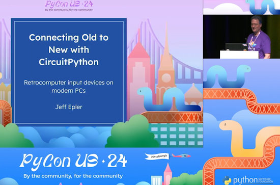](https://www.youtube.com/watch?v=XhwI8ZHhbE8&list=PL2Uw4_HvXqvYhjub9bw4uDAmNtprgAvlJ&index=134)

PyCon 2024 has published CircuitPythonista Jeff Epler's talk on Connecting Old to New with CircuitPython: Retrocomputer Input Devices on Modern PCs - [PyCon US 2024 YouTube](https://www.youtube.com/watch?v=XhwI8ZHhbE8&list=PL2Uw4_HvXqvYhjub9bw4uDAmNtprgAvlJ&index=134).

> "The input devices of decades past hold nostalgic value for many folks. But they don't need to merely sit on a shelf as museum objects—they can be reverse engineered and then adapted to modern computers without modifying the original hardware. CircuitPython... is an excellent language for projects like these, thanks to native USB Human Interface Device (HID) support and the ability to ‘bitbang’ archaic interfaces combined with the fast development cycle of an interpreted language, as you'll learn in case studies adapting these keyboards & mice."

## Tutorial: Writing MicroPython For Your Raspberry Pi Pico In a Web Browser With ViperIDE

Les Pounder walks through the steps of using the new ViperIDE web code editor to use MicroPython pn a Raspberry Pi Pico - [Tom's Hardware](https://www.tomshardware.com/raspberry-pi/raspberry-pi-pico/how-to-write-code-for-your-raspberry-pi-pico-in-your-web-browser-with-viperide).

> "You are not limited to just these two selections. ViperIDE also works with CircuitPython, and ESP boards, Adafruit, Seeed, and micro:bit microcontrollers."

## A GitHub Token Leak Could Have Put the Entire Python Language At Risk

[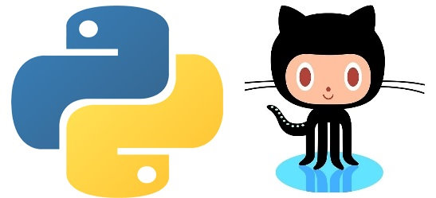](https://www.techradar.com/pro/security/github-token-leak-could-have-put-the-entire-python-language-at-risk)

Cybersecurity researchers discovered a GitHub Personal Access Token in a public Docker container hosted on Docker Hub, which granted elevated access to the GitHub repositories of the Python language, Python Package Index (PyPI), and the Python Software Foundation (PSF) - [TechRadar Pro](https://www.techradar.com/pro/security/github-token-leak-could-have-put-the-entire-python-language-at-risk).

> "According to PyPI, the token was issued before March 3, 2023, but the exact date is impossible to determine since the logs only last for 90 days. PyPI Admin Ee Durbin was notified on June 28 this year, after which the token was revoked."

## Nordic nRF54H20 SoC Now Sampling

[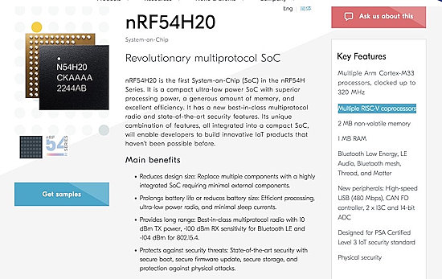](https://www.nordicsemi.com/Products/nRF54H20)

Nordic is now offering samples of it's new nRF54H20 chip. The device has multiple Cortex M33 processors, up to 320 MHz, and multiple RISC-V coprocessors (similar to Raspberry Pi PIO), Bluetooth, Thread, and Matter along with high-speed USB, CAN and I3C - [Nordic](https://www.nordicsemi.com/Products/nRF54H20) via [X](https://x.com/mkvenkit/status/1813082553483686176).

## Python Editor in Excel is Coming to More Users

[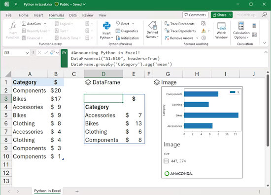](https://www.xda-developers.com/python-editor-excel-coming-users/)

With the Microsoft Excel Python Editor gaining traction among customers, Microsoft is integrating it directly into Excel as an in-the-box option, rather than an add-in - [XDA](https://www.xda-developers.com/python-editor-excel-coming-users/).

> "In this latest release, the Redmond firm has improved some productivity features and the appearance of the IDE too. For those who haven't used Python Editor before, each cell in the sheet is treated like a separate code block, similar to Jupyter Notebook."

## WIZnet Incorporating an RP2040, 2MB Flash and Ethernet Into One Chip

[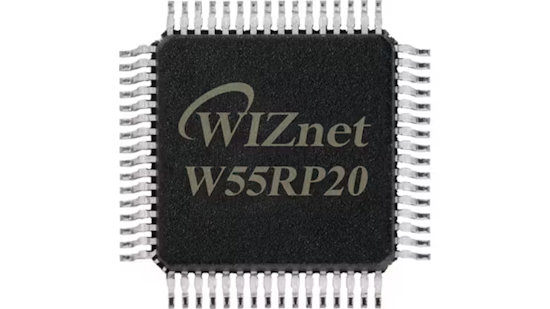](https://www.hackster.io/news/wiznet-puts-the-raspberry-pi-rp2040-and-its-w5500-ethernet-chip-in-a-blender-pours-out-the-ionic-2ed85ad4015b)

WIZnet has been posting on [X/Twitter] their new ioNIC chip which incorporates an RP2040 processor, 2MB flash and an Ethernet NIC+Phy into a single chip. WIZnet conformed they are buying RP2040 wafers from Raspberry Pi - [hackster.io](https://www.hackster.io/news/wiznet-puts-the-raspberry-pi-rp2040-and-its-w5500-ethernet-chip-in-a-blender-pours-out-the-ionic-2ed85ad4015b).

## The Linux Kernel 6.10 Has Officially Been Released

The Linux Kernel 6.10 has been officially released which introduces several new features and improved hardware support. Linux kernel 6.10 improves hardware support by adding new drivers or updating existing ones. Notable highlights include support for the Radxa ROCK 3C development board - [9to5Linux](https://9to5linux.com/linux-kernel-6-10-officially-released-this-is-whats-new).

## Fractal Releases Their 3D Print Files for Their North Pi Case

[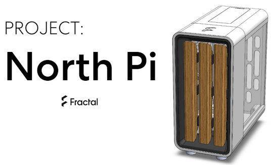](https://www.fractal-design.com/north-pi-3d-files/)

Fractal Design has desided to release the 3D files for their concept North Pi case (which fits a Raspberry Pi 3, 4, or 5) for hobby use - [Fractal Design](https://www.fractal-design.com/north-pi-3d-files/).

[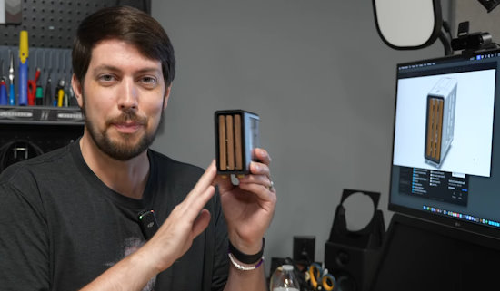](https://www.youtube.com/watch?v=ncyl7cTU9k8)

Jeff Geerling discusses the file release and how he printed out a case - [Jeff Geerling](https://www.youtube.com/watch?v=ncyl7cTU9k8).

## This Week's Python Streams

Python on Hardware is all about building a cooperative ecosphere which allows contributions to be valued and to grow knowledge. Below are the streams within the last week focusing on the community.

**CircuitPython Deep Dive Stream**

[Last Friday](link), Scott streamed work on {subject}.

You can see the latest video and past videos on the Adafruit YouTube channel under the Deep Dive playlist - [YouTube](https://www.youtube.com/playlist?list=PLjF7R1fz_OOXBHlu9msoXq2jQN4JpCk8A).

**CircuitPython Parsec**

John Park’s CircuitPython Parsec this week is on {subject} - [Adafruit Blog](link) and [YouTube](link).

Catch all the episodes in the [YouTube playlist](https://www.youtube.com/playlist?list=PLjF7R1fz_OOWFqZfqW9jlvQSIUmwn9lWr).

**CircuitPython Weekly Meeting**

CircuitPython Weekly Meeting for July 14, 2024 ([notes](https://github.com/adafruit/adafruit-circuitpython-weekly-meeting/blob/main/2024/2024-07-15.md)) [on YouTube](https://youtu.be/5dzgtOCrSOQ).

## Project of the Week: Measuring Power Usage on the RP2040 Chip Running CircuitPython

[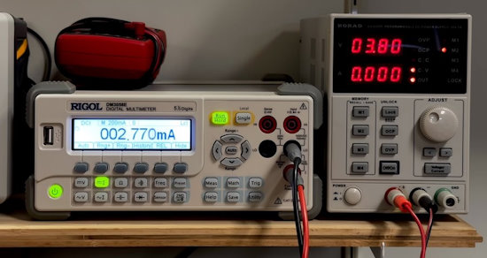](https://x.com/bradanlane/status/1811810602798420080)

Bradán Lane writes about power usage of the RP2040-based eChallenge coin running CircuitPython - [X](https://x.com/bradanlane/status/1811810602798420080).

> "By eChallengeCoin standards this (2.77mA) is horrible for deep sleep mode but for an RP2040 running CircuitPython and having a bucket full of attached hardware, this is impressive! Digging deeper, Adafruit measures the CircuitPython deep sleep on a PICO at 1.4mA. The accelerometer I am using for the Magic 8-Ball needs 1.5mA. Together, this measurement is in the ballpark."

## Popular Last Week

[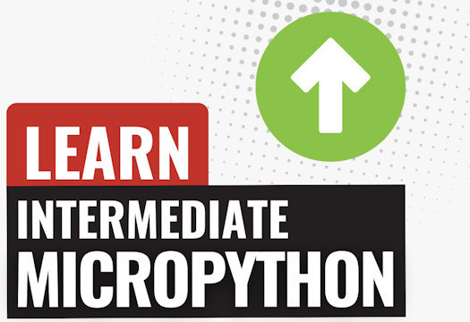](https://www.kevsrobots.com/learn/intermediate_micropython/)

What was the most popular, most clicked link, in [last week's newsletter](https://www.adafruitdaily.com/2024/07/15/python-on-microcontrollers-newsletter-circuitpython-9-1-released-arduino-adopts-qwiic-and-so-much-more-circuitpython-python-micropython-thepsf-raspberry_pi/)? [Introduction to Intermediate MicroPython](https://www.kevsrobots.com/learn/intermediate_micropython/).

## New Notes from Adafruit Playground

[Adafruit Playground](https://adafruit-playground.com/) is a new place for the community to post their projects and other making tips/tricks/techniques. Ad-free, it's an easy way to publish your work in a safe space for free.

[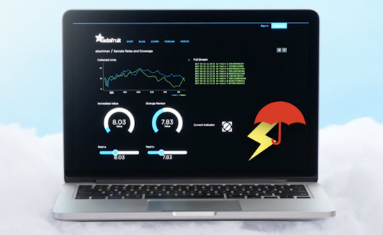](https://adafruit-playground.com/u/CGrover/pages/aio-weather-a-premium-alternative-for-local-observations)

AIO+ Weather: A Premium Alternative for Local Observations - [Adafruit Playground](https://adafruit-playground.com/u/CGrover/pages/aio-weather-a-premium-alternative-for-local-observations).

[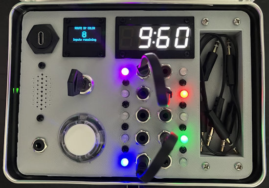](https://adafruit-playground.com/u/squid_jpg/pages/building-a-top-secret-lunchbox?embeds=allow)

Building a "Top-Secret" lunchbox - [Adafruit Playground](https://adafruit-playground.com/u/squid_jpg/pages/building-a-top-secret-lunchbox?embeds=allow).

## News From Around the Web

MIT OpenCourseWare: MIT 6.100L Introduction to CS and Programming using Python, online - [YouTube Playlist](https://www.youtube.com/playlist?list=PLUl4u3cNGP62A-ynp6v6-LGBCzeH3VAQB).

[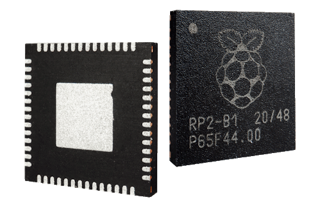](https://www.raspberrypi.com/news/new-rp2040-cmsis-pack/)

Raspberry Pi has announced their CMSIS Device Family Pack (DFP) with support for Raspberry Pi Pico and Raspberry Pi Pico W. The new DFP, allows use boards seamlessly with all of Arm’s CMSIS tools, including µVision - [Raspberry Pi News](https://www.raspberrypi.com/news/new-rp2040-cmsis-pack/).

[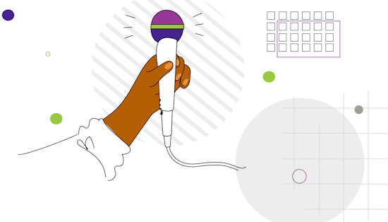](https://labs.quansight.org/blog/free-threaded-python-rollout)

Free-threaded CPython is ready to experiment with - [Quansight Labs](https://labs.quansight.org/blog/free-threaded-python-rollout) and [GitHub](https://py-free-threading.github.io/).

[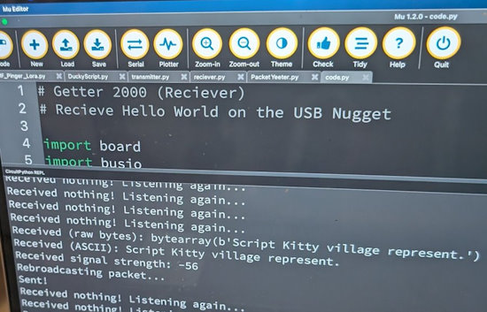](https://x.com/KodyKinzie/status/1813039572517069026/photo/1)

Kodi writes - [X](https://x.com/KodyKinzie/status/1813039572517069026/photo/1).

> "At my first LoRa class ever, I taught students how to send messages with Adafruit CircuitPython and our new LoRa breakout. I was really nervous it would be too difficult, but students were broadcasting LoRa packets repping our village way before the class was over!"

[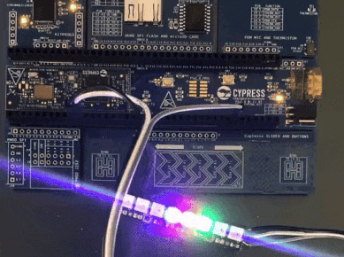](https://www.hackster.io/Infineon_Team/controlling-neopixels-with-micropython-1ca0d6)

Controlling NeoPixels with MicroPython - [hackster.io](https://www.hackster.io/Infineon_Team/controlling-neopixels-with-micropython-1ca0d6).

[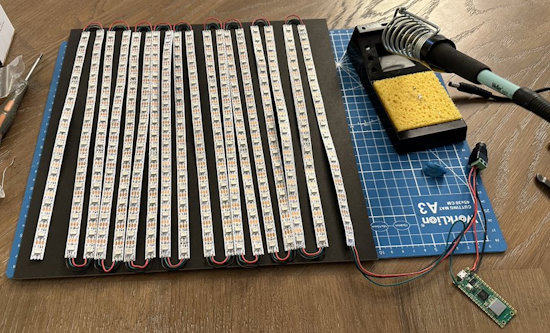](https://x.com/nerdymark/status/1813401702722334812)

X user NerdyMark makes a NeoPixel LED matrix driven by a Raspberry Pi Pico W. Running CircuitPython, it'll have a web interface to change modes and parameters. It's currently running Conway's Game of Life - [X](https://x.com/nerdymark/status/1813401702722334812).

[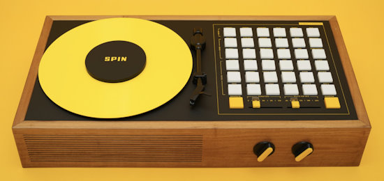](https://www.raspberrypi.com/news/spin-the-death-metal-disco-player-magpimonday/)

Spin: the death metal disco player with Raspberry Pi and Python - [Raspberry Pi News](https://www.raspberrypi.com/news/spin-the-death-metal-disco-player-magpimonday/).

[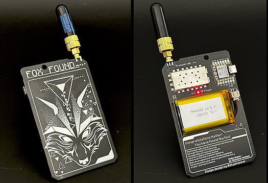](https://x.com/bradanlane/status/1812974489883537485)

A rot13labs "Fox Hint" badge from 2023 is converted to run CircuitPython - [X](https://x.com/bradanlane/status/1812974489883537485).

[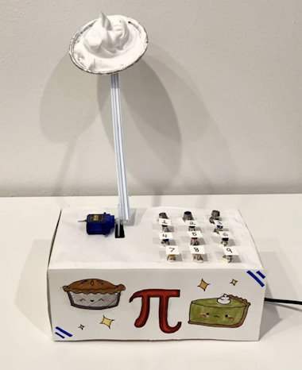](https://www.raspberrypi.com/news/get-pied-with-this-triple-pie-game/)

Be careful or you'll get pied with this triple Pi(e) game, using Raspberry Pi Pico and MicroPython - [Raspberry Pi News](https://www.raspberrypi.com/news/get-pied-with-this-triple-pie-game/).

A CircuitPython program running on a [Cytron Maker Nano RP2040](https://circuitpython.org/board/cytron_maker_nano_rp2040/) controlling six flexible 3V "filament" LEDs ([Adafruit nOOds](https://www.adafruit.com/product/5506)) with PWM brightness control and a simple transistor-based constant-current circuit - [Instructables](https://www.instructables.com/Constant-Current-Circuit-for-Flexible-Filament-LED/).

text - [site](url).

text - [site](url).

text - [site](url).

text - [site](url).

[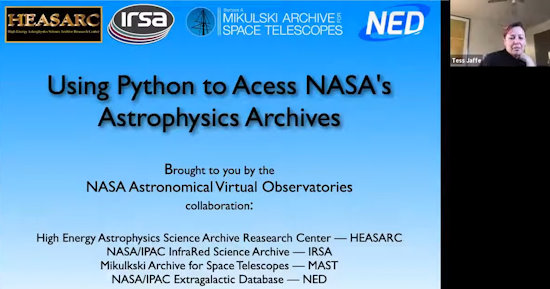](https://www.youtube.com/watch?v=fIvTQ2iZscU)

Using Python to access NASA's Astrophysics archives - [YouTube](https://www.youtube.com/watch?v=fIvTQ2iZscU).

Course on GitHub: LLM101n: Let's build a Storyteller AI LLM using Python, C, and CUDA - [GitHub](https://github.com/karpathy/LLM101n).

[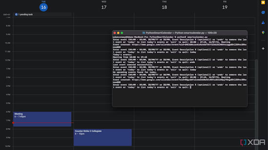](https://www.xda-developers.com/how-smart-google-calendar-python/)

How I made a smart Google Calendar management system with Python - [XDA](https://www.xda-developers.com/how-smart-google-calendar-python/).

## New

[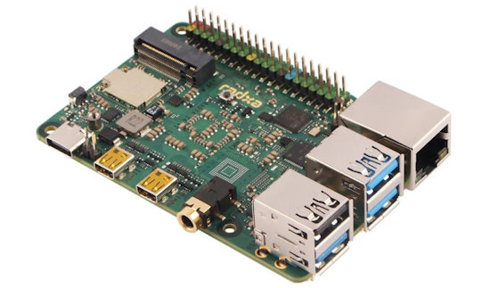](https://www.cnx-software.com/2024/07/19/radxa-x4-low-cost-credit-card-sized-intel-n100-sbc-raspberry-pi-5-alternative/)

Radxa X4 is a credit card-sized Intel Processor N100 single board computer (SBC) that costs almost the same as a Raspberry Pi 5 with the 4GB RAM model going for about $60 and the 8GB RAM variant around $80 - [CNX Software](https://www.cnx-software.com/2024/07/19/radxa-x4-low-cost-credit-card-sized-intel-n100-sbc-raspberry-pi-5-alternative/) and [Radxa Product Page](https://radxa.com/products/x/x4/).

> "The x86 SBC offers many of the same features as the Raspberry Pi 5 including dual micro HDMI output, four USB 3.2/2.0 ports, Ethernet and WiFi networking, and the 40-pin GPIO header handled through a Raspberry Pi RP2040 microcontroller.  Networking is better with 2.5GbE and WiFi 6, M.2 SSD support is built-in and four to eight times faster compared to PCIe HAT for the Pi 5, and the USB 3.2 ports are capable of 10 Gbps speed."

[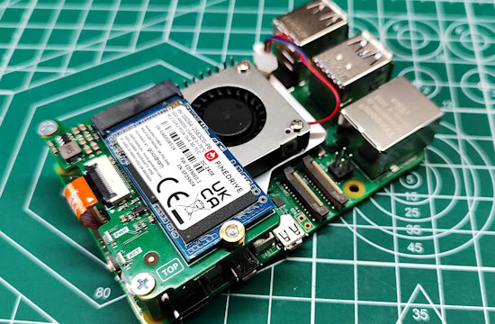](https://www.tomshardware.com/raspberry-pi/raspberry-pi-hats/pineboards-hatdrive-nano-review-low-cost-high-speed-storage-for-your-raspberry-pi-5)

Pineboards HatDrive! Nano Review: A low-cost, high-speed storage solution for your Raspberry Pi 5 - [Tom's Hardware](https://www.tomshardware.com/raspberry-pi/raspberry-pi-hats/pineboards-hatdrive-nano-review-low-cost-high-speed-storage-for-your-raspberry-pi-5).

[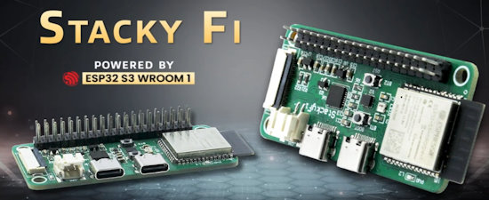](https://www.cnx-software.com/2024/07/17/stackyfi-esp32-s3-camera-board-40-pin-gpio-header-raspberry-pi-hat/)

A new Kickstarter: StackyFi ESP32-S3 board features camera connector, 40-pin GPIO header for Raspberry Pi HATs - [CNX Software](https://www.cnx-software.com/2024/07/17/stackyfi-esp32-s3-camera-board-40-pin-gpio-header-raspberry-pi-hat/) and [Kickstarter](https://www.kickstarter.com/projects/arushi/stackyfi-compact-solution-to-run-multiple-raspberry-pi-hats).

## New Boards Supported by CircuitPython

The number of supported microcontrollers and Single Board Computers (SBC) grows every week. This section outlines which boards have been included in CircuitPython or added to [CircuitPython.org](https://circuitpython.org/).

This week, there were (#/no) new boards added:

- [Board name](url)
- [Board name](url)
- [Board name](url)

*Note: For non-Adafruit boards, please use the support forums of the board manufacturer for assistance, as Adafruit does not have the hardware to assist in troubleshooting.*

Looking to add a new board to CircuitPython? It's highly encouraged! Adafruit has four guides to help you do so:

- [How to Add a New Board to CircuitPython](https://learn.adafruit.com/how-to-add-a-new-board-to-circuitpython/overview)
- [How to add a New Board to the circuitpython.org website](https://learn.adafruit.com/how-to-add-a-new-board-to-the-circuitpython-org-website)
- [Adding a Single Board Computer to PlatformDetect for Blinka](https://learn.adafruit.com/adding-a-single-board-computer-to-platformdetect-for-blinka)
- [Adding a Single Board Computer to Blinka](https://learn.adafruit.com/adding-a-single-board-computer-to-blinka)

## CircuitPython Libraries

The CircuitPython library numbers are continually increasing, while existing ones continue to be updated. Here we provide library numbers and updates!

To get the latest Adafruit libraries, download the [Adafruit CircuitPython Library Bundle](https://circuitpython.org/libraries). To get the latest community contributed libraries, download the [CircuitPython Community Bundle](https://circuitpython.org/libraries).

If you'd like to contribute to the CircuitPython project on the Python side of things, the libraries are a great place to start. Check out the [CircuitPython.org Contributing page](https://circuitpython.org/contributing). If you're interested in reviewing, check out Open Pull Requests. If you'd like to contribute code or documentation, check out Open Issues. We have a guide on [contributing to CircuitPython with Git and GitHub](https://learn.adafruit.com/contribute-to-circuitpython-with-git-and-github), and you can find us in the #help-with-circuitpython and #circuitpython-dev channels on the [Adafruit Discord](https://adafru.it/discord).

You can check out this [list of all the Adafruit CircuitPython libraries and drivers available](https://github.com/adafruit/Adafruit_CircuitPython_Bundle/blob/master/circuitpython_library_list.md). 

The current number of CircuitPython libraries is **###**!

**New Libraries**

Here's this week's new CircuitPython libraries:

* [library](url)

**Updated Libraries**

Here's this week's updated CircuitPython libraries:

* [library](url)

**Library PyPI Weekly Download Stats**

## What’s the CircuitPython team up to this week?

What is the team up to this week? Let’s check in:

**Dan**

I'm merging MicroPython v1.22.2 into CircuitPython, so we can pick up recent changes. After that, we'll do v1.23 and v1.24 if it arrives soon.

I'm also debugging some BLE issues. The first bug I'm looking at is an interoperability problem that's showing up when using the standard Nordic (BLE) UART service. If both boards are nRF or both Espressif, it works fine. But if the peripheral is Espressif and the central is nRF, it does not work. I have packet traces from over the air, and am now debugging with print statements inside the nRF implementation.

**Melissa**

text.

**Tim**

text.

**Jeff**

text.

**Scott**

This last week I've been working on [CircuitMatter](https://github.com/adafruit/circuitmatter). It is a pure Python implementation of some of the Matter IoT spec. Our goal is to have it portable between CircuitPython, CPython and (probably) MicroPython. I'm still working on the foundational packet handling and using unit tests to check my progress. 

**Liz**

This week I worked on a few product guides. The first was for the [RS-232 Pal](https://learn.adafruit.com/adafruit-rs232-pal). This breakout lets you interface with RS-232 hardware via UART with 3-5V logic. I wrote some demo code for both CircuitPython and Arduino that lets you type commands into the serial console to communicate with your RS-232 device. I used an HDMI switcher for testing. When I worked as an AV tech, I always saw those ports on equipment but never really knew what their purpose was.

I also worked on the [HDC3021 temperature and humidity sensor](https://learn.adafruit.com/adafruit-hdc3021-precision-temperature-humidity-sensor). This sensor has a CircuitPython library that I worked on. This sensor is really interesting because you can set high and low threshold alerts, as well as auto polling for reading the temperature and humidity.

## Upcoming Events

The next MicroPython Meetup in Melbourne will be on July 24 – [Meetup](https://www.meetup.com/micropython-meetup/events). You can see recordings of previous meetings on [YouTube](https://www.youtube.com/@MicroPythonOfficial). The June 2024 [Meeting Notes](https://melbournemicropythonmeetup.github.io/June-2024-Meetup/) and [Video](https://www.youtube.com/watch?v=2dKonAwLnB4).

PyOhio is being held July 27-28, 2024 in Cleveland, Ohio - [PyOhio](https://www.pyohio.org/2024/).

Espressif DevCon24 will be held Sep 3-5, 13:00-18:00 CEST. Call for presentations now - [Espressif](https://devcon.espressif.com/).

Maker Faire Bay Area returns to Mare Island Naval Shipyard on October 18-20, 2024 - [Maker Faire](https://makerfaire.com/bay-area/).

**Send Your Events In**

If you know of virtual events or upcoming events, please let us know via email to cpnews(at)adafruit(dot)com.

## Latest Releases

CircuitPython's stable release is [#.#.#](https://github.com/adafruit/circuitpython/releases/latest) and its unstable release is [#.#.#-##.#](https://github.com/adafruit/circuitpython/releases). New to CircuitPython? Start with our [Welcome to CircuitPython Guide](https://learn.adafruit.com/welcome-to-circuitpython).

[2024####](https://github.com/adafruit/Adafruit_CircuitPython_Bundle/releases/latest) is the latest Adafruit CircuitPython library bundle.

[2024####](https://github.com/adafruit/CircuitPython_Community_Bundle/releases/latest) is the latest CircuitPython Community library bundle.

[v#.#.#](https://micropython.org/download) is the latest MicroPython release. Documentation for it is [here](http://docs.micropython.org/en/latest/pyboard/).

[#.#.#](https://www.python.org/downloads/) is the latest Python release. The latest pre-release version is [#.#.#](https://www.python.org/download/pre-releases/).

[#,### Stars](https://github.com/adafruit/circuitpython/stargazers) Like CircuitPython? [Star it on GitHub!](https://github.com/adafruit/circuitpython)

## Call for Help -- Translating CircuitPython is now easier than ever

[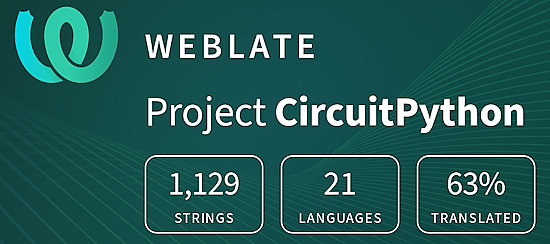](https://hosted.weblate.org/engage/circuitpython/)

One important feature of CircuitPython is translated control and error messages. With the help of fellow open source project [Weblate](https://weblate.org/), we're making it even easier to add or improve translations. 

Sign in with an existing account such as GitHub, Google or Facebook and start contributing through a simple web interface. No forks or pull requests needed! As always, if you run into trouble join us on [Discord](https://adafru.it/discord), we're here to help.

## NUMBER Thanks

The Adafruit Discord community, where we do all our CircuitPython development in the open, reached over NUMBER humans - thank you! Adafruit believes Discord offers a unique way for Python on hardware folks to connect. Join today at [https://adafru.it/discord](https://adafru.it/discord).

## ICYMI - In case you missed it

Python on hardware is the Adafruit Python video-newsletter-podcast! The news comes from the Python community, Discord, Adafruit communities and more and is broadcast on ASK an ENGINEER Wednesdays. The complete Python on Hardware weekly videocast [playlist is here](https://www.youtube.com/playlist?list=PLjF7R1fz_OOXRMjM7Sm0J2Xt6H81TdDev). The video podcast is on [iTunes](https://itunes.apple.com/us/podcast/python-on-hardware/id1451685192?mt=2), [YouTube](http://adafru.it/pohepisodes), [Instagram](https://www.instagram.com/adafruit/channel/)), and [XML](https://itunes.apple.com/us/podcast/python-on-hardware/id1451685192?mt=2).

[The weekly community chat on Adafruit Discord server CircuitPython channel - Audio / Podcast edition](https://itunes.apple.com/us/podcast/circuitpython-weekly-meeting/id1451685016) - Audio from the Discord chat space for CircuitPython, meetings are usually Mondays at 2pm ET, this is the audio version on [iTunes](https://itunes.apple.com/us/podcast/circuitpython-weekly-meeting/id1451685016), Pocket Casts, [Spotify](https://adafru.it/spotify), and [XML feed](https://adafruit-podcasts.s3.amazonaws.com/circuitpython_weekly_meeting/audio-podcast.xml).

## Contribute

The CircuitPython Weekly Newsletter is a CircuitPython community-run newsletter emailed every Monday. The complete [archives are here](https://www.adafruitdaily.com/category/circuitpython/). It highlights the latest CircuitPython related news from around the web including Python and MicroPython developments. To contribute, edit next week's draft [on GitHub](https://github.com/adafruit/circuitpython-weekly-newsletter/tree/gh-pages/_drafts) and [submit a pull request](https://help.github.com/articles/editing-files-in-your-repository/) with the changes. You may also tag your information on Twitter with #CircuitPython. 

Join the Adafruit [Discord](https://adafru.it/discord) or [post to the forum](https://forums.adafruit.com/viewforum.php?f=60) if you have questions.
