- [ ] Library and info updates
- [ ] change date
- [ ] update title
- [ ] Feature story
- [ ] Update  for images
- [ ] Update ICYDNCI
- [ ] All images 550w max only
- [ ] Link "View this email in your browser."

News Sources

- [Adafruit Playground](https://adafruit-playground.com/)
- Twitter: [CircuitPython](https://twitter.com/search?q=circuitpython&src=typed_query&f=live), [MicroPython](https://twitter.com/search?q=micropython&src=typed_query&f=live) and [Python](https://twitter.com/search?q=python&src=typed_query)
- [Raspberry Pi News](https://www.raspberrypi.com/news/)
- Mastodon [CircuitPython](https://octodon.social/tags/CircuitPython) and [MicroPython](https://octodon.social/tags/MicroPython)
- [hackster.io CircuitPython](https://www.hackster.io/search?q=circuitpython&i=projects&sort_by=most_recent) and [MicroPython](https://www.hackster.io/search?q=micropython&i=projects&sort_by=most_recent)
- YouTube: [CircuitPython](https://www.youtube.com/results?search_query=circuitpython&sp=CAI%253D), [MicroPython](https://www.youtube.com/results?search_query=micropython&sp=CAI%253D)
- Instructables: [CircuitPython](https://www.instructables.com/search/?q=circuitpython&projects=all&sort=Newest), [MicroPython](https://www.instructables.com/search/?q=micropython&projects=all&sort=Newest), [Raspberry Pi Python](https://www.instructables.com/search/?q=raspberry+pi+python&projects=all&sort=Newest)
- [python.org](https://www.python.org/)
- [Python Insider - dev team blog](https://pythoninsider.blogspot.com/)
- Individuals: [Jeff Geerling](https://www.jeffgeerling.com/blog)
- Tom's Hardware: [CircuitPython](https://www.tomshardware.com/search?searchTerm=circuitpython&articleType=all&sortBy=publishedDate) and [MicroPython](https://www.tomshardware.com/search?searchTerm=micropython&articleType=all&sortBy=publishedDate) and [Raspberry Pi](https://www.tomshardware.com/search?searchTerm=raspberry%20pi&articleType=all&sortBy=publishedDate)
- [hackaday.io newest projects MicroPython](https://hackaday.io/projects?tag=micropython&sort=date) and [CircuitPython](https://hackaday.io/projects?tag=circuitpython&sort=date)
- [Google News Python](https://news.google.com/topics/CAAqIQgKIhtDQkFTRGdvSUwyMHZNRFY2TVY4U0FtVnVLQUFQAQ?hl=en-US&gl=US&ceid=US%3Aen)
- [hackaday CircuitPython](https://hackaday.com/blog/?s=circuitpython) and [MicroPython](https://hackaday.com/blog/?s=micropython)
- hackaday.io - [CircuitPython](https://hackaday.io/search?term=circuitpython) and [MicroPython](https://hackaday.io/search?term=micropython)

View this email in your browser. **Warning: Flashing Imagery**

Welcome to the latest Python on Microcontrollers newsletter! *insert 2-3 sentences from editor (what's in overview, banter)* - *Anne Barela, Editor*

We're on [Discord](https://discord.gg/HYqvREz), [Twitter](https://twitter.com/search?q=circuitpython&src=typed_query&f=live), and for past newsletters - [view them all here](https://www.adafruitdaily.com/category/circuitpython/). If you're reading this on the web, [subscribe here](https://www.adafruitdaily.com/). Here's the news this week:

## Headline

text - [site](url).

## What’s new in Raspberry Pi Pico 2

[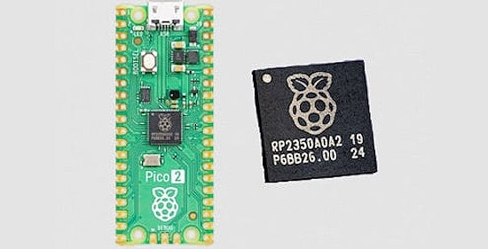](https://www.raspberrypi.com/news/whats-new-in-pico-2/)

In the latest issue of [The MagPi Magazine](https://magpi.raspberrypi.com/issues/145), Raspberry Pi CTO James Adams provides a closer look at what’s new in Raspberry Pi Pico 2 - [Raspberry Pi News](https://www.raspberrypi.com/news/whats-new-in-pico-2/).

[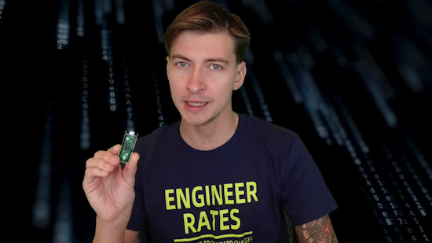](https://www.youtube.com/watch?v=3_URFz4GSsU)

5 Ways Pi Pico 2 takes your projects to the next level - [YouTube](https://www.youtube.com/watch?v=3_URFz4GSsU).

## Is it time to update the Open Hardware Definition for AI or make a parallel one for AI?

[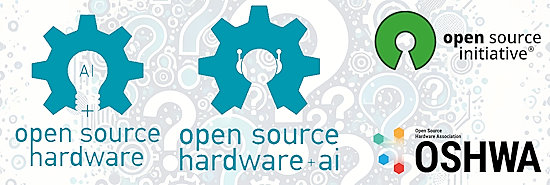](https://blog.adafruit.com/2024/08/27/is-it-time-to-update-the-open-hardware-definition-for-ai-or-make-a-parallel-one-for-ai/)

It might be time to update the Open Hardware Definition, it’s over 10 years old (here is my post on MAKE Magazine from February 10th, 2011). A lot has changed in the last 10+ years for open-source hardware and open-source software, and some things have not! There was/is an Open Source Hardware (OSHW) Definition 1.1 draft, but has not been updated on the wiki since December 10, 2018. Phil Torrone has some suggestions - [Adafruit Blog](https://blog.adafruit.com/2024/08/27/is-it-time-to-update-the-open-hardware-definition-for-ai-or-make-a-parallel-one-for-ai/).

> "While there are a few things I’d update on the Open Hardware Definition 1.0 my focus is on adding something to address AI/ChatGPT/humans working with LLMs, etc. I’m going to propose the same thing that I’ve attempted to have the Open Source Initiative consider for their OSI + AI license / definition. Here’s a blog post about that as well. The goal is sharing which exact tools were used and in what ways to allow others to replicate (and iterate) with AI/LLMs, etc. it’s a little different than commenting code, or publishing code under an open-source license, but the intent can be the same. My addition to the definition is specific to this "freedom": "Study how the system works and inspect its components." The OSI + AI definition at this time leaves out the inspection of prompts and data access transparency."

## Feature

text - [site](url).

## The New 2GB Pi 5 has a 33% Smaller Die with a 30% Idle Power Savings

[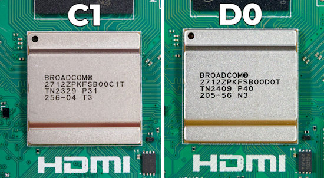](https://www.jeffgeerling.com/blog/2024/new-2gb-pi-5-has-33-smaller-die-30-idle-power-savings)

Jeff Geerling does a deep dive into the D0 stepping of the Raspberry Pi 5 CPU to find it's smaller, resulting in power savings over older C1 chips used in boards with 4 and 8GB of memory - [Jeff Geerling](https://www.jeffgeerling.com/blog/2024/new-2gb-pi-5-has-33-smaller-die-30-idle-power-savings) and [Tom's Hardware](https://www.tomshardware.com/raspberry-pi/raspberry-pi-5-2gb-delid-uncovers-dark-silicon-and-improved-power-performance).

## Compiling Rust, GoLang, Zig, or WebAssembly to MicroPython MPY modules

[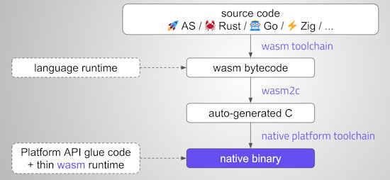](https://github.com/orgs/micropython/discussions/15702)

Volodymyr Shymanskyy, developer of the ViperIDE editor, has discovered that MicroPython has the ability to compile plain C code into a dynamically loadable .mpy file. This revelation sparked an idea and he has now created a bare-bones example demonstrating how to convert a WASM file into a MPY module and run it dynamically on a Raspberry Pi Pico - [GitHub](https://github.com/orgs/micropython/discussions/15702) and wasm2mpy - [GitHub](https://github.com/vshymanskyy/wasm2mpy).

## This Week's Python Streams

Python on Hardware is all about building a cooperative ecosphere which allows contributions to be valued and to grow knowledge. Below are the streams within the last week focusing on the community.

**CircuitPython Deep Dive Stream**

[Last Friday](link), Tim streamed work on {subject}.

You can see the latest video and past videos on the Adafruit YouTube channel under the Deep Dive playlist - [YouTube](https://www.youtube.com/playlist?list=PLjF7R1fz_OOXBHlu9msoXq2jQN4JpCk8A).

**CircuitPython Parsec**

John Park’s CircuitPython Parsec this week is on {subject} - [Adafruit Blog](link) and [YouTube](link).

Catch all the episodes in the [YouTube playlist](https://www.youtube.com/playlist?list=PLjF7R1fz_OOWFqZfqW9jlvQSIUmwn9lWr).

**CircuitPython Weekly Meeting**

CircuitPython Weekly Meeting for {date} ([notes](file)) [on YouTube](link).

## Project of the Week: Bald SENSE Wing

[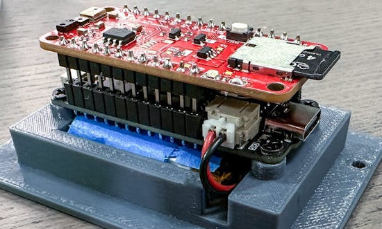](https://www.hackster.io/news/bald-sense-wing-monitors-and-logs-environmental-data-with-feather-microcontrollers-and-circuitpython-8cba2c974ba8)

James Lewis (@baldengineer) has developed an open source FeatherWing has temperature, humidity, light, color, proximity, and sound-sensing for environmental monitoring. CircuitPython was used for rapid development to verify the board - [hackster.io](https://www.hackster.io/news/bald-sense-wing-monitors-and-logs-environmental-data-with-feather-microcontrollers-and-circuitpython-8cba2c974ba8), [GitHub](https://github.com/baldengineer/BaldSENSE_Sensor_Feather_Wing), [Blog Post](https://www.addohms.com/diy-versus-turnkey-pcb-assembly-with-bald-sense-and-macrofab/) and [YouTube](https://youtu.be/cIrElRTOhco).

## Popular Last Week

[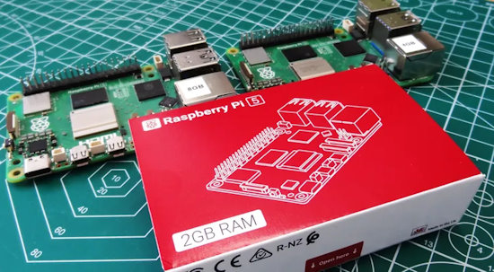](https://www.tomshardware.com/raspberry-pi/raspberry-pi-5s-new-2gb-model-benchmarked-do-you-need-2-4-or-8gb-we-test-against-the-4-and-8gb-versions)

What was the most popular, most clicked link, in [last week's newsletter](https://www.adafruitdaily.com/2024/08/26/python-on-microcontrollers-newsletter-the-raspberry-pi-rp2350-speeds-up-circuitpython-and-micropython-projects-circuitpython-python-micropython-thepsf-raspberry_pi/)? [Raspberry Pi 5’s new 2GB model benchmarked](https://www.tomshardware.com/raspberry-pi/raspberry-pi-5s-new-2gb-model-benchmarked-do-you-need-2-4-or-8gb-we-test-against-the-4-and-8gb-versions).

## New Notes from Adafruit Playground

[Adafruit Playground](https://adafruit-playground.com/) is a new place for the community to post their projects and other making tips/tricks/techniques. Ad-free, it's an easy way to publish your work in a safe space for free.

[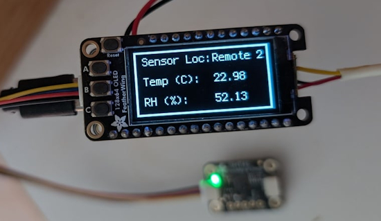](url)

text - [Adafruit Playground](url).

text - [Adafruit Playground](url).

text - [Adafruit Playground](url).

## News From Around the Web

[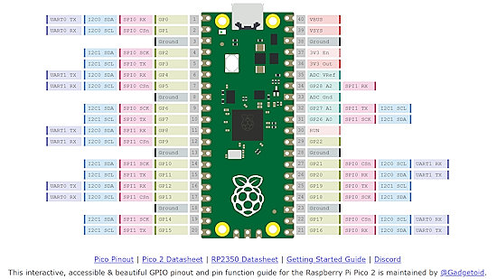](https://pico2.pinout.xyz/)

Gadgetoid has placed a reference pinout of the Raspberry Pi Pico board on pinout.xyz - [pinout.xyz](https://pico2.pinout.xyz/).

PyCon US 2024 has now released 211 videos from this Summer's conference - [YouTube](https://www.youtube.com/playlist?list=PL2Uw4_HvXqvYhjub9bw4uDAmNtprgAvlJ).

[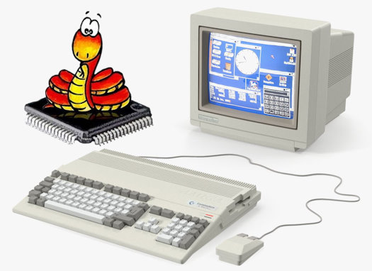](https://aminet.net/package/dev/misc/AmigaMicropython)

New: MicroPython on Classic Amiga, by Jean-Yves Oberlé, "still incomplete but you can start fiddling with it" - [aminet](https://aminet.net/package/dev/misc/AmigaMicropython) and source code - [GitHub](https://github.com/jyoberle/micropython-amiga).

[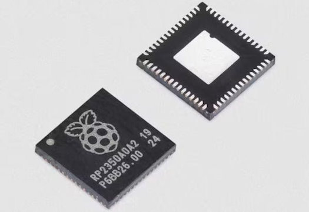](https://www.hackster.io/news/earle-f-philhower-iii-brings-the-arduino-pico-core-to-v4-0-1-adds-rp2350-and-pico-2-support-df2940f52792)

Earle F. Philhower, III Brings the Arduino Pico Core to V4.0.1, Adds RP2350 and Pico 2 Support - [GitHub](https://github.com/earlephilhower/arduino-pico/releases/tag/4.0.1) and [hackster.io](https://www.hackster.io/news/earle-f-philhower-iii-brings-the-arduino-pico-core-to-v4-0-1-adds-rp2350-and-pico-2-support-df2940f52792).

text - [site](url).

text - [site](url).

text - [site](url).

text - [site](url).

Mike Bell designed the RISC-V “Nano V” processor and ported MicroPython for Tiny Tapeout - [Mastodon](https://octodon.social/@mike@rebel-lion.uk/112864886454430377).

text - [site](url).

text - [site](url).

text - [site](url).

text - [site](url).

text - [site](url).

text - [site](url).

text - [site](url).

[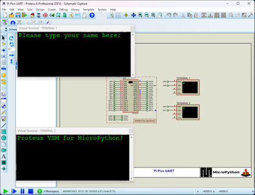](https://www.labcenter.com/buy-vsm/#micropython)

Proteus recently announced support running MicroPython on their simulated microcontrollers, including Pi Pico and ESP32-S3-DEVKITC-1 - [Proteus](https://www.labcenter.com/buy-vsm/#micropython).

text - [site](url).

## New

[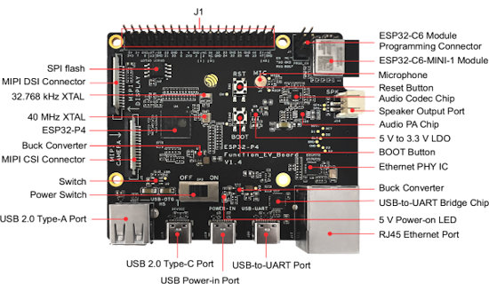](https://www.aliexpress.us/item/3256807278060486.html)

The ESP32-P4 is in limited availability as the ESP32-P4 Function EV Board in some AliExpress shops with notes that they are engineering samples with the ADC uncalibrated - [AliExpress](https://www.aliexpress.us/item/3256807278060486.html).

Note: Brian of Tulip has a CircuitPython port in progress and Matt Trentini has a MicroPython port in progress.

[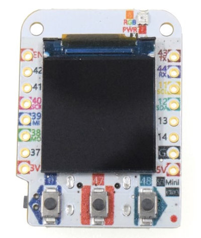](https://www.wemos.cc/en/latest/s3/s3_mini_pro.html)

The S3 Mini Pro is the latest addition to the Wemos ‘D1’ range. It has an ESP32-S3, 2MB PSRAM, 4MB flash, 128x128 0.85” LCD (GC9107), 6-axis IMU, 3x buttons, 1x RGB LED, 1xIR LED, and a colorful PCB - [Wemos](https://www.wemos.cc/en/latest/s3/s3_mini_pro.html) via [Mastodon](https://xoxo.zone/@scruss/112872399781287736).

## New Boards Supported by CircuitPython

The number of supported microcontrollers and Single Board Computers (SBC) grows every week. This section outlines which boards have been included in CircuitPython or added to [CircuitPython.org](https://circuitpython.org/).

This week, there were (#/no) new boards added:

- [Board name](url)
- [Board name](url)
- [Board name](url)

*Note: For non-Adafruit boards, please use the support forums of the board manufacturer for assistance, as Adafruit does not have the hardware to assist in troubleshooting.*

Looking to add a new board to CircuitPython? It's highly encouraged! Adafruit has four guides to help you do so:

- [How to Add a New Board to CircuitPython](https://learn.adafruit.com/how-to-add-a-new-board-to-circuitpython/overview)
- [How to add a New Board to the circuitpython.org website](https://learn.adafruit.com/how-to-add-a-new-board-to-the-circuitpython-org-website)
- [Adding a Single Board Computer to PlatformDetect for Blinka](https://learn.adafruit.com/adding-a-single-board-computer-to-platformdetect-for-blinka)
- [Adding a Single Board Computer to Blinka](https://learn.adafruit.com/adding-a-single-board-computer-to-blinka)

## New Learn Guides

[title](url) from [name](url)

[title](url) from [name](url)

[title](url) from [name](url)

## Updated Learn Guides

[title](url)

## CircuitPython Libraries

The CircuitPython library numbers are continually increasing, while existing ones continue to be updated. Here we provide library numbers and updates!

To get the latest Adafruit libraries, download the [Adafruit CircuitPython Library Bundle](https://circuitpython.org/libraries). To get the latest community contributed libraries, download the [CircuitPython Community Bundle](https://circuitpython.org/libraries).

If you'd like to contribute to the CircuitPython project on the Python side of things, the libraries are a great place to start. Check out the [CircuitPython.org Contributing page](https://circuitpython.org/contributing). If you're interested in reviewing, check out Open Pull Requests. If you'd like to contribute code or documentation, check out Open Issues. We have a guide on [contributing to CircuitPython with Git and GitHub](https://learn.adafruit.com/contribute-to-circuitpython-with-git-and-github), and you can find us in the #help-with-circuitpython and #circuitpython-dev channels on the [Adafruit Discord](https://adafru.it/discord).

You can check out this [list of all the Adafruit CircuitPython libraries and drivers available](https://github.com/adafruit/Adafruit_CircuitPython_Bundle/blob/master/circuitpython_library_list.md). 

The current number of CircuitPython libraries is **###**!

**New Libraries**

Here's this week's new CircuitPython libraries:

* [library](url)

**Updated Libraries**

Here's this week's updated CircuitPython libraries:

* [library](url)

**Library PyPI Weekly Download Stats**

## What’s the CircuitPython team up to this week?

What is the team up to this week? Let’s check in:

**Dan**

text.

**Melissa**

text.

**Tim**

text.

**Jeff**

I was away for about 4 weeks. The bulk of that time I was on a couple of photo safaris in Kenya and Tanzania. If you're interested [check out some photos from my trip](https://photos.app.goo.gl/iRKHTAnWUtqagW34A). To whet your appetite, here's an elephant crossing a dirt road just feet from our vehicle:

I'm back now and working on the list of issues we've targeted to fix before the release of 9.2.0 stable. First up was improving error reporting for analogbufio on Espressif-family microcontrollers when an unsupported sample rate is requested.

**Scott**

I was mostly out in the last week to spend time with visiting family. The rest of the time I've been fixing bugs in order to get 9.2.0 ready for release. Most of the fixes are in 9.1.x releases as well. The most recent fix of mine was speeding up the flash and PSRAM connection on the Qualia to reduce the display glitching. The speeds now match the ones used in 9.0.x. They were slowed in 9.1.x due to the risk of instability when the temperature changed.

**Liz**

text.

## Upcoming Events

Espressif DevCon24 will be held Sep 3-5, 13:00-18:00 CEST. Call for presentations now - [Espressif](https://devcon.espressif.com/).

The next MicroPython Meetup in Melbourne will be on September 25th – [Meetup](https://www.meetup.com/micropython-meetup/events). You can see recordings of previous meetings on [YouTube](https://www.youtube.com/@MicroPythonOfficial). The August 2024 [Roundup](https://melbournemicropythonmeetup.github.io/August-2024-Meetup/).

Maker Faire Bay Area returns to Mare Island Naval Shipyard on October 18-20, 2024 - [Maker Faire](https://makerfaire.com/bay-area/).

Hackaday Superconference is an epic gathering of hardware hackers, makers, and tech enthusiasts happening November 1-3 in Pasadena, California - [Hackaday](https://hackaday.com/2024/08/06/tickets-for-supercon-2024-go-on-sale-now/) and [Eventbrite](https://www.eventbrite.com/e/2024-hackaday-superconference-tickets-965387338517).

PyCon AU will be held from the 22nd to the 26th of November at the Melbourne Convention and Exhibition Centre (MCEC) in Narrm/Melbourne. Matt Trentini and Damien George will both be presennting on MicroPython - [PyCon AU](https://2024.pycon.org.au/).

PyLadies Conference (PyLadiesCon) is a transformative event designed to promote diversity, learning, and empowerment within the Python community. December 6-8, 2024 online - [PyLadies](https://conference.pyladies.com/).

**Send Your Events In**

If you know of virtual events or upcoming events, please let us know via email to cpnews(at)adafruit(dot)com.

## Latest Releases

CircuitPython's stable release is [#.#.#](https://github.com/adafruit/circuitpython/releases/latest) and its unstable release is [#.#.#-##.#](https://github.com/adafruit/circuitpython/releases). New to CircuitPython? Start with our [Welcome to CircuitPython Guide](https://learn.adafruit.com/welcome-to-circuitpython).

[2024####](https://github.com/adafruit/Adafruit_CircuitPython_Bundle/releases/latest) is the latest Adafruit CircuitPython library bundle.

[2024####](https://github.com/adafruit/CircuitPython_Community_Bundle/releases/latest) is the latest CircuitPython Community library bundle.

[v#.#.#](https://micropython.org/download) is the latest MicroPython release. Documentation for it is [here](http://docs.micropython.org/en/latest/pyboard/).

[#.#.#](https://www.python.org/downloads/) is the latest Python release. The latest pre-release version is [#.#.#](https://www.python.org/download/pre-releases/).

[#,### Stars](https://github.com/adafruit/circuitpython/stargazers) Like CircuitPython? [Star it on GitHub!](https://github.com/adafruit/circuitpython)

## Call for Help -- Translating CircuitPython is now easier than ever

[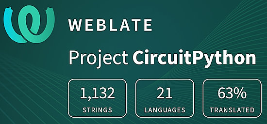](https://hosted.weblate.org/engage/circuitpython/)

One important feature of CircuitPython is translated control and error messages. With the help of fellow open source project [Weblate](https://weblate.org/), we're making it even easier to add or improve translations. 

Sign in with an existing account such as GitHub, Google or Facebook and start contributing through a simple web interface. No forks or pull requests needed! As always, if you run into trouble join us on [Discord](https://adafru.it/discord), we're here to help.

## NUMBER Thanks

The Adafruit Discord community, where we do all our CircuitPython development in the open, reached over NUMBER humans - thank you! Adafruit believes Discord offers a unique way for Python on hardware folks to connect. Join today at [https://adafru.it/discord](https://adafru.it/discord).

## ICYMI - In case you missed it

Python on hardware is the Adafruit Python video-newsletter-podcast! The news comes from the Python community, Discord, Adafruit communities and more and is broadcast on ASK an ENGINEER Wednesdays. The complete Python on Hardware weekly videocast [playlist is here](https://www.youtube.com/playlist?list=PLjF7R1fz_OOXRMjM7Sm0J2Xt6H81TdDev). The video podcast is on [iTunes](https://itunes.apple.com/us/podcast/python-on-hardware/id1451685192?mt=2), [YouTube](http://adafru.it/pohepisodes), [Instagram](https://www.instagram.com/adafruit/channel/)), and [XML](https://itunes.apple.com/us/podcast/python-on-hardware/id1451685192?mt=2).

[The weekly community chat on Adafruit Discord server CircuitPython channel - Audio / Podcast edition](https://itunes.apple.com/us/podcast/circuitpython-weekly-meeting/id1451685016) - Audio from the Discord chat space for CircuitPython, meetings are usually Mondays at 2pm ET, this is the audio version on [iTunes](https://itunes.apple.com/us/podcast/circuitpython-weekly-meeting/id1451685016), Pocket Casts, [Spotify](https://adafru.it/spotify), and [XML feed](https://adafruit-podcasts.s3.amazonaws.com/circuitpython_weekly_meeting/audio-podcast.xml).

## Contribute

The CircuitPython Weekly Newsletter is a CircuitPython community-run newsletter emailed every Monday. The complete [archives are here](https://www.adafruitdaily.com/category/circuitpython/). It highlights the latest CircuitPython related news from around the web including Python and MicroPython developments. To contribute, edit next week's draft [on GitHub](https://github.com/adafruit/circuitpython-weekly-newsletter/tree/gh-pages/_drafts) and [submit a pull request](https://help.github.com/articles/editing-files-in-your-repository/) with the changes. You may also tag your information on Twitter with #CircuitPython. 

Join the Adafruit [Discord](https://adafru.it/discord) or [post to the forum](https://forums.adafruit.com/viewforum.php?f=60) if you have questions.
