- [ ] Library and info updates
- [ ] change date
- [ ] update title
- [ ] Feature story
- [ ] Update  for images
- [ ] Update ICYDNCI
- [ ] All images 550w max only
- [ ] Link "View this email in your browser."

News Sources

- [Adafruit Playground](https://adafruit-playground.com/)
- Twitter: [CircuitPython](https://twitter.com/search?q=circuitpython&src=typed_query&f=live), [MicroPython](https://twitter.com/search?q=micropython&src=typed_query&f=live) and [Python](https://twitter.com/search?q=python&src=typed_query)
- [Raspberry Pi News](https://www.raspberrypi.com/news/)
- Mastodon [CircuitPython](https://octodon.social/tags/CircuitPython) and [MicroPython](https://octodon.social/tags/MicroPython)
- [hackster.io CircuitPython](https://www.hackster.io/search?q=circuitpython&i=projects&sort_by=most_recent) and [MicroPython](https://www.hackster.io/search?q=micropython&i=projects&sort_by=most_recent)
- YouTube: [CircuitPython](https://www.youtube.com/results?search_query=circuitpython&sp=CAI%253D), [MicroPython](https://www.youtube.com/results?search_query=micropython&sp=CAI%253D)
- Instructables: [CircuitPython](https://www.instructables.com/search/?q=circuitpython&projects=all&sort=Newest), [MicroPython](https://www.instructables.com/search/?q=micropython&projects=all&sort=Newest), [Raspberry Pi Python](https://www.instructables.com/search/?q=raspberry+pi+python&projects=all&sort=Newest)
- [python.org](https://www.python.org/)
- [Python Insider - dev team blog](https://pythoninsider.blogspot.com/)
- Individuals: [Jeff Geerling](https://www.jeffgeerling.com/blog)
- Tom's Hardware: [CircuitPython](https://www.tomshardware.com/search?searchTerm=circuitpython&articleType=all&sortBy=publishedDate) and [MicroPython](https://www.tomshardware.com/search?searchTerm=micropython&articleType=all&sortBy=publishedDate) and [Raspberry Pi](https://www.tomshardware.com/search?searchTerm=raspberry%20pi&articleType=all&sortBy=publishedDate)
- [hackaday.io newest projects MicroPython](https://hackaday.io/projects?tag=micropython&sort=date) and [CircuitPython](https://hackaday.io/projects?tag=circuitpython&sort=date)
- [Google News Python](https://news.google.com/topics/CAAqIQgKIhtDQkFTRGdvSUwyMHZNRFY2TVY4U0FtVnVLQUFQAQ?hl=en-US&gl=US&ceid=US%3Aen)
- [hackaday CircuitPython](https://hackaday.com/blog/?s=circuitpython) and [MicroPython](https://hackaday.com/blog/?s=micropython)
- hackaday.io - [CircuitPython](https://hackaday.io/search?term=circuitpython) and [MicroPython](https://hackaday.io/search?term=micropython)

View this email in your browser. **Warning: Flashing Imagery**

Welcome to the latest Python on Microcontrollers newsletter! *insert 2-3 sentences from editor (what's in overview, banter)* - *Anne Barela, Editor*

We're on [Discord](https://discord.gg/HYqvREz), [Twitter](https://twitter.com/search?q=circuitpython&src=typed_query&f=live), and for past newsletters - [view them all here](https://www.adafruitdaily.com/category/circuitpython/). If you're reading this on the web, [subscribe here](https://www.adafruitdaily.com/). Here's the news this week:

## MicroPython v1.24.0 Released

[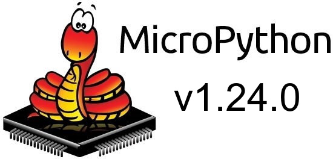](https://github.com/micropython/micropython/releases/tag/v1.24.0)

MicroPython v1.24.0 adds support for the new Raspberry Pi RP2350 MCU, improved RISC-V support with native code generation, support for ESP32-C6 MCUs, updates the Zephyr version with threading support, unified TinyUSB bindings across ports, a portable UART IRQ API, and enhanced mpremote recursive copy. There are also numerous bug fixes, enhancements to the test suite and more attention to testing of the machine module and its API. Read on for more details.

Support for the RISC-V architecture has been significantly extended, to include an RV32IMC native code emitter, native NLR and GC register scanning implementations for 32- and 64-bit RISC-V, support for placing RV32IMC native code in .mpy files and also freezing it, and RISC-V semihosting support. Testing for RISC-V is done with the qemu and unix ports, and the support is utilised in the esp32 and rp2 ports.

There is now support concatenation of adjacent f-strings, as well as raw f-strings. There is also a new micropython.RingIO class which provides a stream interface to an efficient, thread-safe, byte-oriented ring-buffer implementation.

All the ports that use TinyUSB have now been unified to use the same shared helper code for CDC serial. This includes: esp32 (S2 and S3), mimxrt, renesas-ra, rp2 and samd ports. With this has come the useful feature that the startup CDC serial data is buffered and then sent to the host upon connection. This means that (among other things) the REPL banner and initial prompt is now seen on first connection to a board - [GitHub Release Notes](https://github.com/micropython/micropython/releases/tag/v1.24.0).

## A New Release of Raspberry Pi OS

[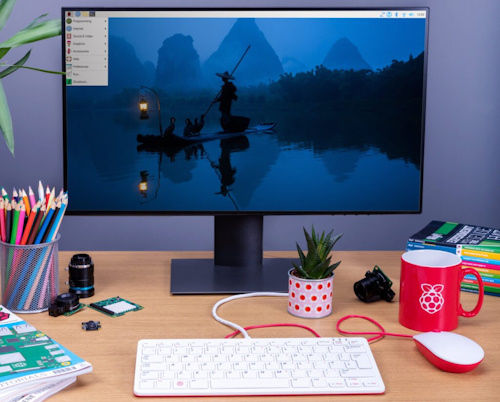](https://www.raspberrypi.com/news/a-new-release-of-raspberry-pi-os/)

Raspberry Pi has released a new version of Raspberry Pi OS. This version includes a significant change, albeit one that we hope most people won’t even notice. The Wayland compositor for window handling is now turned on by default for all models - [Raspberry Pi News](https://www.raspberrypi.com/news/a-new-release-of-raspberry-pi-os/l).

> "For most of this year, we have been working on porting labwc to the Raspberry Pi Desktop. This has very much been a collaborative process with the developers of both labwc and wlroots: both have helped us immensely with their support as we contribute features and optimisations needed for our desktop. After much optimisation for our hardware, we have reached the point where labwc desktops run just as fast as X on older Raspberry Pi models. Today, we make the switch with our latest desktop image: Raspberry Pi Desktop now runs Wayland by default across all models. When you update an existing installation of Bookworm, you will see a prompt asking to switch to labwc the next time you reboot."

## CircuitPython 9.2.0 Released

CircuitPython 9.2.0, the latest minor revision of CircuitPython (although packed with enough for a major step), is a new stable release. - [Adafruit Blog](https://blog.adafruit.com/2024/10/28/circuitpython-9-2-0-released/) and [GitHub Release Notes](https://github.com/adafruit/circuitpython/releases/tag/9.2.0).

**Highlights of this release**
- Fix RP2350 cache invalidation for PSRAM.

**Notable changes in 9.2.0 from 9.1.x**
- Raspberry Pi RP2350 support.
- Update to Espressif ESP-IDF V5.3.1, including new I2C driver.
- Merge MicroPython updates from v1.22.2 and v1.23.
- Espressif BLE improvements.
- Add `math.dist()`.
- `_eve` updates.
- New `busio.I2C.probe()` and `bitbangio.I2C.probe()` methods to check for a single device address.
- ESP32-S3: implement `sdioio`.
- New `audiodelay`s and `audiofilters` modules. These modules are experimental, and the API may change.
- **Incompatible change**: Change default hostname for all Espressif boards to the ESP-IDF default, which is `espressif`.
- **Incompatible change**: Use default hostname for mDNS. Fix mDNS collision mangling.

## Raspberry Pi Product Series Explained

[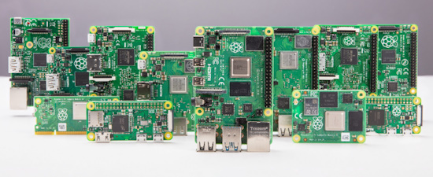](https://www.raspberrypi.com/news/raspberry-pi-product-series-explained/)

As the Raspberry Pi product line expands, it can get confusing trying to keep track of all the different Raspberry Pi boards out there. Raspberry Pi has published a high-level breakdown of their models, including the flagship single board computer (SBC) series, Zero series, Compute Module series, and Pico microcontrollers - [Raspberry Pi News](https://www.raspberrypi.com/news/raspberry-pi-product-series-explained/).

## Arduino Brings Its MicroPython Editor to the Cloud with a Browser-Based Web App Release

[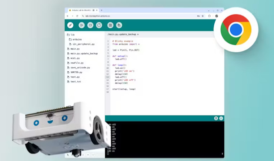](https://www.hackster.io/news/arduino-brings-its-micropython-editor-to-the-cloud-with-a-browser-based-web-app-release-310179492abc)

The web appears to be a popular place to edit MicroPython and CircuitPython apps with the latest entry being from the Arduino team. At the moment the editor is still in the 'lab' phase with bug fixes and improvements planned. A webserial browser is required (which excludes Firefox) - [hackster.io](https://www.hackster.io/news/arduino-brings-its-micropython-editor-to-the-cloud-with-a-browser-based-web-app-release-310179492abc) annd [Arduino](https://lab-micropython.arduino.cc/) (Arduino log-in required).

## Python has Overtaken JavaScript on GitHub

Python has overtaken JavaScript as the most popular language on GitHub, while the use of Jupyter Notebooks also has skyrocketed on the site. The rise of both underscore the surge in data science, artificial intelligence, and machine learning on the code-sharing platform, according to GitHub’s just-released [Octoverse 2024 report](https://github.blog/news-insights/octoverse/octoverse-2024/) - [InfoWorld](https://www.infoworld.com/article/3594587/python-has-overtaken-javascript-on-github.html).

## Feature

text - [site](url).

## This Week's Python Streams

Python on Hardware is all about building a cooperative ecosphere which allows contributions to be valued and to grow knowledge. Below are the streams within the last week focusing on the community.

**CircuitPython Deep Dive Stream**

[Last Friday](link), Tim streamed work on {subject}.

You can see the latest video and past videos on the Adafruit YouTube channel under the Deep Dive playlist - [YouTube](https://www.youtube.com/playlist?list=PLjF7R1fz_OOXBHlu9msoXq2jQN4JpCk8A).

**CircuitPython Parsec**

John Park’s CircuitPython Parsec this week is on {subject} - [Adafruit Blog](link) and [YouTube](https://youtu.be/zq9w_QjuEkU).

Catch all the episodes in the [YouTube playlist](https://www.youtube.com/playlist?list=PLjF7R1fz_OOWFqZfqW9jlvQSIUmwn9lWr).

**CircuitPython Weekly Meeting**

CircuitPython Weekly Meeting for October 28, 2024 ([notes](https://github.com/adafruit/adafruit-circuitpython-weekly-meeting/blob/main/2024/2024-10-28.md)) [on YouTube](link).

## Projects of the Week: Halloween Builds

Here's another batch of Halloween builds using Python.

Haunted houses are popular and serious money-makers during the Halloween season. They’re also a lot of fun, using various sensors and triggers to activate scary events like sounds, lights, or even animatronic props like moving and talking skeletons. Thanks to Raspberry Pi, YouTube creator NetworkChuck created even more advanced scares to scare his trick-or-treaters (and poor, innocent children.) Then he documented it all on YouTube to help others do likewise - [XDA](https://www.xda-developers.com/build-raspberry-pi-powered-haunted-house-heres-how/) and [YouTube](https://youtu.be/X2YH-XyqyXE).

[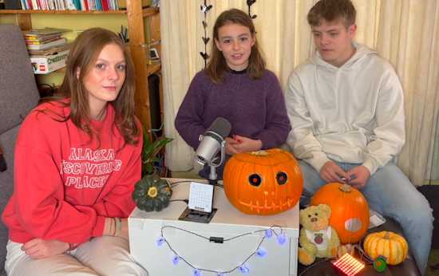](https://www.youtube.com/watch?v=HtQt4uwFvD8)

A spooky DIY bring your pumpkin to life with moving eyes & movement sensors using RaspberryPi Pico - [YouTube](https://www.youtube.com/watch?v=HtQt4uwFvD8) via [X](https://x.com/GurgleApps/status/1850977970678087921).

[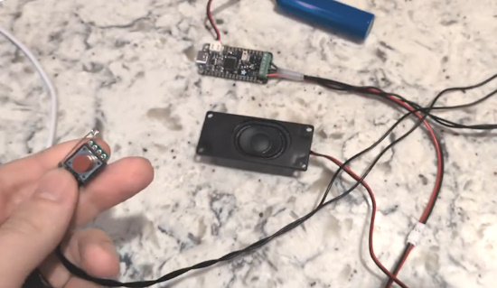](https://x.com/gvy_dvpont/status/1851339414838079906)

> "Helped with a friend's kid's Halloween costume (sorry in advance for the audio, but the costume's gonna be good). All from the spare parts bin! TIL safety pins are super easy to solder" - [X](https://x.com/gvy_dvpont/status/1851339414838079906).

## Popular Last Week

What was the most popular, most clicked link, in [last week's newsletter](https://www.adafruitdaily.com/2024/10/28/new-raspberry-pi-products-503-libraries-and-more/)? [Best Raspberry Pi Projects: October 2024](https://www.tomshardware.com/features/best-raspberry-pi-projects).

Did you know you can read past issues of this newsletter in the Adafruit Daily Archive? [Check it out](https://www.adafruitdaily.com/category/circuitpython/).

## New Notes from Adafruit Playground

[Adafruit Playground](https://adafruit-playground.com/) is a new place for the community to post their projects and other making tips/tricks/techniques. Ad-free, it's an easy way to publish your work in a safe space for free.

[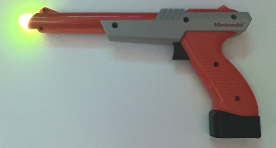](https://adafruit-playground.com/u/squid_jpg/pages/guide-zapper-lights-sound-mod)

Zapper Lights/Sound mod - [Adafruit Playground](https://adafruit-playground.com/u/squid_jpg/pages/guide-zapper-lights-sound-mod).

## News From Around the Web

[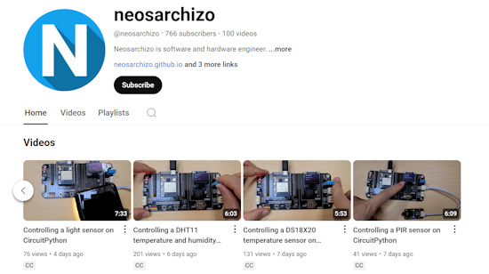](https://www.youtube.com/@neosarchizo)

YouTuber neosarchizo has created a whole series of tutorial videos on various ways to use CircuitPython - [YouTube](https://www.youtube.com/@neosarchizo) and descriptions - [GitHub.io](https://neosarchizo.github.io/).

[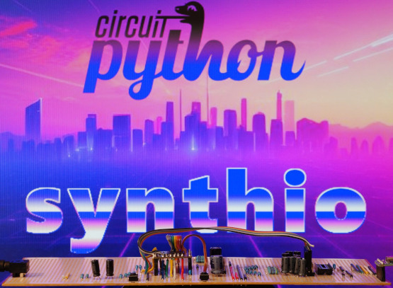](https://www.instructables.com/Creating-Synthesizer-Sounds-Using-CircuitPython-Sy/)

Step-by-step coding of a synthesizer patch (sound) using CircuitPython's [synthio](https://learn.adafruit.com/audio-synthesis-with-circuitpython-synthio) library on a Pimoroni PGA2350 with external circuitry (or Cytron Maker Pi Pico) - [Instructables](https://www.instructables.com/Creating-Synthesizer-Sounds-Using-CircuitPython-Sy/).

[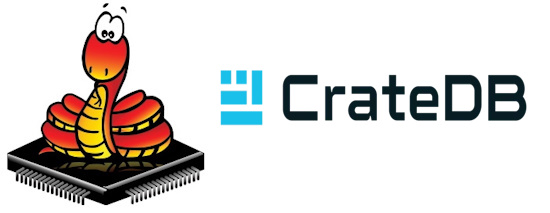](https://github.com/crate/micropython-cratedb/)

micropython-cratedb - a CrateDB driver for MicroPython - [GitHub](https://github.com/crate/micropython-cratedb/) via [X](https://x.com/simon_prickett/status/1851264534889013509).

[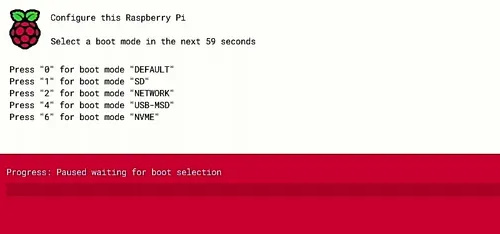](https://www.tomshardware.com/raspberry-pi/how-to-install-and-use-the-new-raspberry-pi-boot-menu)

How to install and use the new Raspberry Pi boot menu - [Tom's Hardware](https://www.tomshardware.com/raspberry-pi/how-to-install-and-use-the-new-raspberry-pi-boot-menu).

[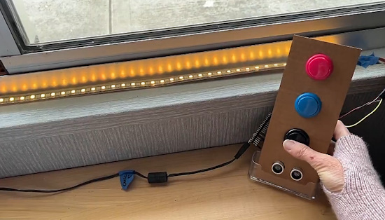](https://x.com/MsHaughs/status/1851967547807277342)

NeoPixel window lights in different colors with Raspberry Pi Pico and CircuitPython - [X](https://x.com/MsHaughs/status/1851967547807277342).

Raspberry Pi and Python drive a daily Calvin and Hobbes comic display via an E-ink display - [Tom's Hardware](https://www.tomshardware.com/raspberry-pi/raspberry-pi-drives-daily-calvin-and-hobbes-comic-fun-via-e-ink-display).

text - [site](url).

[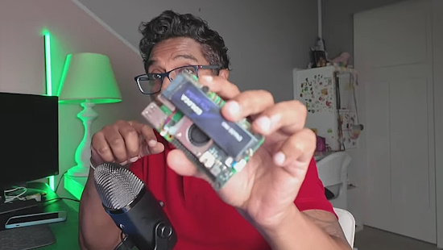](https://www.youtube.com/watch?v=XE-bZI_Faus)

Clone Raspbian OS - Raspberry Pi 5 Backup - [YouTube](https://www.youtube.com/watch?v=XE-bZI_Faus).

text - [site](url).

text - [site](url).

text - [site](url).

text - [site](url).

text - [site](url).

text - [site](url).

[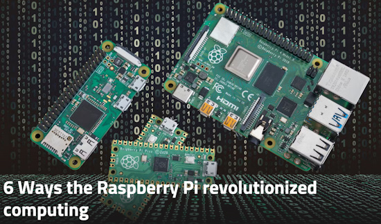](https://www.xda-developers.com/6-ways-raspberry-pi-revolutionized-computing/)

6 Ways the Raspberry Pi revolutionized computing - [XDA](https://www.xda-developers.com/6-ways-raspberry-pi-revolutionized-computing/).

text - [site](url).

text - [site](url).

## New

[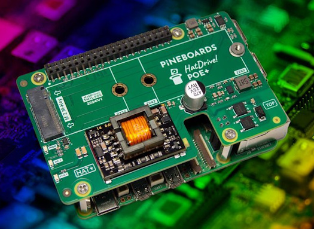](https://www.tomshardware.com/raspberry-pi/pineboards-poe-hat-brings-power-and-nvme-to-your-raspberry-pi-5)

Pineboards' PoE+ HAT brings power and NVMe for an SSD to your Raspberry Pi 5 - [Tom's Hardware](https://www.tomshardware.com/raspberry-pi/pineboards-poe-hat-brings-power-and-nvme-to-your-raspberry-pi-5).

text - [site](url).

## New Boards Supported by CircuitPython

The number of supported microcontrollers and Single Board Computers (SBC) grows every week. This section outlines which boards have been included in CircuitPython or added to [CircuitPython.org](https://circuitpython.org/).

This week there were (#/no) new boards added:

- [Board name](url)
- [Board name](url)
- [Board name](url)

*Note: For non-Adafruit boards, please use the support forums of the board manufacturer for assistance, as Adafruit does not have the hardware to assist in troubleshooting.*

Looking to add a new board to CircuitPython? It's highly encouraged! Adafruit has four guides to help you do so:

- [How to Add a New Board to CircuitPython](https://learn.adafruit.com/how-to-add-a-new-board-to-circuitpython/overview)
- [How to add a New Board to the circuitpython.org website](https://learn.adafruit.com/how-to-add-a-new-board-to-the-circuitpython-org-website)
- [Adding a Single Board Computer to PlatformDetect for Blinka](https://learn.adafruit.com/adding-a-single-board-computer-to-platformdetect-for-blinka)
- [Adding a Single Board Computer to Blinka](https://learn.adafruit.com/adding-a-single-board-computer-to-blinka)

## New Learn Guides

[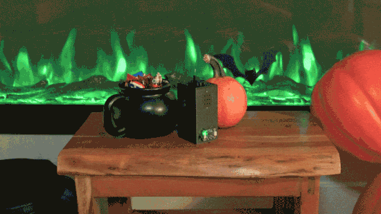](https://learn.adafruit.com/guides/latest)

The Adafruit Learning System has over 3,000 free guides for learning skills and building projects including using Python.

[Motion Sensor Bat](https://learn.adafruit.com/motion-sensor-bat) from [Ruiz Brothers](https://learn.adafruit.com/u/pixil3d)

## CircuitPython Libraries

The CircuitPython library numbers are continually increasing, while existing ones continue to be updated. Here we provide library numbers and updates!

To get the latest Adafruit libraries, download the [Adafruit CircuitPython Library Bundle](https://circuitpython.org/libraries). To get the latest community contributed libraries, download the [CircuitPython Community Bundle](https://circuitpython.org/libraries).

If you'd like to contribute to the CircuitPython project on the Python side of things, the libraries are a great place to start. Check out the [CircuitPython.org Contributing page](https://circuitpython.org/contributing). If you're interested in reviewing, check out Open Pull Requests. If you'd like to contribute code or documentation, check out Open Issues. We have a guide on [contributing to CircuitPython with Git and GitHub](https://learn.adafruit.com/contribute-to-circuitpython-with-git-and-github), and you can find us in the #help-with-circuitpython and #circuitpython-dev channels on the [Adafruit Discord](https://adafru.it/discord).

You can check out this [list of all the Adafruit CircuitPython libraries and drivers available](https://github.com/adafruit/Adafruit_CircuitPython_Bundle/blob/master/circuitpython_library_list.md). 

The current number of CircuitPython libraries is **###**!

**New Libraries**

Here's this week's new CircuitPython libraries:

* [library](url)

**Updated Libraries**

Here's this week's updated CircuitPython libraries:

* [library](url)

**Library PyPI Weekly Download Stats**

## What’s the CircuitPython team up to this week?

What is the team up to this week? Let’s check in:

**Dan**

text.

**Tim**

This week I implemented a handful of new features and fixes to the circuitpython.org website that were found in the GitHub issues, [there is a blogpost detailing them](https://blog.adafruit.com/2024/10/29/roundup-of-circuitpython-org-changes-circuitpython/). I also worked with Liz on the driver for the VCNL4200 device. Lastly I've been working on a new learn guide covering how to create custom Animations for use with the `adafruit_led_animation` library, I've created a handful of new animations to use as examples to explain different concepts.

**Jeff**

I've been working on a requested enhancement to `synthio`: biquad filters whose properties (central frequency & sharpness) can be adjusted at runtime or by LFOs. As I write this, the PR is pending review.

**Liz**

This week I've been working with Tim on the [VCNL4200 CircuitPython driver](https://github.com/adafruit/Adafruit_CircuitPython_VCNL4200). This driver has a lot of registers to port compared to what our sensors normally have so it has been nice to have someone to bounce ideas off of and double check that the hardware is working as expected. A guide for this sensor will be published soon with example code in CircuitPython and Arduino.

I also setup a Raspberry Pi 5 for the first time. While working on this, I referenced Carter's [excellent guide on setting up and using a virtual environment with Python](https://learn.adafruit.com/python-virtual-environment-usage-on-raspberry-pi). If you've been confused on the venv Python chatter in regard to the Pi, or in general, definitely check it out as an excellent reference.

## Upcoming Events

PyCon AU will be held from the 22nd to the 26th of November at the Melbourne Convention and Exhibition Centre (MCEC) in Narrm/Melbourne. Matt Trentini and Damien George will both be presenting on MicroPython - [PyCon AU](https://2024.pycon.org.au/).

The next MicroPython Meetup in Melbourne will be on November 27th – [Meetup](https://www.meetup.com/micropython-meetup/events). You can see recordings of previous meetings on [YouTube](https://www.youtube.com/@MicroPythonOfficial). September's meeting notes are [here](https://melbournemicropythonmeetup.github.io/September-2024-Meetup/).

PyLadies Conference (PyLadiesCon) is a transformative event designed to promote diversity, learning, and empowerment within the Python community. December 6-8, 2024 online - [PyLadies](https://conference.pyladies.com/).

**Send Your Events In**

If you know of virtual events or upcoming events, please let us know via email to cpnews(at)adafruit(dot)com.

## Latest Releases

CircuitPython's stable release is [#.#.#](https://github.com/adafruit/circuitpython/releases/latest) and its unstable release is [#.#.#-##.#](https://github.com/adafruit/circuitpython/releases). New to CircuitPython? Start with our [Welcome to CircuitPython Guide](https://learn.adafruit.com/welcome-to-circuitpython).

[2024####](https://github.com/adafruit/Adafruit_CircuitPython_Bundle/releases/latest) is the latest Adafruit CircuitPython library bundle.

[2024####](https://github.com/adafruit/CircuitPython_Community_Bundle/releases/latest) is the latest CircuitPython Community library bundle.

[v#.#.#](https://micropython.org/download) is the latest MicroPython release. Documentation for it is [here](http://docs.micropython.org/en/latest/pyboard/).

[#.#.#](https://www.python.org/downloads/) is the latest Python release. The latest pre-release version is [#.#.#](https://www.python.org/download/pre-releases/).

[#,### Stars](https://github.com/adafruit/circuitpython/stargazers) Like CircuitPython? [Star it on GitHub!](https://github.com/adafruit/circuitpython)

## Call for Help -- Translating CircuitPython is now easier than ever

[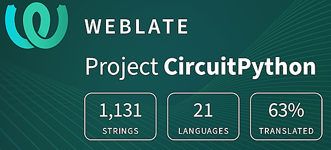](https://hosted.weblate.org/engage/circuitpython/)

One important feature of CircuitPython is translated control and error messages. With the help of fellow open source project [Weblate](https://weblate.org/), we're making it even easier to add or improve translations. 

Sign in with an existing account such as GitHub, Google or Facebook and start contributing through a simple web interface. No forks or pull requests needed! As always, if you run into trouble join us on [Discord](https://adafru.it/discord), we're here to help.

## NUMBER Thanks

The Adafruit Discord community, where we do all our CircuitPython development in the open, reached over NUMBER humans - thank you! Adafruit believes Discord offers a unique way for Python on hardware folks to connect. Join today at [https://adafru.it/discord](https://adafru.it/discord).

## ICYMI - In case you missed it

Python on hardware is the Adafruit Python video-newsletter-podcast! The news comes from the Python community, Discord, Adafruit communities and more and is broadcast on ASK an ENGINEER Wednesdays. The complete Python on Hardware weekly videocast [playlist is here](https://www.youtube.com/playlist?list=PLjF7R1fz_OOXRMjM7Sm0J2Xt6H81TdDev). The video podcast is on [iTunes](https://itunes.apple.com/us/podcast/python-on-hardware/id1451685192?mt=2), [YouTube](http://adafru.it/pohepisodes), [Instagram](https://www.instagram.com/adafruit/channel/)), and [XML](https://itunes.apple.com/us/podcast/python-on-hardware/id1451685192?mt=2).

[The weekly community chat on Adafruit Discord server CircuitPython channel - Audio / Podcast edition](https://itunes.apple.com/us/podcast/circuitpython-weekly-meeting/id1451685016) - Audio from the Discord chat space for CircuitPython, meetings are usually Mondays at 2pm ET, this is the audio version on [iTunes](https://itunes.apple.com/us/podcast/circuitpython-weekly-meeting/id1451685016), Pocket Casts, [Spotify](https://adafru.it/spotify), and [XML feed](https://adafruit-podcasts.s3.amazonaws.com/circuitpython_weekly_meeting/audio-podcast.xml).

## Contribute

The CircuitPython Weekly Newsletter is a CircuitPython community-run newsletter emailed every Monday. The complete [archives are here](https://www.adafruitdaily.com/category/circuitpython/). It highlights the latest CircuitPython related news from around the web including Python and MicroPython developments. To contribute, edit next week's draft [on GitHub](https://github.com/adafruit/circuitpython-weekly-newsletter/tree/gh-pages/_drafts) and [submit a pull request](https://help.github.com/articles/editing-files-in-your-repository/) with the changes. You may also tag your information on Twitter with #CircuitPython. 

Join the Adafruit [Discord](https://adafru.it/discord) or [post to the forum](https://forums.adafruit.com/viewforum.php?f=60) if you have questions.
