- [ ] Library and info updates
- [ ] change date
- [ ] update title
- [ ] Feature story
- [ ] Update  for images
- [ ] Update ICYDNCI
- [ ] All images 550w max only
- [ ] Link "View this email in your browser."

News Sources

- [Adafruit Playground](https://adafruit-playground.com/)
- Twitter: [CircuitPython](https://twitter.com/search?q=circuitpython&src=typed_query&f=live), [MicroPython](https://twitter.com/search?q=micropython&src=typed_query&f=live) and [Python](https://twitter.com/search?q=python&src=typed_query)
- [Raspberry Pi News](https://www.raspberrypi.com/news/)
- Mastodon [CircuitPython](https://octodon.social/tags/CircuitPython) and [MicroPython](https://octodon.social/tags/MicroPython)
- [hackster.io CircuitPython](https://www.hackster.io/search?q=circuitpython&i=projects&sort_by=most_recent) and [MicroPython](https://www.hackster.io/search?q=micropython&i=projects&sort_by=most_recent)
- YouTube: [CircuitPython](https://www.youtube.com/results?search_query=circuitpython&sp=CAI%253D), [MicroPython](https://www.youtube.com/results?search_query=micropython&sp=CAI%253D)
- Instructables: [CircuitPython](https://www.instructables.com/search/?q=circuitpython&projects=all&sort=Newest), [MicroPython](https://www.instructables.com/search/?q=micropython&projects=all&sort=Newest), [Raspberry Pi Python](https://www.instructables.com/search/?q=raspberry+pi+python&projects=all&sort=Newest)
- [hackaday CircuitPython](https://hackaday.com/blog/?s=circuitpython) and [MicroPython](https://hackaday.com/blog/?s=micropython)
- [python.org](https://www.python.org/)
- [Python Insider - dev team blog](https://pythoninsider.blogspot.com/)
- Individuals: [Jeff Geerling](https://www.jeffgeerling.com/blog), [Yakroo](https://x.com/Yakroo5077)
- Tom's Hardware: [CircuitPython](https://www.tomshardware.com/search?searchTerm=circuitpython&articleType=all&sortBy=publishedDate) and [MicroPython](https://www.tomshardware.com/search?searchTerm=micropython&articleType=all&sortBy=publishedDate) and [Raspberry Pi](https://www.tomshardware.com/search?searchTerm=raspberry%20pi&articleType=all&sortBy=publishedDate)
- [hackaday.io newest projects MicroPython](https://hackaday.io/projects?tag=micropython&sort=date) and [CircuitPython](https://hackaday.io/projects?tag=circuitpython&sort=date)
- [Google News Python](https://news.google.com/topics/CAAqIQgKIhtDQkFTRGdvSUwyMHZNRFY2TVY4U0FtVnVLQUFQAQ?hl=en-US&gl=US&ceid=US%3Aen)
- hackaday.io - [CircuitPython](https://hackaday.io/search?term=circuitpython) and [MicroPython](https://hackaday.io/search?term=micropython)

View this email in your browser. **Warning: Flashing Imagery**

Welcome to the latest Python on Microcontrollers newsletter! *insert 2-3 sentences from editor (what's in overview, banter)* - *Anne Barela, Editor*

We're on [Discord](https://discord.gg/HYqvREz), [Twitter](https://twitter.com/search?q=circuitpython&src=typed_query&f=live), and for past newsletters - [view them all here](https://www.adafruitdaily.com/category/circuitpython/). If you're reading this on the web, [subscribe here](https://www.adafruitdaily.com/). Here's the news this week:

## Raspberry Pi Compute Module 5 Spotted

[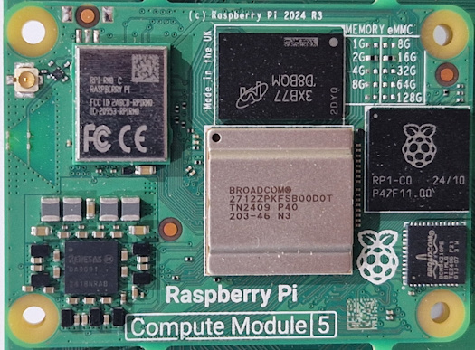](https://chaos.social/@kuro/113469240412312622)

[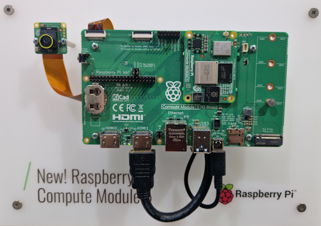](https://chaos.social/@kuro/113469240412312622)

The highly anticipated Raspberry Pi Compute Module 5 has been spotted publicly at [Electronica 2024](https://electronica.de/en/trade-fair/) attached to the Compute Module 5 IO Board - [Mastodon](https://chaos.social/@kuro/113469240412312622). Via [X](https://x.com/bretweber/status/1856427429012652280).

## Reverse Engineering MicroPython Frozen Modules

[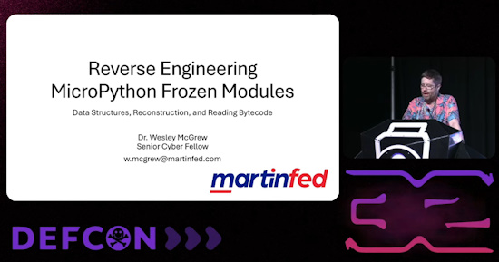](https://securityboulevard.com/2024/11/def-con-32-reverse-engineering-micropython-frozen-modules/)

Wesley McGrew at DEF CON 32 gave a talk on reverse engineering MicroPython frozen modules - [YouTube](https://www.youtube.com/watch?v=QXa29AJqdRc) and [Article](https://securityboulevard.com/2024/11/def-con-32-reverse-engineering-micropython-frozen-modules/).

## NeoPixel Control on the Raspberry Pi 5 Inches Closer with a New Python Library

[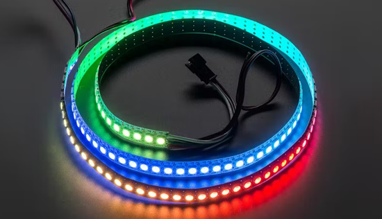](https://www.hackster.io/news/userspace-ws281x-control-on-the-raspberry-pi-5-inches-closer-with-new-python-library-release-6c8af3e50d9e)

Embedded software developer Philip Howard has announced a beta release of a Python library for handling WS281x "NeoPixel" addressable RGB LEDs on a Raspberry Pi — delivering support for the Raspberry Pi 5 and its newly-driven general-purpose input/output (GPIO) pins - [hackster.io](https://www.hackster.io/news/userspace-ws281x-control-on-the-raspberry-pi-5-inches-closer-with-new-python-library-release-6c8af3e50d9e) and [GitHub](https://github.com/rpi-ws281x/rpi-ws281x-python/releases/tag/pi5-beta2). Via [Mastodon](https://fosstodon.org/@gadgetoid/113427088003491784).

## Why Raspberry Pi for an SBC Guy

[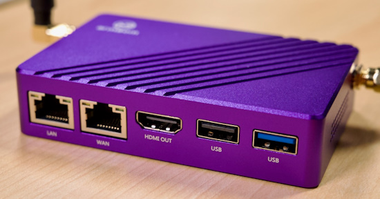](https://www.jeffgeerling.com/blog/2024/why-raspberry-pi-sbc-guy)

Why would one pick a Raspberry Pi vs. other single board computers (SBC)? Jeff Geerling provides his reasoning - [Jeff Geerling](https://www.jeffgeerling.com/blog/2024/why-raspberry-pi-sbc-guy).

## Raspberry Pi AI Kit Projects

[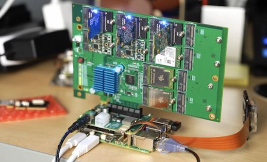](https://www.raspberrypi.com/news/raspberry-pi-ai-kit-projects/)

The versatility of the Raspberry Pi platform, combined with AI capabilities, opens up a world of new possibilities for innovative smart projects. Check out some highlighted by Raspberry Pi and The Magpi Magazine - [Raspberry Pi](https://www.raspberrypi.com/news/raspberry-pi-ai-kit-projects/).

## Overclocking a Raspberry Pi 5 to 3.6 Gigahertz

[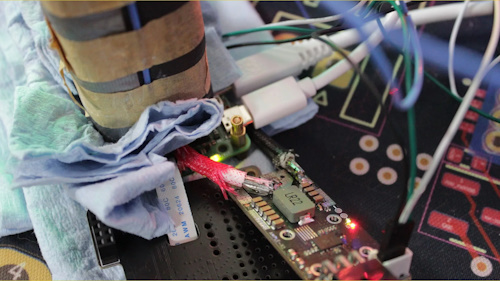](https://blog.adafruit.com/2024/11/13/overclocking-a-raspberry-pi-5-to-3-6-gigahertz-skatterbencher/)

Pieter on Skatterbencher is a frequent overclocker and he’s taken on boosting the new Raspberry Pi 5 to unheard of clock speeds. Various methods were used to be able to increase the frequency the Pi would run at - [Skatterbencher](https://skatterbencher.com/2024/11/11/3600-mhz-raspberry-pi-5-with-liquid-nitrogen/) and [Adafruit Blog](https://blog.adafruit.com/2024/11/13/overclocking-a-raspberry-pi-5-to-3-6-gigahertz-skatterbencher/).

## Raspberry Pi Connect Receives Improvements

[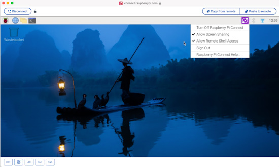](https://www.raspberrypi.com/news/raspberry-pi-connect-new-native-panel-plugin-and-connectivity-testing/)

The latest release of Raspberry Pi OS includes an all-new, native panel plugin for Raspberry Pi Connect, the secure remote access solution allowing you to connect to a Raspberry Pi desktop and command line directly from a web browser. They have been improving support and performance on as many Raspberry Pi devices as possible — from Raspberry Pi Zero to Raspberry Pi 5 — both when using Raspberry Pi OS with desktop and the Lite version - [Raspberry Pi News](https://www.raspberrypi.com/news/raspberry-pi-connect-new-native-panel-plugin-and-connectivity-testing/).

## This Week's Python Streams

Python on Hardware is all about building a cooperative ecosphere which allows contributions to be valued and to grow knowledge. Below are the streams within the last week focusing on the community.

**CircuitPython Deep Dive Stream**

[Last Friday](link), Tim streamed work on {subject}.

You can see the latest video and past videos on the Adafruit YouTube channel under the Deep Dive playlist - [YouTube](https://www.youtube.com/playlist?list=PLjF7R1fz_OOXBHlu9msoXq2jQN4JpCk8A).

**CircuitPython Parsec**

John Park’s CircuitPython Parsec this week is on {subject} - [Adafruit Blog](link) and [YouTube](link).

Catch all the episodes in the [YouTube playlist](https://www.youtube.com/playlist?list=PLjF7R1fz_OOWFqZfqW9jlvQSIUmwn9lWr).

**CircuitPython Weekly Meeting**

CircuitPython Weekly Meeting for November 12, 2024 ([notes](https://github.com/adafruit/adafruit-circuitpython-weekly-meeting/blob/main/2024/2024-11-12.md)) [on YouTube](https://youtu.be/51XJkrynsUo).

## Project of the Week: Making a Trading Gameboy

[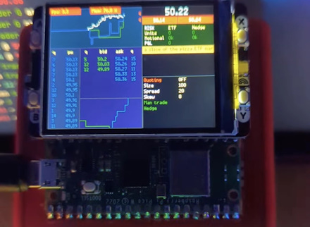](https://blog.adafruit.com/2024/11/12/making-a-trading-gameboy-a-pocket-exchange-and-algo-trading-platform-questdb/)

Tancrede Collard makes a handheld Gameboy-style market/trading ga,e using a Raspberry Pi Pico, display and MicroPython - [QuestDB](https://questdb.io/blog/making-a-trading-gameboy/) and [Adafruit Blog](https://blog.adafruit.com/2024/11/12/making-a-trading-gameboy-a-pocket-exchange-and-algo-trading-platform-questdb/).

## Popular Last Week

[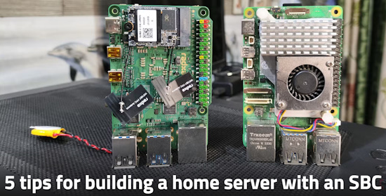](https://www.xda-developers.com/tips-for-building-a-home-server-with-an-sbc/)

What was the most popular, most clicked link, in [last week's newsletter](https://www.adafruitdaily.com/2024/11/11/python-on-microcontrollers-newsletter-new-pi-goodies-pico-powered-fallout-t-45-helmet-and-more-circuitpython-python-micropython-thepsf-raspberry_pi/)? [5 tips for building a home server with an SBC](https://www.xda-developers.com/tips-for-building-a-home-server-with-an-sbc/).

Did you know you can read past issues of this newsletter in the Adafruit Daily Archive? [Check it out](https://www.adafruitdaily.com/category/circuitpython/).

## New Notes from Adafruit Playground

[Adafruit Playground](https://adafruit-playground.com/) is a new place for the community to post their projects and other making tips/tricks/techniques. Ad-free, it's an easy way to publish your work in a safe space for free.

Adding WiFi the Easy Way - [Adafruit Playground](https://adafruit-playground.com/u/picofun/pages/adding-wifi-the-easy-way).

[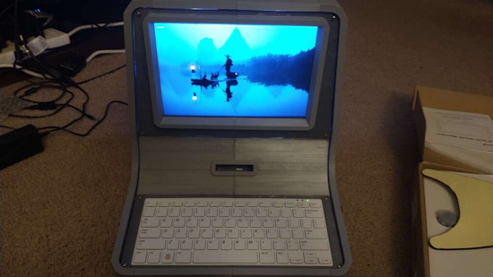](https://adafruit-playground.com/u/omnifarious50/pages/i-turned-the-raspberry-pi-400-into-a-fallout-style-terminal)

I turned the Raspberry Pi 400 into a Fallout-style terminal! - [Adafruit Playground](https://adafruit-playground.com/u/omnifarious50/pages/i-turned-the-raspberry-pi-400-into-a-fallout-style-terminal).

text - [Adafruit Playground](url).

## News From Around the Web

[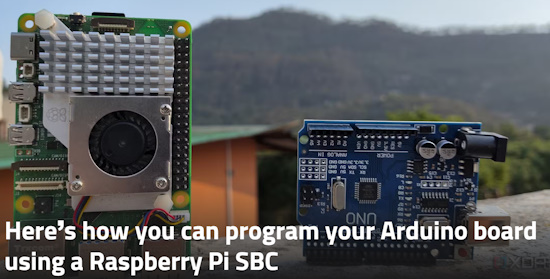](https://www.xda-developers.com/program-an-arduino-using-a-raspberry-pi/)

Here’s how you can program your Arduino board using a Raspberry Pi SBC - [XDA](https://www.xda-developers.com/program-an-arduino-using-a-raspberry-pi/).

[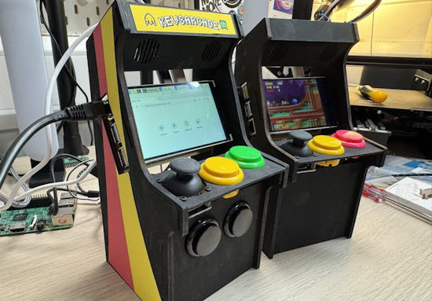](https://x.com/kevsmac/status/1855959011704656227)

Kevin McAleer makes a second arcade cabinet, this one with two extra buttons, for use with a Raspberry Pi by using a Pico programmed in CircuitPython - [X](https://x.com/kevsmac/status/1855959011704656227).

[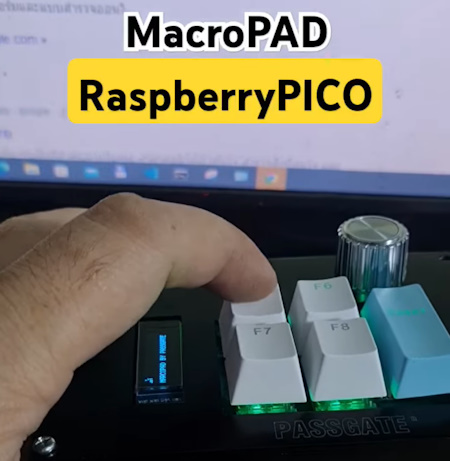](https://www.youtube.com/shorts/JqeYxvhkz6o)

A MacroPAD with Raspbberry Pi Pico and CircuitPython - [YouTube](https://www.youtube.com/shorts/JqeYxvhkz6o). Via [X](https://x.com/Yakroo5077/status/1855861316243894662).

[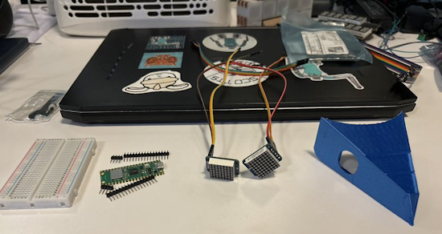](https://x.com/scottmonaghan/status/1855774055325991354)

Scott is porting his electronic eyes project, using 8x8 LED matrices, over to a Raspberry Pi Pico running CircuitPython - [X](https://x.com/scottmonaghan/status/1855774055325991354).

[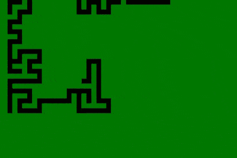](https://github.com/tantanGH/distribution/tree/main/micropython)

Maze generation on an X68000 using MicroPython - [GitHub](https://github.com/tantanGH/distribution/tree/main/micropython). Via [X](https://x.com/snakGH/status/1624323106902011904) (Japanese).

[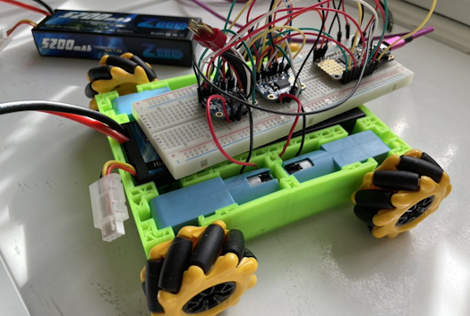](https://x.com/dan__treasure/status/1856559676772758012)

Makinng a robot with Adafruit Feather and CircuitPython - [X](https://x.com/dan__treasure/status/1856559676772758012).

SunChaser - a MicroPython-powered solar tracker - [hackster.io](https://www.hackster.io/Infineon_Team/sunchaser-a-micropython-powered-solar-tracker-29d9a8).

text - [site](url).

text - [site](url).

[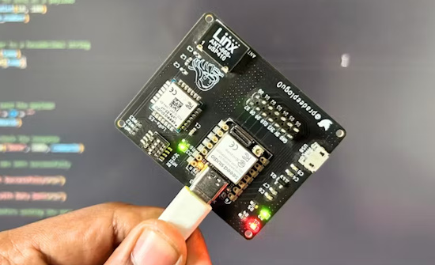](https://www.hackster.io/pradeeplogu0/wio-e5-with-micropython-5f2284)

The Wio E5 with MicroPython - [hackster.io](https://www.hackster.io/pradeeplogu0/wio-e5-with-micropython-5f2284).

text - [site](url).

text - [site](url).

text - [site](url).

text - [site](url).

[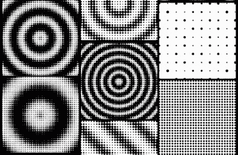](https://blog.adafruit.com/2024/11/13/creating-perfectly-looping-animations-with-python/)

Creating perfectly looping animations with Python - [Instructables](https://www.instructables.com/Creating-Perfectly-Looping-Animations-With-Python/) and [Adafruit Blog](https://blog.adafruit.com/2024/11/13/creating-perfectly-looping-animations-with-python/).

[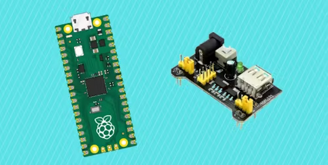](https://www.hackster.io/Shilleh/powering-the-raspberry-pi-pico-w-with-the-mb102-power-supply-04f97d)

Powering a Raspberry Pi Pico W with an MB102 Power Supply and MicroPython - [hackster.io](https://www.hackster.io/Shilleh/powering-the-raspberry-pi-pico-w-with-the-mb102-power-supply-04f97d).

[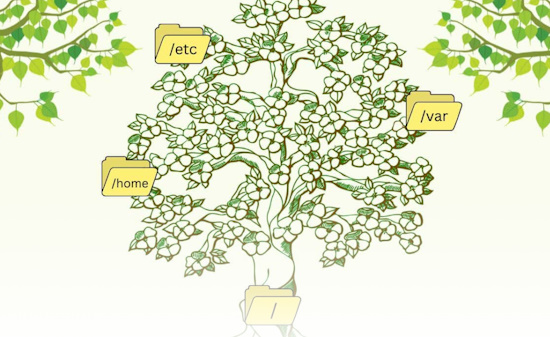](https://raspberrytips.fr/systeme-fichiers-raspberry-pi/)

How does the Raspberry Pi file system work? - [Raspberry Tips](https://raspberrytips.fr/systeme-fichiers-raspberry-pi/) (French).

Beginner Coding in Python: Building the simplest AI chat companion possible - [How-To Geek](https://www.howtogeek.com/beginner-coding-in-python-build-a-simple-ai-chat-companion/).

## New

[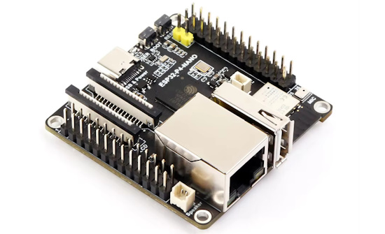](https://www.cnx-software.com/2024/11/06/waveshare-esp32-p4-nano-board-offers-ethernet-wifi-6-bluetooth-5-mipi-display-and-camera-interfaces-gpio-headers/)

Waveshare ESP32-P4-NANO board offers Ethernet, WiFi 6, Bluetooth 5, MIPI display and camera interfaces, GPIO headers - [CNX Software](https://www.cnx-software.com/2024/11/06/waveshare-esp32-p4-nano-board-offers-ethernet-wifi-6-bluetooth-5-mipi-display-and-camera-interfaces-gpio-headers/).

[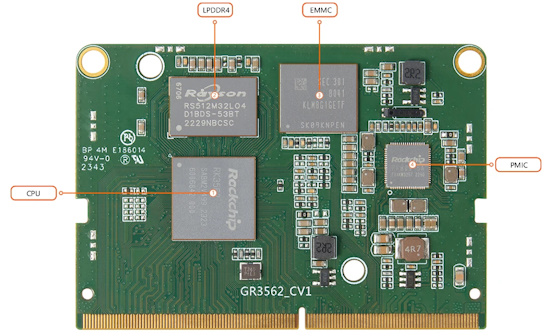](url)

text - [site](url).

## New Boards Supported by CircuitPython

The number of supported microcontrollers and Single Board Computers (SBC) grows every week. This section outlines which boards have been included in CircuitPython or added to [CircuitPython.org](https://circuitpython.org/).

This week there were (#/no) new boards added:

- [Board name](url)
- [Board name](url)
- [Board name](url)

*Note: For non-Adafruit boards, please use the support forums of the board manufacturer for assistance, as Adafruit does not have the hardware to assist in troubleshooting.*

Looking to add a new board to CircuitPython? It's highly encouraged! Adafruit has four guides to help you do so:

- [How to Add a New Board to CircuitPython](https://learn.adafruit.com/how-to-add-a-new-board-to-circuitpython/overview)
- [How to add a New Board to the circuitpython.org website](https://learn.adafruit.com/how-to-add-a-new-board-to-the-circuitpython-org-website)
- [Adding a Single Board Computer to PlatformDetect for Blinka](https://learn.adafruit.com/adding-a-single-board-computer-to-platformdetect-for-blinka)
- [Adding a Single Board Computer to Blinka](https://learn.adafruit.com/adding-a-single-board-computer-to-blinka)

## New Learn Guides

[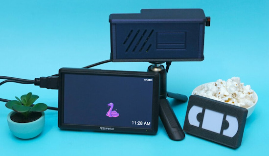](https://learn.adafruit.com/guides/latest)

The Adafruit Learning System has over 3,000 free guides for learning skills and building projects including using Python.

[NFC Raspberry Pi Media Player](https://learn.adafruit.com/nfc-raspberry-pi-media-player) from [Liz Clark](https://learn.adafruit.com/u/BlitzCityDIY)

## CircuitPython Libraries

The CircuitPython library numbers are continually increasing, while existing ones continue to be updated. Here we provide library numbers and updates!

To get the latest Adafruit libraries, download the [Adafruit CircuitPython Library Bundle](https://circuitpython.org/libraries). To get the latest community contributed libraries, download the [CircuitPython Community Bundle](https://circuitpython.org/libraries).

If you'd like to contribute to the CircuitPython project on the Python side of things, the libraries are a great place to start. Check out the [CircuitPython.org Contributing page](https://circuitpython.org/contributing). If you're interested in reviewing, check out Open Pull Requests. If you'd like to contribute code or documentation, check out Open Issues. We have a guide on [contributing to CircuitPython with Git and GitHub](https://learn.adafruit.com/contribute-to-circuitpython-with-git-and-github), and you can find us in the #help-with-circuitpython and #circuitpython-dev channels on the [Adafruit Discord](https://adafru.it/discord).

You can check out this [list of all the Adafruit CircuitPython libraries and drivers available](https://github.com/adafruit/Adafruit_CircuitPython_Bundle/blob/master/circuitpython_library_list.md). 

The current number of CircuitPython libraries is **###**!

**New Libraries**

Here's this week's new CircuitPython libraries:

* [library](url)

**Updated Libraries**

Here's this week's updated CircuitPython libraries:

* [library](url)

## What’s the CircuitPython team up to this week?

What is the team up to this week? Let’s check in:

**Dan**

I am continuing to work on getting CircuitMatter's cryptography code running on CircuitPython.

**Tim**

I added how to install links for 70 more boards listed on circuitpython.org, all of the publicly available Adafruit boards have them now as well as a few of the high profile 3rd party ones that also have a Learn guide like the Raspberry Pi Pico and Picow. I've also been working through any open issues that are within my means in the library repos, this week brought fixes in a few driver libraries and some documentation improvements to some others. 

I made a few tweaks in Adabot to adjust the stats that appear in the reports used during the Monday meetings. During the Deep Dive stream on Friday I worked on a new `TextBox` widget for the `DisplayText` library that allows you to set a width and height when it's created and will automatically wrap the text to contain it within the given size. Having the width constrained also allows it to support center and right alignment which the other Label classes cannot do.

**Jeff**

text.

**Scott**

text.

**Liz**

I’ve been working on a CircuitPython video synth with the Feather RP2350 and HSTX to DVI output. I am using a PDM mic as an audio input and am doing some FFT math to create some spectrum analyzer style animations. There is also a 1x4 seesaw rotary encoder breakout for extra control.

## Upcoming Events

PyCon AU will be held from the 22nd to the 26th of November at the Melbourne Convention and Exhibition Centre (MCEC) in Narrm/Melbourne. Matt Trentini and Damien George will both be presenting on MicroPython - [PyCon AU](https://2024.pycon.org.au/).

The next MicroPython Meetup in Melbourne will be on November 27th – [Meetup](https://www.meetup.com/micropython-meetup/events). You can see recordings of previous meetings on [YouTube](https://www.youtube.com/@MicroPythonOfficial). September's meeting notes are [here](https://melbournemicropythonmeetup.github.io/September-2024-Meetup/).

PyLadies Conference (PyLadiesCon) is a transformative event designed to promote diversity, learning, and empowerment within the Python community. December 6-8, 2024 online - [PyLadies](https://conference.pyladies.com/) and [Schedule](https://conference.pyladies.com/schedule/).

**Send Your Events In**

If you know of virtual events or upcoming events, please let us know via email to cpnews(at)adafruit(dot)com.

## Latest Releases

CircuitPython's stable release is [#.#.#](https://github.com/adafruit/circuitpython/releases/latest) and its unstable release is [#.#.#-##.#](https://github.com/adafruit/circuitpython/releases). New to CircuitPython? Start with our [Welcome to CircuitPython Guide](https://learn.adafruit.com/welcome-to-circuitpython).

[2024####](https://github.com/adafruit/Adafruit_CircuitPython_Bundle/releases/latest) is the latest Adafruit CircuitPython library bundle.

[2024####](https://github.com/adafruit/CircuitPython_Community_Bundle/releases/latest) is the latest CircuitPython Community library bundle.

[v1.24.0](https://micropython.org/download) is the latest MicroPython release. Documentation for it is [here](http://docs.micropython.org/en/latest/pyboard/).

[#.#.#](https://www.python.org/downloads/) is the latest Python release. The latest pre-release version is [#.#.#](https://www.python.org/download/pre-releases/).

[#,### Stars](https://github.com/adafruit/circuitpython/stargazers) Like CircuitPython? [Star it on GitHub!](https://github.com/adafruit/circuitpython)

## Call for Help -- Translating CircuitPython is now easier than ever

[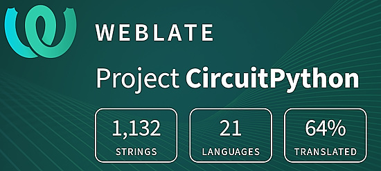](https://hosted.weblate.org/engage/circuitpython/)

One important feature of CircuitPython is translated control and error messages. With the help of fellow open source project [Weblate](https://weblate.org/), we're making it even easier to add or improve translations. 

Sign in with an existing account such as GitHub, Google or Facebook and start contributing through a simple web interface. No forks or pull requests needed! As always, if you run into trouble join us on [Discord](https://adafru.it/discord), we're here to help.

## 38,454 Thanks

The Adafruit Discord community, where we do all our CircuitPython development in the open, reached over 38,454 humans - thank you! Adafruit believes Discord offers a unique way for Python on hardware folks to connect. Join today at [https://adafru.it/discord](https://adafru.it/discord).

## ICYMI - In case you missed it

Python on hardware is the Adafruit Python video-newsletter-podcast! The news comes from the Python community, Discord, Adafruit communities and more and is broadcast on ASK an ENGINEER Wednesdays. The complete Python on Hardware weekly videocast [playlist is here](https://www.youtube.com/playlist?list=PLjF7R1fz_OOXRMjM7Sm0J2Xt6H81TdDev). The video podcast is on [iTunes](https://itunes.apple.com/us/podcast/python-on-hardware/id1451685192?mt=2), [YouTube](http://adafru.it/pohepisodes), [Instagram](https://www.instagram.com/adafruit/channel/)), and [XML](https://itunes.apple.com/us/podcast/python-on-hardware/id1451685192?mt=2).

[The weekly community chat on Adafruit Discord server CircuitPython channel - Audio / Podcast edition](https://itunes.apple.com/us/podcast/circuitpython-weekly-meeting/id1451685016) - Audio from the Discord chat space for CircuitPython, meetings are usually Mondays at 2pm ET, this is the audio version on [iTunes](https://itunes.apple.com/us/podcast/circuitpython-weekly-meeting/id1451685016), Pocket Casts, [Spotify](https://adafru.it/spotify), and [XML feed](https://adafruit-podcasts.s3.amazonaws.com/circuitpython_weekly_meeting/audio-podcast.xml).

## Contribute

The CircuitPython Weekly Newsletter is a CircuitPython community-run newsletter emailed every Monday. The complete [archives are here](https://www.adafruitdaily.com/category/circuitpython/). It highlights the latest CircuitPython related news from around the web including Python and MicroPython developments. To contribute, edit next week's draft [on GitHub](https://github.com/adafruit/circuitpython-weekly-newsletter/tree/gh-pages/_drafts) and [submit a pull request](https://help.github.com/articles/editing-files-in-your-repository/) with the changes. You may also tag your information on Twitter with #CircuitPython. 

Join the Adafruit [Discord](https://adafru.it/discord) or [post to the forum](https://forums.adafruit.com/viewforum.php?f=60) if you have questions.
