View this email in your browser. **Warning: Flashing Imagery**

Welcome to the latest Python on Microcontrollers newsletter! A great deal has happened this week! Raspberry Pi has released the long anticipated Raspberry Pi Pico 2 W **and** the Compute Module 5. And video talks from PyCon Australia 2024 are online and include informative discussions of MicroPython. Please note this issue is a bit abbreviated, your editor was sick and took some doctor ordered rest. But you cannot keep a good Maker down completely. Happy Cyber Monday! - *Anne Barela, Editor*

We're on [Discord](https://discord.gg/HYqvREz), [Twitter](https://twitter.com/search?q=circuitpython&src=typed_query&f=live), and for past newsletters - [view them all here](https://www.adafruitdaily.com/category/circuitpython/). If you're reading this on the web, [subscribe here](https://www.adafruitdaily.com/). Here's the news this week:

## MicroPython v1.24.1 is Out

[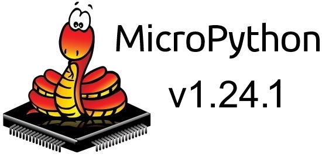](https://github.com/micropython/micropython/releases/tag/v1.24.1)

MicroPython v1.24.1 is a patch release containing 21 new commits to the codebase. It is articularly useful for rp2 and ESP32 builds and it's also a good idea to update mpremote - [GitHub Release Notes](https://github.com/micropython/micropython/releases/tag/v1.24.1) and [Prebuilt Downloads](https://t.co/5lTx8jv125).

## The New Raspberry Pi Pico 2 W Combines the new RP2350 with WiFi

[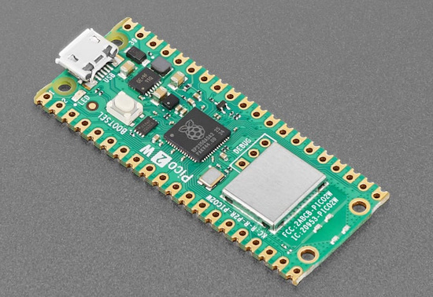](https://www.raspberrypi.com/news/raspberry-pi-pico-2-w-on-sale-now/)

Raspberry Pi product launches continue with the Raspberry Pi Pico 2 W, a wireless-enabled variant of this summer’s Pico 2. Built around the new RP2350 microcontroller, it featuring the tried and tested wireless modem from the original Pico W and it's priced at just $7 - [Raspberry Pi News](https://www.raspberrypi.com/news/raspberry-pi-pico-2-w-on-sale-now/).

[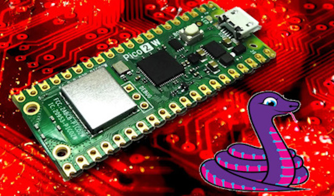](https://www.tomshardware.com/raspberry-pi/raspberry-pi-pico-2-w-review)

The Raspberry Pi Pico 2 W was ready to run CircuitPython on release. The CircuitPython team had made a board definition and had it ready to go. Tom's Hardware discusses it, Ladyada on X posted it and the Adafruit Blog has details - [Tom's Hardware](https://www.tomshardware.com/raspberry-pi/raspberry-pi-pico-2-w-review), [Ladyada on X](https://x.com/adafruit/status/1861061350526419294) and [Adafruit Blog](https://blog.adafruit.com/2024/11/25/circuitpython-connects-wifi-with-ease-on-the-raspberry-pi-pico-2-w-tomshardware/).

## The Raspberry Pi Commpute Module 5 is Here

[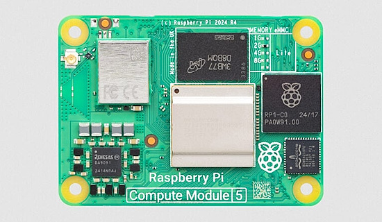](https://www.raspberrypi.com/news/compute-module-5-on-sale-now/)

The Raspberry Pi Compute Module 5 is on sale now from $45 - [Raspberry Pi News](https://www.raspberrypi.com/news/compute-module-5-on-sale-now/).

Compute Module 5 gives you everything you love about Raspberry Pi 5, but in a smaller package:

* A 2.4GHz quad-core 64-bit Arm Cortex-A76 CPU
* A VideoCore VII GPU, supporting OpenGL ES 3.1 and Vulkan 1.3
* Dual 4Kp60 HDMI® display output
* A 4Kp60 HEVC decoder
* Optional dual-band 802.11ac Wi-Fi® and Bluetooth 5.0
* 2 × USB 3.0 interfaces, supporting simultaneous 5Gbps operation
* Gigabit Ethernet, with IEEE 1588 support
* 2 × 4-lane MIPI camera/display transceivers
* A PCIe 2.0 x1 interface for fast peripherals
* 30 GPIOs, supporting 1.8V or 3.3V operation
* A rich selection of peripherals (UART, SPI, I2C, I2S, SDIO, and PWM)
* It is available with 2GB, 4GB, or 8GB of LPDDR4X-4267 SDRAM, and with 16GB, 32GB, or 64GB of MLC eMMC non-volatile memory. 16GB SDRAM variants are expected to follow in 2025.

An IO Board and case are also available alongside the CM 5 from Raspberry Pi.

[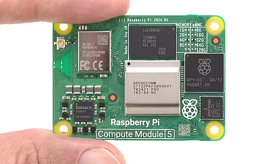](https://www.hackster.io/news/power-in-a-tiny-package-a-hands-on-review-of-the-raspberry-pi-compute-module-5-aeef3feb7415)

A Hands-On Review of the Raspberry Pi Compute Module 5 - [Hackster.io](https://www.hackster.io/news/power-in-a-tiny-package-a-hands-on-review-of-the-raspberry-pi-compute-module-5-aeef3feb7415).

## MicroPython: The Best Bits! - Matt Trentini at Pycon AU 2024)

[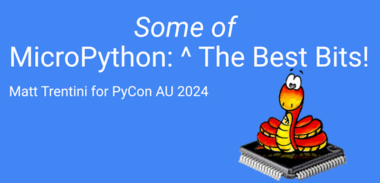](https://www.youtube.com/watch?v=EVRDuu-Sez0)

MicroPython continues to grow in popularity. But _why_? What is it about this pint-sized version of Python that makes it compelling? What are the best bits of MicroPython? Join Matt Trentini in this talk for a whirlwind tour of some of the most exciting features of this modern embedded programming language - [Talk on YouTube](https://www.youtube.com/watch?v=EVRDuu-Sez0) and [Slides](https://docs.google.com/presentation/d/e/2PACX-1vQDB-oMalkKqR1GNfWwSKGRDsSJGJQKIGu3GUbQWLuWMkMn3NOd9GjoYdhr6YLKU0U_9jtu5Q_xjyit/pub?slide=id.gc6f73a04f_0_0). Via [Mastodon](https://fosstodon.org/@matt_trentini/113569996953673401).

## Teaching Digital Technologies in Australian Schools with Python and the Kookaberry

[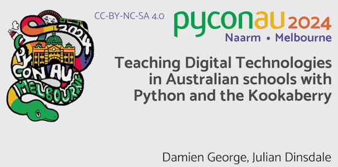](https://www.youtube.com/watch?v=eK2YIHYDbG8)

Damien George (MicroPython inventor) and Julian Dinsdale's talk at PyCon AU 2024 - [YouTube](https://www.youtube.com/watch?v=eK2YIHYDbG8).

> "There are around 6,200 primary schools around Australia, and the curriculum has a requirement to teach Digital Technologies, which includes a coding portion.  There are many challenges here, not least which is enabling the approximately 150,000 primary school teachers with the skills and resources to teach programming to young students.  The AustSTEM foundation was set up to assist in this area, and developed a MicroPython based learning platform, which consists of a pocket-sized computing device that integrates with a web-based coding and teaching environment. In this talk we will discuss this teaching platform, how it can help students transition from block-based programming to textual coding, and show some of the successes we have had so far in Australian classrooms"

## 10 Raspberry Pi Pico Project Ideas to Get You Started

[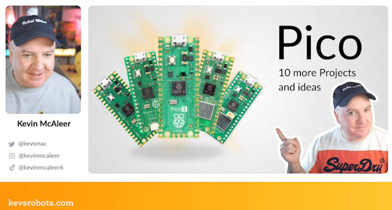](https://www.youtube.com/watch?v=iwNt7JwWQYc)

Roboteer Keven McAleer demonstrates 10 Raspberry Pi Pico project ideas to get you started - [YouTube](https://www.youtube.com/watch?v=iwNt7JwWQYc).

## Feather Takes Flight on the SparkFun Thing Plus with an RP2350 Microcontroller

[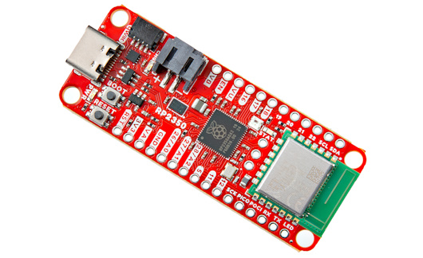](https://www.sparkfun.com/products/25134)

SparkFun's latest [Feather](https://www.adafruit.com/category/943) soars high! The SparkFun RP2350 Thing Plus is a dynamic and powerful wireless development platform in the Thing Plus form factor. This lightweight powerhouse spreads its wings with a RP2350 microcontroller from the Raspberry Pi Foundation. This board includes their radio module for single-band 2.4 GHz WiFi 4 (802.11n) and Bluetooth® 5.2, along with standard hardware components found on all Thing Plus Boards. This includes on-board Lithium Ion (LiPo) battery charging and fuel gauge circuits, µSD card socket, Qwiic connector, and the Thing Plus pinout (Feather-footprint, & Feather pinout, ensuring compatibility with the Feather ecosystem), and allowing use of the RP2350 Thing Plus in a wide variety of both local and remote applications.

It looks like this could be a Feather in your project’s cap! Ready to ruffle some Feathers? Dive into your next project and let your ideas fly to new heights with this new Feather :) - [SparkFun](https://www.sparkfun.com/products/25134).

## This Week's Python Streams

Python on Hardware is all about building a cooperative ecosphere which allows contributions to be valued and to grow knowledge. Below are the streams within the last week focusing on the community.

**CircuitPython Deep Dive Stream**

[Last Friday](https://youtube.com/live/7fIM6B4bNrM), Tim was looking into a `Vectorio` rotation bug.

You can see the latest video and past videos on the Adafruit YouTube channel under the Deep Dive playlist - [YouTube](https://www.youtube.com/playlist?list=PLjF7R1fz_OOXBHlu9msoXq2jQN4JpCk8A).

**CircuitPython Parsec**

John Park’s CircuitPython Parsec was off this week due to heavy doses of turkey and cranberry. Catch all the episodes in the [YouTube playlist](https://www.youtube.com/playlist?list=PLjF7R1fz_OOWFqZfqW9jlvQSIUmwn9lWr).

**CircuitPython Weekly Meeting**

CircuitPython Weekly Meeting for {date} ([notes](file)) [on YouTube](link).

## Project of the Week

The CircuitPython_PIO_I2S library by Cooper Dalrymple provides bidirectional I2S audio communication using PIO on Raspberry Pi RP2xxx microcontrollers - [GitHub](https://github.com/relic-se/CircuitPython_PIO_I2S) and [Adafruit Playground](https://adafruit-playground.com/u/relic_se/pages/adafruit-i2s-mems-microphone-breakout-circuitpython-wiring-test). Via [X](https://x.com/coopersnout/status/1860082832397468060).

## Popular Last Week

What was the most popular, most clicked link, in [last week's newsletter](https://www.adafruitdaily.com/2024/11/25/python-on-microcontrollers-newsletter-circuitpython-9-2-1-what-is-dma-pyconus-2025-and-more-circuitpython-python-micropython-thepsf-raspberry_pi/)? [Review: 7 Python IDEs compared](https://www.infoworld.com/article/2250631/review-7-python-ides-compared.html).

Did you know you can read past issues of this newsletter in the Adafruit Daily Archive? [Check it out](https://www.adafruitdaily.com/category/circuitpython/).

## New Notes from Adafruit Playground

[Adafruit Playground](https://adafruit-playground.com/) is a new place for the community to post their projects and other making tips/tricks/techniques. Ad-free, it's an easy way to publish your work in a safe space for free.

Science + Fiction = Fun! (The Drake Equation and CircuitPython) - [Adafruit Playground](https://adafruit-playground.com/u/mrklingon/pages/science-fiction-fun).

Adafruit I2S MEMS Microphone Breakout: CircuitPython wiring & test - [Adafruit Playground](https://adafruit-playground.com/u/relic_se/pages/adafruit-i2s-mems-microphone-breakout-circuitpython-wiring-test).

[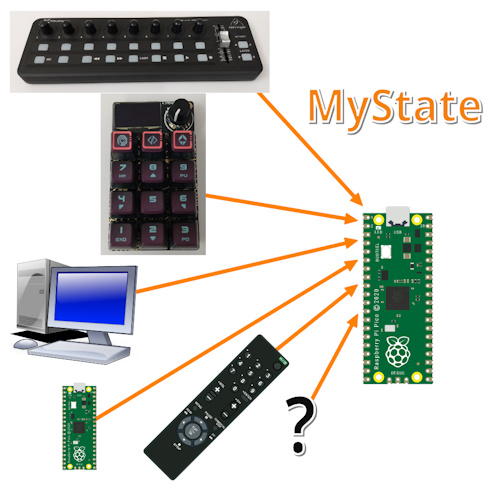](https://adafruit-playground.com/u/Alain_ManHW/pages/mystate-be-one-with-the-electronics-universe-collaborate-interoperate)

MyState: Be one with the electronics universe. Collaborate. Interoperate - [Adafruit Playground](https://adafruit-playground.com/u/Alain_ManHW/pages/mystate-be-one-with-the-electronics-universe-collaborate-interoperate).

## News From Around the Web

[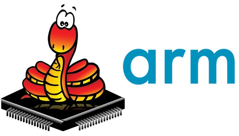](https://github.com/orgs/micropython/discussions/16345)

GitHub user pysselmedheg has posted that they have writted their own assembler decorator for MicroPython. It has the full ARMv6-M instruction set (like in the RP2040), and it's not as restrictive as `@micropython.asm_thumb` regarding use of Python variables, or even Python code as a preprocessor - [GitHub](https://github.com/orgs/micropython/discussions/16345).

[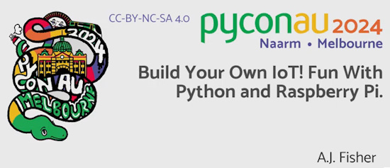](https://www.youtube.com/watch?v=RbQAY-ZfrIw)

"Build Your Own IoT! Fun With Python and Raspberry Pi." - A.J. Fisher's talk at Pycon AU 2024 - [YouTube](https://www.youtube.com/watch?v=RbQAY-ZfrIw).

Luci was not happy with the speed of framebuffering in CircuitPython so she has coded up a version with more speed - [Mastodon](https://twoot.site/@luci/113528168739055075) and [GitHub](https://github.com/LuciCodesStuff/FrameBuffer.py).

[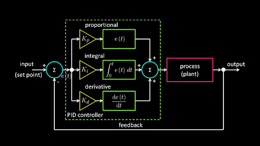](https://www.digikey.com/en/maker/tutorials/2024/implementing-a-pid-controller-algorithm-in-python)

Implementing a PID controller algorithm in Python - [Maker.io](https://www.digikey.com/en/maker/tutorials/2024/implementing-a-pid-controller-algorithm-in-python).

[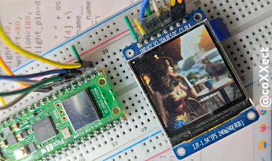](https://www.youtube.com/shorts/FgtMxo2pFNM)

An image slideshow on an ST7789 display using a Raspberry Pi Pico 2 with CircuitPython 9.2.1 - [YouTube](https://www.youtube.com/watch?v=NzaIc1PHTYo) and [Blog](https://coxxect.blogspot.com/2024/11/raspberry-pi-pico-2circuitpython-9_29.html).

text - [site](url).

text - [site](url).

text - [site](url).

text - [site](url).

text - [site](url).

text - [site](url).

text - [site](url).

text - [site](url).

text - [site](url).

text - [site](url).

text - [site](url).

text - [site](url).

text - [site](url).

## New

[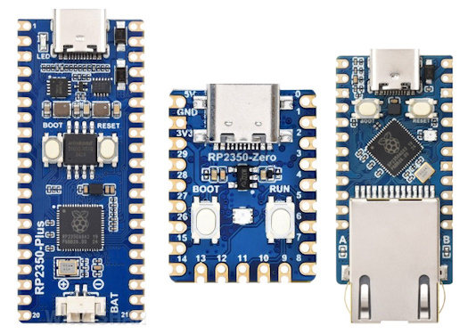](https://www.cnx-software.com/2024/11/28/waveshare-rp2350-usb-c-development-boards-castellated-design-battery-support-built-in-ethernet-port/)

Waveshare launches three RP2350 USB-C development boards - [CNX](https://www.cnx-software.com/2024/11/28/waveshare-rp2350-usb-c-development-boards-castellated-design-battery-support-built-in-ethernet-port/).

[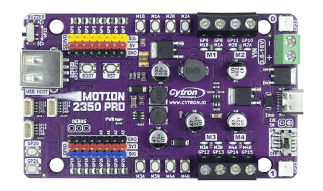](https://www.cytron.io/p-motion-2350-pro)

Cytron has released the MOTION 2350 Pro - an advanced robotics controller for beginners - [Cytron](https://www.cytron.io/p-motion-2350-pro).

[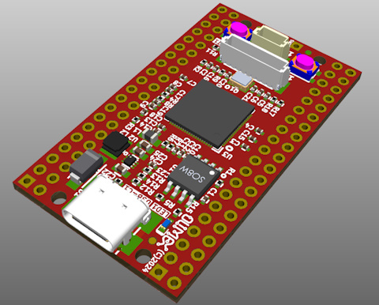](https://olimex.wordpress.com/2024/11/28/pico2-xl-and-pico2-xxl-are-open-source-hardware-boards-with-rp2350b-and-offering-48-gpios-available-2-16mb-flash-0-8mb-psram-sd-card-usb-c-and-2a-3-3v-power-supply/)

The PICO2-XL and PICO2-XXL are Open Source Hardware boards with RP2350B and offer 48 GPIOs, 2-16MB Flash, 0-8MB PSRAM, SD-card, USB-C and 2A 3.3V power supply - [Olimex Blog](https://olimex.wordpress.com/2024/11/28/pico2-xl-and-pico2-xxl-are-open-source-hardware-boards-with-rp2350b-and-offering-48-gpios-available-2-16mb-flash-0-8mb-psram-sd-card-usb-c-and-2a-3-3v-power-supply/).

## New Boards Supported by CircuitPython

The number of supported microcontrollers and Single Board Computers (SBC) grows every week. This section outlines which boards have been included in CircuitPython or added to [CircuitPython.org](https://circuitpython.org/).

This week there were two new boards added:

- [Bradán Lane STUDIO Coin M0](https://circuitpython.org/board/bradanlanestudio_coin_m0/)
- [Pico 2 W](https://circuitpython.org/board/raspberry_pi_pico2_w/)
- [Board name](url)

*Note: For non-Adafruit boards, please use the support forums of the board manufacturer for assistance, as Adafruit does not have the hardware to assist in troubleshooting.*

Looking to add a new board to CircuitPython? It's highly encouraged! Adafruit has four guides to help you do so:

- [How to Add a New Board to CircuitPython](https://learn.adafruit.com/how-to-add-a-new-board-to-circuitpython/overview)
- [How to add a New Board to the circuitpython.org website](https://learn.adafruit.com/how-to-add-a-new-board-to-the-circuitpython-org-website)
- [Adding a Single Board Computer to PlatformDetect for Blinka](https://learn.adafruit.com/adding-a-single-board-computer-to-platformdetect-for-blinka)
- [Adding a Single Board Computer to Blinka](https://learn.adafruit.com/adding-a-single-board-computer-to-blinka)

## New Learn Guides

[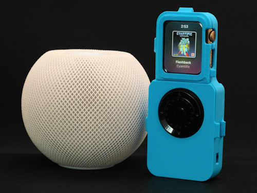](https://learn.adafruit.com/guides/latest)

The Adafruit Learning System has over 3,000 free guides for learning skills and building projects including using Python.

[Tiny Pod - BLE Rotary Encoder for iWatch](https://learn.adafruit.com/ano-pod) from The Ruiz Brothers and Liz Clark.

## CircuitPython Libraries

The CircuitPython library numbers are continually increasing, while existing ones continue to be updated. Here we provide library numbers and updates!

To get the latest Adafruit libraries, download the [Adafruit CircuitPython Library Bundle](https://circuitpython.org/libraries). To get the latest community contributed libraries, download the [CircuitPython Community Bundle](https://circuitpython.org/libraries).

If you'd like to contribute to the CircuitPython project on the Python side of things, the libraries are a great place to start. Check out the [CircuitPython.org Contributing page](https://circuitpython.org/contributing). If you're interested in reviewing, check out Open Pull Requests. If you'd like to contribute code or documentation, check out Open Issues. We have a guide on [contributing to CircuitPython with Git and GitHub](https://learn.adafruit.com/contribute-to-circuitpython-with-git-and-github), and you can find us in the #help-with-circuitpython and #circuitpython-dev channels on the [Adafruit Discord](https://adafru.it/discord).

You can check out this [list of all the Adafruit CircuitPython libraries and drivers available](https://github.com/adafruit/Adafruit_CircuitPython_Bundle/blob/master/circuitpython_library_list.md). 

The current number of CircuitPython libraries is **506**!

**Updated Libraries**

Here's this week's updated CircuitPython libraries:

  * [adafruit/Adafruit_CircuitPython_MiniMQTT](https://github.com/adafruit/Adafruit_CircuitPython_MiniMQTT)
  * [adafruit/Adafruit_CircuitPython_CharLCD](https://github.com/adafruit/Adafruit_CircuitPython_CharLCD)
  * [adafruit/Adafruit_CircuitPython_Dash_Dis](https://github.com/adafruit/Adafruit_CircuitPython_Dash_Dis)

## What’s the CircuitPython team up to this week?

What is the team up to this week? Let’s check in:

**Dan**

I did some refactoring in the CircuitMatter library to isolate the calls to the `ecdsa` library, so that its functionality can be replaced with something else when running CircuitMatter on CircuitPython.

**Tim**

I fixed an issue with filtering boards on circuitpython.org that was caused by my changes to search from last week. I've continued working through library issues, this week I added docstrings, type annotations, examples to various libraries and submitted a timeout fix for MiniMQTT. I finished the BlueSky project guide, however it may get a re-visit if I can work through some issues with the TFT display. 

**Jeff**

This week I implemented a DOS floppy archiver for the Floppsy board. With just one button press, it archives DOS floppies in any of the 4 common formats (360k, 720k, 1.2M and 1.44M) into IMG files on an SD card.

**Scott**

I'm back from my first short stretch of paternity leave this week. The baby and my wife are doing well. We're sleep deprived but that's how it goes with newborns.

I've gotten caught up on email and have been working on the ESP32-P4 support. TinyUSB added support after my initial work so I'm trying to get USB going. I plan on helping bring CircuitMatter to CircuitPython with Dan. I'm also brainstorming goals for CircuitPython in 2025. I'll be out on more paternity leave next year so we need to prioritize my time before then. We'll do #CircuitPython2025 in the New Year to hear from our community.

## Upcoming Events

PyLadies Conference (PyLadiesCon) is a transformative event designed to promote diversity, learning, and empowerment within the Python community. December 6-8, 2024 online - [PyLadies](https://conference.pyladies.com/).

The next MicroPython Meetup in Melbourne will be on December 11th – [Meetup](https://www.meetup.com/micropython-meetup/events). You can see recordings of previous meetings on [YouTube](https://www.youtube.com/@MicroPythonOfficial).

The community is coming back to Pittsburgh, Pennsylvania for PyCon US 2025 May 14 - May 22, 2025 - [us.pycon.org](https://us.pycon.org/2025/).

**Send Your Events In**

If you know of virtual events or upcoming events, please let us know via email to cpnews(at)adafruit(dot)com.

## Latest Releases

CircuitPython's stable release is [9.2.1](https://github.com/adafruit/circuitpython/releases/latest). New to CircuitPython? Start with the [Welcome to CircuitPython Guide](https://learn.adafruit.com/welcome-to-circuitpython).

[20241128](https://github.com/adafruit/Adafruit_CircuitPython_Bundle/releases/latest) is the latest Adafruit CircuitPython library bundle.

[20241110](https://github.com/adafruit/CircuitPython_Community_Bundle/releases/latest) is the latest CircuitPython Community library bundle.

[v1.24.1](https://micropython.org/download) is the latest MicroPython release. Documentation for it is [here](http://docs.micropython.org/en/latest/pyboard/).

[3.13.0](https://www.python.org/downloads/) is the latest Python release. The latest pre-release version is [3.14.0a2](https://www.python.org/download/pre-releases/).

[4,129 Stars](https://github.com/adafruit/circuitpython/stargazers) Like CircuitPython? [Star it on GitHub!](https://github.com/adafruit/circuitpython)

## Call for Help -- Translating CircuitPython is now easier than ever

[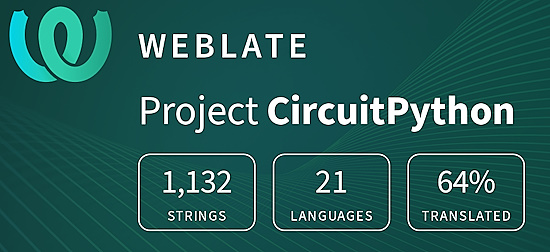](https://hosted.weblate.org/engage/circuitpython/)

One important feature of CircuitPython is translated control and error messages. With the help of fellow open source project [Weblate](https://weblate.org/), we're making it even easier to add or improve translations. 

Sign in with an existing account such as GitHub, Google or Facebook and start contributing through a simple web interface. No forks or pull requests needed! As always, if you run into trouble join us on [Discord](https://adafru.it/discord), we're here to help.

## 38,475 Thanks

The Adafruit Discord community, where we do all our CircuitPython development in the open, reached over 38,475 humans - thank you! Adafruit believes Discord offers a unique way for Python on hardware folks to connect. Join today at [https://adafru.it/discord](https://adafru.it/discord).

## ICYMI - In case you missed it

Python on hardware is the Adafruit Python video-newsletter-podcast! The news comes from the Python community, Discord, Adafruit communities and more and is broadcast on ASK an ENGINEER Wednesdays. The complete Python on Hardware weekly videocast [playlist is here](https://www.youtube.com/playlist?list=PLjF7R1fz_OOXRMjM7Sm0J2Xt6H81TdDev). The video podcast is on [iTunes](https://itunes.apple.com/us/podcast/python-on-hardware/id1451685192?mt=2), [YouTube](http://adafru.it/pohepisodes), [Instagram](https://www.instagram.com/adafruit/channel/)), and [XML](https://itunes.apple.com/us/podcast/python-on-hardware/id1451685192?mt=2).

[The weekly community chat on Adafruit Discord server CircuitPython channel - Audio / Podcast edition](https://itunes.apple.com/us/podcast/circuitpython-weekly-meeting/id1451685016) - Audio from the Discord chat space for CircuitPython, meetings are usually Mondays at 2pm ET, this is the audio version on [iTunes](https://itunes.apple.com/us/podcast/circuitpython-weekly-meeting/id1451685016), Pocket Casts, [Spotify](https://adafru.it/spotify), and [XML feed](https://adafruit-podcasts.s3.amazonaws.com/circuitpython_weekly_meeting/audio-podcast.xml).

## Contribute

The CircuitPython Weekly Newsletter is a CircuitPython community-run newsletter emailed every Monday. The complete [archives are here](https://www.adafruitdaily.com/category/circuitpython/). It highlights the latest CircuitPython related news from around the web including Python and MicroPython developments. To contribute, edit next week's draft [on GitHub](https://github.com/adafruit/circuitpython-weekly-newsletter/tree/gh-pages/_drafts) and [submit a pull request](https://help.github.com/articles/editing-files-in-your-repository/) with the changes. You may also tag your information on Twitter with #CircuitPython. 

Join the Adafruit [Discord](https://adafru.it/discord) or [post to the forum](https://forums.adafruit.com/viewforum.php?f=60) if you have questions.
