- [ ] Library and info updates
- [ ] change date
- [ ] update title
- [ ] Feature story
- [ ] Update  for images
- [ ] Update ICYDNCI
- [ ] All images 550w max only
- [ ] Link "View this email in your browser."

News Sources

- [Adafruit Playground](https://adafruit-playground.com/)
- Twitter: [CircuitPython](https://twitter.com/search?q=circuitpython&src=typed_query&f=live), [MicroPython](https://twitter.com/search?q=micropython&src=typed_query&f=live) and [Python](https://twitter.com/search?q=python&src=typed_query)
- [Raspberry Pi News](https://www.raspberrypi.com/news/)
- Mastodon [CircuitPython](https://octodon.social/tags/CircuitPython) and [MicroPython](https://octodon.social/tags/MicroPython)
- [hackster.io CircuitPython](https://www.hackster.io/search?q=circuitpython&i=projects&sort_by=most_recent) and [MicroPython](https://www.hackster.io/search?q=micropython&i=projects&sort_by=most_recent)
- YouTube: [CircuitPython](https://www.youtube.com/results?search_query=circuitpython&sp=CAI%253D), [MicroPython](https://www.youtube.com/results?search_query=micropython&sp=CAI%253D)
- Instructables: [CircuitPython](https://www.instructables.com/search/?q=circuitpython&projects=all&sort=Newest), [MicroPython](https://www.instructables.com/search/?q=micropython&projects=all&sort=Newest), [Raspberry Pi Python](https://www.instructables.com/search/?q=raspberry+pi+python&projects=all&sort=Newest)
- [hackaday CircuitPython](https://hackaday.com/blog/?s=circuitpython) and [MicroPython](https://hackaday.com/blog/?s=micropython)
- [python.org](https://www.python.org/)
- [Python Insider - dev team blog](https://pythoninsider.blogspot.com/)
- Individuals: [Jeff Geerling](https://www.jeffgeerling.com/blog), [Yakroo](https://x.com/Yakroo5077)
- Tom's Hardware: [CircuitPython](https://www.tomshardware.com/search?searchTerm=circuitpython&articleType=all&sortBy=publishedDate) and [MicroPython](https://www.tomshardware.com/search?searchTerm=micropython&articleType=all&sortBy=publishedDate) and [Raspberry Pi](https://www.tomshardware.com/search?searchTerm=raspberry%20pi&articleType=all&sortBy=publishedDate)
- [hackaday.io newest projects MicroPython](https://hackaday.io/projects?tag=micropython&sort=date) and [CircuitPython](https://hackaday.io/projects?tag=circuitpython&sort=date)
- [Google News Python](https://news.google.com/topics/CAAqIQgKIhtDQkFTRGdvSUwyMHZNRFY2TVY4U0FtVnVLQUFQAQ?hl=en-US&gl=US&ceid=US%3Aen)
- hackaday.io - [CircuitPython](https://hackaday.io/search?term=circuitpython) and [MicroPython](https://hackaday.io/search?term=micropython)

View this email in your browser. **Warning: Flashing Imagery**

Welcome to the latest Python on Microcontrollers newsletter! *insert 2-3 sentences from editor (what's in overview, banter)* - *Anne Barela, Editor*

We're on [Discord](https://discord.gg/HYqvREz), [Twitter](https://twitter.com/search?q=circuitpython&src=typed_query&f=live), and for past newsletters - [view them all here](https://www.adafruitdaily.com/category/circuitpython/). If you're reading this on the web, [subscribe here](https://www.adafruitdaily.com/). Here's the news this week:

## The Raspberry Pi 500 Keyboard Debuts Along With an HDMI Monitor

[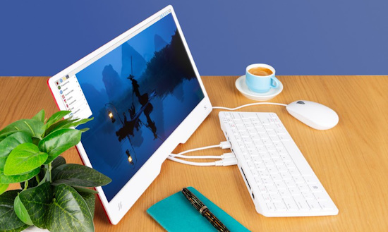](https://www.raspberrypi.com/news/raspberry-pi-500-and-raspberry-pi-monitor-on-sale-now/)

Raspberry Pi has released two hotly anticipated products: the [Raspberry Pi 500](https://www.adafruit.com/product/6111) keyboard sized computer, available for $90, and the [Raspberry Pi Monitor](https://www.adafruit.com/product/6088) for $100 - [Raspberry Pi News](https://www.raspberrypi.com/news/raspberry-pi-500-and-raspberry-pi-monitor-on-sale-now/).

[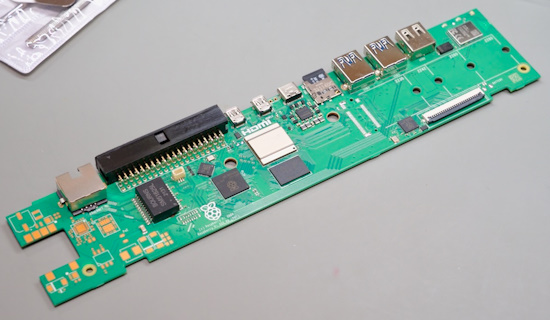](https://www.jeffgeerling.com/blog/2024/pi-500-much-faster-lacks-m2)

Jeff Geerling does a thorough review of the Pi 500. He notes the PCB has space for a PCIe card and power over Ethernet, but the components are not placed, therefore the unit dooesn't have those capabilities (but may in the future in a "pro" model). Overall it's a solid offering, with the 2x to 3x speedup from the Pi 5 design - [Jeff Geerling](https://www.jeffgeerling.com/blog/2024/pi-500-much-faster-lacks-m2) and [YouTube](https://youtu.be/5YfJWYELA3k).

[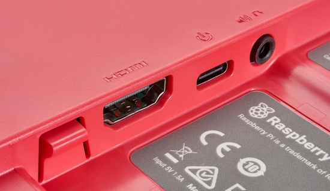](https://www.jeffgeerling.com/blog/2024/pi-500-much-faster-lacks-m2)

The monitor is a 15.6" IPS LCD with speakers. It can be powered either directly off the Pi's USB port (at 60% brightness and 60% volume), or via an external USB-C charger (for 100%). It comes with an integrated kickstand. If the VESA mount is used, it does block the ports, making changing connections difficult - [Jeff Geerling](https://www.jeffgeerling.com/blog/2024/pi-500-much-faster-lacks-m2).

[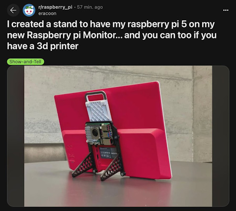](https://x.com/geerlingguy/status/1866957917032972410)

And folks are already designing alternate stands and Pi 5 mounts for the monitor - [X](https://x.com/geerlingguy/status/1866957917032972410) and [Printables](https://www.printables.com/model/1105030-raspberry-pi-monitor-stand).

## Adafruit Visits Boston College

[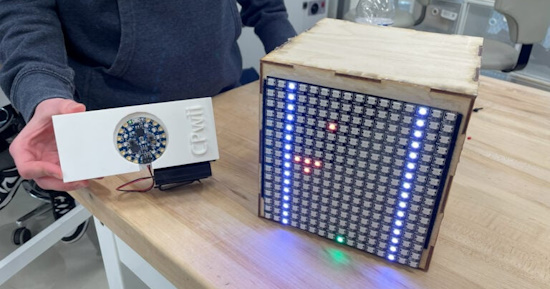](https://blog.adafruit.com/2024/12/11/visiting-the-student-tech-showcase-at-boston-college-2024/)

On Friday, December 6th, Adafruiters Noe and Liz visited Boston College (BC) for Professor John Gallaugher‘s Student Tech Showcase, joined by BC alum and maker Guy Dupont - [Adafruit Blog](https://blog.adafruit.com/2024/12/11/visiting-the-student-tech-showcase-at-boston-college-2024/).

> "At the end of every semester, Prof. Gallaugher organizes a showcase for his students in his physical computing and Swift programming classes to present their end of semester projects science fair-style. All of the projects were very impressive. For most of the students, the class had marked the first time they were working with these technologies, including electronics for the physical computing students.
 &nbsp;  
Prof. Gallaugher uses [CircuitPython](https://circuitpython.org/) and a lot of [Adafruit](https://www.adafruit.com/) hardware in his physical computing course. We were able to chat with the students presenting to learn about their projects and hear about their experiences using CircuitPython and Adafruit hardware."

## Feature

text - [site](url).

## Feature

text - [site](url).

## Feature

text - [site](url).

## STMicro Launches a NPU-Equipped Microcontroller

[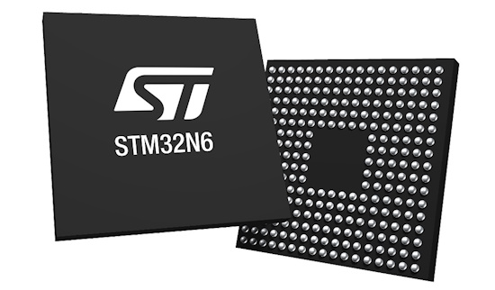](https://www.eetimes.com/stmicro-launches-npu-equipped-microcontroller/)

The STM32N6 is the newest and most powerful STM32 and the first to come with a Neural-ART Accelerator, a custom neural processing unit (NPU) capable of 600 GOPS for machine learning applications which once demanded an accelerated microprocessor now run on an MCU. It’s also STM's first Cortex-M55 MCU and one of the few in the industry to run at 800 MHz. Additionally, at 4.2 MB, the STM32N6 includes the largest embedded RAM on an STM32 - [EE Times](https://www.eetimes.com/stmicro-launches-npu-equipped-microcontroller/) and [STM Blog](https://blog.st.com/stm32n6/).

## This Week's Python Streams

Python on Hardware is all about building a cooperative ecosphere which allows contributions to be valued and to grow knowledge. Below are the streams within the last week focusing on the community.

**CircuitPython Deep Dive Stream**

[Last Friday](link), Tim streamed work on {subject}.

You can see the latest video and past videos on the Adafruit YouTube channel under the Deep Dive playlist - [YouTube](https://www.youtube.com/playlist?list=PLjF7R1fz_OOXBHlu9msoXq2jQN4JpCk8A).

**CircuitPython Parsec**

John Park’s CircuitPython Parsec this week is on {subject} - [Adafruit Blog](link) and [YouTube](link).

Catch all the episodes in the [YouTube playlist](https://www.youtube.com/playlist?list=PLjF7R1fz_OOWFqZfqW9jlvQSIUmwn9lWr).

**CircuitPython Weekly Meeting**

CircuitPython Weekly Meeting for December 9, 2024 ([notes](https://github.com/adafruit/adafruit-circuitpython-weekly-meeting/blob/main/2024/2024-12-09.md)) [on YouTube](https://youtu.be/mewDFnjzxIk).

## Project of the Week

[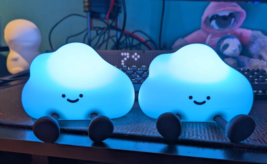](url)

text - [site](url).

## Popular Last Week

[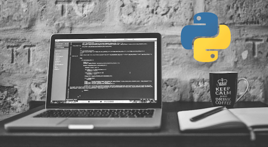](https://www.kdnuggets.com/10-python-libraries-every-developer-should-know)

What was the most popular, most clicked link, in [last week's newsletter](https://www.adafruitdaily.com/2024/12/09/python-on-microcontrollers-newsletter-programming-pi-5-pio-circuitpython-vscode-and-much-more-circuitpython-python-micropython-thepsf-raspberry_pi/)? [10 Python Libraries Every Developer Should Know](https://www.kdnuggets.com/10-python-libraries-every-developer-should-know).

Did you know you can read past issues of this newsletter in the Adafruit Daily Archive? [Check it out](https://www.adafruitdaily.com/category/circuitpython/).

## New Notes from Adafruit Playground

[Adafruit Playground](https://adafruit-playground.com/) is a new place for the community to post their projects and other making tips/tricks/techniques. Ad-free, it's an easy way to publish your work in a safe space for free.

text - [Adafruit Playground](url).

text - [Adafruit Playground](url).

text - [Adafruit Playground](url).

## News From Around the Web

[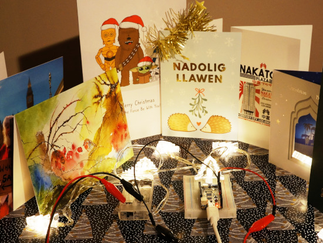](https://www.instructables.com/PWM-Brightness-Control-of-Small-Christmas-Lights-U/)

Powering small 3V Christmas lights with the second regulator on the UM FeatherS2 with PWM brightness control via unusual technique of PWM signal on enable line using CircuitPython - [Instructables](https://www.instructables.com/PWM-Brightness-Control-of-Small-Christmas-Lights-U/).

text - [site](url).

text - [site](url).

text - [site](url).

text - [site](url).

text - [site](url).

text - [site](url).

text - [site](url).

text - [site](url).

text - [site](url).

text - [site](url).

text - [site](url).

text - [site](url).

text - [site](url).

text - [site](url).

text - [site](url).

text - [site](url).

text - [site](url).

## New

[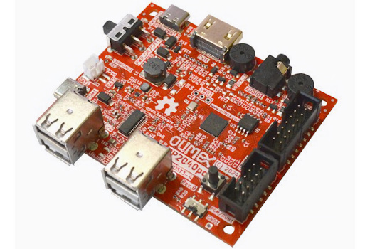](https://www.cnx-software.com/2024/12/12/15-euros-olimex-rp2040pc-raspberry-pi-rp2040-computer-board-supports-apple-and-oric-atmos-emulation/)

Olimex RP2040pc Raspberry Pi RP2040 computer board supports Apple and Oric Atmos emulation through the Reload emulator. You’ll find the source code on the [reload-emulator GitHub repository](https://github.com/vsladkov/reload-emulator). It’s designed with the official Raspberry Pi Pico C/C++ SDK, and relies on popular projects such as PicoDVI and tinyUSB - [CNX Software](https://www.cnx-software.com/2024/12/12/15-euros-olimex-rp2040pc-raspberry-pi-rp2040-computer-board-supports-apple-and-oric-atmos-emulation/).

text - [site](url).

## New Boards Supported by CircuitPython

The number of supported microcontrollers and Single Board Computers (SBC) grows every week. This section outlines which boards have been included in CircuitPython or added to [CircuitPython.org](https://circuitpython.org/).

This week there were (#/no) new boards added:

- [Board name](url)
- [Board name](url)
- [Board name](url)

*Note: For non-Adafruit boards, please use the support forums of the board manufacturer for assistance, as Adafruit does not have the hardware to assist in troubleshooting.*

Looking to add a new board to CircuitPython? It's highly encouraged! Adafruit has four guides to help you do so:

- [How to Add a New Board to CircuitPython](https://learn.adafruit.com/how-to-add-a-new-board-to-circuitpython/overview)
- [How to add a New Board to the circuitpython.org website](https://learn.adafruit.com/how-to-add-a-new-board-to-the-circuitpython-org-website)
- [Adding a Single Board Computer to PlatformDetect for Blinka](https://learn.adafruit.com/adding-a-single-board-computer-to-platformdetect-for-blinka)
- [Adding a Single Board Computer to Blinka](https://learn.adafruit.com/adding-a-single-board-computer-to-blinka)

## New Learn Guides

[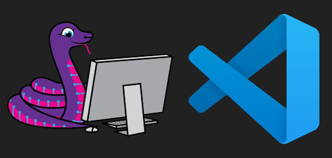](https://learn.adafruit.com/guides/latest)

The Adafruit Learning System has over 3,000 free guides for learning skills and building projects including using Python.

[title](url) from [name](url)

[title](url) from [name](url)

[title](url) from [name](url)

## Updated Learn Guides

[title](url)

## CircuitPython Libraries

The CircuitPython library numbers are continually increasing, while existing ones continue to be updated. Here we provide library numbers and updates!

To get the latest Adafruit libraries, download the [Adafruit CircuitPython Library Bundle](https://circuitpython.org/libraries). To get the latest community contributed libraries, download the [CircuitPython Community Bundle](https://circuitpython.org/libraries).

If you'd like to contribute to the CircuitPython project on the Python side of things, the libraries are a great place to start. Check out the [CircuitPython.org Contributing page](https://circuitpython.org/contributing). If you're interested in reviewing, check out Open Pull Requests. If you'd like to contribute code or documentation, check out Open Issues. We have a guide on [contributing to CircuitPython with Git and GitHub](https://learn.adafruit.com/contribute-to-circuitpython-with-git-and-github), and you can find us in the #help-with-circuitpython and #circuitpython-dev channels on the [Adafruit Discord](https://adafru.it/discord).

You can check out this [list of all the Adafruit CircuitPython libraries and drivers available](https://github.com/adafruit/Adafruit_CircuitPython_Bundle/blob/master/circuitpython_library_list.md). 

The current number of CircuitPython libraries is **###**!

**New Libraries**

Here's this week's new CircuitPython libraries:

* [library](url)

**Updated Libraries**

Here's this week's updated CircuitPython libraries:

* [library](url)

## What’s the CircuitPython team up to this week?

What is the team up to this week? Let’s check in:

**Dan**

text.

**Tim**

text.

**Jeff**

I've been working on Raspberry Pi 5 NeoPixel support in Adafruit Blinka. By the time you read this, it's likely that (after a few simple steps like updating your Pi's kernel & firmware to the latest official versions) `import neopixel` will work on Raspberry Pi 5 computers with Blinka installed on them.

**Scott**

I've been continuing to work on CircuitPython on Zephyr. `west flash` worked well to load the new binary onto the nRF52840 and it started up! I got output over the serial to the UART adapter. I tried connecting CircuitPython to the Zephyr console but discovered it is blocking! So, CircuitPython starts up and then just waits for a character forever. Next, I'll use a lower level asynchronous API. I'm travelling this week though and then mostly off for holidays so I'm not sure when that'll happen. Follow along on my [Zephyr git branch](https://github.com/tannewt/circuitpython/tree/zephyr).

**Liz**

This past week I had the opportunity to visit Boston College (BC) for Professor John Gallaugher's Student Tech Showcase. At the end of every semester, Prof. Gallaugher organizes a showcase for his students in his physical computing and Swift programming classes to present their end of semester projects science fair-style. The students use CircuitPython and a lot of Adafruit hardware in his physical computing course. I wrote up a [blog post](https://blog.adafruit.com/2024/12/11/visiting-the-student-tech-showcase-at-boston-college-2024/) detailing the visit and highlighting some of the CircuitPython projects that were on display; all of which were very impressive, especially for only one semester of work.

## Upcoming Events

The next MicroPython Meetup in Melbourne will be on December 25th – [Meetup](https://www.meetup.com/micropython-meetup/events). You can see recordings of previous meetings on [YouTube](https://www.youtube.com/@MicroPythonOfficial). 

The community is coming back to Pittsburgh, Pennsylvania for PyCon US 2025 May 14 - May 22, 2025 - [us.pycon.org](https://us.pycon.org/2025/).

**Send Your Events In**

If you know of virtual events or upcoming events, please let us know via email to cpnews(at)adafruit(dot)com.

## Latest Releases

CircuitPython's stable release is [#.#.#](https://github.com/adafruit/circuitpython/releases/latest) and its unstable release is [#.#.#-##.#](https://github.com/adafruit/circuitpython/releases). New to CircuitPython? Start with our [Welcome to CircuitPython Guide](https://learn.adafruit.com/welcome-to-circuitpython).

[2024####](https://github.com/adafruit/Adafruit_CircuitPython_Bundle/releases/latest) is the latest Adafruit CircuitPython library bundle.

[2024####](https://github.com/adafruit/CircuitPython_Community_Bundle/releases/latest) is the latest CircuitPython Community library bundle.

[v#.#.#](https://micropython.org/download) is the latest MicroPython release. Documentation for it is [here](http://docs.micropython.org/en/latest/pyboard/).

[#.#.#](https://www.python.org/downloads/) is the latest Python release. The latest pre-release version is [#.#.#](https://www.python.org/download/pre-releases/).

[#,### Stars](https://github.com/adafruit/circuitpython/stargazers) Like CircuitPython? [Star it on GitHub!](https://github.com/adafruit/circuitpython)

## Call for Help -- Translating CircuitPython is now easier than ever

[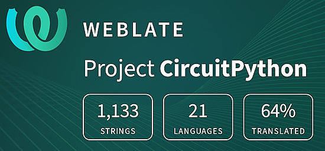](https://hosted.weblate.org/engage/circuitpython/)

One important feature of CircuitPython is translated control and error messages. With the help of fellow open source project [Weblate](https://weblate.org/), we're making it even easier to add or improve translations. 

Sign in with an existing account such as GitHub, Google or Facebook and start contributing through a simple web interface. No forks or pull requests needed! As always, if you run into trouble join us on [Discord](https://adafru.it/discord), we're here to help.

## NUMBER Thanks

The Adafruit Discord community, where we do all our CircuitPython development in the open, reached over NUMBER humans - thank you! Adafruit believes Discord offers a unique way for Python on hardware folks to connect. Join today at [https://adafru.it/discord](https://adafru.it/discord).

## ICYMI - In case you missed it

Python on hardware is the Adafruit Python video-newsletter-podcast! The news comes from the Python community, Discord, Adafruit communities and more and is broadcast on ASK an ENGINEER Wednesdays. The complete Python on Hardware weekly videocast [playlist is here](https://www.youtube.com/playlist?list=PLjF7R1fz_OOXRMjM7Sm0J2Xt6H81TdDev). The video podcast is on [iTunes](https://itunes.apple.com/us/podcast/python-on-hardware/id1451685192?mt=2), [YouTube](http://adafru.it/pohepisodes), [Instagram](https://www.instagram.com/adafruit/channel/)), and [XML](https://itunes.apple.com/us/podcast/python-on-hardware/id1451685192?mt=2).

[The weekly community chat on Adafruit Discord server CircuitPython channel - Audio / Podcast edition](https://itunes.apple.com/us/podcast/circuitpython-weekly-meeting/id1451685016) - Audio from the Discord chat space for CircuitPython, meetings are usually Mondays at 2pm ET, this is the audio version on [iTunes](https://itunes.apple.com/us/podcast/circuitpython-weekly-meeting/id1451685016), Pocket Casts, [Spotify](https://adafru.it/spotify), and [XML feed](https://adafruit-podcasts.s3.amazonaws.com/circuitpython_weekly_meeting/audio-podcast.xml).

## Contribute

The CircuitPython Weekly Newsletter is a CircuitPython community-run newsletter emailed every Monday. The complete [archives are here](https://www.adafruitdaily.com/category/circuitpython/). It highlights the latest CircuitPython related news from around the web including Python and MicroPython developments. To contribute, edit next week's draft [on GitHub](https://github.com/adafruit/circuitpython-weekly-newsletter/tree/gh-pages/_drafts) and [submit a pull request](https://help.github.com/articles/editing-files-in-your-repository/) with the changes. You may also tag your information on Twitter with #CircuitPython. 

Join the Adafruit [Discord](https://adafru.it/discord) or [post to the forum](https://forums.adafruit.com/viewforum.php?f=60) if you have questions.
