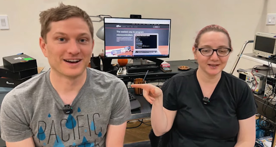
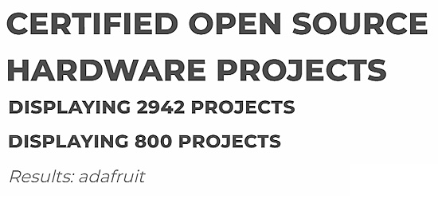

- [ ] Library and info updates
- [ ] change date
- [ ] update title
- [ ] Feature story
- [ ] Update  for images
- [ ] Update ICYDNCI
- [ ] All images 550w max only
- [ ] Link "View this email in your browser."

News Sources

- [Adafruit Playground](https://adafruit-playground.com/)
- Twitter: [CircuitPython](https://twitter.com/search?q=circuitpython&src=typed_query&f=live), [MicroPython](https://twitter.com/search?q=micropython&src=typed_query&f=live) and [Python](https://twitter.com/search?q=python&src=typed_query)
- [Raspberry Pi News](https://www.raspberrypi.com/news/)
- Mastodon [CircuitPython](https://octodon.social/tags/CircuitPython) and [MicroPython](https://octodon.social/tags/MicroPython)
- [hackster.io CircuitPython](https://www.hackster.io/search?q=circuitpython&i=projects&sort_by=most_recent) and [MicroPython](https://www.hackster.io/search?q=micropython&i=projects&sort_by=most_recent)
- YouTube: [CircuitPython](https://www.youtube.com/results?search_query=circuitpython&sp=CAI%253D), [MicroPython](https://www.youtube.com/results?search_query=micropython&sp=CAI%253D)
- Instructables: [CircuitPython](https://www.instructables.com/search/?q=circuitpython&projects=all&sort=Newest), [MicroPython](https://www.instructables.com/search/?q=micropython&projects=all&sort=Newest), [Raspberry Pi Python](https://www.instructables.com/search/?q=raspberry+pi+python&projects=all&sort=Newest)
- [hackaday CircuitPython](https://hackaday.com/blog/?s=circuitpython) and [MicroPython](https://hackaday.com/blog/?s=micropython)
- [python.org](https://www.python.org/)
- [Python Insider - dev team blog](https://pythoninsider.blogspot.com/)
- Individuals: [Jeff Geerling](https://www.jeffgeerling.com/blog), [Yakroo](https://x.com/Yakroo5077)
- Tom's Hardware: [CircuitPython](https://www.tomshardware.com/search?searchTerm=circuitpython&articleType=all&sortBy=publishedDate) and [MicroPython](https://www.tomshardware.com/search?searchTerm=micropython&articleType=all&sortBy=publishedDate) and [Raspberry Pi](https://www.tomshardware.com/search?searchTerm=raspberry%20pi&articleType=all&sortBy=publishedDate)
- [hackaday.io newest projects MicroPython](https://hackaday.io/projects?tag=micropython&sort=date) and [CircuitPython](https://hackaday.io/projects?tag=circuitpython&sort=date)
- [Google News Python](https://news.google.com/topics/CAAqIQgKIhtDQkFTRGdvSUwyMHZNRFY2TVY4U0FtVnVLQUFQAQ?hl=en-US&gl=US&ceid=US%3Aen)
- hackaday.io - [CircuitPython](https://hackaday.io/search?term=circuitpython) and [MicroPython](https://hackaday.io/search?term=micropython)

View this email in your browser. **Warning: Flashing Imagery**

Welcome to the latest Python on Microcontrollers newsletter! *insert 2-3 sentences from editor (what's in overview, banter)* - *Anne Barela, Editor*

We're on [Discord](https://discord.gg/HYqvREz), [Twitter/X](https://twitter.com/search?q=circuitpython&src=typed_query&f=live), [BlueSky](https://bsky.app/profile/circuitpython.org) and for past newsletters - [view them all here](https://www.adafruitdaily.com/category/circuitpython/). If you're reading this on the web, [subscribe here](https://www.adafruitdaily.com/). Here's the news this week:

## CircuitPython 2025

Let’s take this moment to reflect on 2024 and look ahead to 2025 for CircuitPython. Just like past years dating back to 2019, we’d like folks in the CircuitPython community to share their thoughts about CircuitPython’s future. So, please post about #CircuitPython2025 to some public place on the internet.

There is still time to get your submission in! Send yours in to [circuitpython2025@adafruit.com](mailto:circuitpython2025@adafruit.com) or post it to a public place and send the link in by Tuesday January 14th - [Adafruit Blog](https://blog.adafruit.com/2024/12/20/circuitpython-in-2025-circuitpython2025-python-circuitpython/).

See some of the submissions which have already come in - [blog.adafruit.com/tag/circuitpython2025/](https://blog.adafruit.com/tag/circuitpython2025/).

## Scott and Ladyada Talk CircuitPython 2025

Scott Shawcroft, the lead developer of CircuitPython, speaks with Ladyada on the past, present and future of CircuitPython - [Adafruit Blog](https://blog.adafruit.com/2025/01/07/scott-and-ladyada-talk-circuitpython-2025-circuitpython-circuitpython2025/) and [YouTube](https://www.youtube.com/watch?v=klyVOe_1nUA).

## Raspberry Pi Releases the Raspberry Pi 5 with 16GB RAM

On Thursday, Raspberry Pi released the awaited 16GB RAM version of their Raspberry Pi 5 flagship single board computer. Boards are available from retailers at a price point of $120 US - [Raspberry Pi News](https://www.raspberrypi.com/news/16gb-raspberry-pi-5-on-sale-now-at-120/).

> "The optimised D0 stepping of the Broadcom BCM2712 application processor includes support for memories larger than 8GB. And our friends at Micron were able to offer us a single package containing eight of their 16Gbit LPDDR4X die, making a 16GB product feasible for the first time."

They also launched Raspberry Pi Carbon Removal Credits, providing an option to mitigate the carbon footprint of manufacturing, shipping, and disposing of one of their computers. Priced at $4, they use offsets based on UNDO Carbon's enhanced rock weathering (ERW) technology - [Raspberry Pi News](https://www.raspberrypi.com/products/carbon-removal-credit/).

## OSHWA Nears 3,000 Open Source Projects and Adafruit Reaches 800

The Open Source Hardware Association (OSHWA) is nearing the certification of 3,000 open source projects worldwide as of the end of 2024. Of those, 800 are by Adafruit - [OSHWA](https://certification.oshwa.org/list.html).

## Feature

text - [site](url).

## Feature

text - [site](url).

## Free Python Book Gets Yet Another Update

Think Python 3rd Edition by Allen B. Downey has been updated and released. While it’s on Amazon, etc. for purchase via [Green Tea Press](https://greenteapress.com/wp/think-python-3rd-edition/), there is a free version on GitHub - [github.io](https://allendowney.github.io/ThinkPython/).

## KiCad 9 Release Candidate Available

The KiCad project announced the first release candidate for the next major version of their free printed circuit board design software. Version 9.0.0 is expected to be released by 01/31/25 - [X](https://x.com/kicad_pcb/status/1870871446597308559). [New Features](https://forum.kicad.info/t/post-v8-new-features-and-development-news/48614) and [Downloads](https://www.kicad.org/download/).

## This Week's Python Streams

Python on Hardware is all about building a cooperative ecosphere which allows contributions to be valued and to grow knowledge. Below are the streams within the last week focusing on the community.

**CircuitPython Deep Dive Stream**

[Last Friday](link), Scott streamed work on {subject}.

You can see the latest video and past videos on the Adafruit YouTube channel under the Deep Dive playlist - [YouTube](https://www.youtube.com/playlist?list=PLjF7R1fz_OOXBHlu9msoXq2jQN4JpCk8A).

**CircuitPython Parsec**

John Park’s CircuitPython Parsec this week is on {subject} - [Adafruit Blog](link) and [YouTube](link).

Catch all the episodes in the [YouTube playlist](https://www.youtube.com/playlist?list=PLjF7R1fz_OOWFqZfqW9jlvQSIUmwn9lWr).

[]

The CircuitPython Show has returned after a one year hiatus! In the latest episode, host Paul Cutler interviews CircuitPython community member Aaron Pendley. Aaron shares how he got started with computers, how he discovered CircuitPython, and some of his favorite CircuitPython projects - [The CircuitPython Show](https://www.circuitpythonshow.com)

**CircuitPython Weekly Meeting**

CircuitPython Weekly Meeting for January 6th, 2025 ([notes](https://github.com/adafruit/adafruit-circuitpython-weekly-meeting/blob/main/2025/2025-01-06.md)) [on YouTube](https://youtu.be/wj-ltwc_WXo).

## Project of the Week - A Raspberry Pi Pico MIDI Gesture Controller

Guitarist and keen coder Gary Rigg created a Raspberry Pi Pico-based MIDI expression pedal with 3D printing and CircuitPython - [The MagPi](https://www.raspberrypi.com/news/raspberry-pi-pico-midi-gesture-controller/) and [YouTube](https://youtu.be/qRjAQaGeyRA).

## Popular in the Last Issue

What was the most popular, most clicked link, in [the last newsletter](https://www.adafruitdaily.com/2024/12/23/python-on-microcontrollers-newsletter-a-fabulous-year-for-python-on-hardware-and-much-more-circuitpython-python-micropython-thepsf-raspberry_pi/)? [5 of the best budget-friendly SBCs](https://www.xda-developers.com/best-budget-friendly-sbcs/).

Did you know you can read past issues of this newsletter in the Adafruit Daily Archive? [Check it out](https://www.adafruitdaily.com/category/circuitpython/).

## New Notes from Adafruit Playground

[Adafruit Playground](https://adafruit-playground.com/) is a new place for the community to post their projects and other making tips/tricks/techniques. Ad-free, it's an easy way to publish your work in a safe space for free.

Option Map: Microcontroller form factors - [Adafruit Playground](https://adafruit-playground.com/u/Alain_ManHW/pages/option-map-microcontroller-form-factors).

CircuitPython "Ring Oscillator" RNG with SN74AHCT14 - [Adafruit Playground](https://adafruit-playground.com/u/jepler/pages/circuitpython-ring-oscillator-rng-with-sn74ahct14).

text - [Adafruit Playground](url).

## News From Around the Web

text - [site](url).

2024 was Raspberry Pi's biggest year to date - [How-to Geek](https://www.howtogeek.com/2024-was-raspberry-pis-biggest-year-to-date/).

A Git crash course cheat sheet - [X](https://x.com/sysxplore/status/1877098694241071360/photo/1) (click the graphic to get a larger version). [Author Site](https://thatstraw.gumroad.com/l/cheatsheets) with other guides.

text - [site](url).

text - [site](url).

text - [site](url).

text - [site](url).

text - [site](url).

text - [site](url).

text - [site](url).

text - [site](url).

text - [site](url).

text - [site](url).

text - [site](url).

text - [site](url).

text - [site](url).

text - [site](url).

text - [site](url).

## New

Cygnet is a new Feather-compatible host microcontroller from Blues - supporting Arduino, C, C++, and soon CircuitPython - [Blues](https://dev.blues.io/blog/introducing-cygnet-stm32-feather-blues/).

text - [site](url).

## New Boards Supported by CircuitPython

The number of supported microcontrollers and Single Board Computers (SBC) grows every week. This section outlines which boards have been included in CircuitPython or added to [CircuitPython.org](https://circuitpython.org/).

This week there were (#/no) new boards added:

- [Board name](url)
- [Board name](url)
- [Board name](url)

*Note: For non-Adafruit boards, please use the support forums of the board manufacturer for assistance, as Adafruit does not have the hardware to assist in troubleshooting.*

Looking to add a new board to CircuitPython? It's highly encouraged! Adafruit has four guides to help you do so:

- [How to Add a New Board to CircuitPython](https://learn.adafruit.com/how-to-add-a-new-board-to-circuitpython/overview)
- [How to add a New Board to the circuitpython.org website](https://learn.adafruit.com/how-to-add-a-new-board-to-the-circuitpython-org-website)
- [Adding a Single Board Computer to PlatformDetect for Blinka](https://learn.adafruit.com/adding-a-single-board-computer-to-platformdetect-for-blinka)
- [Adding a Single Board Computer to Blinka](https://learn.adafruit.com/adding-a-single-board-computer-to-blinka)

## New Learn Guides

The Adafruit Learning System has over 3,000 free guides for learning skills and building projects including using Python.

[Holiday IoT Switch](https://learn.adafruit.com/holiday-iot-switch) from [Ruiz Brothers](https://learn.adafruit.com/u/pixil3d)

[Control Wiz Lights With CircuitPython](https://learn.adafruit.com/control-wiz-lights-with-circuitpython) from [Tim C](https://learn.adafruit.com/u/Foamyguy)

## CircuitPython Libraries

The CircuitPython library numbers are continually increasing, while existing ones continue to be updated. Here we provide library numbers and updates!

To get the latest Adafruit libraries, download the [Adafruit CircuitPython Library Bundle](https://circuitpython.org/libraries). To get the latest community contributed libraries, download the [CircuitPython Community Bundle](https://circuitpython.org/libraries).

If you'd like to contribute to the CircuitPython project on the Python side of things, the libraries are a great place to start. Check out the [CircuitPython.org Contributing page](https://circuitpython.org/contributing). If you're interested in reviewing, check out Open Pull Requests. If you'd like to contribute code or documentation, check out Open Issues. We have a guide on [contributing to CircuitPython with Git and GitHub](https://learn.adafruit.com/contribute-to-circuitpython-with-git-and-github), and you can find us in the #help-with-circuitpython and #circuitpython-dev channels on the [Adafruit Discord](https://adafru.it/discord).

You can check out this [list of all the Adafruit CircuitPython libraries and drivers available](https://github.com/adafruit/Adafruit_CircuitPython_Bundle/blob/master/circuitpython_library_list.md). 

The current number of CircuitPython libraries is **###**!

**New Libraries**

Here's this week's new CircuitPython libraries:

* [library](url)

**Updated Libraries**

Here's this week's updated CircuitPython libraries:

* [library](url)

## What’s the CircuitPython team up to this week?

What is the team up to this week? Let’s check in:

**Dan**

I'm preparing CircuitPython 9.2.2 for release soon. It will include over fifty pull requests with fixes, new boards, and new features.

I'm continuing working on getting CircuitMatter running in CircuitPython. I now am at the point in a simple example where all the encryption keys have been generated. At this point it appears I will need to add some needed features to the mDNS implementation in CircuitPython.

I fixed a bug in the CircuitPython MiniMQTT library that caused large packets to be truncated.

**Tim**

I've continued working on issues and reviewing PRs submitted CircuitPython libraries. This week I tested a few on the VEML7700 and submitted a fix a value that was changed in the newer revisions of the datasheet. I also tested some reported issues for WS2801 LEDs and refactored that library to use `pixelbuf` internally. I've started making a `displayio` based analog clock face widget that has customizable hands, numbers, and background.

**Jeff**

I took almost two full weeks off during the holidays, but when I was working it was all PIO, all the time.

As mentioned in the final newsletter of last year, I am still working on RGB matrix display support on the Pi5.

I also have started working on enabling PIO on the Metro RP2350 to use pins 32 and up in CircuitPython, which is also needed for the board's USB host functionality.

**Scott**

This week I've been facilitating #CircuitPython2025 and collecting the posts [on the blog](https://blog.adafruit.com/tag/circuitpython2025/). I've been working on CircuitPython on Zephyr otherwise. I'm working on supporting their flash API and am excited to abstract on top of it. Theoretically we'll be able to support newer flash devices like NAND (instead of NOR) that Zephyr already supports.

**Liz**

This week I returned from my end of year nap. I kicked off 2025 by documenting the [Newxie vertical TFT displays](https://learn.adafruit.com/adafruit-1-14-240x135-color-newxie-tft-display). These displays are meant to emulate nixie tubes with right angle header pins that allow them to stand-up easily on a breadboard. For the guide, I wrote examples for using one display with CircuitPython, Python and Arduino and a special page for using four of them at once with Python on a Raspberry Pi. 

## Upcoming Events

The next MicroPython Meetup in Melbourne will be on January 22nd – [Meetup](https://www.meetup.com/micropython-meetup/events). You can see recordings of previous meetings on [YouTube](https://www.youtube.com/@MicroPythonOfficial). 

The community is coming back to Pittsburgh, Pennsylvania for PyCon US 2025 May 14 - May 22, 2025 - [us.pycon.org](https://us.pycon.org/2025/).

**Send Your Events In**

If you know of virtual events or upcoming events, please let us know via email to cpnews(at)adafruit(dot)com.

## Latest Releases

CircuitPython's stable release is [#.#.#](https://github.com/adafruit/circuitpython/releases/latest) and its unstable release is [#.#.#-##.#](https://github.com/adafruit/circuitpython/releases). New to CircuitPython? Start with our [Welcome to CircuitPython Guide](https://learn.adafruit.com/welcome-to-circuitpython).

[2025####](https://github.com/adafruit/Adafruit_CircuitPython_Bundle/releases/latest) is the latest Adafruit CircuitPython library bundle.

[2025####](https://github.com/adafruit/CircuitPython_Community_Bundle/releases/latest) is the latest CircuitPython Community library bundle.

[v#.#.#](https://micropython.org/download) is the latest MicroPython release. Documentation for it is [here](http://docs.micropython.org/en/latest/pyboard/).

[#.#.#](https://www.python.org/downloads/) is the latest Python release. The latest pre-release version is [#.#.#](https://www.python.org/download/pre-releases/).

[#,### Stars](https://github.com/adafruit/circuitpython/stargazers) Like CircuitPython? [Star it on GitHub!](https://github.com/adafruit/circuitpython)

## Call for Help -- Translating CircuitPython is now easier than ever

One important feature of CircuitPython is translated control and error messages. With the help of fellow open source project [Weblate](https://weblate.org/), we're making it even easier to add or improve translations. 

Sign in with an existing account such as GitHub, Google or Facebook and start contributing through a simple web interface. No forks or pull requests needed! As always, if you run into trouble join us on [Discord](https://adafru.it/discord), we're here to help.

## NUMBER Thanks

The Adafruit Discord community, where we do all our CircuitPython development in the open, reached over NUMBER humans - thank you! Adafruit believes Discord offers a unique way for Python on hardware folks to connect. Join today at [https://adafru.it/discord](https://adafru.it/discord).

## ICYMI - In case you missed it

Python on hardware is the Adafruit Python video-newsletter-podcast! The news comes from the Python community, Discord, Adafruit communities and more and is broadcast on ASK an ENGINEER Wednesdays. The complete Python on Hardware weekly videocast [playlist is here](https://www.youtube.com/playlist?list=PLjF7R1fz_OOXRMjM7Sm0J2Xt6H81TdDev). The video podcast is on [iTunes](https://itunes.apple.com/us/podcast/python-on-hardware/id1451685192?mt=2), [YouTube](http://adafru.it/pohepisodes), [Instagram](https://www.instagram.com/adafruit/channel/)), and [XML](https://itunes.apple.com/us/podcast/python-on-hardware/id1451685192?mt=2).

[The weekly community chat on Adafruit Discord server CircuitPython channel - Audio / Podcast edition](https://itunes.apple.com/us/podcast/circuitpython-weekly-meeting/id1451685016) - Audio from the Discord chat space for CircuitPython, meetings are usually Mondays at 2pm ET, this is the audio version on [iTunes](https://itunes.apple.com/us/podcast/circuitpython-weekly-meeting/id1451685016), Pocket Casts, [Spotify](https://adafru.it/spotify), and [XML feed](https://adafruit-podcasts.s3.amazonaws.com/circuitpython_weekly_meeting/audio-podcast.xml).

## Contribute

The CircuitPython Weekly Newsletter is a CircuitPython community-run newsletter emailed every Monday. The complete [archives are here](https://www.adafruitdaily.com/category/circuitpython/). It highlights the latest CircuitPython related news from around the web including Python and MicroPython developments. To contribute, edit next week's draft [on GitHub](https://github.com/adafruit/circuitpython-weekly-newsletter/tree/gh-pages/_drafts) and [submit a pull request](https://help.github.com/articles/editing-files-in-your-repository/) with the changes. You may also tag your information on Twitter with #CircuitPython. 

Join the Adafruit [Discord](https://adafru.it/discord) or [post to the forum](https://forums.adafruit.com/viewforum.php?f=60) if you have questions.
