- [ ] Library and info updates
- [ ] change date
- [ ] update title
- [ ] Feature story
- [ ] Update []() for images
- [ ] Update ICYDNCI
- [ ] All images 550w max only
- [ ] Link "View this email in your browser."

News Sources

- [Adafruit Playground](https://adafruit-playground.com/)
- Twitter: [CircuitPython](https://twitter.com/search?q=circuitpython&src=typed_query&f=live), [MicroPython](https://twitter.com/search?q=micropython&src=typed_query&f=live) and [Python](https://twitter.com/search?q=python&src=typed_query)
- [Raspberry Pi News](https://www.raspberrypi.com/news/)
- Mastodon [CircuitPython](https://octodon.social/tags/CircuitPython) and [MicroPython](https://octodon.social/tags/MicroPython)
- [hackster.io CircuitPython](https://www.hackster.io/search?q=circuitpython&i=projects&sort_by=most_recent) and [MicroPython](https://www.hackster.io/search?q=micropython&i=projects&sort_by=most_recent)
- YouTube: [CircuitPython](https://www.youtube.com/results?search_query=circuitpython&sp=CAI%253D), [MicroPython](https://www.youtube.com/results?search_query=micropython&sp=CAI%253D)
- Instructables: [CircuitPython](https://www.instructables.com/search/?q=circuitpython&projects=all&sort=Newest), [MicroPython](https://www.instructables.com/search/?q=micropython&projects=all&sort=Newest), [Raspberry Pi Python](https://www.instructables.com/search/?q=raspberry+pi+python&projects=all&sort=Newest)
- [hackaday CircuitPython](https://hackaday.com/blog/?s=circuitpython) and [MicroPython](https://hackaday.com/blog/?s=micropython)
- [python.org](https://www.python.org/)
- [Python Insider - dev team blog](https://pythoninsider.blogspot.com/)
- Individuals: [Jeff Geerling](https://www.jeffgeerling.com/blog), [Yakroo](https://x.com/Yakroo5077)
- Tom's Hardware: [CircuitPython](https://www.tomshardware.com/search?searchTerm=circuitpython&articleType=all&sortBy=publishedDate) and [MicroPython](https://www.tomshardware.com/search?searchTerm=micropython&articleType=all&sortBy=publishedDate) and [Raspberry Pi](https://www.tomshardware.com/search?searchTerm=raspberry%20pi&articleType=all&sortBy=publishedDate)
- [hackaday.io newest projects MicroPython](https://hackaday.io/projects?tag=micropython&sort=date) and [CircuitPython](https://hackaday.io/projects?tag=circuitpython&sort=date)
- [Google News Python](https://news.google.com/topics/CAAqIQgKIhtDQkFTRGdvSUwyMHZNRFY2TVY4U0FtVnVLQUFQAQ?hl=en-US&gl=US&ceid=US%3Aen)
- hackaday.io - [CircuitPython](https://hackaday.io/search?term=circuitpython) and [MicroPython](https://hackaday.io/search?term=micropython)

View this email in your browser. **Warning: Flashing Imagery**

Welcome to the latest Python on Microcontrollers newsletter! *insert 2-3 sentences from editor (what's in overview, banter)* - *Anne Barela, Editor*

We're on [Discord](https://discord.gg/HYqvREz), [Twitter/X](https://twitter.com/search?q=circuitpython&src=typed_query&f=live), [BlueSky](https://bsky.app/profile/circuitpython.org) and for past newsletters - [view them all here](https://www.adafruitdaily.com/category/circuitpython/). If you're reading this on the web, [subscribe here](https://www.adafruitdaily.com/). Here's the news this week:

## CircuitPython 2025 Wraps-Up

[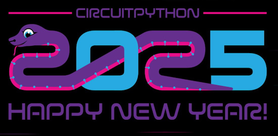](https://blog.adafruit.com/2025/01/15/thank-you-for-circuitpython2025/)

Scott Shawcroft thanks the 16 folks who wrote in about #CircuitPython2025. He states "It was a great mix of detailed suggestions and big news around who will be working on CircuitPython. It’ll be an exciting year and we’re happy to have you all participating." - [Adafruit Blog](https://blog.adafruit.com/2025/01/15/thank-you-for-circuitpython2025/).

## The Raspberry Pi RP2350 Hacking Challenge Results Are In

[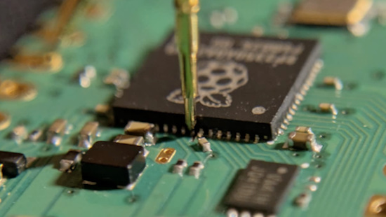](https://www.raspberrypi.com/news/security-through-transparency-rp2350-hacking-challenge-results-are-in/)

All chips have vulnerabilities, and most vendors’ strategy is not to talk about them. Raspberry Pi consider this to be suboptimal, so they entered into the DEF CON hacking spirit by offering a one-month, $10,000 prize to the first person to retrieve a secret value from the one-time-programmable (OTP) memory on the device.

On January 14, 2025, Raspberry Pi announced that they received not one but four valid submissions, all of which require physical access to the chip, with varying degrees of intrusiveness - [Raspberry Pi News](https://www.raspberrypi.com/news/security-through-transparency-rp2350-hacking-challenge-results-are-in/) and [Adafruit Blog](https://blog.adafruit.com/2025/01/14/the-raspberry-pi-rp2350-hacking-challenge-results-are-in-raspberry_pi/).

## LVGL Ported to MicroPython

[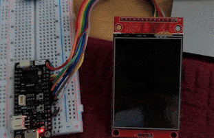](https://x.com/KeithMukai/status/1878560602936787350)

Keith Mukai notes on X that Kevin Schlosser has "lvgl working on the latest MicroPython and it runs just fine on an ESP32-S3." - [X](https://x.com/KeithMukai/status/1878560602936787350). See the software - [GitHub](https://github.com/lvgl-micropython/lvgl_micropython).

## A HUB75 Matrix Driver for Raspberry Pi 5 Using PIO

[](https://github.com/adafruit/Adafruit_Blinka_Raspberry_Pi5_Piomatter)

The Raspberry Pi 5 uses the new RP1 peripheral chip for GPIO, different from previous Raspberry Pi computers. This breaks some libraries including those driving LEDs, CircuitPython developer Jeff Epler has programmed the PIO on the RP1 to output image frames for HUB75 LED matrices - [GitHub](https://github.com/adafruit/Adafruit_Blinka_Raspberry_Pi5_Piomatter).

## Open Source Licenses: Everything You Need to Know

[](https://techcrunch.com/2025/01/12/open-source-licenses-everything-you-need-to-know/)

Open source makes the technology world go ’round, forming as much as 90% of the modern software stack via frameworks; libraries; databases; operating systems; and countless stand-alone applications. However, there’s a perennial struggle between the open source and proprietary realms. At the heart of all this is the thorny issue of licensing. Read about various licenses and their use - [TechCrunch](https://techcrunch.com/2025/01/12/open-source-licenses-everything-you-need-to-know/).

## Focus: Using Python

### Python is the New Basic

[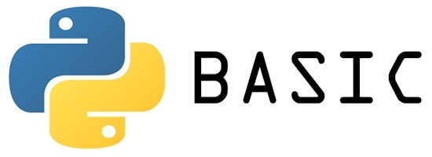](https://news.ycombinator.com/item?id=42665441)

A thread discussing the concept that Python is the new BASIC language from last century in terms of ease of use and ubiquity - [YCombinator](https://news.ycombinator.com/item?id=42665441).

### Python For Everything

[](https://medium.com/@pysolanki/python-for-everything-9530abd13d7b)

Python For Everything: why Python is the best programming language, and you should learn it - [Medium](https://medium.com/@pysolanki/python-for-everything-9530abd13d7b).

### Why Every Python Dev Needs Virtual Environments Now

[](https://thenewstack.io/why-every-python-dev-needs-virtual-environments-now/)

A virtual environment is an isolated sandbox that allows you to install everything you need for a project without affecting things globally. Python contains everything you need to create and use a virtual environment, and it's easy - [The New Stack](https://thenewstack.io/why-every-python-dev-needs-virtual-environments-now/).

## This Week's Python Streams

[](https://circuitpython.org/)

Python on Hardware is all about building a cooperative ecosphere which allows contributions to be valued and to grow knowledge. Below are the streams within the last week focusing on the community.

**CircuitPython Deep Dive Stream**

[](link)

[Last Friday](link), Scott streamed work on {subject}.

You can see the latest video and past videos on the Adafruit YouTube channel under the Deep Dive playlist - [YouTube](https://www.youtube.com/playlist?list=PLjF7R1fz_OOXBHlu9msoXq2jQN4JpCk8A).

**CircuitPython Parsec**

[](link)

John Park’s CircuitPython Parsec this week is on {subject} - [Adafruit Blog](link) and [YouTube](link).

Catch all the episodes in the [YouTube playlist](https://www.youtube.com/playlist?list=PLjF7R1fz_OOWFqZfqW9jlvQSIUmwn9lWr).

**CircuitPython Weekly Meeting**

CircuitPython Weekly Meeting for January 13, 2025 ([notes](https://github.com/adafruit/adafruit-circuitpython-weekly-meeting/blob/main/2025/2025-01-13.md)) [on YouTube](https://youtu.be/gRgLVyYwpnE?si=o2-S9xyQLo_TWek6).

## Project of the Week: Putting a Music Sequencer in a PS4 Controller

[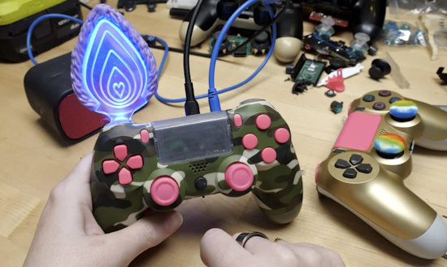](https://www.instructables.com/Music-Sequencer-in-a-PS4-Controller/)

Becky Stern uses an Adafruit KB2040 microcontroller board with a Raspberry Pi RP2040 chip, programmed in CircuitPython, to turn a Playstation PS4 controller into a music sequencer - [Instructables](https://www.instructables.com/Music-Sequencer-in-a-PS4-Controller/).

## Popular Last Week

[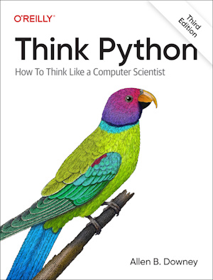](url)

What was the most popular, most clicked link, in [last week's newsletter](https://www.adafruitdaily.com/2025/01/13/python-on-microcontrollers-newsletter-open-hardware-is-in-new-circuitpython-and-pi-5-16gb-and-much-more-circuitpython-python-micropython-thepsf-raspberry_pi/)? [Free book online: Think Python](https://allendowney.github.io/ThinkPython/).

Did you know you can read past issues of this newsletter in the Adafruit Daily Archive? [Check it out](https://www.adafruitdaily.com/category/circuitpython/).

## New Notes from Adafruit Playground

[Adafruit Playground](https://adafruit-playground.com/) is a new place for the community to post their projects and other making tips/tricks/techniques. Ad-free, it's an easy way to publish your work in a safe space for free.

[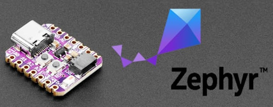](https://adafruit-playground.com/u/SamBlenny/pages/getting-started-with-zephyr-on-linux)

Getting Started with Zephyr on Linux - [Adafruit Playground](https://adafruit-playground.com/u/SamBlenny/pages/getting-started-with-zephyr-on-linux).

Zephyr Shell over USB or BLE + Bluefruit Connect - [Adafruit Playground](https://adafruit-playground.com/u/SamBlenny/pages/zephyr-shell-over-usb-or-ble-bluefruit-connect).

[](url)

text - [Adafruit Playground](url).

## News From Around the Web

[](https://bhave.sh/micropython-install-esp32/)

Bhavesh Kakwani shows two ways to install MicroPython on an ESP32 - [bhave.sh](https://bhave.sh/micropython-install-esp32/).

[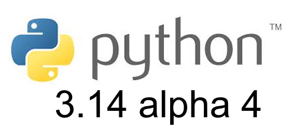](https://blog.python.org/2025/01/python-3140-alpha-4-is-out.html)

Python 3.14.0 alpha 4 is out - [Python Insider](https://blog.python.org/2025/01/python-3140-alpha-4-is-out.html).

There are many new features planned in Python 3.14 including the use of Greek letters as constants
```
from math import pi as π

def circumference(radius: float) -> float:
    return 2 * π * radius

print(circumference(6378.137))  # 40075.016685578485
```
[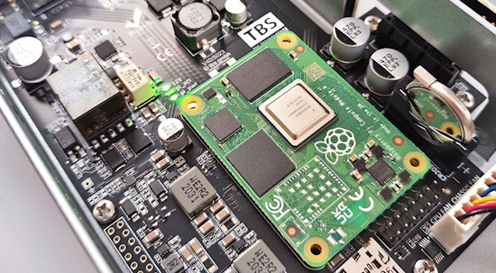](https://www.raspberrypi.com/news/raspberry-pi-compute-module-case-studies/)

Raspberry Pi presents several Compute Module use case studies - [Raspberry Pi News](https://www.raspberrypi.com/news/raspberry-pi-compute-module-case-studies/).

[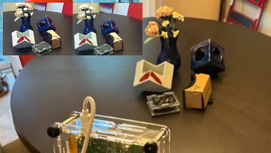](https://www.tomshardware.com/raspberry-pi/maker-builds-a-raspberry-pi-5-powered-stereoscopic-3d-video-camera)

Maker builds a Raspberry Pi 5 powered stereoscopic 3D video camera with Python - [Tom's Hardware](https://www.tomshardware.com/raspberry-pi/maker-builds-a-raspberry-pi-5-powered-stereoscopic-3d-video-camera).

[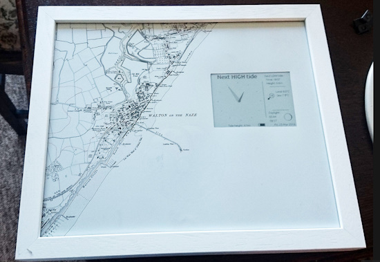](https://hackaday.io/project/10573-tide-clock-in-micropython)

Showing times of upcoming high/low tides using a WiPy and an e-paper display to try MicroPython in a project - [hackaday.io](https://hackaday.io/project/10573-tide-clock-in-micropython).

[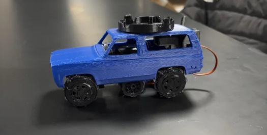](https://www.instructables.com/3D-Printed-Toy-Car-1/)

Making a 3D-printed toy car with Adafruit Circuit Playground Express and CircuitPython - [Instructables](https://www.instructables.com/3D-Printed-Toy-Car-1/).

[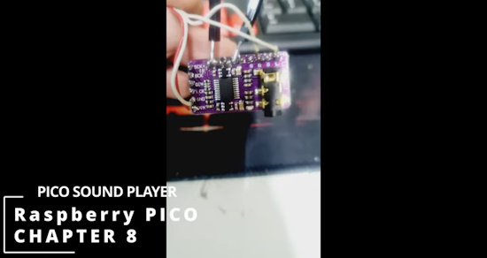](https://www.youtube.com/watch?v=Bndc-yfxYPE)

A Raspberry Pi Pico I2S & PCM5100 based Pico sound player - [YouTube](https://www.youtube.com/watch?v=Bndc-yfxYPE).

[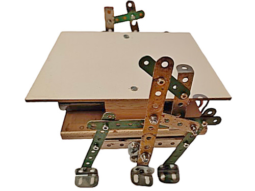](https://www.instructables.com/Remote-controlled-Walking-Robot/)

A remote-controlled walking robot using Raspberry Pi Pico W controlled servos and MicroPython - [Instructables](https://www.instructables.com/Remote-controlled-Walking-Robot/) and [YouTube](https://www.youtube.com/watch?v=KL7vufR3ROQ).

[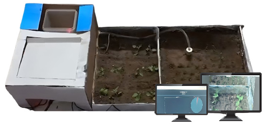](https://www.instructables.com/AgriAid-IOT-Smart-Irrigation-System/)

AgriAid: an IoT smart irrigation system using Raspberry Pi and Python - [Instructables](https://www.instructables.com/AgriAid-IOT-Smart-Irrigation-System/).

[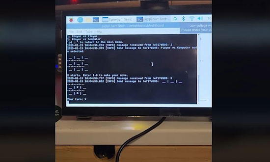](https://www.tomshardware.com/raspberry-pi/raspberry-pi-powers-this-meshtastic-network-bbs)

Raspberry Pi and Python power a Meshtastic network BBS - [Tom's Hardware](https://www.tomshardware.com/raspberry-pi/raspberry-pi-powers-this-meshtastic-network-bbs).

[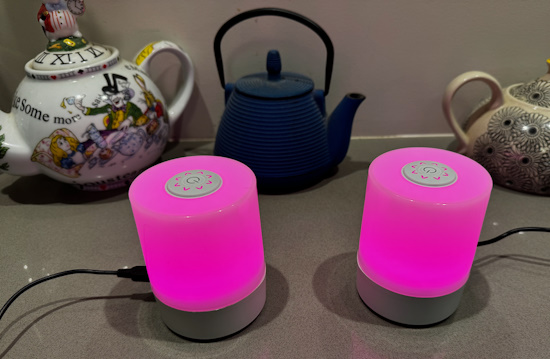](https://www.instructables.com/Friend-Lamp-Stay-in-Touch-With-Light/)

Friend Lights to stay in touch with a friend. They use a Raspberry Pi Pico W and MicroPython - [Instructables](https://www.instructables.com/Friend-Lamp-Stay-in-Touch-With-Light/) snd [YouTube](https://www.youtube.com/watch?v=FuA02xuyCaY).

[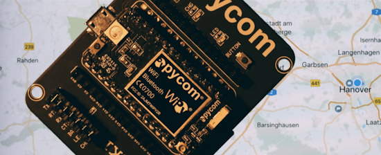](https://hackaday.io/project/27987-geolocation-using-wlan-and-micropython)

Geolocation using WLAN and MicroPython - [hackaday.io](https://hackaday.io/project/27987-geolocation-using-wlan-and-micropython).

[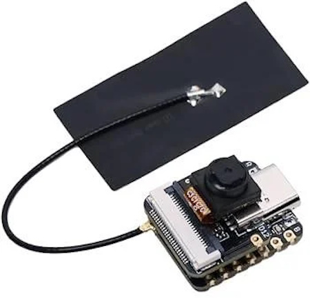](https://www.instructables.com/Esp32-S3-Sense-Video-Streaming-in-Micro-Python/)

Video streaming with the ESP32-S3 Sense in MicroPython - [Instructables](https://www.instructables.com/Esp32-S3-Sense-Video-Streaming-in-Micro-Python/).

[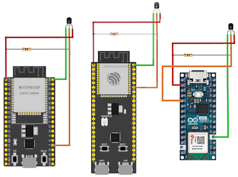](https://www.i-programmer.info/programming/148-hardware/17750-esp32-in-micropython-one-wire-bus-ds1820.html)

ESP32 in MicroPython: One Wire Bus DS1820 - [i-programmer](https://www.i-programmer.info/programming/148-hardware/17750-esp32-in-micropython-one-wire-bus-ds1820.html).

[](https://sdomi.pl/weblog/23-serenityos-realhw/)

Bringing SerenityOS to real hardware with RP2040 and CircuitPython - [sdomi.pl](https://sdomi.pl/weblog/23-serenityos-realhw/).

[](url)

text - [site](url).

[](url)

text - [site](url).

[](url)

text - [site](url).

## New

[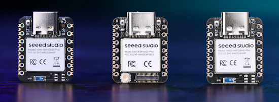](https://www.cnx-software.com/2025/01/13/seeed-studio-xiao-plus-series-adds-more-gpio-castellated-holes/)

Seeed Studio XIAO Plus series adds more GPIOs through castellated holes. The new series includes the XIAO ESP32S3 Plus, XIAO nRF52840 Plus, and XIAO nRF52840 Sense Plus which are direct upgrades of the XIAO ESP32S3, XIAO nRF52840 BLE, and XIAO nRF52840 Sense boards. The XIAO nRF52840 Plus and the XIAO nRF52840 Sense Plus can be programmed with Arduino, CircuitPython, and MicroPython - [CNX Software](https://www.cnx-software.com/2025/01/13/seeed-studio-xiao-plus-series-adds-more-gpio-castellated-holes/).

[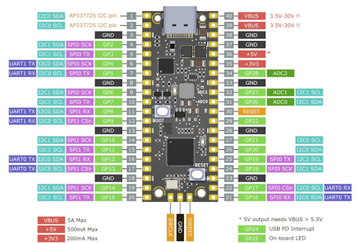](https://hackaday.io/project/198384-picopd-pro-usb-c-pd-31-pps-avs-with-rp2040)

PicoPD Pro adds Power Delivery 3.1 (PD3.1) with PPS EPR AVS to a RP2040 board in a Pico footprint - [hackaday.io](https://hackaday.io/project/198384-picopd-pro-usb-c-pd-31-pps-avs-with-rp2040) and [YouTube](https://youtu.be/BqMuVDwbEKI).

## New Boards Supported by CircuitPython

The number of supported microcontrollers and Single Board Computers (SBC) grows every week. This section outlines which boards have been included in CircuitPython or added to [CircuitPython.org](https://circuitpython.org/).

This week there were no new boards added.

*Note: For non-Adafruit boards, please use the support forums of the board manufacturer for assistance, as Adafruit does not have the hardware to assist in troubleshooting.*

Looking to add a new board to CircuitPython? It's highly encouraged! Adafruit has four guides to help you do so:

- [How to Add a New Board to CircuitPython](https://learn.adafruit.com/how-to-add-a-new-board-to-circuitpython/overview)
- [How to add a New Board to the circuitpython.org website](https://learn.adafruit.com/how-to-add-a-new-board-to-the-circuitpython-org-website)
- [Adding a Single Board Computer to PlatformDetect for Blinka](https://learn.adafruit.com/adding-a-single-board-computer-to-platformdetect-for-blinka)
- [Adding a Single Board Computer to Blinka](https://learn.adafruit.com/adding-a-single-board-computer-to-blinka)

## New Learn Guides

[](https://learn.adafruit.com/guides/latest)

The Adafruit Learning System has over 3,000 free guides for learning skills and building projects including using Python.

[title](url) from [name](url)

[title](url) from [name](url)

[title](url) from [name](url)

## Updated Learn Guides

[title](url)

## CircuitPython Libraries

[](https://circuitpython.org/libraries)

The CircuitPython library numbers are continually increasing, while existing ones continue to be updated. Here we provide library numbers and updates!

To get the latest Adafruit libraries, download the [Adafruit CircuitPython Library Bundle](https://circuitpython.org/libraries). To get the latest community contributed libraries, download the [CircuitPython Community Bundle](https://circuitpython.org/libraries).

If you'd like to contribute to the CircuitPython project on the Python side of things, the libraries are a great place to start. Check out the [CircuitPython.org Contributing page](https://circuitpython.org/contributing). If you're interested in reviewing, check out Open Pull Requests. If you'd like to contribute code or documentation, check out Open Issues. We have a guide on [contributing to CircuitPython with Git and GitHub](https://learn.adafruit.com/contribute-to-circuitpython-with-git-and-github), and you can find us in the #help-with-circuitpython and #circuitpython-dev channels on the [Adafruit Discord](https://adafru.it/discord).

You can check out this [list of all the Adafruit CircuitPython libraries and drivers available](https://github.com/adafruit/Adafruit_CircuitPython_Bundle/blob/master/circuitpython_library_list.md). 

The current number of CircuitPython libraries is **497**!

**Updated Libraries**

Here's this week's updated CircuitPython libraries:

  * [adafruit/Adafruit_CircuitPython_BLE_Beacon](https://github.com/adafruit/Adafruit_CircuitPython_BLE_Beacon)
  * [adafruit/Adafruit_CircuitPython_VL53L4CD](https://github.com/adafruit/Adafruit_CircuitPython_VL53L4CD)
  * [adafruit/Adafruit_CircuitPython_ImageLoad](https://github.com/adafruit/Adafruit_CircuitPython_ImageLoad)
  * [adafruit/Adafruit_CircuitPython_SI7021](https://github.com/adafruit/Adafruit_CircuitPython_SI7021)
  * [adafruit/Adafruit_CircuitPython_PCF8575](https://github.com/adafruit/Adafruit_CircuitPython_PCF8575)
  * [jposada202020/CircuitPython_slider](https://github.com/jposada202020/CircuitPython_slider)
  * [jins-tkomoda/CircuitPython_QMI8658C](https://github.com/jins-tkomoda/CircuitPython_QMI8658C)

## What’s the CircuitPython team up to this week?

What is the team up to this week? Let’s check in:

**Dan**

After the recent release of CircuitPython 9.2.2, I investigated a USB problem with ESP32-S3 that may be due to a TinyUSB update, and am working with the TinyUSB maintainer on this.

I tested and merged a user-contributed pull request for the Adafruit Arduino NeoPixel library that fixes using longer NeoPixel strands.

I'm now working on a CircuitPython DMA issue that broke PicoDVI.

**Tim**

This week I worked on a couple infrastructure maintenance tasks, one was some fixes in cookiecutter to get it so a freshly generated project will pass pre-commit. The other is a change that is necessary to our read the docs configuration based on the RTD service deprecating some behavior around default configuration which used to allow us not to specify a configuration value that we will need to specify moving forward. I've submitted PRs for cookiecutter and the Bundle repo to resolve that, and next I will patch the libraries with the same fix.

**Jeff**

This week I made the initial release of the new `piomatter` Python package for driving HUB75 style RGB matrices on the Raspberry Pi 5. Some bugfixes will be needed before this can be declared a stable version, though.

**Scott**

This week we [wrapped up #CircuitPython2025](https://blog.adafruit.com/2025/01/15/thank-you-for-circuitpython2025/). Thank you to everyone who posted their ideas. I'm very excited for the future of CircuitPython.

My own #CircuitPython2025 post and work this week has been on CircuitPython on Zephyr. This week I've gotten flash support working and also USB via TinyUSB. It is all a bit of a hack but I'm getting closer to polishing it all up.

**Liz**

This week I updated the [Feather RP2350 guide](https://learn.adafruit.com/adafruit-feather-rp2350) to have PSRAM examples in both CircuitPython and Arduino. PSRAM is automatically used as the first line of storage on the board, so these demos just confirm that you have the heap space by running a check. 8MB of PSRAM will be incredibly helpful for CircuitPython projects that utilize a lot of graphical elements.

## Upcoming Events

[](https://www.meetup.com/MicroPython-Meetup/)

The next MicroPython Meetup in Melbourne will be on January 22nd – [Meetup](https://www.meetup.com/micropython-meetup/events). You can see recordings of previous meetings on [YouTube](https://www.youtube.com/@MicroPythonOfficial). 

[](https://us.pycon.org/2025/)

The community is coming back to Pittsburgh, Pennsylvania for PyCon US 2025 May 14 - May 22, 2025 - [us.pycon.org](https://us.pycon.org/2025/).

**Send Your Events In**

If you know of virtual events or upcoming events, please let us know via email to cpnews(at)adafruit(dot)com.

## Latest Releases

CircuitPython's stable release is [9.2.2](https://github.com/adafruit/circuitpython/releases/latest). New to CircuitPython? Start with our [Welcome to CircuitPython Guide](https://learn.adafruit.com/welcome-to-circuitpython).

[20250116](https://github.com/adafruit/Adafruit_CircuitPython_Bundle/releases/latest) is the latest Adafruit CircuitPython library bundle.

[20250111](https://github.com/adafruit/CircuitPython_Community_Bundle/releases/latest) is the latest CircuitPython Community library bundle.

[v1.24.1](https://micropython.org/download) is the latest MicroPython release. Documentation for it is [here](http://docs.micropython.org/en/latest/pyboard/).

[3.13.1](https://www.python.org/downloads/) is the latest Python release. The latest pre-release version is [3.14.0a4](https://www.python.org/download/pre-releases/).

[4,173 Stars](https://github.com/adafruit/circuitpython/stargazers) Like CircuitPython? [Star it on GitHub!](https://github.com/adafruit/circuitpython)

## Call for Help -- Translating CircuitPython is now easier than ever

[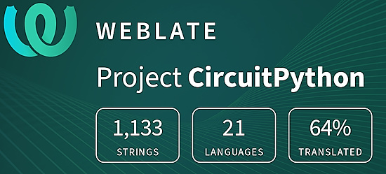](https://hosted.weblate.org/engage/circuitpython/)

One important feature of CircuitPython is translated control and error messages. With the help of fellow open source project [Weblate](https://weblate.org/), we're making it even easier to add or improve translations. 

Sign in with an existing account such as GitHub, Google or Facebook and start contributing through a simple web interface. No forks or pull requests needed! As always, if you run into trouble join us on [Discord](https://adafru.it/discord), we're here to help.

## 38,612 Thanks

[](https://adafru.it/discord)

[](https://discord.gg/adafruit)

The Adafruit Discord community, where we do all our CircuitPython development in the open, reached over 38,612 humans - thank you! Adafruit believes Discord offers a unique way for Python on hardware folks to connect. Join today at [https://adafru.it/discord](https://adafru.it/discord).

## ICYMI - In case you missed it

[](https://www.youtube.com/playlist?list=PLjF7R1fz_OOXRMjM7Sm0J2Xt6H81TdDev)

Python on hardware is the Adafruit Python video-newsletter-podcast! The news comes from the Python community, Discord, Adafruit communities and more and is broadcast on ASK an ENGINEER Wednesdays. The complete Python on Hardware weekly videocast [playlist is here](https://www.youtube.com/playlist?list=PLjF7R1fz_OOXRMjM7Sm0J2Xt6H81TdDev). The video podcast is on [iTunes](https://itunes.apple.com/us/podcast/python-on-hardware/id1451685192?mt=2), [YouTube](http://adafru.it/pohepisodes), [Instagram](https://www.instagram.com/adafruit/channel/)), and [XML](https://itunes.apple.com/us/podcast/python-on-hardware/id1451685192?mt=2).

[The weekly community chat on Adafruit Discord server CircuitPython channel - Audio / Podcast edition](https://itunes.apple.com/us/podcast/circuitpython-weekly-meeting/id1451685016) - Audio from the Discord chat space for CircuitPython, meetings are usually Mondays at 2pm ET, this is the audio version on [iTunes](https://itunes.apple.com/us/podcast/circuitpython-weekly-meeting/id1451685016), Pocket Casts, [Spotify](https://adafru.it/spotify), and [XML feed](https://adafruit-podcasts.s3.amazonaws.com/circuitpython_weekly_meeting/audio-podcast.xml).

## Contribute

The CircuitPython Weekly Newsletter is a CircuitPython community-run newsletter emailed every Monday. The complete [archives are here](https://www.adafruitdaily.com/category/circuitpython/). It highlights the latest CircuitPython related news from around the web including Python and MicroPython developments. To contribute, edit next week's draft [on GitHub](https://github.com/adafruit/circuitpython-weekly-newsletter/tree/gh-pages/_drafts) and [submit a pull request](https://help.github.com/articles/editing-files-in-your-repository/) with the changes. You may also tag your information on Twitter with #CircuitPython. 

Join the Adafruit [Discord](https://adafru.it/discord) or [post to the forum](https://forums.adafruit.com/viewforum.php?f=60) if you have questions.
