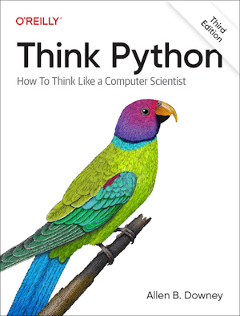

View this email in your browser.

Welcome to the latest Python on Microcontrollers newsletter! This week's issue has a couple of features. First are three how-to articles on Meshtastic, Time-of-Flight sensors and the pitfalls of Raspberry Pi PIO. Second is new materials for teaching CircuitPython at Boston College. We're all searching for easier ways of doing our projects, and this issue might just help with that and spur creativity. - *Anne Barela, Editor*

We're on [Discord](https://discord.gg/HYqvREz), [Twitter/X](https://twitter.com/search?q=circuitpython&src=typed_query&f=live), [BlueSky](https://bsky.app/profile/circuitpython.org) and for past newsletters - [view them all here](https://www.adafruitdaily.com/category/circuitpython/). If you're reading this on the web, [subscribe here](https://www.adafruitdaily.com/). Here's the news this week:

## Arduino Launches a MicroPython Package Manager

The Arduino team has announced a new library management system aimed at making it easier to write MicroPython code for compatible Arduino microcontrollers by providing single-click installation from an official package index - [hackster.io](https://www.hackster.io/news/arduino-launches-a-micropython-package-manager-for-easier-library-installation-f67cf7604048) and [Arduino Blog](https://blog.arduino.cc/2025/01/21/micropython-programming-on-arduino-just-got-easier/).

> "The Arduino Lab for MicroPython has now gained an external package management system. Run outside the IDE itself, it works almost identically to the library manager in the standard Arduino IDE: it connects to an official package index and provides a searchable list of libraries, any one of which can be installed to a compatible microcontroller board in a single click. It also provides a way to add third-party packages from a URL — and all files can be automatically converted to MPY format for inclusion in a sketch.   The official package index includes, the Arduino team says, both officially-maintained packages, MicroPython standard libraries, and community contributions; those interested in adding to the latter are invited to send pull requests in to [the MicroPython Package Index on GitHub](https://github.com/arduino/package-index-py/).   Those who just want to try it out as an end-user, meanwhile, can find the source code and initial release on [GitHub](https://github.com/arduino/lab-micropython-package-installer?tab=readme-ov-file). Boards supported are the Arduino Portenta H7, Portenta C33, Nicla Vision, Giga, Nano RP2040, Nano ESP32, and Nano 33 BLE; "this tool may work for third party boards too," the Arduino team notes, but warns "this is, however, not officially supported."

## MicroPython at FOSDEM

MicroPython will once again be joining forces with Espruino at [FOSDFEM](https://fosdem.org/2025/) this year, 1-2 February in Brussels. Their table will be in building AW and they'd like you to show off your projects using MicroPython. There will also be two [talks by Jon Nordby](https://fosdem.org/2025/schedule/event/fosdem-2025-4524-milliwatt-sized-machine-learning-on-microcontrollers-with-emlearn/) - [X](https://x.com/micropython/status/1881661639209930838?t=xLLPAgM27LMWvteRfXVgAw&s=03).

## The Boston College Semester of Code

Prof. John Gallaugher of Boston College posts on [Mastodon](https://mastodon.world/@gallaugher/113878268732153363):

> "If anyone wants to get in on a newbie-friendly #SemesterOfCircuitPython I am posting all of our weekly flipped class lessons in a playlist at [YouTube.com/@BuildWithProfG](https://www.youtube.com/@BuildWithProfG). Plus weekly notes in Keynote & .pdf format, complete with in-class challenges in the PhysComp Google drive at [Gallaugher.com](https://gallaugher.com/). The first 2 weeks have lots of set up/config/background info. Starting with the Adafruit Circuit Playground Bluefruit, switching to Raspberry Pi Pico W midsemester. PyCharm, CircUp. All welcome!"

See a new selection of videos highlighted below in this newsletter.

## Dominic Plunkett Discusses Engineering the Raspberry Pi Compute Module 5

In the latest issue of [The MagPi magazine](https://magpi.raspberrypi.com/issues/149), Andrew Gregory speaks to Senior Principal Hardware Engineer Dominic Plunkett about how the pieces of the Raspberry Pi Compute Module 5 puzzle came together - [Raspberry Pi News](https://www.raspberrypi.com/news/meet-the-engineer-dominic-plunkett-on-compute-module-5/).

## Hacker's Guide to Meshtastic: Off-Grid, Encrypted LoRa Meshnets for Cheap

Beginners can now create off-grid, encrypted mesh networks for cheap using Meshtastic, with applications in emergency communication, sensor monitoring, and more. These mesh networks have been popping up in cities all over the world. A recent talk at 38c3 by Kody Kinzie goes over everything a beginner needs to run or build their own nodes - [38c3](https://media.ccc.de/v/38c3-hacker-s-guide-to-meshtastic-off-grid-encrypted-lora-meshnets-for-cheap).

## Time of Flight Sensors: How do They Work?

Hackaday looks into Time of Flight sensors: what they are and how they work - [Hackaday](https://hackaday.com/2025/01/20/time-of-flight-sensors-how-do-they-work/) and MicroPython code - [GitHub](https://gist.github.com/wd5gnr/d0eb804ec6beca83b236fc5fcfd1a3db).

## Raspberry Pi Programmable IO Pitfalls

The Raspberry Pi RP2xxx's Programmable Input/Output (PIO) subsystem, while incredibly powerful and versatile, comes with peculiarities. This article focuses on understanding PIO programming and its quirks - [Towards Data Science](https://towardsdatascience.com/nine-pico-pio-wats-with-micropython-part-1-82b80fb84473).

## Matter Will Be Better in 2025 — Say the People Who Make It

The CSA, Thread Group, and Wi-Fi Alliance say they’re working together to fix the problems that have plagued the smart home standard in its first two years. The Verge asks them how and when - [TheVerge](https://www.theverge.com/24349390/matter-csa-thread-group-wifi-alliance-interview-2025).

## This Week's Python Streams

Python on Hardware is all about building a cooperative ecosphere which allows contributions to be valued and to grow knowledge. Below are the streams within the last week focusing on the community.

**CircuitPython Deep Dive Stream**

[Last Friday](https://youtube.com/live/3lHUde2KjPo), Scott streamed work on Zephyr WiFi.

You can see the latest video and past videos on the Adafruit YouTube channel under the Deep Dive playlist - [YouTube](https://www.youtube.com/playlist?list=PLjF7R1fz_OOXBHlu9msoXq2jQN4JpCk8A).

**CircuitPython Parsec**

John Park’s CircuitPython Parsec this week is on Feather ESP32-S2/S3 I2C battery monitoring - [Adafruit Blog](https://blog.adafruit.com/2025/01/24/john-parks-circuitpython-parsec-feather-esp32-s2-s3-i2c-battery-monitoring-adafruit-circuitpython/) and [YouTube](https://youtu.be/9gwKL7J8JZY).

Catch all the episodes in the [YouTube playlist](https://www.youtube.com/playlist?list=PLjF7R1fz_OOWFqZfqW9jlvQSIUmwn9lWr).

**The CircuitPython Show**

In the latest episode released January 27th, Paul welcomes back Jan Goolsbey, who shares how he built a corrosion and weather monitoring system using CircuitPython - [The CircuitPython Show](https://www.circuitpythonshow.com).

**CircuitPython Weekly Meeting**

CircuitPython Weekly Meeting for January 21, 2025 ([notes](https://github.com/adafruit/adafruit-circuitpython-weekly-meeting/blob/main/2025/2025-01-21.md)) [on YouTube](https://youtu.be/R2cf7scgf8E).

## Project of the Week: Upcycling an Air Quality Sensor

Using a PM2.5 sensor pulled from a broken "smart" air purifier, Daniel James created a simple two-component CircuitPython-powered air quality monitor using a Raspberry Pi RP2040-based Adafruit KB2040 microcontroller board - [hackster.io](https://www.hackster.io/news/daniel-james-air-quality-monitor-pairs-a-salvaged-pm2-5-sensor-with-an-adafruit-kb2040-183c08bcd13b), [website](https://thzinc.com/2025/01/22/simple-pm2-5-particulate-monitor.html), and [GitHub](https://github.com/thzinc/simple-particulate-monitor).

## Popular Last Week

What was the most popular, most clicked link, in [last week's newsletter](https://www.adafruitdaily.com/2025/01/20/python-on-microcontrollers-newsletter-circuitpython-2025-wraps-focus-on-using-python-open-source-and-more-circuitpython-python-micropython-thepsf-raspberry_pi/)? [Free eBook: Think Python](https://allendowney.github.io/ThinkPython/).

Did you know you can read past issues of this newsletter in the Adafruit Daily Archive? [Check it out](https://www.adafruitdaily.com/category/circuitpython/).

## New Notes from Adafruit Playground

[Adafruit Playground](https://adafruit-playground.com/) is a new place for the community to post their projects and other making tips/tricks/techniques. Ad-free, it's an easy way to publish your work in a safe space for free.

CircuitPython Matrix Portal S3 NTP Clock - [Adafruit Playground](https://adafruit-playground.com/u/DJDevon3/pages/circuit-python-matrix-portal-s3-ntp-clock).

Adventure Engine: mapping a world in a NeoTrinkey - [Adafruit Playground](https://adafruit-playground.com/u/mrklingon/pages/adventure-engine-mapping-a-world-in-a-neotrinkey).

## News From Around the Web

This week starts with highlighting a set of new videos on CircuitPython by Professor Gallaugher at Boston College.

Bring in Da Noise! Playing .wav files in CircuitPython on a Circuit Playground Express (CircuitPython School) - [YouTube](https://www.youtube.com/watch?v=tZxMN7d_eHg).

Bring in Da Func! Pt. 1, Introducing CircuitPython Functions (CircuitPython School) - [YouTube](https://www.youtube.com/watch?v=MdZ21IJU7gQ).

Clip It Good! Clip a Speaker to a CircuitPlayground (CircuitPython School) - [YouTube](https://www.youtube.com/watch?v=qYxfHguFOAg).

Better Buttons with Debouncing (CircuitPython School) - [YouTube](https://www.youtube.com/watch?v=eepF0wLCbW0).

ifs, ands, and buttons - Conditionals in CircuitPython (CircuitPython School) - [YouTube](https://www.youtube.com/watch?v=m5fpRb3Fg8s).

Importing and Using NeoPixel Colors from the Adafruit LED Colors Library (CircuitPython School) - [YouTube](https://www.youtube.com/watch?v=X293W-fFkG8).

Flash & Loop NeoPixels with Lists in Python (CircuitPython School) - [YouTube](https://www.youtube.com/watch?v=_rDWUqD-5NI).

And back to community projects:

Linux 6.13 release – main changes for the Arm, RISC-V, and MIPS architectures - [CNX Software](https://www.cnx-software.com/2025/01/20/linux-6-13-release-main-changes-arm-risc-v-and-mips-architectures/).

A USB to I3C converter using a Raspberry Pi Pico. Computer tests in Python - [Hackaday](https://hackaday.com/2025/01/18/i3c-bit-banging-fun-for-the-rp2040/) and [GitHub](https://github.com/xyphro/I3CBlaster).

Anything to Home Assistant - with PSOC™ and MicroPython. Bring any sensor into Home Assistant, easier than ever, with MicroPython - [hackster.io](https://www.hackster.io/Infineon_Team/anything-to-home-assistant-with-psoc-micropython-acb293).

Using desktop Python to manage external sensors and motors with a Raspberry Pi Pico RP2040 and Adafruit Blinka - [YouTube](https://www.youtube.com/shorts/idw-Ojx0k40).

An ESP32-C3 SHT40 weather web server using CircuitPython - [Instructables](https://www.instructables.com/ESP32-C3-SHT40-Weather-Server/).

ESP32-C6: a beginner's guide to LED blinking in 5 minutes with CircuitPython - [YouTube](https://youtu.be/FLsSCecuTR8?feature=shared).

A Raspberry Pi weather station made with Python and Grafana - [X](https://x.com/kevsmac/status/1882821720878547371).

Making Belshazzar’s Clock using MicroPython - [karliner.net](https://blog.karliner.net/projects/belshazzars-clock/). Via [Mastodon](https://octodon.social/@mike@gotosocial.minus1.com/113787983363666826).

Using a WebSocket control panel to broadcast data from the Raspberry Pi Pico W and control LEDs in real time with MicroPython and the Microdot framework - [hackster.io](https://www.hackster.io/rajivcodelab/how-to-build-a-websocket-control-panel-raspberry-pi-pico-w-5f029c) and [YouTube](https://youtu.be/MKL1RmpoxvU).

Four Raspberry Pi CyberDeck projects to inspire your own build - [SlashGear](https://www.slashgear.com/1748513/raspberry-pi-projects-cyberdeck-inspired/).

Next-gen Ethernet standards set to move forward in 2025 - [NetworkWorld](https://www.networkworld.com/article/3802351/next-gen-ethernet-standards-set-to-move-forward-in-2025.html).

MicroPython vs CircuitPython - Python for Microcontroller and Embedded System - [YouTube](https://www.youtube.com/watch?v=Y89lCgi6FuE) (Hindi).

## New

Olimex has recently released the PICO2-XL and PICO2-XXL open-source hardware RP2350B development boards with up to 16MB flash, 8MB PSRAM, 48 GPIOs, a microSD card slot, and more. Open hardware RP2350B boards are hard to find, and the only others besides these Olimex boards are the JumperLess V5 and Bus Pirate 6, but they are not general-purpose boards - [CNX Software](https://www.cnx-software.com/2025/01/17/open-hardware-rp2350b-boards-offer-up-to-16mb-flash-8mb-psram-microsd-card-slot-48x-gpios/).

## New Boards Supported by CircuitPython

The number of supported microcontrollers and Single Board Computers (SBC) grows every week. This section outlines which boards have been included in CircuitPython or added to [CircuitPython.org](https://circuitpython.org/).

This week there were four new boards added:

- [M5Stamp S3](https://circuitpython.org/board/m5stack_stamp_s3/)
- [PicoMo V3](https://circuitpython.org/board/picomo_v3/)
- [Adafruit Sparkle Motion](https://circuitpython.org/board/adafruit_sparkle_motion/)
- [Adafruit Mini Sparkle Motion](https://circuitpython.org/board/adafruit_mini_sparkle_motion/)

*Note: For non-Adafruit boards, please use the support forums of the board manufacturer for assistance, as Adafruit does not have the hardware to assist in troubleshooting.*

Looking to add a new board to CircuitPython? It's highly encouraged! Adafruit has four guides to help you do so:

- [How to Add a New Board to CircuitPython](https://learn.adafruit.com/how-to-add-a-new-board-to-circuitpython/overview)
- [How to add a New Board to the circuitpython.org website](https://learn.adafruit.com/how-to-add-a-new-board-to-the-circuitpython-org-website)
- [Adding a Single Board Computer to PlatformDetect for Blinka](https://learn.adafruit.com/adding-a-single-board-computer-to-platformdetect-for-blinka)
- [Adding a Single Board Computer to Blinka](https://learn.adafruit.com/adding-a-single-board-computer-to-blinka)

## Learn Guides

The [Adafruit Learning System](https://learn.adafruit.com/) has over 3,000 free guides for learning skills and building projects including using Python.

## CircuitPython Libraries

The CircuitPython library numbers are continually increasing, while existing ones continue to be updated. Here we provide library numbers and updates!

To get the latest Adafruit libraries, download the [Adafruit CircuitPython Library Bundle](https://circuitpython.org/libraries). To get the latest community contributed libraries, download the [CircuitPython Community Bundle](https://circuitpython.org/libraries).

If you'd like to contribute to the CircuitPython project on the Python side of things, the libraries are a great place to start. Check out the [CircuitPython.org Contributing page](https://circuitpython.org/contributing). If you're interested in reviewing, check out Open Pull Requests. If you'd like to contribute code or documentation, check out Open Issues. We have a guide on [contributing to CircuitPython with Git and GitHub](https://learn.adafruit.com/contribute-to-circuitpython-with-git-and-github), and you can find us in the #help-with-circuitpython and #circuitpython-dev channels on the [Adafruit Discord](https://adafru.it/discord).

You can check out this [list of all the Adafruit CircuitPython libraries and drivers available](https://github.com/adafruit/Adafruit_CircuitPython_Bundle/blob/master/circuitpython_library_list.md). 

The current number of CircuitPython libraries is **498**!

**New Libraries**

Here's this week's new CircuitPython libraries:

  * [noelanderson/CircuitPython_PCA9955B](https://github.com/noelanderson/CircuitPython_PCA9955B)

**Updated Libraries**

Here's this week's updated CircuitPython libraries:

  * [adafruit/Adafruit_CircuitPython_PixelMap](https://github.com/adafruit/Adafruit_CircuitPython_PixelMap)
  * [adafruit/Adafruit_CircuitPython_MiniMQTT](https://github.com/adafruit/Adafruit_CircuitPython_MiniMQTT)
  * [adafruit/Adafruit_CircuitPython_PyCamera](https://github.com/adafruit/Adafruit_CircuitPython_PyCamera)
  * [adafruit/Adafruit_CircuitPython_Wiz](https://github.com/adafruit/Adafruit_CircuitPython_Wiz)
  * [tekktrik/CircuitPython_CSV](https://github.com/tekktrik/CircuitPython_CSV)

## What’s the CircuitPython team up to this week?

What is the team up to this week? Let’s check in:

**Dan**

I released CircuitPython 9.2.3 about ten days ago to fix a problem with USB and ESP32-S3. Since then, another fix has been made for USB and STM, and I hope to release 9.2.4 soon, along with some other fixes.

I'm now working on completing an update to the NINA-FW firmware for AirLift co-processors that will allow using elliptic cryptography certificate chains. A lot of this work was done more than a year ago, but it still needs to be debugged.

**Tim**

This week I've been working on some fixes for Blinka Displayio. I also searched the bundle for and fixed a few instances of our docs conf.py using deprecated Python modules. Lastly, I tested all of the CircuitPython examples for the Sparkle Motion Mini product guide pages. 

**Jeff**

I've continued working in Raspberry Pi 5 land, making improvements to the `piomatter` Python package for driving HUB75 style RGB matrices. This includes an example where part of the "/dev/fb0" framebuffer is copied and displayed on an attached matrix.

**Scott**

I'm continuing to work on CircuitPython on Zephyr. I fixed flash support so that CIRCUITPY is writable. I've changed memory management to support multiple RAM regions including SDRAM. The RA8 dev board has an external flash with varying page sizes so I've added support for a uniform subregion. I'm hoping to get WiFi working next.

**Liz**

This week I worked on CircuitPython code for a [motorized turntable project](https://learn.adafruit.com/motorized-turntable-3) with Noe. This turntable is meant for getting dynamic video shots. It uses the new TMC2209 silent stepper motor driver, which works by toggling the step pin to move the motor. I found that when I added the rotary encoder and button checks into the loop, even with ticks, that the driver basically stalled and wasn't moving. I switched to `asyncio` and that allowed the project to work with toggling the step pin, reading the rotary encoder and button and updating the OLED screen. I'm hoping this will be a nice demo for folks on how to use `asyncio`, which can be a bit tricky to wrap your head around.

## Upcoming Events

FOSDEM is a free event for software developers to meet, share ideas and collaborate. This year it will be February 1-2 in Brussels and the MicroPython folks will be there - [FOSDEM 2025](https://fosdem.org/2025/).

PyCascades is a regional PyCon in the Pacific Northwest, celebrating the west coast Python developer and user community. Our organizing team includes members of the Vancouver, Seattle, and Portland Python user groups. February 8-9, Portland, Oregon US - [PyCascades 2025](https://2025.pycascades.com/).

The next MicroPython Meetup in Melbourne, Australia will be on February 26th – [Meetup](https://www.meetup.com/micropython-meetup/events). You can see recordings of previous meetings on [YouTube](https://www.youtube.com/@MicroPythonOfficial). 

The community is coming back to Pittsburgh, Pennsylvania for PyCon US 2025 May 14 - May 22, 2025 - [us.pycon.org](https://us.pycon.org/2025/).

**Send Your Events In**

If you know of virtual events or upcoming events, please let us know via email to cpnews(at)adafruit(dot)com.

## Latest Releases

CircuitPython's stable release is [9.2.3](https://github.com/adafruit/circuitpython/releases/latest)). New to CircuitPython? Start with our [Welcome to CircuitPython Guide](https://learn.adafruit.com/welcome-to-circuitpython).

[20250123](https://github.com/adafruit/Adafruit_CircuitPython_Bundle/releases/latest) is the latest Adafruit CircuitPython library bundle.

[20250124](https://github.com/adafruit/CircuitPython_Community_Bundle/releases/latest) is the latest CircuitPython Community library bundle.

[v1.24.1](https://micropython.org/download) is the latest MicroPython release. Documentation for it is [here](http://docs.micropython.org/en/latest/pyboard/).

[3.13.1](https://www.python.org/downloads/) is the latest Python release. The latest pre-release version is [3.14.0a4](https://www.python.org/download/pre-releases/).

[4,181 Stars](https://github.com/adafruit/circuitpython/stargazers) Like CircuitPython? [Star it on GitHub!](https://github.com/adafruit/circuitpython)

## Call for Help -- Translating CircuitPython is now easier than ever

One important feature of CircuitPython is translated control and error messages. With the help of fellow open source project [Weblate](https://weblate.org/), we're making it even easier to add or improve translations. 

Sign in with an existing account such as GitHub, Google or Facebook and start contributing through a simple web interface. No forks or pull requests needed! As always, if you run into trouble join us on [Discord](https://adafru.it/discord), we're here to help.

## 38,659 Thanks

The Adafruit Discord community, where we do all our CircuitPython development in the open, reached over 38,659 humans - thank you! Adafruit believes Discord offers a unique way for Python on hardware folks to connect. Join today at [https://adafru.it/discord](https://adafru.it/discord).

## ICYMI - In case you missed it

Python on hardware is the Adafruit Python video-newsletter-podcast! The news comes from the Python community, Discord, Adafruit communities and more and is broadcast on ASK an ENGINEER Wednesdays. The complete Python on Hardware weekly videocast [playlist is here](https://www.youtube.com/playlist?list=PLjF7R1fz_OOXRMjM7Sm0J2Xt6H81TdDev). The video podcast is on [iTunes](https://itunes.apple.com/us/podcast/python-on-hardware/id1451685192?mt=2), [YouTube](http://adafru.it/pohepisodes), [Instagram](https://www.instagram.com/adafruit/channel/)), and [XML](https://itunes.apple.com/us/podcast/python-on-hardware/id1451685192?mt=2).

[The weekly community chat on Adafruit Discord server CircuitPython channel - Audio / Podcast edition](https://itunes.apple.com/us/podcast/circuitpython-weekly-meeting/id1451685016) - Audio from the Discord chat space for CircuitPython, meetings are usually Mondays at 2pm ET, this is the audio version on [iTunes](https://itunes.apple.com/us/podcast/circuitpython-weekly-meeting/id1451685016), Pocket Casts, [Spotify](https://adafru.it/spotify), and [XML feed](https://adafruit-podcasts.s3.amazonaws.com/circuitpython_weekly_meeting/audio-podcast.xml).

## Contribute

The CircuitPython Weekly Newsletter is a CircuitPython community-run newsletter emailed every Monday. The complete [archives are here](https://www.adafruitdaily.com/category/circuitpython/). It highlights the latest CircuitPython related news from around the web including Python and MicroPython developments. To contribute, edit next week's draft [on GitHub](https://github.com/adafruit/circuitpython-weekly-newsletter/tree/gh-pages/_drafts) and [submit a pull request](https://help.github.com/articles/editing-files-in-your-repository/) with the changes. You may also tag your information on Twitter with #CircuitPython. 

Join the Adafruit [Discord](https://adafru.it/discord) or [post to the forum](https://forums.adafruit.com/viewforum.php?f=60) if you have questions.
