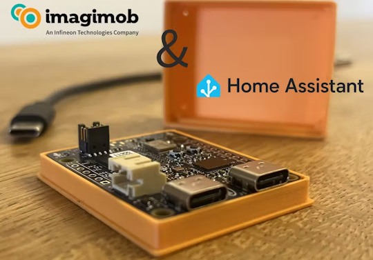
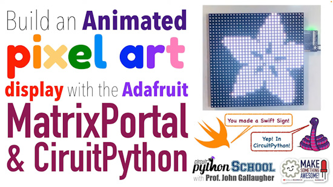

- [ ] Library and info updates
- [ ] change date
- [ ] update title
- [ ] Feature story
- [ ] Update  for images
- [ ] Update ICYDNCI
- [ ] All images 550w max only
- [ ] Link "View this email in your browser."

News Sources

- [Adafruit Playground](https://adafruit-playground.com/)
- Twitter: [CircuitPython](https://twitter.com/search?q=circuitpython&src=typed_query&f=live), [MicroPython](https://twitter.com/search?q=micropython&src=typed_query&f=live) and [Python](https://twitter.com/search?q=python&src=typed_query)
- [Raspberry Pi News](https://www.raspberrypi.com/news/)
- Mastodon [CircuitPython](https://octodon.social/tags/CircuitPython) and [MicroPython](https://octodon.social/tags/MicroPython)
- [hackster.io CircuitPython](https://www.hackster.io/search?q=circuitpython&i=projects&sort_by=most_recent) and [MicroPython](https://www.hackster.io/search?q=micropython&i=projects&sort_by=most_recent)
- YouTube: [CircuitPython](https://www.youtube.com/results?search_query=circuitpython&sp=CAI%253D), [MicroPython](https://www.youtube.com/results?search_query=micropython&sp=CAI%253D)
- Instructables: [CircuitPython](https://www.instructables.com/search/?q=circuitpython&projects=all&sort=Newest), [MicroPython](https://www.instructables.com/search/?q=micropython&projects=all&sort=Newest), [Raspberry Pi Python](https://www.instructables.com/search/?q=raspberry+pi+python&projects=all&sort=Newest)
- [hackaday CircuitPython](https://hackaday.com/blog/?s=circuitpython) and [MicroPython](https://hackaday.com/blog/?s=micropython)
- [python.org](https://www.python.org/)
- [Python Insider - dev team blog](https://pythoninsider.blogspot.com/)
- Individuals: [Jeff Geerling](https://www.jeffgeerling.com/blog), [Yakroo](https://x.com/Yakroo5077)
- Tom's Hardware: [CircuitPython](https://www.tomshardware.com/search?searchTerm=circuitpython&articleType=all&sortBy=publishedDate) and [MicroPython](https://www.tomshardware.com/search?searchTerm=micropython&articleType=all&sortBy=publishedDate) and [Raspberry Pi](https://www.tomshardware.com/search?searchTerm=raspberry%20pi&articleType=all&sortBy=publishedDate)
- [hackaday.io newest projects MicroPython](https://hackaday.io/projects?tag=micropython&sort=date) and [CircuitPython](https://hackaday.io/projects?tag=circuitpython&sort=date)
- [Google News Python](https://news.google.com/topics/CAAqIQgKIhtDQkFTRGdvSUwyMHZNRFY2TVY4U0FtVnVLQUFQAQ?hl=en-US&gl=US&ceid=US%3Aen)
- hackaday.io - [CircuitPython](https://hackaday.io/search?term=circuitpython) and [MicroPython](https://hackaday.io/search?term=micropython)

View this email in your browser. **Warning: Flashing Imagery**

Welcome to the latest Python on Microcontrollers newsletter! *insert 2-3 sentences from editor (what's in overview, banter)* - *Anne Barela, Editor*

We're on [Discord](https://discord.gg/HYqvREz), [Twitter/X](https://twitter.com/search?q=circuitpython&src=typed_query&f=live), [BlueSky](https://bsky.app/profile/circuitpython.org) and for past newsletters - [view them all here](https://www.adafruitdaily.com/category/circuitpython/). If you're reading this on the web, [subscribe here](https://www.adafruitdaily.com/). Here's the news this week:

## CircuitPython 9.2.4 Released

CircuitPython 9.2.4 is the latest bugfix revision of CircuitPython and is a new stable release - [Adafruit Blog](https://blog.adafruit.com/2025/01/28/circuitpython-9-2-4-released/) and release notes - [GitHub](https://github.com/adafruit/circuitpython/releases/tag/9.2.4).

**Highlights of this release**

* Update frozen modules, including a fix for `adafruit_requests`.
* `audiofilters`: add `Distortion` and implement LFO ticking.
* Add `canio` support for i.MX boards.
* Fix RP2 `picodvi` crash.
* Fix STM USB crashes.

## Focus on AI/ML for Microcontrollers and Single Board Computers

You may notice that this newsletter avoids fads, instead looking to highlight things that can actually be done with hardware and software we might actually obtain. Here are three articles I found which address just that.

While most models take in terabytes and need high end compute to process and provide results, IEEE Spectrum highlights Pennsylvania State University and MIT's paper, published in Nature Scientific Reports, which demonstrates how a neural network can achieve an accuracy of more than 90 percent while sampling as little as 10 percent of the original sensor data.

To punctuate this, they use a Raspberry Pi Pico running their software - [IEEE Spectrum](https://spectrum.ieee.org/sensor-data).

Deepseek, a new AI startup run by a Chinese hedge fund, *allegedly* created a new open weights model called R1 that beats OpenAI's best model in every metric. Besides the embarassment of a Chinese startup beating OpenAI using one percent of the resources (according to Deepseek), their model can 'distill' other models to make them run better on slower hardware. Jeff Geerling tests this out using a Raspberry Pi 5 connected to a PC GPU/graphics card - [JeffGeerling.com](https://www.jeffgeerling.com/blog/2025/how-deepseek-r1-on-raspberry-pi) and [YouTube](https://youtu.be/o1sN1lB76EA).

[Software Heritage](https://www.softwareheritage.org/) was founded in 2016 to collect and preserve all publicly available source code. After the ChatGPT explosion, it quickly became clear that Software Heritage held the largest dataset for training AI models on code in the world. Another IEEE Spectrum article delves into ethical coding of AIs, data cleaning, opt-out, personal information in open code, license checks, and more - [IEEE Spectrum](https://spectrum.ieee.org/coding-ai).

## ESP32-C5 Engineering Samples Are Out

The ESP32-C5 is the first 32-bit single-core RISC-V-based MCU from Espressif to support both 2.4 GHz and 5 GHz WiFi 6, along with Bluetooth 5 (LE) and IEEE 802.15.4 standards. The dual-band support opens new possibilities for IoT applications, allowing devices to operate on the less crowded 5 GHz band for lower latency and more reliable connectivity. The inclusion of advanced WiFi 6 features such as Target Wake Time (TWT), MU-MIMO, and OFDMA ensures improved performance in dense network environments - [Circuit Digest](https://circuitdigest.com/news/breaking-barriers-espressifs-esp32-c5-brings-5-ghz-wi-fi-to-iot-devices), [Espressif](https://www.espressif.com/en/products/socs/esp32-c5) and [YouTube](https://www.youtube.com/watch?v=glEvHRHdboA). Via [X](https://x.com/EspressifSystem/status/1883940237522657398).

## CircuitPython Pull Request Milestones

CircuitPython reached a milestone with Pull Request number Ten Thousand made by Jeff Epler. Also CircuitPython  blew past the milestone of 5000 *merged PRs* sometime last year, with a total 5,143 merged PRs at the moment - [GitHub](https://github.com/adafruit/circuitpython/pull/10000).

## Raspberry Pi Programmable IO Pitfalls - Part 2

Part 2 of an exploration into the unexpected quirks of programming the Raspberry Pi Pico PIO with MicroPython. In [Part 1](https://medium.com/towards-data-science/nine-pico-pio-wats-with-micropython-part-1-82b80fb84473) (in the last issue of this newsletter), there were four challenge assumptions about register count, instruction slots, the behavior of pull(noblock), and smart yet cheap hardware - [Towards Data Science](https://towardsdatascience.com/nine-pico-pio-wats-with-micropython-part-2-984a642f25a4).

## Feature

text - [site](url).

## This Week's Python Streams

Python on Hardware is all about building a cooperative ecosphere which allows contributions to be valued and to grow knowledge. Below are the streams within the last week focusing on the community.

**CircuitPython Deep Dive Stream**

[Last Friday](link), Scott streamed work on {subject}.

You can see the latest video and past videos on the Adafruit YouTube channel under the Deep Dive playlist - [YouTube](https://www.youtube.com/playlist?list=PLjF7R1fz_OOXBHlu9msoXq2jQN4JpCk8A).

**CircuitPython Parsec**

John Park’s CircuitPython Parsec this week is on {subject} - [Adafruit Blog](link) and [YouTube](link).

Catch all the episodes in the [YouTube playlist](https://www.youtube.com/playlist?list=PLjF7R1fz_OOWFqZfqW9jlvQSIUmwn9lWr).

**The CircuitPython Show**

The CircuitPython Show has returned after a one year hiatus! In the latest episode, host Paul Cutler interviews xxxx - [The CircuitPython Show](https://www.circuitpythonshow.com)

**CircuitPython Weekly Meeting**

CircuitPython Weekly Meeting for January 27, 2025 ([notes](https://github.com/adafruit/adafruit-circuitpython-weekly-meeting/blob/main/2025/2025-01-27.md)) [on YouTube](https://youtu.be/8ZmzxqDhe6c).

## Project of the Week: The Cyber WalkMan

A Cyberpunk-style multi-display music player integrating a [Unihiker](https://www.unihiker.com/) single board computer with Python and Tkinter to build a sleek GUI. It incorporates an SSD1306 OLED display for supplementary information, such as time and song status - [DFRobot](https://community.dfrobot.com/makelog-315042.html), [GitHub](https://github.com/YakrooThai/UNIHIKER/blob/main/CyberWalkMan/cyberwalkyoue.py) and [YouTube](https://www.youtube.com/watch?v=QR0yzph_53w) and [X]().

## Popular Last Week

What was the most popular, most clicked link, in [last week's newsletter](https://www.adafruitdaily.com/2025/01/27/python-on-microcontrollers-newsletter-a-new-arduino-micropython-package-manager-how-tos-and-much-more-circuitpython-python-micropython-thepsf-raspberry_pi/)? [Free eBook: Think Python](https://allendowney.github.io/ThinkPython/).

Did you know you can read past issues of this newsletter in the Adafruit Daily Archive? [Check it out](https://www.adafruitdaily.com/category/circuitpython/).

## New Notes from Adafruit Playground

[Adafruit Playground](https://adafruit-playground.com/) is a new place for the community to post their projects and other making tips/tricks/techniques. Ad-free, it's an easy way to publish your work in a safe space for free.

Using a 7" Sunton ESP32-S3 8048S070 with CircuitPython - [Adafruit Playground](https://adafruit-playground.com/u/DJDevon3/pages/7-sunton-esp32s3-8048s070-circuit-python).

Greenhouse Temperature Logger - [Adafruit Playground](https://adafruit-playground.com/u/SamBlenny/pages/greenhouse-temperature-logger).

## News From Around the Web

The book *Using Sensors with the Raspberry Pi Pico* by Daniel Quadros contains examples in Pico SDK, Arduino, MicroPython and CircuitPython - [Leanpub](https://leanpub.com/picosensors/c/LeanpubWeeklySale2025Jan31) and [YouTube](https://youtu.be/cISNF1M75uY). Via [X](https://x.com/DQSoft/status/1885267922186010926).

A solar-powered wildlife monitor uses a Raspberry Pi AI HAT+ and Python to track birds to soon be used in real-world conservation efforts - [hackster.io](https://www.hackster.io/news/it-s-for-the-birds-5625a8bb9ea9), [GitHub](https://github.com/LukeDitria/RasPi_YOLO) and [YouTube](https://www.youtube.com/watch?v=Cd_yplR1hcI).

The 3D-printed [BEAPER](https://mirobo.tech/beaper) Pico robot is controlled by a Raspberry Pi Pico 2 W microcontroller programmed in MicroPython or CircuitPython - [X](https://bsky.app/profile/mirobotech.bsky.social/post/3lgqfboa2n22a).

Build your own Bluetooth remote control for your robots using a GamePAD PCB, some buttons and MicroPython - [YouTube](https://www.youtube.com/watch?v=HeGr8RnzVqk). Via [X](https://x.com/kevsmac/status/1883797725952483749).

A baby cry detector with Home Assistant integration via MicroPython - [hackster.io](https://www.hackster.io/Infineon_Team/ai-baby-cry-detector-with-home-assistant-integration-05576f).

Easy Python Coding for Robots: Getting Started with CircuitPython - [YouTube](https://www.youtube.com/watch?v=dhD4JQTZt_Q).

IchigoJam for Raspberry Pi Pico (RP2040) "IchigoJam P" is a self-contained computer with DVI video out and USB keyboard support. Plug in a Raspberry Pi Pico and [download firmware](https://pcn.club/sp/ijp/IchigoJamP-1.6.1.zip) (ZIP) to program in IchigoJam BASIC - [PCN](https://hello002.stores.jp/items/67627aefbe11ec0202ac08a8).

**Here is a new batch of CircuitPython School videos from Prof John Gallaugher at Boston College:**

Light Sensor and the Circuit Playground - [YouTube](https://www.youtube.com/watch?v=V8WDj0C9B9o).

Alarm! Play Sound and Animate NeoPixel LED Lights - [YouTube](https://www.youtube.com/watch?v=WzThofwowfo).

Brightness! Pulsing NeoPixel lights in CircuitPython - [YouTube](https://www.youtube.com/watch?v=NwaVR3mqpCQ).

Fidget Dot - a CircuitPython School Challenge Solution - [YouTube](https://www.youtube.com/watch?v=p1MawEjchqc).

Bring in da Func Part 2 Scope, Global vs Local, Return Values - [YouTube](https://www.youtube.com/watch?v=I1u3L7JeJkk).

Animated Pixel Art Using the Adafruit Matrix Portal and CircuitPython - [YouTube](https://www.youtube.com/watch?v=hb2HtoIEXM8).

text - [site](url).

Python Methods Cheat Sheet - [X](https://x.com/PythonPr/status/1882824776684806558).

Python-powered RTL-SDR signal analyzer can warn of active jamming attacks - [hackster.io](https://www.hackster.io/news/alejandro-martin-s-python-powered-rtl-sdr-signal-analyzer-can-warn-of-active-jamming-attacks-1c0b221211a9) and [GitHub](https://github.com/msalexms/rtl-sdr-analyzer?tab=readme-ov-file).

text - [site](url).

How I would learn Python in 2025 (if I could start over) - [KDnuggets](https://www.kdnuggets.com/learn-python-2025-start-over).

## Coming Soon and New

The Unexpected Maker OmniController is an upcoming NANOS3 based motor controller board - [X](https://x.com/unexpectedmaker/status/1885152330016039148).

SparkFun Digi X-ON LoRaWAN development kit combines Digi HX15 gateway with RP2350 IoT node and environmental sensors module, programmable in MicroPython, Pico SDK and Arduino - [CNX Software](https://www.cnx-software.com/2025/01/31/sparkfun-digi-x-on-lorawan-development-kit-combines-digi-hx15-gateway-with-rp2350-iot-node-and-environmental-sensors-module/).

## New Boards Supported by CircuitPython

The number of supported microcontrollers and Single Board Computers (SBC) grows every week. This section outlines which boards have been included in CircuitPython or added to [CircuitPython.org](https://circuitpython.org/).

This week there were (#/no) new boards added:

- [Board name](url)
- [Board name](url)
- [Board name](url)

*Note: For non-Adafruit boards, please use the support forums of the board manufacturer for assistance, as Adafruit does not have the hardware to assist in troubleshooting.*

Looking to add a new board to CircuitPython? It's highly encouraged! Adafruit has four guides to help you do so:

- [How to Add a New Board to CircuitPython](https://learn.adafruit.com/how-to-add-a-new-board-to-circuitpython/overview)
- [How to add a New Board to the circuitpython.org website](https://learn.adafruit.com/how-to-add-a-new-board-to-the-circuitpython-org-website)
- [Adding a Single Board Computer to PlatformDetect for Blinka](https://learn.adafruit.com/adding-a-single-board-computer-to-platformdetect-for-blinka)
- [Adding a Single Board Computer to Blinka](https://learn.adafruit.com/adding-a-single-board-computer-to-blinka)

## New Learn Guides

The Adafruit Learning System has over 3,000 free guides for learning skills and building projects including using Python.

[Stepper Motor Turntable](https://learn.adafruit.com/stepper-motor-turntable) from [Ruiz Brothers](https://learn.adafruit.com/u/pixil3d)

## CircuitPython Libraries

The CircuitPython library numbers are continually increasing, while existing ones continue to be updated. Here we provide library numbers and updates!

To get the latest Adafruit libraries, download the [Adafruit CircuitPython Library Bundle](https://circuitpython.org/libraries). To get the latest community contributed libraries, download the [CircuitPython Community Bundle](https://circuitpython.org/libraries).

If you'd like to contribute to the CircuitPython project on the Python side of things, the libraries are a great place to start. Check out the [CircuitPython.org Contributing page](https://circuitpython.org/contributing). If you're interested in reviewing, check out Open Pull Requests. If you'd like to contribute code or documentation, check out Open Issues. We have a guide on [contributing to CircuitPython with Git and GitHub](https://learn.adafruit.com/contribute-to-circuitpython-with-git-and-github), and you can find us in the #help-with-circuitpython and #circuitpython-dev channels on the [Adafruit Discord](https://adafru.it/discord).

You can check out this [list of all the Adafruit CircuitPython libraries and drivers available](https://github.com/adafruit/Adafruit_CircuitPython_Bundle/blob/master/circuitpython_library_list.md). 

The current number of CircuitPython libraries is **###**!

**New Libraries**

Here's this week's new CircuitPython libraries:

* [library](url)

**Updated Libraries**

Here's this week's updated CircuitPython libraries:

* [library](url)

## What’s the CircuitPython team up to this week?

What is the team up to this week? Let’s check in:

**Dan**

I released CircuitPython 9.2.4 last week to fix some board builds that were not working. I'm continuing to fix bugs for future 9.x.x. releases, alternating that work with continuing work on getting CircuitMatter to run on CircuitPython.

**Tim**

This week I've been working on the examples and guide pages for the new Sparkle Motion device. Many of the examples are the same as the ones featured in the Mini Sparkle Motion guide, but I did create a new one to demonstrate usage of the IR receiver. I've been using the CircuitPython web editor a lot while working on the examples and I'm using the beta branch in order to test out the features not in the live version yet, I've documented a few issues that I've found and intend to look into. Next I'll be working on Raspberry Pi 5 w/ RGB Matrixes using the Blinka compatibility layer.

**Jeff**

I released `[adafuit_rp1pio](https://github.com/adafruit/Adafruit_Blinka_Raspberry_Pi5_rp1pio)`, a subset of the CircuitPython `rp2pio` module. This enables use of the Programmed I/O (pio) peripheral in the Raspberry Pi 5 computer from Python code.

**Scott**

This week I'm continuing to work on the CircuitPython Zephyr port. I got WiFi scanning working on the nRF7002 DK. I meant to get connecting working but got distracted by build improvements. The build improvements were my next TODO so it's ok to work on too. It is needed before we can PR it to the main repo and release new boards based on it. We're getting closer to an alpha port that will be released for testing.

**Liz**

text.

## Upcoming Events

The next MicroPython Meetup in Melbourne will be on January 22nd – [Meetup](https://www.meetup.com/micropython-meetup/events). You can see recordings of previous meetings on [YouTube](https://www.youtube.com/@MicroPythonOfficial). 

The community is coming back to Pittsburgh, Pennsylvania for PyCon US 2025 May 14 - May 22, 2025 - [us.pycon.org](https://us.pycon.org/2025/).

**Send Your Events In**

If you know of virtual events or upcoming events, please let us know via email to cpnews(at)adafruit(dot)com.

## Latest Releases

CircuitPython's stable release is [#.#.#](https://github.com/adafruit/circuitpython/releases/latest) and its unstable release is [#.#.#-##.#](https://github.com/adafruit/circuitpython/releases). New to CircuitPython? Start with our [Welcome to CircuitPython Guide](https://learn.adafruit.com/welcome-to-circuitpython).

[2025####](https://github.com/adafruit/Adafruit_CircuitPython_Bundle/releases/latest) is the latest Adafruit CircuitPython library bundle.

[2025####](https://github.com/adafruit/CircuitPython_Community_Bundle/releases/latest) is the latest CircuitPython Community library bundle.

[v#.#.#](https://micropython.org/download) is the latest MicroPython release. Documentation for it is [here](http://docs.micropython.org/en/latest/pyboard/).

[#.#.#](https://www.python.org/downloads/) is the latest Python release. The latest pre-release version is [#.#.#](https://www.python.org/download/pre-releases/).

[#,### Stars](https://github.com/adafruit/circuitpython/stargazers) Like CircuitPython? [Star it on GitHub!](https://github.com/adafruit/circuitpython)

## Call for Help -- Translating CircuitPython is now easier than ever

One important feature of CircuitPython is translated control and error messages. With the help of fellow open source project [Weblate](https://weblate.org/), we're making it even easier to add or improve translations. 

Sign in with an existing account such as GitHub, Google or Facebook and start contributing through a simple web interface. No forks or pull requests needed! As always, if you run into trouble join us on [Discord](https://adafru.it/discord), we're here to help.

## 38,703 Thanks

The Adafruit Discord community, where we do all our CircuitPython development in the open, reached over 38,703 humans - thank you! Adafruit believes Discord offers a unique way for Python on hardware folks to connect. Join today at [https://adafru.it/discord](https://adafru.it/discord).

## ICYMI - In case you missed it

Python on hardware is the Adafruit Python video-newsletter-podcast! The news comes from the Python community, Discord, Adafruit communities and more and is broadcast on ASK an ENGINEER Wednesdays. The complete Python on Hardware weekly videocast [playlist is here](https://www.youtube.com/playlist?list=PLjF7R1fz_OOXRMjM7Sm0J2Xt6H81TdDev). The video podcast is on [iTunes](https://itunes.apple.com/us/podcast/python-on-hardware/id1451685192?mt=2), [YouTube](http://adafru.it/pohepisodes), [Instagram](https://www.instagram.com/adafruit/channel/)), and [XML](https://itunes.apple.com/us/podcast/python-on-hardware/id1451685192?mt=2).

[The weekly community chat on Adafruit Discord server CircuitPython channel - Audio / Podcast edition](https://itunes.apple.com/us/podcast/circuitpython-weekly-meeting/id1451685016) - Audio from the Discord chat space for CircuitPython, meetings are usually Mondays at 2pm ET, this is the audio version on [iTunes](https://itunes.apple.com/us/podcast/circuitpython-weekly-meeting/id1451685016), Pocket Casts, [Spotify](https://adafru.it/spotify), and [XML feed](https://adafruit-podcasts.s3.amazonaws.com/circuitpython_weekly_meeting/audio-podcast.xml).

## Contribute

The CircuitPython Weekly Newsletter is a CircuitPython community-run newsletter emailed every Monday. The complete [archives are here](https://www.adafruitdaily.com/category/circuitpython/). It highlights the latest CircuitPython related news from around the web including Python and MicroPython developments. To contribute, edit next week's draft [on GitHub](https://github.com/adafruit/circuitpython-weekly-newsletter/tree/gh-pages/_drafts) and [submit a pull request](https://help.github.com/articles/editing-files-in-your-repository/) with the changes. You may also tag your information on Twitter with #CircuitPython. 

Join the Adafruit [Discord](https://adafru.it/discord) or [post to the forum](https://forums.adafruit.com/viewforum.php?f=60) if you have questions.
