- [ ] Library and info updates
- [ ] change date
- [ ] update title
- [ ] Feature story
- [ ] Update  for images
- [ ] Update ICYDNCI
- [ ] All images 550w max only
- [ ] Link "View this email in your browser."

News Sources

- [Adafruit Playground](https://adafruit-playground.com/)
- Twitter: [CircuitPython](https://twitter.com/search?q=circuitpython&src=typed_query&f=live), [MicroPython](https://twitter.com/search?q=micropython&src=typed_query&f=live) and [Python](https://twitter.com/search?q=python&src=typed_query)
- [Raspberry Pi News](https://www.raspberrypi.com/news/)
- Mastodon [CircuitPython](https://octodon.social/tags/CircuitPython) and [MicroPython](https://octodon.social/tags/MicroPython)
- [hackster.io CircuitPython](https://www.hackster.io/search?q=circuitpython&i=projects&sort_by=most_recent) and [MicroPython](https://www.hackster.io/search?q=micropython&i=projects&sort_by=most_recent)
- YouTube: [CircuitPython](https://www.youtube.com/results?search_query=circuitpython&sp=CAI%253D), [MicroPython](https://www.youtube.com/results?search_query=micropython&sp=CAI%253D)
- Instructables: [CircuitPython](https://www.instructables.com/search/?q=circuitpython&projects=all&sort=Newest), [MicroPython](https://www.instructables.com/search/?q=micropython&projects=all&sort=Newest), [Raspberry Pi Python](https://www.instructables.com/search/?q=raspberry+pi+python&projects=all&sort=Newest)
- [hackaday CircuitPython](https://hackaday.com/blog/?s=circuitpython) and [MicroPython](https://hackaday.com/blog/?s=micropython)
- [python.org](https://www.python.org/)
- [Python Insider - dev team blog](https://pythoninsider.blogspot.com/)
- Individuals: [Jeff Geerling](https://www.jeffgeerling.com/blog), [Yakroo](https://x.com/Yakroo5077)
- Tom's Hardware: [CircuitPython](https://www.tomshardware.com/search?searchTerm=circuitpython&articleType=all&sortBy=publishedDate) and [MicroPython](https://www.tomshardware.com/search?searchTerm=micropython&articleType=all&sortBy=publishedDate) and [Raspberry Pi](https://www.tomshardware.com/search?searchTerm=raspberry%20pi&articleType=all&sortBy=publishedDate)
- [hackaday.io newest projects MicroPython](https://hackaday.io/projects?tag=micropython&sort=date) and [CircuitPython](https://hackaday.io/projects?tag=circuitpython&sort=date)
- [Google News Python](https://news.google.com/topics/CAAqIQgKIhtDQkFTRGdvSUwyMHZNRFY2TVY4U0FtVnVLQUFQAQ?hl=en-US&gl=US&ceid=US%3Aen)
- hackaday.io - [CircuitPython](https://hackaday.io/search?term=circuitpython) and [MicroPython](https://hackaday.io/search?term=micropython)

View this email in your browser. **Warning: Flashing Imagery**

Welcome to the latest Python on Microcontrollers newsletter! *insert 2-3 sentences from editor (what's in overview, banter)* - *Anne Barela, Editor*

We're on [Discord](https://discord.gg/HYqvREz), [Twitter/X](https://twitter.com/search?q=circuitpython&src=typed_query&f=live), [BlueSky](https://bsky.app/profile/circuitpython.org) and for past newsletters - [view them all here](https://www.adafruitdaily.com/category/circuitpython/). If you're reading this on the web, [subscribe here](https://www.adafruitdaily.com/). Here's the news this week:

## Headline

text - [site](url).

## Adafruit Announces Fruit Jam, an RP2350B-based Single Board Computer

[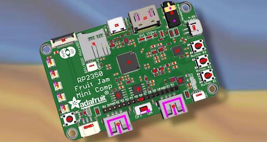](https://blog.adafruit.com/2025/02/03/fruit-jam-rp2350b-credit-card-mini-computer-with-all-the-fixins/)

Looking to "jam a ridonkulous amount of hardware" into a single-board computer, Adafruit has shown their design in progress, initially entitled Fruit Jam. Adafruit is aiming it for classic game and computer emulation and CircuitPython, although it should work with any RP2350 compatible language - [Adafruit Blog](https://blog.adafruit.com/2025/02/03/fruit-jam-rp2350b-credit-card-mini-computer-with-all-the-fixins/), [Hackster.io](https://www.hackster.io/news/adafruit-unveils-a-work-in-progress-raspberry-pi-rp2350b-single-board-computer-the-fruit-jam-008f4cc73dde), and [Tom's Hardware](https://www.tomshardware.com/raspberry-pi/adafruits-fruit-jam-is-a-raspberry-pi-pico-2-powered-credit-card-sized-computer).

> "With the extra pins of the QFN-80 RP2350B, we’re able to jam a ridonkulous amount of hardware into this shape: RP2350B dual 150MHz Cortex M33 w/ PicoProbe debug port, 16 MB Flash + 8 MB PSRAM, USB type C for bootloading/USB client, Micro SD card with SPI or SDIO, DVI output on the HSTX port, I2S stereo headphone + mono speaker via the TLV320DAC3100, 2-port USB type A hub for both keyboard and mouse or game controllers, chunky on-off switch, Stemma QT I2C + Stemma classic JST 3-pin, EYESPI for TFT displays, 5x NeoPixels, 3x tactile switches, and a 16-pin socket header with 10 A/D GPIO + 5V/3V/GND power pins. The PSRAM will help when we want to do things like run emulations that we need to store in fast RAM access, and it will also let us use the main SRAM as the DVI video buffer."

## Feature

text - [site](url).

## Feature

text - [site](url).

## Debugging Within Visual Studio Code

[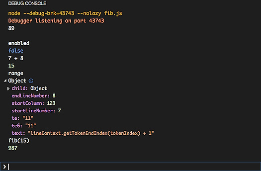](https://code.visualstudio.com/Docs/editor/debugging#_debug-console-repl)

Visual Studio Code allows for debugging within the interface including setting up a REPL (Read-Eval-Print Loop) - [visualstudio.com](https://code.visualstudio.com/Docs/editor/debugging#_debug-console-repl) and specifically [Python Debugging](https://code.visualstudio.com/docs/python/debugging).

## An Interview with Gordon Hollingworth of Raspberry Pi

Tom's Hardware: The Pi Cast has Raspberry Pi CTO Gordon Hollingworth on the show to talk about software engineering for the Raspberry Pi - [YouTube](https://www.youtube.com/watch?v=UxO4qiw9kIw). Via [BlueSky](https://bsky.app/profile/biglesp.bsky.social/post/3lgxhiu2ybl2v).

## This Week's Python Streams

Python on Hardware is all about building a cooperative ecosphere which allows contributions to be valued and to grow knowledge. Below are the streams within the last week focusing on the community.

**CircuitPython Deep Dive Stream**

[Last Friday](link), Scott streamed work on {subject}.

You can see the latest video and past videos on the Adafruit YouTube channel under the Deep Dive playlist - [YouTube](https://www.youtube.com/playlist?list=PLjF7R1fz_OOXBHlu9msoXq2jQN4JpCk8A).

**CircuitPython Parsec**

John Park’s CircuitPython Parsec this week is on {subject} - [Adafruit Blog](link) and [YouTube](link).

Catch all the episodes in the [YouTube playlist](https://www.youtube.com/playlist?list=PLjF7R1fz_OOWFqZfqW9jlvQSIUmwn9lWr).

**The CircuitPython Show**

The CircuitPython Show begins a three part series on designing a PCB, building CircuitPython, and writing a CircuitPython library.  First in the series is Designing a PCB to work with CircuitPython with Bradán Lane - [The CircuitPython Show](https://www.circuitpythonshow.com/@circuitpythonshow).

**CircuitPython Weekly Meeting**

CircuitPython Weekly Meeting for February 3, 2025 ([notes](https://github.com/adafruit/adafruit-circuitpython-weekly-meeting/blob/main/2025/2025-02-03.md)) [on YouTube](https://youtu.be/kl1Kpmvdk5g).

## Project of the Week

text - [site](url).

## Popular Last Week

What was the most popular, most clicked link, in [last week's newsletter](https://www.adafruitdaily.com/2025/02/03/python-on-microcontrollers-newsletter-circuitpython-9-2-4-out-machine-learning-on-raspberry-pi-and-much-more-circuitpython-python-micropython-thepsf-raspberry_pi/)? [Free eBook: Think Python](https://allendowney.github.io/ThinkPython/).

Did you know you can read past issues of this newsletter in the Adafruit Daily Archive? [Check it out](https://www.adafruitdaily.com/category/circuitpython/).

## New Notes from Adafruit Playground

[Adafruit Playground](https://adafruit-playground.com/) is a new place for the community to post their projects and other making tips/tricks/techniques. Ad-free, it's an easy way to publish your work in a safe space for free.

Creating Reduced Sized Bitmap Fonts From .ttf File - [Adafruit Playground](https://adafruit-playground.com/u/Timeline/pages/creating-reduced-sized-bitmap-fonts-from-ttf-file).

[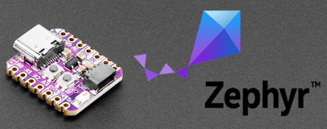](https://adafruit-playground.com/u/SamBlenny/pages/zephyr-quest-troubleshooting-a-pi-pico2-build-error)

Zephyr Quest: Troubleshooting a Pi Pico2 build error - [Adafruit Playground](https://adafruit-playground.com/u/SamBlenny/pages/zephyr-quest-troubleshooting-a-pi-pico2-build-error).

Circuit Playground: Galaxy Explorer - [Adafruit Playground](https://adafruit-playground.com/u/mrklingon/pages/circuit-playground-galaxy-explorer).

## News From Around the Web

[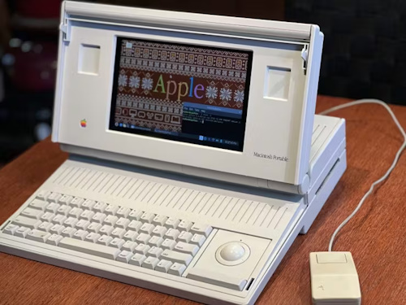](https://www.hackster.io/news/return-of-the-mac-d7e9e28950fd?s=03)

Paul Rickards takes a Mac Portable M5120 case and transforms it into a Raspberry Pi 5 computer with a color screen. A Raspberry Pi Pico running KMK firmware (using CircuitPython) handles keyboard inputs. It runs a Mac emulator - [hackster.io](https://www.hackster.io/news/return-of-the-mac-d7e9e28950fd?s=03).

[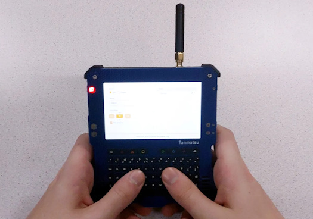](https://hackaday.com/2025/02/04/a-closer-look-at-the-tanmatsu/)

Hackaday provides some additional details on the Tanmatsu (Japanese for “Terminal”), powered by the new Espressif ESP32-P4 application processor. It's expected to run MicroPython and native applications. Preorders are open via [Nicolai Electronics](https://nicolaielectronics.nl/blog/2025/01/06/tanmatsu-can-now-be-pre-ordered/). Via [Hackaday](https://hackaday.com/2025/02/04/a-closer-look-at-the-tanmatsu/).

text - [site](url).

text - [site](url).

text - [site](url).

text - [site](url).

text - [site](url).

text - [site](url).

text - [site](url).

text - [site](url).

text - [site](url).

text - [site](url).

text - [site](url).

text - [site](url).

text - [site](url).

[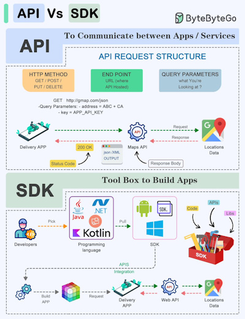](https://x.com/sahnlam/status/1886643358770323800?s=03)

Comparing an API vs. a SDK - [X](https://x.com/sahnlam/status/1886643358770323800?s=03).

[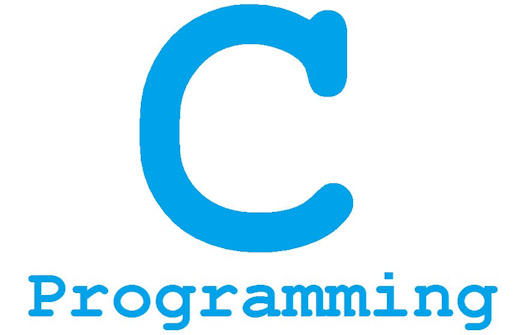](https://www.circuitbasics.com/how-to-write-and-run-a-c-program-on-the-raspberry-pi/)

How to write and run a C program on the Raspberry Pi - [Circuit Basics](https://www.circuitbasics.com/how-to-write-and-run-a-c-program-on-the-raspberry-pi/).

Yo, I heard you like decorators - [Bo Bayles Annex](https://www.bbayles.com/index/decorator_factory).

## New

[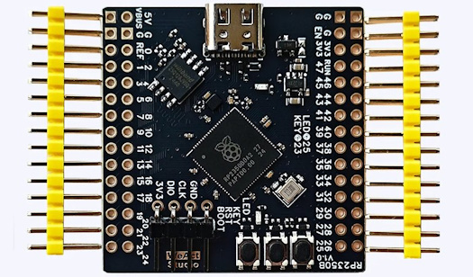](https://www.cnx-software.com/2025/02/03/tiny-weact-rp2350b-core-board-exposes-all-48-i-os-from-the-raspberry-pi-rp2350b-microcontroller/)

The WeAct RP2350B Core Board exposes all 48 I/Os from the Raspberry Pi RP2350B microcontroller - [CNX Software](https://www.cnx-software.com/2025/02/03/tiny-weact-rp2350b-core-board-exposes-all-48-i-os-from-the-raspberry-pi-rp2350b-microcontroller/).

[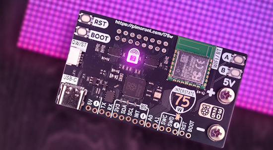](https://shop.pimoroni.com/products/interstate-75-w)

Interstate 75 W is a RP2350A-based driver board for HUB75-style LED matrices. It includes an RM2 module (CYW43439), supporting IEEE 802.11 b/g/n wireless LAN, and Bluetooth - [Pimoroni](https://shop.pimoroni.com/products/interstate-75-w).

[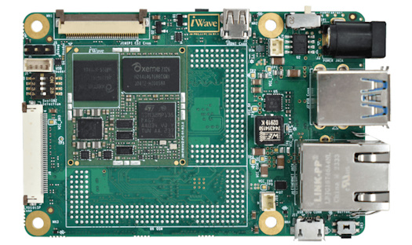](https://www.cnx-software.com/2025/02/05/iwave-systems-iw-rainbow-g54s-credit-card-sized-sbc-features-an-stm32mp133-mp135-osm-size-s-module/)

iWave Systems iW-RainboW-G54S is a credit card-sized SBC fitted with an OSM Size-S (30x30mm) system-on-module based on STM32MP133 or STM32MP135 Cortex-A7 SoC with up to 1GB RAM, and up to 128GB flash - [CNX Software](https://www.cnx-software.com/2025/02/05/iwave-systems-iw-rainbow-g54s-credit-card-sized-sbc-features-an-stm32mp133-mp135-osm-size-s-module/).

## New Boards Supported by CircuitPython

The number of supported microcontrollers and Single Board Computers (SBC) grows every week. This section outlines which boards have been included in CircuitPython or added to [CircuitPython.org](https://circuitpython.org/).

This week there were (#/no) new boards added:

- [Board name](url)
- [Board name](url)
- [Board name](url)

*Note: For non-Adafruit boards, please use the support forums of the board manufacturer for assistance, as Adafruit does not have the hardware to assist in troubleshooting.*

Looking to add a new board to CircuitPython? It's highly encouraged! Adafruit has four guides to help you do so:

- [How to Add a New Board to CircuitPython](https://learn.adafruit.com/how-to-add-a-new-board-to-circuitpython/overview)
- [How to add a New Board to the circuitpython.org website](https://learn.adafruit.com/how-to-add-a-new-board-to-the-circuitpython-org-website)
- [Adding a Single Board Computer to PlatformDetect for Blinka](https://learn.adafruit.com/adding-a-single-board-computer-to-platformdetect-for-blinka)
- [Adding a Single Board Computer to Blinka](https://learn.adafruit.com/adding-a-single-board-computer-to-blinka)

## New Learn Guides

[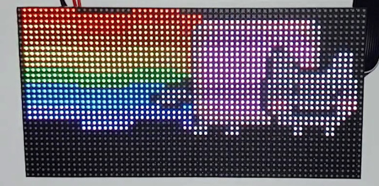](https://learn.adafruit.com/guides/latest)

The Adafruit Learning System has over 3,000 free guides for learning skills and building projects including using Python.

[RGB Matrix Panels With Raspberry Pi 5](https://learn.adafruit.com/rgb-matrix-panels-with-raspberry-pi-5/multiple-matrix-panels) from [Tim C](https://learn.adafruit.com/u/Foamyguy)

[Toddler Timer](https://learn.adafruit.com/toddler-timer) from [Ruiz Brothers](https://learn.adafruit.com/u/pixil3d)

[title](url) from [name](url)

## Updated Learn Guides

[title](url)

## CircuitPython Libraries

The CircuitPython library numbers are continually increasing, while existing ones continue to be updated. Here we provide library numbers and updates!

To get the latest Adafruit libraries, download the [Adafruit CircuitPython Library Bundle](https://circuitpython.org/libraries). To get the latest community contributed libraries, download the [CircuitPython Community Bundle](https://circuitpython.org/libraries).

If you'd like to contribute to the CircuitPython project on the Python side of things, the libraries are a great place to start. Check out the [CircuitPython.org Contributing page](https://circuitpython.org/contributing). If you're interested in reviewing, check out Open Pull Requests. If you'd like to contribute code or documentation, check out Open Issues. We have a guide on [contributing to CircuitPython with Git and GitHub](https://learn.adafruit.com/contribute-to-circuitpython-with-git-and-github), and you can find us in the #help-with-circuitpython and #circuitpython-dev channels on the [Adafruit Discord](https://adafru.it/discord).

You can check out this [list of all the Adafruit CircuitPython libraries and drivers available](https://github.com/adafruit/Adafruit_CircuitPython_Bundle/blob/master/circuitpython_library_list.md). 

The current number of CircuitPython libraries is **###**!

**New Libraries**

Here's this week's new CircuitPython libraries:

* [library](url)

**Updated Libraries**

Here's this week's updated CircuitPython libraries:

* [library](url)

## What’s the CircuitPython team up to this week?

What is the team up to this week? Let’s check in:

**Dan**

I am working on the NINA-FW firmware, which is used in Adafruit's AirLift breakouts and co-processors. A pull request to update NINA-FW from its upstream repo has been stalled for a while, but I believe I am now making progress on finishing the update.

**Tim**

This week I worked on examples and a Learn guide for using RGB matrix panels with the Raspberry Pi 5 using the new PioMatter library that Jeff wrote. After that I started working on the GC9A01A display. I've adapted a 3rd party driver for the latest versions of CircuitPython and added it to the bundle. I've got another project lined up that will make use of this display.

**Jeff**

My last week saw more PIO activity. I fixed a regression in `rp2pio` that affected `RotaryEncoder` on RP2040/RP2350 when more than one encoder is in use. This is merged into CircuitPython and will appear in an upcoming release. Relatedly, I also worked on allowing multiple rotary encoders on Pi 5. This work has not yet reached the stage of being PR'd.

Another thing I'm working on is automatically connecting to an attached display on boards like Feather RP2350 with the HSTX connector. When this code is added, boards that enable it will check for the presence of an I2C EEPROM at address 0x50, which holds the monitor's EDID information and enable a framebuffer when it's found. At the time of writing, this work is in a draft PR and will undergo some improvements before it's merged.

**Scott**

This past week I've polished up my Zephyr work and [submitted a pull request (PR) for review](https://github.com/adafruit/circuitpython/pull/10026). It is still a work in progress but gives folks a chance to test it and expand it. I took a little detour to update our Python code formatting to `ruff` from `black` too. This matches what MicroPython does. Next up I'm circling back to WiFi within Zephyr.

**Liz**

Thanks to Tim now assisting with product guides, I finally had time to work on the guide and CircuitPython driver for the [INA228](https://learn.adafruit.com/adafruit-ina228-i2c-power-monitor). This breakout lets you monitor high or low side power measurements over I2C. There is support in both Arduino and CircuitPython, so you can easily add detailed power monitoring to your projects.

## Upcoming Events

The next MicroPython Meetup in Melbourne will be on February 26th – [Meetup](https://www.meetup.com/micropython-meetup/events). You can see recordings of previous meetings on [YouTube](https://www.youtube.com/@MicroPythonOfficial). 

The community is coming back to Pittsburgh, Pennsylvania for PyCon US 2025 May 14 - May 22, 2025 - [us.pycon.org](https://us.pycon.org/2025/).

**Send Your Events In**

If you know of virtual events or upcoming events, please let us know via email to cpnews(at)adafruit(dot)com.

## Latest Releases

CircuitPython's stable release is [#.#.#](https://github.com/adafruit/circuitpython/releases/latest) and its unstable release is [#.#.#-##.#](https://github.com/adafruit/circuitpython/releases). New to CircuitPython? Start with our [Welcome to CircuitPython Guide](https://learn.adafruit.com/welcome-to-circuitpython).

[2025####](https://github.com/adafruit/Adafruit_CircuitPython_Bundle/releases/latest) is the latest Adafruit CircuitPython library bundle.

[2025####](https://github.com/adafruit/CircuitPython_Community_Bundle/releases/latest) is the latest CircuitPython Community library bundle.

[v#.#.#](https://micropython.org/download) is the latest MicroPython release. Documentation for it is [here](http://docs.micropython.org/en/latest/pyboard/).

[#.#.#](https://www.python.org/downloads/) is the latest Python release. The latest pre-release version is [#.#.#](https://www.python.org/download/pre-releases/).

[#,### Stars](https://github.com/adafruit/circuitpython/stargazers) Like CircuitPython? [Star it on GitHub!](https://github.com/adafruit/circuitpython)

## Call for Help -- Translating CircuitPython is now easier than ever

[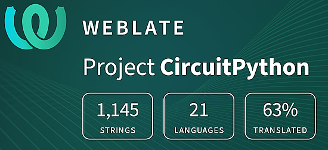](https://hosted.weblate.org/engage/circuitpython/)

One important feature of CircuitPython is translated control and error messages. With the help of fellow open source project [Weblate](https://weblate.org/), we're making it even easier to add or improve translations. 

Sign in with an existing account such as GitHub, Google or Facebook and start contributing through a simple web interface. No forks or pull requests needed! As always, if you run into trouble join us on [Discord](https://adafru.it/discord), we're here to help.

## NUMBER Thanks

The Adafruit Discord community, where we do all our CircuitPython development in the open, reached over NUMBER humans - thank you! Adafruit believes Discord offers a unique way for Python on hardware folks to connect. Join today at [https://adafru.it/discord](https://adafru.it/discord).

## ICYMI - In case you missed it

Python on hardware is the Adafruit Python video-newsletter-podcast! The news comes from the Python community, Discord, Adafruit communities and more and is broadcast on ASK an ENGINEER Wednesdays. The complete Python on Hardware weekly videocast [playlist is here](https://www.youtube.com/playlist?list=PLjF7R1fz_OOXRMjM7Sm0J2Xt6H81TdDev). The video podcast is on [iTunes](https://itunes.apple.com/us/podcast/python-on-hardware/id1451685192?mt=2), [YouTube](http://adafru.it/pohepisodes), [Instagram](https://www.instagram.com/adafruit/channel/)), and [XML](https://itunes.apple.com/us/podcast/python-on-hardware/id1451685192?mt=2).

[The weekly community chat on Adafruit Discord server CircuitPython channel - Audio / Podcast edition](https://itunes.apple.com/us/podcast/circuitpython-weekly-meeting/id1451685016) - Audio from the Discord chat space for CircuitPython, meetings are usually Mondays at 2pm ET, this is the audio version on [iTunes](https://itunes.apple.com/us/podcast/circuitpython-weekly-meeting/id1451685016), Pocket Casts, [Spotify](https://adafru.it/spotify), and [XML feed](https://adafruit-podcasts.s3.amazonaws.com/circuitpython_weekly_meeting/audio-podcast.xml).

## Contribute

The CircuitPython Weekly Newsletter is a CircuitPython community-run newsletter emailed every Monday. The complete [archives are here](https://www.adafruitdaily.com/category/circuitpython/). It highlights the latest CircuitPython related news from around the web including Python and MicroPython developments. To contribute, edit next week's draft [on GitHub](https://github.com/adafruit/circuitpython-weekly-newsletter/tree/gh-pages/_drafts) and [submit a pull request](https://help.github.com/articles/editing-files-in-your-repository/) with the changes. You may also tag your information on Twitter with #CircuitPython. 

Join the Adafruit [Discord](https://adafru.it/discord) or [post to the forum](https://forums.adafruit.com/viewforum.php?f=60) if you have questions.
