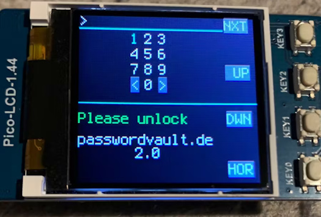
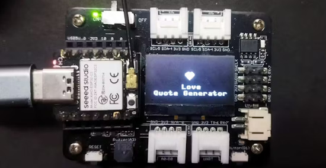

View this email in your browser. **Warning: Flashing Imagery**

Welcome to the latest Python on Microcontrollers newsletter! Happy belated Valentine's Day. This week we start with comparing Python, MicroPython and CircuitPython and then compare the processing power of various Raspberry Pi single board computers over the years. And further on an article on why you might want to use a Raspberry Pi Pico microcontroller instead of a full Pi. There are more events you'll want to check out and so much more in this packed issue. - *Anne Barela, Editor*

We're on [Discord](https://discord.gg/HYqvREz), [Twitter/X](https://twitter.com/search?q=circuitpython&src=typed_query&f=live), [BlueSky](https://bsky.app/profile/circuitpython.org) and for past newsletters - [view them all here](https://www.adafruitdaily.com/category/circuitpython/). If you're reading this on the web, [subscribe here](https://www.adafruitdaily.com/). Here's the news this week:

## Python, MicroPython, and CircuitPython: Similarities and Differences

Don Wilcher writes about the similarities and differences in Python, MicroPython, and CircuitPython - [DigiKey](https://www.digikey.com/en/maker/tutorials/2025/python-micropython-and-circuitpython-similarities-and-differences).

## A Raspberry Pi 1 to Pi 5 Performance Comparison

A look at what almost 13 years of development has done for the Raspberry Pi, from the original Pi launched in 2012 through to the Pi 5 which was released just over a year ago, The DIY Life puts them to the test to show you the speed in various tasks to help you decide which board may be right for your application - [The DIY Life](https://www.the-diy-life.com/raspberry-pi-drag-race-pi-1-to-pi-5-performance-comparison/).

## 10 Years of Certifying Open Source Hardware

Michael Weinberg presented 10 Years of Certifying Open Source Hardware at FOSDEM 2025 - [X](https://bsky.app/profile/michaelweinberg.org/post/3lhu2zye6ht2x) and [Video](https://ftp.belnet.be/mirror/FOSDEM/video/2025/h1309/fosdem-2025-4257-lessons-from-10-years-of-certifying-open-source-hardware.av1.webm).

## Gustavo Reynaga: Inspiring the Next Generation of Makers with MicroPython

If you’re a fan of open-source technology, Gustavo Salvador Reynaga Aguilar is a name to know. An experienced educator with a passion for technology, Reynaga has spent nearly three decades teaching and inspiring students at CECATI 132 in Mexico. He’s worked with platforms like Arduino, Raspberry Pi, and BeagleBone - [Arduino Blog](https://blog.arduino.cc/2025/02/10/gustavo-reynaga-inspiring-the-next-generation-of-makers-with-micropython/).

## VSCode 1.97 Adds Copilot And Python Debugging

The latest update of Visual Studio Code is now available with free use of GitHub Copilot (2,000 code completions a month, 50 chat messages a month) and the ability to debug Python directly from the terminal - [I Programmer](https://www.i-programmer.info/news/90-tools/17826-vscode-197-adds-copilot-and-python-debugging.html).

## 7 Superpowers of a Raspberry Pi Pico That Beat the Regular Pi

The Raspberry Pi Pico might seem small and simple compared to the bigger Pi models, but it has some cool features that make it ideal for specific projects - [XDA](https://www.xda-developers.com/7-superpowers-of-a-raspberry-pi-pico-that-beat-the-regular-pi/).

## 3 Essential Skills To Survive Embedded Career

The Captain Embedded blog posits to successfully work on Embedded Systems, one should have 3 main skills: EE, CS, plus a 3rd field - [Captain Embedded](https://rosmianto.com/3-essential-skills-to-survive-embedded-career.html).

## An Open Source Password Manager

PasswordVault 2.x is an open source password manager, based on Raspberry Pi Pico 2 and a small display with buttons. It is implemented in CircuitPython - [hackster.io](https://www.hackster.io/olav/passwordvault-2-x-05d922) and [GitHub](https://github.com/PasswordVault/passwordvault-cp2).

## Can English Dethrone Python as Top Programming Language?

As generative AI reshapes software development, natural language commands are replacing traditional programming syntax, but experts question if English can ever match the precision of code - [The New Stack](https://thenewstack.io/can-english-dethrone-python-as-top-programming-language/).

## This Week's Python Streams

Python on Hardware is all about building a cooperative ecosphere which allows contributions to be valued and to grow knowledge. Below are the streams within the last week focusing on the community.

**CircuitPython Deep Dive Stream**

[Last Friday](https://youtube.com/live/CUk3PnDkyLY), Scott streamed work on Fruit Jammin'.

You can see the latest video and past videos on the Adafruit YouTube channel under the Deep Dive playlist - [YouTube](https://www.youtube.com/playlist?list=PLjF7R1fz_OOXBHlu9msoXq2jQN4JpCk8A).

**CircuitPython Parsec**

John Park’s CircuitPython Parsec this week is on LED Matrix Characters - [Adafruit Blog](https://blog.adafruit.com/2025/02/14/john-parks-circuitpython-parsec-led-matrix-characters/) and [YouTube](https://youtu.be/4BxkTxL0ygc).

Catch all the episodes in the [YouTube playlist](https://www.youtube.com/playlist?list=PLjF7R1fz_OOWFqZfqW9jlvQSIUmwn9lWr).

**The CircuitPython Show**

The CircuitPython Show has returned after a one year hiatus! In the latest episode, host Paul Cutler interviews xxxx - [The CircuitPython Show](https://www.circuitpythonshow.com)

**CircuitPython Weekly Meeting**

CircuitPython Weekly Meeting for February 10, 2025 ([notes](https://github.com/adafruit/adafruit-circuitpython-weekly-meeting/blob/main/2025/2025-02-10.md)) [on YouTube](https://youtu.be/G011wOuMWEI).

## Project of the Week: A 3D Printed Traffic Signal

Glen Akins' WiFi enabled bicycle traffic signal with a 2.1" 480x480 round TFT display and Qualia ESP32-S3 board running CircuitPython - [X](https://bsky.app/profile/bikerglen.bsky.social/post/3lholvee4nk2i).

## Popular Last Week

What was the most popular, most clicked link, in [last week's newsletter](https://www.adafruitdaily.com/2025/02/10/python-on-microcontrollers-newsletter-micropython-focus-fruit-jam-vsc-debugging-and-more-circuitpython-python-micropython-thepsf-raspberry_pi/)? [MicroPython IDEs and Tools](https://medium.com/pythoneers/micropython-ides-and-tools-aebe61b0f0c5).

Did you know you can read past issues of this newsletter in the Adafruit Daily Archive? [Check it out](https://www.adafruitdaily.com/category/circuitpython/).

## New Notes from Adafruit Playground

[Adafruit Playground](https://adafruit-playground.com/) is a new place for the community to post their projects and other making tips/tricks/techniques. Ad-free, it's an easy way to publish your work in a safe space for free.

Weather Display Using Open-Meteo's API - [Adafruit Playground](https://adafruit-playground.com/u/CGrover/pages/weather-display-using-open-meteo-s-api).

Build a 'MiniMarquee' WiFi Text Scroller - [Adafruit Playground](https://adafruit-playground.com/u/squid_jpg/pages/guide-build-a-minimarquee-wifi-text-scroller).

Zephyr Quest: Feather RP2350 Board Def - [Adafruit Playground](https://adafruit-playground.com/u/SamBlenny/pages/zephyr-quest-feather-rp2350-board-def).

## News From Around the Web

vOS-CircuitPython-Shell is a lightweight and flexible virtual operating system (vOS) shell for CircuitPython under an MIT license - [GitHub](https://github.com/Night-Traders-Dev/vOS-CircuitPython-Shell).

Simon Willison’s Weblog discusses the latest Python 3.14 alpha (3.14.0a5) - [Simon Willison’s Weblog](https://simonwillison.net/2025/Feb/13/python-3140a5/#atom-everything).

> "Our initial benchmarks show a ~20-30% performance improvement across CPython."

WebVM is an x86 Linux virtual machine that runs in a browser using WebAssembly. It runs an unmodified Debian distribution including many native development toolchains - [Command Line](https://webvm.io/), [Graphical](https://webvm.io/alpine.html) and [GitHub](https://github.com/leaningtech/webvm) (Apache 2.0 license). Via [X](https://x.com/GithubProjects/status/1889553959305568582).

Connecting to a Circuit Playground Bluefruit and change the color of the NeoPixels from a custom SwiftUI app with the Circuit Playground running CircuitPython - [X](https://bsky.app/profile/apendley.bsky.social/post/3lhwsr6m7vk2l).

FlashMyPico website allows you to write C code, build the firmware, and flash it to your Raspberry Pi Pico, Pico W, Pico 2, or Pico 2 W directly from a web browser instead of having to check out the code from GitHub, build it in a terminal, and then manually copy the resulting binary - [FlashMyPico](https://flashmypico.com/about) and [CNX Software](https://www.cnx-software.com/2025/02/10/flashmypico-raspberry-pi-pico-pico-2-code-editing-and-firmware-flashing-from-a-web-browser/).

Broadcasting a Raspberry Pi Pico 2 W IP address via UDP using CiricuitPython sockets - [X](https://x.com/xialulee/status/1890005816465621092).

A Raspberry Pi 4-based robot using Python - [GitHub](https://www.linkedin.com/posts/krzysztof-wladyszewski-125869106_i-know-it-looks-ugly-but-i-decided-to-show-activity-7294182758094909440-0KWW/).

A Raspberry Pi AI pizza clock tells the time one slice at a time - [Tom's Hardware](https://www.tomshardware.com/raspberry-pi/this-raspberry-pi-ai-pizza-clock-tells-the-time-one-slice-at-a-time).

Celebrating 20 Years of Make: magazine - [Zoom Launch Party](https://events.zoom.us/ev/Akg3EY9XVQhzUPg66Rdbgtq350T9ylp37gHY_GhMm9CwIPOX8zbA~AkAYSEqMqoIzGRF7Ji4LDC09VmEX1EqAtvHojt5_gREY_1_AhINEoRRIdw).

Converting RGB888 color values to RGB565 in MicroPython - [X](https://x.com/TotalMK/status/1890068393514140127).

A Futaba VFD Micropython UART driver for the Raspberry Pi Pico - [GitHub](https://github.com/slabua/micropython-futaba-4-BT-68ZY-vfd-driver).

Control your Raspberry Pi from Android (SSH, VNC, etc.) - [RaspberryTips](https://raspberrytips.fr/controler-raspberry-pi-depuis-android/) (French).

How To change the default Python version on Raspberry Pi - [RaspberryTips](https://raspberrytips.com/change-default-python-version/).

Chris Burton has made a CircuitPython library to upload and optionally execute firmware to a flashless RP235x (RP2350/RP2350A/RP2350B) IC using UART boot - [Mastodon](https://octodon.social/@burtyb@widget.uk/113991191900167867) and [GitHub](https://github.com/8086net/CircuitPython_UARTboot).

A randomized love quote display based on Xiao ESP32C3 and MicroPython - [hackster.io](https://www.hackster.io/hendra/love-quote-generator-d1b16a).

FLAC 1.5 is now out as the newest feature update to the software built around the Free Lossless Audio Codec - [Phoronix](https://www.phoronix.com/news/FLAC-1.5-Released).

How to build a WebSocket control panel with Raspberry Pi Pico W and MicroPython - [hackster.io](https://www.hackster.io/rajivcodelab/how-to-build-a-websocket-control-panel-raspberry-pi-pico-w-5f029c).

text - [site](url).

## New

CPico RP2350 is another Raspberry Pi Pico 2 alternative with USB-C, 8MB flash, 2MB PSRAM, BConnect I2C & debug ports - [CNX Software](https://www.cnx-software.com/2025/02/07/cpico-rp2350-raspberry-pi-pico-2-alternative-with-usb-c-8mb-flash-2mb-psram-bconnect-i2c-debug-ports/).

Solder Party, maker of CircuitPython and MicroPython compatible hardware, was at FOSDEM earlier this month and showed off new products. These included some keyboard-based products that look like an update to their popular Keyboard FeatherWing - [X](https://x.com/solderparty/status/1890415250387743149).

## New Boards Supported by CircuitPython

The number of supported microcontrollers and Single Board Computers (SBC) grows every week. This section outlines which boards have been included in CircuitPython or added to [CircuitPython.org](https://circuitpython.org/).

This week there were no new boards added.

*Note: For non-Adafruit boards, please use the support forums of the board manufacturer for assistance, as Adafruit does not have the hardware to assist in troubleshooting.*

Looking to add a new board to CircuitPython? It's highly encouraged! Adafruit has four guides to help you do so:

- [How to Add a New Board to CircuitPython](https://learn.adafruit.com/how-to-add-a-new-board-to-circuitpython/overview)
- [How to add a New Board to the circuitpython.org website](https://learn.adafruit.com/how-to-add-a-new-board-to-the-circuitpython-org-website)
- [Adding a Single Board Computer to PlatformDetect for Blinka](https://learn.adafruit.com/adding-a-single-board-computer-to-platformdetect-for-blinka)
- [Adding a Single Board Computer to Blinka](https://learn.adafruit.com/adding-a-single-board-computer-to-blinka)

## New Learn Guides

The Adafruit Learning System has over 3,000 free guides for learning skills and building projects including using Python.

[Espresso Water Tank Meter](https://learn.adafruit.com/espresso-water-tank-meter) from [John Park](https://learn.adafruit.com/u/johnpark)

## CircuitPython Libraries

The CircuitPython library numbers are continually increasing, while existing ones continue to be updated. Here we provide library numbers and updates!

To get the latest Adafruit libraries, download the [Adafruit CircuitPython Library Bundle](https://circuitpython.org/libraries). To get the latest community contributed libraries, download the [CircuitPython Community Bundle](https://circuitpython.org/libraries).

If you'd like to contribute to the CircuitPython project on the Python side of things, the libraries are a great place to start. Check out the [CircuitPython.org Contributing page](https://circuitpython.org/contributing). If you're interested in reviewing, check out Open Pull Requests. If you'd like to contribute code or documentation, check out Open Issues. We have a guide on [contributing to CircuitPython with Git and GitHub](https://learn.adafruit.com/contribute-to-circuitpython-with-git-and-github), and you can find us in the #help-with-circuitpython and #circuitpython-dev channels on the [Adafruit Discord](https://adafru.it/discord).

You can check out this [list of all the Adafruit CircuitPython libraries and drivers available](https://github.com/adafruit/Adafruit_CircuitPython_Bundle/blob/master/circuitpython_library_list.md). 

The current number of CircuitPython libraries is **506**!

**New Libraries**

Here's this week's new CircuitPython libraries:

  * [adafruit/Adafruit_CircuitPython_LPS28](https://github.com/adafruit/Adafruit_CircuitPython_LPS28)
  * [adafruit/Adafruit_CircuitPython_Display_AnalogClock](https://github.com/adafruit/Adafruit_CircuitPython_Display_AnalogClock)

**Updated Libraries**

Here's this week's updated CircuitPython libraries:

  * [adafruit/Adafruit_CircuitPython_VEML7700](https://github.com/adafruit/Adafruit_CircuitPython_VEML7700)
  * [adafruit/Adafruit_CircuitPython_MiniMQTT](https://github.com/adafruit/Adafruit_CircuitPython_MiniMQTT)
  * [adafruit/Adafruit_CircuitPython_VCNL4020](https://github.com/adafruit/Adafruit_CircuitPython_VCNL4020)
  * [adafruit/Adafruit_CircuitPython_BitmapSaver](https://github.com/adafruit/Adafruit_CircuitPython_BitmapSaver)

## What’s the CircuitPython team up to this week?

What is the team up to this week? Let’s check in:

**Dan**

With the help of testers from the community, I made a version of NINA-FW that includes updates from the upstream Arduino version. It now works with ECDSA certificates chains, which was a long-standing issue. A little more testing is in progress with version 2.0.0-rc.0+adafruit. Assuming that works out I will release 2.0.0+adafruit soon. The "+adafruit" suffix is to distinguish it from the Arduino version.

**Tim**

This week I worked on updating the Raspberry Pi 5 RGB Matrix examples to make use of the latest API, and wrote a new guide page that details the possible configuration options that it provides. I also finished working on a guide that features the new round displays showing an analog clock with graphics and jingles inspired by an iconic old public domain cartoon.

**Jeff**

In CircuitPython, I've been working on some quality-of-life improvements for the Raspberry Pi RP2350 microcontroller.

First up, I noticed that a display connected to my Feather RP2350 would blank when I was writing to the CIRCUITPY drive. With help from Scott & eightycc, I found a solution that involved giving the display code an elevated interrupt priority so it could run during this time, and the glitches are solved. This pull request was recently merged and is in the absolute latest releases.

Second, I've added code on select RP2350 boards (Metro RP2350 and Feather RP2350) to detect an attached display via the presence of the "EDID" chip in the monitor. If the monitor is there, the display will be configured, by default to 320x240 with 16 bits per pixel. In the same pull request, I changed how `board.DISPLAY` works: Now all boards with displayio will have a `board.DISPLAY` property which always reflects a configured display, and which is `None` if there's no configured display. This also makes it easier for a display configured in `boot.py` or in a previous run of `code.py` to be used the next time without the need to reconfigure it. As I write this, the pull request is waiting for approval. In the future, the monitor auto-detection might be applied to other boards.

I also did some behind-the-scenes changes, saving some space in the flash chips by removing redundant routines in the CircuitPython source without affecting any functionality (hopefully). One pull request has been merged, and another is pending.

**Scott**

This week I was continuing on Zephyr WiFi work. I managed to connect to my WiFi and get an IP address. Next work is to get socket stuff going. **However**, I got my Fruit Jam board and I'm working on board bring up. I added support for 720x400 video output for better widescreen support. Now I'm debugging USB Host support.

**Liz**

This week I worked on the [240x240 Round Display guide](https://learn.adafruit.com/adafruit-1-28-240x240-round-tft-lcd). This display uses the GC9A01A driver. I had to add support for this driver to the RGB Display library to have it work with Blinka. This support has been merged in so it is ready for folks to use. There are examples in the guide for CircuitPython, Python and Arduino.

## Upcoming Events

The next MicroPython Meetup in Melbourne will be on February 26th – [Meetup](https://www.meetup.com/micropython-meetup/events). You can see recordings of previous meetings on [YouTube](https://www.youtube.com/@MicroPythonOfficial). 

Embedded World 2025 will be held March 11 to 13, 2025 in Nuremberg, Germany. [Raspberry Pi](https://x.com/Raspberry_Pi/status/1889333638417768590) will be there - [Embedded World](https://www.embedded-world.de/en).

The community is coming back to Pittsburgh, Pennsylvania for PyCon US 2025 May 14 - May 22, 2025 - [us.pycon.org](https://us.pycon.org/2025/).

Open Hardware Summit 2025 is being held May 30 · 10am - May 31 · 6pm GMT+1 in Edinburgh, Scotland - [Eventbrite](https://www.eventbrite.com/e/open-hardware-summit-2025-tickets-1067611086499).

**Send Your Events In**

If you know of virtual events or upcoming events, please let us know via email to cpnews(at)adafruit(dot)com.

## Latest Releases

CircuitPython's stable release is [9.2.4](https://github.com/adafruit/circuitpython/releases/latest). New to CircuitPython? Start with our [Welcome to CircuitPython Guide](https://learn.adafruit.com/welcome-to-circuitpython).

[20250214](https://github.com/adafruit/Adafruit_CircuitPython_Bundle/releases/latest) is the latest Adafruit CircuitPython library bundle.

[20250130](https://github.com/adafruit/CircuitPython_Community_Bundle/releases/latest) is the latest CircuitPython Community library bundle.

[v1.24.1](https://micropython.org/download) is the latest MicroPython release. Documentation for it is [here](http://docs.micropython.org/en/latest/pyboard/).

[3.13.2](https://www.python.org/downloads/) is the latest Python release. The latest pre-release version is [3.14.0a5](https://www.python.org/download/pre-releases/).

[4,197 Stars](https://github.com/adafruit/circuitpython/stargazers) Like CircuitPython? [Star it on GitHub!](https://github.com/adafruit/circuitpython)

## Call for Help -- Translating CircuitPython is now easier than ever

One important feature of CircuitPython is translated control and error messages. With the help of fellow open source project [Weblate](https://weblate.org/), we're making it even easier to add or improve translations. 

Sign in with an existing account such as GitHub, Google or Facebook and start contributing through a simple web interface. No forks or pull requests needed! As always, if you run into trouble join us on [Discord](https://adafru.it/discord), we're here to help.

## 38,765 Thanks

The Adafruit Discord community, where we do all our CircuitPython development in the open, reached over 38,765 humans - thank you! Adafruit believes Discord offers a unique way for Python on hardware folks to connect. Join today at [https://adafru.it/discord](https://adafru.it/discord).

## ICYMI - In case you missed it

Python on hardware is the Adafruit Python video-newsletter-podcast! The news comes from the Python community, Discord, Adafruit communities and more and is broadcast on ASK an ENGINEER Wednesdays. The complete Python on Hardware weekly videocast [playlist is here](https://www.youtube.com/playlist?list=PLjF7R1fz_OOXRMjM7Sm0J2Xt6H81TdDev). The video podcast is on [iTunes](https://itunes.apple.com/us/podcast/python-on-hardware/id1451685192?mt=2), [YouTube](http://adafru.it/pohepisodes), [Instagram](https://www.instagram.com/adafruit/channel/)), and [XML](https://itunes.apple.com/us/podcast/python-on-hardware/id1451685192?mt=2).

[The weekly community chat on Adafruit Discord server CircuitPython channel - Audio / Podcast edition](https://itunes.apple.com/us/podcast/circuitpython-weekly-meeting/id1451685016) - Audio from the Discord chat space for CircuitPython, meetings are usually Mondays at 2pm ET, this is the audio version on [iTunes](https://itunes.apple.com/us/podcast/circuitpython-weekly-meeting/id1451685016), Pocket Casts, [Spotify](https://adafru.it/spotify), and [XML feed](https://adafruit-podcasts.s3.amazonaws.com/circuitpython_weekly_meeting/audio-podcast.xml).

## Contribute

The CircuitPython Weekly Newsletter is a CircuitPython community-run newsletter emailed every Monday. The complete [archives are here](https://www.adafruitdaily.com/category/circuitpython/). It highlights the latest CircuitPython related news from around the web including Python and MicroPython developments. To contribute, edit next week's draft [on GitHub](https://github.com/adafruit/circuitpython-weekly-newsletter/tree/gh-pages/_drafts) and [submit a pull request](https://help.github.com/articles/editing-files-in-your-repository/) with the changes. You may also tag your information on Twitter with #CircuitPython. 

Join the Adafruit [Discord](https://adafru.it/discord) or [post to the forum](https://forums.adafruit.com/viewforum.php?f=60) if you have questions.
